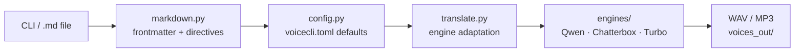

# VoiceCLI


Unified CLI for voice generation and transcription — Qwen3-TTS, Chatterbox, Faster Whisper & Kyutai STT backends.

## Why

Local TTS is scattered across incompatible APIs, each with their own parameter names, quirks, and input formats. Switching engines means rewriting scripts.

VoiceCLI gives you one CLI and one `.md` script format that works across Qwen3-TTS, Chatterbox Multilingual, and Chatterbox Turbo — a built-in translator adapts your script to each engine's capabilities automatically. No cloud API keys, no GPU server, no rewrite when you switch models.

Built for developers and content creators who want expressive, multilingual speech synthesis running entirely on local hardware.

## Pipeline

Input flows through four stages: frontmatter parsing → config backfill → engine translation → synthesis. The translator is the key piece — it applies an engine capability matrix so one universal `.md` script works across all backends without manual changes.



## Requirements

- Python 3.11–3.12
- CUDA GPU (both engines run on GPU)
- [uv](https://docs.astral.sh/uv/) package manager

## Install

```bash
git clone <repo-url> && cd voiceCLI
uv sync
```

## Quick Start

```bash
# Generate speech with default voice (Qwen, Ryan)
voicecli generate "Hello, how are you today?"

# Pick a different voice
voicecli generate "Bonjour" --voice Vivian --lang French

# Use Chatterbox engine
voicecli generate "This is exciting!" --engine chatterbox

# Clone a voice from a reference audio file
voicecli clone "Say this in my voice" --ref my_recording.wav

# Transcribe an audio file
voicecli transcribe recording.wav

# Live mic transcription
voicecli listen

# Dictation mode (STT daemon + overlay)
voicecli dictate
```

## Library API

VoiceCLI is also a Python library. Install it as a dependency and call it directly — no subprocess, no HTTP server.

```bash
# From another project
uv add --editable /path/to/voiceCLI
```

```python
import asyncio
from voicecli import generate, generate_async, transcribe, transcribe_async, clone_async

# Synchronous TTS
result = generate("Hello world")
print(result.path)          # Path to WAV file
print(result.duration_s)    # Duration in seconds

# Async TTS (preferred in async contexts like Lyra)
result = await generate_async("Bonjour", voice="Vivian", lang="French")

# Voice cloning
result = await clone_async("Say this", ref="sample.wav")

# Transcription
text = transcribe("recording.wav")

# Async transcription
result = await transcribe_async("recording.wav", lang="fr")
print(result.text)
print(result.language)

# Introspection
from voicecli import list_engines, list_voices
engines = list_engines()   # list[str]
voices = list_voices()     # list[str] (Qwen voices)
```

Public API (`__all__`): `generate`, `generate_async`, `clone`, `clone_async`, `transcribe`, `transcribe_async`, `list_engines`, `list_voices`, `TTSResult`, `TranscriptionResult`, `TTSDocument`, `Segment`.

## User Config (`voicecli.toml`)

Optional file (gitignored). Sets default values so you don't pass flags every time.

**Discovery**: voicecli checks `~/.voicecli/voicecli.toml` first, then walks up from CWD to `$HOME` as fallback. The canonical location is `~/.voicecli/voicecli.toml` — accessible from any project. A warning is printed to stderr if no file is found anywhere.

```bash
mkdir -p ~/.voicecli
cp voicecli.example.toml ~/.voicecli/voicecli.toml   # then edit to taste
```

```toml
[defaults]
language = "French"
engine = "qwen"
accent = "Léger accent du sud provençal"
personality = "Voix calme, douce et flamboyante"
exaggeration = 0.7
cfg_weight = 0.3
segment_gap = 200
crossfade = 50
# plain = false       # strip [tags] and ignore <!-- directives -->
# chunked = false     # always output separate chunk files
# chunk_size = 500    # target chunk size in chars (~15 chars/sec)
```

Structured instruct parts (`accent`, `personality`, `speed`, `emotion`) auto-compose into
`instruct`: `"accent. personality. speed. emotion"`. Raw `instruct` bypasses composition.

**Segment propagation**: toml structured parts are backfilled into `.md` segments where frontmatter
didn't set them, so a script with no frontmatter still inherits instruct from voicecli.toml.

Priority: **CLI flag > markdown frontmatter > voicecli.toml > hardcoded default**

## Commands

### `generate` — Text to speech

```bash
voicecli generate "Your text here"
voicecli generate "Your text" --engine chatterbox --output out.wav
voicecli generate script.md                      # read from markdown file
voicecli generate article.txt                    # read from plain text file
voicecli generate script.md --segment-gap 300    # 300ms silence between segments
voicecli generate script.md --crossfade 50       # 50ms fade between segments
voicecli generate script.md --plain              # ignore [tags] and <!-- directives -->
voicecli generate article.txt --chunked          # split into separate chunk files
voicecli generate article.txt --chunked --chunk-size 300  # ~20s chunks
```

| Flag | Short | Description | Default |
|------|-------|-------------|---------|
| `--engine` | `-e` | TTS engine (`qwen`, `chatterbox`, `chatterbox-turbo`) | `qwen` |
| `--voice` | `-v` | Voice name (Qwen only) | `Ono_Anna` |
| `--output` | `-o` | Output WAV path | auto-generated |
| `--lang` | | Language | `English` |
| `--mp3` | | Also save as MP3 | off |
| `--segment-gap` | | Silence between segments (ms) | `0` |
| `--crossfade` | | Fade between segments (ms) | `0` |
| `--plain` | | Strip `[tags]` and ignore `<!-- directives -->` | off |
| `--chunked` | | Save each chunk as a separate file | off |
| `--chunk-size` | | Target chunk size in chars (~15 chars/sec) | `500` |
| `--fast` | | Use smaller 0.6B Qwen model | off |

### `clone` — Voice cloning

```bash
voicecli clone "Text to speak" --ref reference.wav
voicecli clone "Text to speak"              # uses active sample (see below)
voicecli clone script.md --segment-gap 200  # with segment transitions
voicecli clone script.md --plain            # ignore [tags] and <!-- directives -->
voicecli clone article.txt --chunked        # split into separate chunk files
```

| Flag | Short | Description | Default |
|------|-------|-------------|---------|
| `--ref` | `-r` | Reference audio file | active sample |
| `--engine` | `-e` | TTS engine | `qwen` |
| `--ref-text` | | Transcript of reference audio | none |
| `--output` | `-o` | Output WAV path | auto-generated |
| `--lang` | | Language | `English` |
| `--mp3` | | Also save as MP3 | off |
| `--segment-gap` | | Silence between segments (ms) | `0` |
| `--crossfade` | | Fade between segments (ms) | `0` |
| `--plain` | | Strip `[tags]` and ignore `<!-- directives -->` | off |
| `--chunked` | | Save each chunk as a separate file | off |
| `--chunk-size` | | Target chunk size in chars (~15 chars/sec) | `500` |
| `--fast` | | Use smaller 0.6B Qwen model | off |

### `samples` — Manage voice samples

```bash
voicecli samples list                       # list all samples
voicecli samples add voice.wav              # import a WAV file
voicecli samples record my_voice            # record from microphone (10s)
voicecli samples record my_voice -d 5       # record for 5 seconds
voicecli samples use my_voice.wav           # set as active sample
voicecli samples active                     # show current active sample
voicecli samples remove my_voice.wav        # delete a sample
```

Once you set an active sample, `clone` uses it automatically — no `--ref` needed.

### `voices` — List available voices

```bash
voicecli voices                             # Qwen voices
voicecli voices --engine chatterbox
```

### `engines` — List available engines

```bash
voicecli engines
```

### `transcribe` — Speech to text

```bash
voicecli transcribe audio.wav                   # auto-detect language
voicecli transcribe audio.wav --lang fr         # force language
voicecli transcribe audio.wav --model large-v3  # choose model
voicecli transcribe audio.wav --json            # JSON with language + timestamps
voicecli transcribe audio.wav -o result.txt     # save to file
```

| Flag | Short | Description | Default |
|------|-------|-------------|---------|
| `--model` | `-m` | Whisper model | `large-v3-turbo` |
| `--lang` | `-l` | Force language code | auto-detect |
| `--output` | `-o` | Save text to file | `~/.voicecli/STT/texts_out/` |
| `--json` | | JSON output with timestamps | off |

Available models: `tiny`, `base`, `small`, `medium`, `large-v3`, `large-v3-turbo`

### `listen` — Live mic transcription

```bash
voicecli listen                                 # EN + FR (1b model)
voicecli listen --model 2.6b                    # English-only, higher quality
```

Uses Kyutai STT for real-time mic-to-text. Press Ctrl+C to stop.

| Flag | Short | Description | Default |
|------|-------|-------------|---------|
| `--model` | `-m` | Kyutai model (`1b` or `2.6b`) | `1b` |

### `dictate` — Continuous STT dictation

Runs a persistent STT daemon with a waveform overlay UI. Toggle recording with a keyboard shortcut, transcribe speech, and auto-paste the result into the active window.

```bash
voicecli dictate               # start STT daemon + overlay
voicecli dictate cancel        # cancel current recording
voicecli dictate next-mode     # cycle STT mode
voicecli dictate status        # show daemon status
```

On WSL2, use the included AutoHotkey script for global shortcuts:

| Shortcut | Action |
|----------|--------|
| `Alt+Shift+Space` | Toggle recording |
| `Alt+Shift+Tab` | Cycle mode |
| `Alt+Shift+Esc` | Cancel |

Auto-paste after transcription is enabled by `auto_paste = true` in `voicecli.toml` (`[stt]` section).
See [docs/dictation-setup.md](docs/dictation-setup.md) for full setup.

### `serve` — Daemon (warm model for fast generation)

Keeps the Qwen model resident in VRAM so subsequent `generate`/`clone` calls skip the ~60s cold start.

```bash
voicecli serve                    # start daemon (loads model on first request)
voicecli serve --engine qwen      # preload Qwen model at startup
voicecli serve --engine qwen-fast # preload Qwen-Fast (CUDA-graph model)
voicecli serve --fast             # use smaller 0.6B model
```

`generate` and `clone` automatically use the daemon when it's running — no flags needed. Falls back silently to standalone if the daemon isn't up.

To keep the daemon running across sessions, use supervisord or systemd (see `voicecli serve --help` for a config snippet).

| Flag | Short | Description | Default |
|------|-------|-------------|---------|
| `--engine` | `-e` | Engine to preload at startup | none (lazy load) |
| `--fast` | | Use smaller 0.6B Qwen model | off |

### `emotions` — Expressiveness cheat sheet

```bash
voicecli emotions
```

## Markdown File Input

Instead of raw text, `generate` and `clone` accept a `.md` file with YAML frontmatter or a plain `.txt` file:

```markdown
---
language: French
accent: "Léger accent provençal"
personality: "Calme et douce"
emotion: "Chaleureuse"
segment_gap: 200
crossfade: 50
---

Bonjour, comment allez-vous aujourd'hui ?

<!-- emotion: "Passionnée" -->
<!-- segment_gap: 500 -->
Maintenant, parlons de choses importantes.
```

### Frontmatter fields

All optional — CLI flags override frontmatter values.

| Field | Engine | Description |
|-------|--------|-------------|
| `language` | qwen + chatterbox | Language for synthesis |
| `voice` | qwen | Speaker name |
| `engine` | all | `qwen`, `chatterbox`, or `chatterbox-turbo` |
| `accent` | qwen | Pronunciation/regional origin (composes into instruct) |
| `personality` | qwen | Character traits (composes into instruct) |
| `speed` | qwen | Tempo/pace (composes into instruct) |
| `emotion` | qwen | Emotional state (composes into instruct) |
| `instruct` | qwen | Raw instruct bypass (overrides all structured parts) |
| `exaggeration` | chatterbox | Expressiveness 0.25–2.0 (default 0.5) |
| `cfg_weight` | chatterbox | Speaker adherence 0.0–1.0 (default 0.5) |
| `segment_gap` | all | Silence between segments in ms (default 0) |
| `crossfade` | all | Fade between segments in ms (default 0) |

Structured parts (`accent`, `personality`, `speed`, `emotion`) auto-compose into `instruct`: `"accent. personality. speed. emotion"`. Only non-empty parts are joined. Raw `instruct` bypasses composition.

**Write instruct parts in the target language** — French speech needs French instructs, English speech needs English instructs.

Markdown formatting (`# headers`, `**bold**`, `[links](url)`, etc.) is stripped automatically. Paralinguistic tags like `[laugh]` and `[sigh]` are preserved for Chatterbox Turbo.

### Per-section directives

All frontmatter fields can be overridden per-section using `<!-- key: value -->` HTML comments. Multiple keys can be set in a single comment, separated by commas. Directives accumulate before a text block and apply to the text that follows. Each section inherits frontmatter defaults — override only what changes.

```markdown
---
language: French
accent: "Provençal"
personality: "Calme et douce"
emotion: "Chaleureuse"
exaggeration: 0.5
segment_gap: 200
---

Bienvenue à tous.

<!-- emotion: "Passionnée", exaggeration: 0.8, segment_gap: 500 -->
Maintenant parlons de choses importantes.

<!-- language: Japanese, voice: Ono_Anna, crossfade: 100, segment_gap: 0 -->
A section in Japanese with a different voice, crossfaded in.
```

Commas inside quoted values are handled correctly: `<!-- emotion: "Passionnée, mais contenue" -->`.

Available directives: `accent`, `personality`, `speed`, `emotion`, `instruct`, `exaggeration`, `cfg_weight`, `language`, `voice`, `segment_gap`, `crossfade`

### Segment transitions

| gap | crossfade | Result |
|-----|-----------|--------|
| 0   | 0         | Direct concat (default) |
| >0  | 0         | Hard cut, silence, hard cut |
| 0   | >0        | Fade-out then fade-in (no silence) |
| >0  | >0        | Fade-out, silence, fade-in |

> **Note:** Qwen clone does NOT support `instruct` — only `generate` does. All engines support per-section overrides for their supported parameters.

## Emotion Controls

**Qwen** — structured instruct parts (recommended):
- `accent`: pronunciation/origin — `"Léger accent provençal"`
- `personality`: character traits — `"Calme, douce et flamboyante"`
- `speed`: tempo/pace — `"Rythme posé"`
- `emotion`: emotional state — `"Chaleureuse"`, `"Passionnée"`
- Parts auto-compose: `"accent. personality. speed. emotion"`
- Per-section: `<!-- emotion: "Passionnée" -->` overrides just emotion
- Raw `instruct` still works as bypass: `"Parle avec colère"`, `"En chuchotant"`
- Write instruct parts in the target language (French speech → French instructs)

**Chatterbox Turbo** — paralinguistic tags (English only):
- Insert inline: `[laugh]`, `[chuckle]`, `[cough]`, `[sigh]`, `[gasp]`, `[groan]`, `[sniff]`, `[shush]`, `[clear throat]`
- Tags are converted to instruct on Qwen (base instruct preserved), stripped on Multilingual

**Chatterbox** — numeric controls (both turbo & multilingual):
- `exaggeration` (0.25–2.0): how expressive — can be set per-section
- `cfg_weight` (0.0–1.0): speaker adherence — can be set per-section
- Use 0.0 for cross-language cloning to reduce accent bleed

**Chatterbox Multilingual** — 23 languages:
Arabic, Danish, German, Greek, English, Spanish, Finnish, French, Hebrew, Hindi, Italian, Japanese, Korean, Malay, Dutch, Norwegian, Polish, Portuguese, Russian, Swedish, Swahili, Turkish, Chinese

## Available Voices (Qwen)

Vivian, Serena, Uncle_Fu, Dylan, Eric, Ryan, Aiden, Ono_Anna, Sohee

## Project Structure

```
voicecli.example.toml # template — copy to voicecli.toml (gitignored)
TTS/
  texts_in/         # authored .md scripts (tracked in git)
  voices_out/       # generated WAV/MP3 (gitignored)
  samples/          # voice samples for cloning (gitignored)
STT/
  audio_in/         # audio files to transcribe (gitignored)
  texts_out/        # transcription results (gitignored)
src/voicecli/
  cli.py            # Typer commands (entry point)
  config.py         # TOML config loader (reads voicecli.toml)
  engine.py         # Abstract TTSEngine + registry
  engines/
    qwen.py         # Qwen3-TTS backend
    chatterbox.py   # Chatterbox Multilingual backend
    chatterbox_turbo.py  # Chatterbox Turbo backend
  markdown.py       # Frontmatter parser + directive parser
  translate.py      # Engine capability matrix + document translator
  utils.py          # Output paths + concat_audio + WAV→MP3
  samples.py        # Sample management (add/record/use/remove)
  transcribe.py     # Faster Whisper file transcription
  listen.py         # Kyutai STT real-time mic transcription
  overlay.py        # Waveform overlay UI (tkinter/WSLg)
  assets/           # UI sounds (start.wav, stop.wav)
```

## Documentation

| Doc | Description |
|-----|-------------|
| [CONTRIBUTING.md](CONTRIBUTING.md) | How to contribute |
| [docs/dictation-setup.md](docs/dictation-setup.md) | Full dictation setup (AHK, WSL2, auto-paste) |
| [docs/configuration.md](docs/configuration.md) | `voicecli.toml` reference |

## License

MIT
