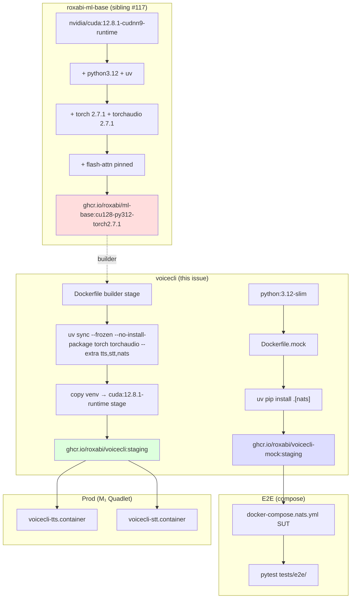
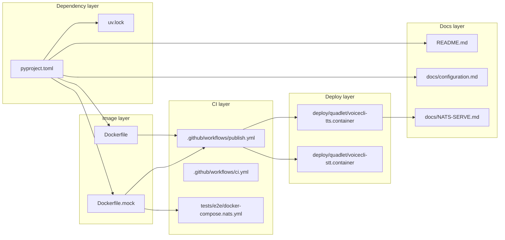

## Summary

Migrate voiceCLI from self-contained Dockerfile (CUDA 12.5 + torch in core deps) to `FROM ghcr.io/roxabi/ml-base:cu128-py312-torch2.7.1` (sibling #117). Split torch out of core deps into `[tts]`/`[stt]` extras. Add slim `voicecli-mock:staging` image for E2E (replaces the 7 GB SUT pull bottleneck in compose). Update Quadlet refs on M₁ with NATS drain protocol.

## Architecture

### Image build flow



### File × Function map



## Bootstrap Context

External dependency on sibling issue **#117** (roxabi-ml-base repo bootstrap):
- Phases B/C (V3, V5) require `ml-base:local` built on M₂ (sibling Phase A complete).
- Phase D (V7) requires `ghcr.io/roxabi/ml-base:cu128-py312-torch2.7.1` published.
- voiceCLI PR merge gated on #117 GHCR tag pullable.

Verify uv version compatibility before V1: current Dockerfile pins `ghcr.io/astral-sh/uv:0.11.7`. The flag `--no-install-package` requires uv ≥ 0.5; 0.11.7 is fine.

## Agents

| Agent | Tasks | Files |
|---|---|---|
| backend-dev | 4 | pyproject.toml, uv.lock |
| devops | 8 | Dockerfile, Dockerfile.mock, tests/e2e/docker-compose.nats.yml, .github/workflows/publish.yml, deploy/quadlet/*.container |
| tester | 7 | manual M₂ + M₁ verification (Phases B/C/D) |
| doc-writer | 3 | README.md, docs/configuration.md, docs/NATS-SERVE.md |

## Consistency Report

| Spec section | Plan slice |
|---|---|
| D1 (dep resolution) | V1 |
| D2 (multi-stage) | V2 |
| D3 (non-root user) | V2 |
| D4 (slim mock SUT) | V4 |
| D5 (`[mock]` extra removed) | V1 |
| D6 (flash-attn kept) | (sibling #117) |
| D7 (CUDA 12.8) | V2 (consumes ml-base) |
| D8 (cuDNN ABI guard) | V7 |
| D9 (uv.lock audit) | V1 |
| D10 (exact-patch tag) | V2 |
| D11 (Quadlet drain) | V8 |
| D12 (cross-repo gate) | (PR description, V8 ↔ #117) |
| D13 (public visibility) | (sibling #117) |
| D14 (governance) | (sibling #117) |

Coverage: 14/14 spec decisions traced. No untraced tasks. Sibling-handled items (D6/D13/D14, partial D7) noted.

## Micro-Tasks

### V1 — Dep split + uv.lock regen + override audit (backend-dev)

**T1** [GREEN] — Verify uv `--no-install-package` flag works for torch on uv 0.11.7
- File: (verification only)
- Verify: `uv --version && uv sync --help | grep no-install-package`
- Expected: `0.11.7` (or current), flag listed
- Difficulty: 1 · Time: 2 min · Spec trace: D1 R1

**T2** [GREEN] — Edit `pyproject.toml`: dep split
- File: `pyproject.toml`
- Remove: `torch>=2.7`, `torchaudio>=2.7` from `[project].dependencies`
- Add `[project.optional-dependencies]`: `tts = ["qwen-tts", "faster-qwen3-tts", "chatterbox-tts"]`, `stt = ["faster-whisper>=1.2"]`, `all = ["voicecli[tts,stt,nats]"]`
- Keep `[voxtral]`, `[hotkey]`, `[overlay]`, `[nats]` as-is
- Verify: `grep -A2 'optional-dependencies' pyproject.toml | head -20`
- Difficulty: 2 · Time: 5 min · Spec trace: D5

**T3** [GREEN] — Regenerate `uv.lock` and audit overrides
- File: `uv.lock`
- Cmd: `uv lock` then re-evaluate each entry in `[tool.uv] override-dependencies`
- For each override: try removal in scratch branch, run `uv lock`, observe if conflict resurfaces. Keep only entries still required.
- Verify: `git diff uv.lock | head -50` and document override audit in PR description
- Difficulty: 3 · Time: 20 min · Spec trace: D9 R2

**T4** [RED-GATE V1] — Verify install in clean venv excludes torch reinstall
- File: (verification only)
- Cmd: `python -m venv /tmp/v1 && source /tmp/v1/bin/activate && uv pip install --no-deps . && uv sync --frozen --no-install-package torch torchaudio --extra tts,stt,nats`
- Expected: torch + torchaudio not present in venv (`pip list | grep -i torch` → empty); other deps installed
- Difficulty: 3 · Time: 10 min · Spec trace: D1

### V2 — New multi-stage Dockerfile (devops)

**T5** [GREEN] — Write new `Dockerfile` builder stage
- File: `Dockerfile`
- `FROM ghcr.io/roxabi/ml-base:${ML_BASE_TAG} AS builder` with `ARG ML_BASE_TAG=cu128-py312-torch2.7.1`
- `COPY pyproject.toml uv.lock ./`
- `RUN uv sync --frozen --no-install-package torch torchaudio --no-dev --extra tts --extra stt --extra nats`
- Verify: `podman build --target builder --build-arg ML_BASE_TAG=local -t voicecli-builder:local .`
- Difficulty: 3 · Time: 15 min · Spec trace: D1, D2

**T6** [GREEN] — Write runtime stage with non-root user
- File: `Dockerfile`
- `FROM nvidia/cuda:12.8.1-cudnn9-runtime-ubuntu24.04 AS runtime`
- Install `libportaudio2 ca-certificates`; create `voicecli:1501` user
- `COPY --from=builder --chown=voicecli:voicecli /app /app`; `USER voicecli`
- Carry over `HEALTHCHECK`, `ENTRYPOINT ["/entrypoint.sh"]`, `CMD ["tts"]`
- Verify: `podman build --build-arg ML_BASE_TAG=local -t voicecli:local . && podman run --rm voicecli:local id` shows uid 1501
- Difficulty: 3 · Time: 15 min · Spec trace: D2, D3

### V3 — Phase B smoke test on M₂ (tester)

**T7** [RED-GATE V3] — voicecli imports + qwen-fast generate one sample on M₂
- File: (manual smoke test)
- Cmd:
  ```bash
  podman run --rm --gpus all voicecli:local voicecli --help
  podman run --rm --gpus all -v ~/.voicecli:/home/voicecli/.voicecli \
    voicecli:local voicecli generate "Bonjour, ceci est un test." -e qwen-fast
  ```
- Expected: `--help` returns 0; generation produces wav in `~/.voicecli/TTS/voices_out/`; no CUDA OOM; image ≤8 GB
- Difficulty: 2 · Time: 15 min · Spec trace: SC-staging, SC-prod
- Blocked-by: T6, sibling #117 Phase A

### V4 — Dockerfile.mock + compose (devops)

**T8** [GREEN] — Write `Dockerfile.mock`
- File: `Dockerfile.mock` (NEW)
- `FROM python:3.12-slim` + `apt-get install libsndfile1 portaudio19-dev`
- `COPY --from=ghcr.io/astral-sh/uv:0.11.7 /uv /usr/local/bin/`
- `uv sync --frozen --extra nats` (NO torch, NO `[mock]` extra — D5)
- Same `voicecli:1501` user pattern
- `ENTRYPOINT ["voicecli"]` (compose passes `nats-serve tts/stt --engine mock`)
- Verify: `podman build -f Dockerfile.mock -t voicecli-mock:local . && podman images | grep voicecli-mock` shows size <300 MB
- Difficulty: 3 · Time: 15 min · Spec trace: D4, D5

**T9** [GREEN] — Update `tests/e2e/docker-compose.nats.yml`
- File: `tests/e2e/docker-compose.nats.yml`
- Change both `voicecli-tts` and `voicecli-stt` services: `image: ghcr.io/roxabi/voicecli-mock:staging` (was `ghcr.io/roxabi/voicecli:staging`)
- Verify: `grep -c voicecli-mock tests/e2e/docker-compose.nats.yml` → 2
- Difficulty: 1 · Time: 3 min · Spec trace: D4

### V5 — Phase C E2E local green (tester)

**T10** [RED-GATE V5] — pytest tests/e2e/ green via compose against `voicecli-mock:local`
- File: (manual)
- Cmd: temporarily override compose image to `voicecli-mock:local`; `pytest tests/e2e/ -v`
- Expected: `test_nats_roundtrip` green; total wall-clock from `compose up` to test pass <60 s
- Difficulty: 2 · Time: 15 min · Spec trace: SC-e2e
- Blocked-by: T8, T9, sibling #117 Phase A

### V6 — publish.yml second image build (devops)

**T11** [GREEN] — Add `voicecli-mock` build job to `publish.yml`
- File: `.github/workflows/publish.yml`
- Add second job using same `Roxabi/.github/.github/workflows/publish-container.yml@v1` reusable workflow with `image_name: ghcr.io/roxabi/voicecli-mock` and `dockerfile: Dockerfile.mock` input.
- If reusable workflow does not accept `dockerfile` input → inline a separate job with `docker/build-push-action`
- Verify: `gh workflow view publish.yml --ref staging` after push; on PR push, both images build
- Difficulty: 3 · Time: 20 min · Spec trace: D4

**T12** [RED-GATE V6] — CI green on a draft PR (smoke)
- File: (CI verification)
- Verify: open draft PR, watch CI; both `voicecli` and `voicecli-mock` images build + push; e2e job pulls `voicecli-mock:staging` and goes green
- Difficulty: 2 · Time: 10 min · Spec trace: D4

### V7 — Phase D cuDNN ABI guard on M₁ (tester)

**T13** [RED-GATE V7] — Pull `ml-base` + ctranslate2/whisper smoke on M₁ Ampere
- File: (manual on M₁)
- Cmd:
  ```bash
  podman pull ghcr.io/roxabi/ml-base:cu128-py312-torch2.7.1
  podman run --rm --gpus all ghcr.io/roxabi/ml-base:cu128-py312-torch2.7.1 \
    python -c "
  import torch; print('torch', torch.__version__, torch.cuda.is_available())
  print('cap', torch.cuda.get_device_capability(0))
  import flash_attn; print('flash_attn', flash_attn.__version__)
  from ctranslate2 import Translator; print('ctranslate2 OK')
  "
  ```
- Then pull `voicecli:staging-candidate` and run `voicecli transcribe sample.wav`
- Expected: torch ✓, flash_attn ✓, ctranslate2 ✓ on sm_86; whisper transcribes non-empty text
- Difficulty: 3 · Time: 20 min · Spec trace: D8 R3
- Blocked-by: sibling #117 GHCR publish, T11

### V8 — Quadlet refs + drain protocol (devops)

**T14** [GREEN] — Update `deploy/quadlet/voicecli-tts.container` `Image=` ref
- File: `deploy/quadlet/voicecli-tts.container`
- Verify: `grep ^Image= deploy/quadlet/voicecli-tts.container`
- Difficulty: 1 · Time: 2 min · Spec trace: D4

**T15** [GREEN] — Update `deploy/quadlet/voicecli-stt.container` `Image=` ref
- File: `deploy/quadlet/voicecli-stt.container`
- Verify: `grep ^Image= deploy/quadlet/voicecli-stt.container`
- Difficulty: 1 · Time: 2 min · Spec trace: D4

**T16** [GREEN] — Document NATS drain protocol
- File: `docs/NATS-SERVE.md` (append section under Quadlet) or `docs/supervisor.md`
- Content: pre-swap drain steps — stop new NATS jobs (graceful satellite shutdown), wait for in-flight to complete, then `daemon-reload` + restart with new image. Tag previous image as `:staging-prev` for rollback.
- Verify: `grep -A5 'drain' docs/NATS-SERVE.md`
- Difficulty: 2 · Time: 10 min · Spec trace: D11 R6

### V9 — Docs (doc-writer)

**T17** [GREEN] — Update `README.md` install snippets
- File: `README.md`
- Replace `uv sync` with `uv sync --extra tts --extra stt --extra nats` (or `--extra all`); document mock-only path: `uv sync --extra nats` for E2E/CI use
- Add note: torch is provided by ml-base for Docker; for local dev install via `uv sync --extra all` (uv resolves torch from `pytorch-cu128` index already in pyproject.toml)
- Verify: `grep -A2 'uv sync' README.md`
- Difficulty: 2 · Time: 10 min · Spec trace: D5, breaking change

**T18** [GREEN] — Update `docs/configuration.md`
- File: `docs/configuration.md`
- Document the extras topology and which to install per use case (TTS-only / STT-only / mock E2E / full)
- Verify: `grep -E 'tts|stt|extra' docs/configuration.md | head -10`
- Difficulty: 2 · Time: 10 min · Spec trace: D5

**T19** [GREEN] — CHANGELOG breaking-change note (release-please scaffolding)
- File: commit message body in implement step
- Body must include `BREAKING CHANGE:` footer noting torch removal from core deps; users running editable installs must specify extras
- Verify: commit message at PR open time
- Difficulty: 1 · Time: 2 min · Spec trace: D5

## Task IDs

<!-- Generated by /plan. Used by /implement to resume tasks on session restart. -->
- T1: 6 — Verify uv --no-install-package flag on 0.11.7
- T2: 7 — pyproject.toml dep split
- T3: 8 — Regenerate uv.lock + audit overrides
- T4: 9 — [RED-GATE V1] Verify clean venv install excludes torch reinstall
- T5: 10 — Dockerfile builder stage
- T6: 11 — Dockerfile runtime stage (non-root + healthcheck)
- T7: 12 — [RED-GATE V3] Phase B smoke on M₂ (qwen-fast generate)
- T8: 13 — Write Dockerfile.mock
- T9: 14 — Update docker-compose.nats.yml image refs
- T10: 15 — [RED-GATE V5] Phase C E2E local green
- T11: 16 — Add voicecli-mock build to publish.yml
- T12: 17 — [RED-GATE V6] CI green on draft PR
- T13: 18 — [RED-GATE V7] Phase D ctranslate2/whisper smoke on M₁
- T14: 19 — Update voicecli-tts.container Image=
- T15: 20 — Update voicecli-stt.container Image=
- T16: 21 — Document NATS drain protocol
- T17: 22 — README.md install snippets
- T18: 23 — docs/configuration.md extras topology
- T19: 24 — Commit message BREAKING CHANGE footer
