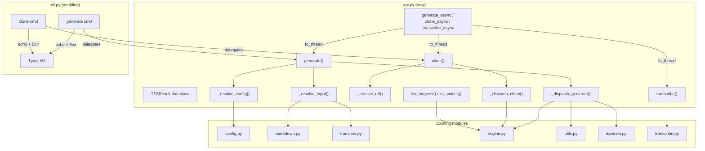
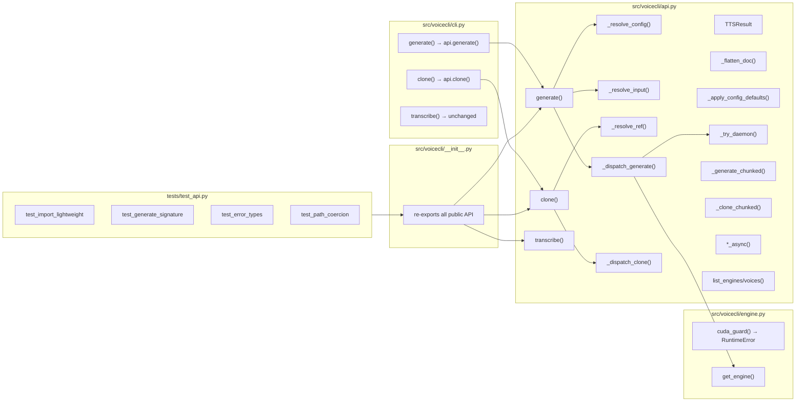

## Summary

Extract orchestration logic from `cli.py` Typer commands into a new `api.py` module, exposing
`generate()`, `clone()`, `transcribe()` as importable Python functions. Refactor `cuda_guard()` to
raise `RuntimeError` instead of `SystemExit`. CLI becomes thin wrappers over the API. Add async
variants via `asyncio.to_thread`.

## Architecture





## Agents

| Agent | Task count | Files |
|-------|-----------|-------|
| backend-dev | 10 | api.py, cli.py, engine.py, __init__.py |
| tester | 1 | tests/test_api.py |

## Micro-Tasks

### Slice 1: Core API + result types + CUDA refactor

#### Task 1 — Create api.py with TTSResult dataclass [P]
- **Agent:** backend-dev
- **File:** `src/voicecli/api.py`
- **Spec trace:** E4, A1, A2
- **Phase:** RED
- **Difficulty:** 1

Create `api.py` with:
```python
from dataclasses import dataclass
from pathlib import Path

@dataclass
class TTSResult:
    wav_path: Path
    mp3_path: Path | None = None
```

- **Verify:** `python -c "from voicecli.api import TTSResult; print(TTSResult.__dataclass_fields__)"`
- **Expected:** Shows wav_path and mp3_path fields

#### Task 2 — Refactor cuda_guard to raise RuntimeError [P]
- **Agent:** backend-dev
- **File:** `src/voicecli/engine.py`
- **Spec trace:** N6, SC-12
- **Phase:** RED
- **Difficulty:** 2

Change `cuda_guard()`:
- Remove print statements and `raise SystemExit(1)`
- Instead, raise `RuntimeError(msg)` with a structured message containing the error type and original message
- Keep the context manager interface identical

```python
@contextlib.contextmanager
def cuda_guard(engine_name: str) -> Iterator[None]:
    try:
        yield
    except (RuntimeError, OSError) as exc:
        msg = str(exc)
        if not _CUDA_PATTERNS.search(msg):
            raise
        raise RuntimeError(f"CUDA error in {engine_name}: {msg}") from exc
```

- **Verify:** `python -c "from voicecli.engine import cuda_guard"`
- **Expected:** No errors

#### Task 3 — Extract _resolve_config from cli.py [depends: T1]
- **Agent:** backend-dev
- **File:** `src/voicecli/api.py`
- **Spec trace:** N1
- **Phase:** GREEN
- **Difficulty:** 2

Move config loading + default layering logic from cli.py generate/clone into `_resolve_config()`.
Returns a dict of resolved defaults (engine, language, voice, extra_kwargs, gap_ms, xfade_ms, etc.).
Accepts `config` parameter (Path | None) for explicit config file.

#### Task 4 — Extract _resolve_input from cli.py [depends: T3]
- **Agent:** backend-dev
- **File:** `src/voicecli/api.py`
- **Spec trace:** N2, N3
- **Phase:** GREEN
- **Difficulty:** 3

Move file detection (.md/.txt) + markdown parsing + `_apply_config_defaults()` + `translate_for_engine()`
into `_resolve_input()`. Also move `_flatten_doc()`. Returns resolved (text, engine, language, voice, extra_kwargs).

#### Task 5 — Move daemon/chunked helpers to api.py [depends: T1]
- **Agent:** backend-dev
- **File:** `src/voicecli/api.py`
- **Spec trace:** N4
- **Phase:** GREEN
- **Difficulty:** 2

Move from cli.py to api.py:
- `_try_daemon()`, `_make_chunk_daemon_fn()`
- `_emit_chunk()`, `_write_done()`, `_generate_chunked()`, `_clone_chunked()`

Remove `typer.echo()` calls in moved functions — use a callback or return values instead.

#### Task 6 — Implement generate() and clone() [depends: T3, T4, T5]
- **Agent:** backend-dev
- **File:** `src/voicecli/api.py`
- **Spec trace:** A1, A2, SC-1 through SC-9
- **Phase:** GREEN
- **Difficulty:** 4

Wire together: `_resolve_config()` → `_resolve_input()` → `_dispatch_generate()/_dispatch_clone()`.
Accept all kwargs from spec (engine, voice, output, language, mp3, fast, chunked, chunk_size,
config, segment_gap, crossfade, plain). Coerce `str` paths to `Path` for text/ref/output/config.
Return `TTSResult`. Handle errors: ValueError for invalid engine/no active sample,
FileNotFoundError for missing files.

- **Verify:** `python -c "from voicecli.api import generate, clone; import inspect; print(inspect.signature(generate))"`
- **Expected:** Shows full signature with keyword-only args

#### Task 7 — Update __init__.py exports (E1, E4) [depends: T6]
- **Agent:** backend-dev
- **File:** `src/voicecli/__init__.py`
- **Spec trace:** E1, E4, SC-1, SC-13
- **Phase:** GREEN
- **Difficulty:** 1

Add lazy imports:
```python
from voicecli.api import TTSResult, generate, clone
```

- **Verify:** `python -c "import sys; from voicecli import generate, clone, TTSResult; assert 'torch' not in sys.modules"`
- **Expected:** No assertion error (torch not imported)

---
### RED-GATE: Slice 1 ✓
Verify: `python -c "from voicecli import generate, clone, TTSResult; print('Slice 1 OK')"`

---

### Slice 2: CLI delegation

#### Task 8 — Rewrite cli.py generate() as thin wrapper [depends: T6]
- **Agent:** backend-dev
- **File:** `src/voicecli/cli.py`
- **Spec trace:** S1, S3, S4, SC-14
- **Phase:** REFACTOR
- **Difficulty:** 3

Replace the body of `cli.py:generate()` with:
```python
try:
    result = api.generate(text, engine=engine, voice=voice, ...)
    typer.echo(f"Saved to {result.wav_path}")
    if result.mp3_path:
        typer.echo(f"Saved to {result.mp3_path}")
except ValueError as e:
    typer.echo(f"Error: {e}", err=True)
    raise typer.Exit(1)
except FileNotFoundError as e:
    typer.echo(f"Error: {e}", err=True)
    raise typer.Exit(1)
except RuntimeError as e:
    # CUDA error formatting
    _print_cuda_error(str(e))
    raise typer.Exit(1)
```

Remove all orchestration logic from cli.py generate (config loading, markdown parsing, etc.).
Move CUDA formatting from `cuda_guard()` into a `_print_cuda_error()` helper in cli.py.

- **Verify:** `uv run voicecli generate --help`
- **Expected:** Same help output as before (flags unchanged)

#### Task 9 — Rewrite cli.py clone() as thin wrapper [depends: T6]
- **Agent:** backend-dev
- **File:** `src/voicecli/cli.py`
- **Spec trace:** S2, S3, S4, SC-14
- **Phase:** REFACTOR
- **Difficulty:** 3

Same pattern as Task 8 but for `clone()`. Remove orchestration, delegate to `api.clone()`.

- **Verify:** `uv run voicecli clone --help`
- **Expected:** Same help output as before (flags unchanged)

---
### RED-GATE: Slice 2 ✓
Verify: `uv run voicecli generate --help && uv run voicecli clone --help`

---

### Slice 3: Async + extras

#### Task 10 — Add transcribe() wrapper + async + list functions [depends: T7]
- **Agent:** backend-dev
- **File:** `src/voicecli/api.py`
- **Spec trace:** A3, A4, A5, A6, SC-15 through SC-18
- **Phase:** GREEN
- **Difficulty:** 2

Add to api.py:
```python
import asyncio
from voicecli.transcribe import TranscriptionResult

def transcribe(audio, *, model="large-v3-turbo", language=None, output=None):
    ...

async def generate_async(*args, **kwargs): return await asyncio.to_thread(generate, *args, **kwargs)
async def clone_async(*args, **kwargs): return await asyncio.to_thread(clone, *args, **kwargs)
async def transcribe_async(*args, **kwargs): return await asyncio.to_thread(transcribe, *args, **kwargs)

def list_engines(): ...
def list_voices(engine): ...
```

- **Verify:** `python -c "from voicecli.api import generate_async, list_engines; print(list_engines())"`

#### Task 11 — Update __init__.py with remaining exports [depends: T10]
- **Agent:** backend-dev
- **File:** `src/voicecli/__init__.py`
- **Spec trace:** E2, E3, E5, E6
- **Phase:** GREEN
- **Difficulty:** 1

Add remaining exports:
```python
from voicecli.api import generate_async, clone_async, transcribe_async, transcribe
from voicecli.api import list_engines, list_voices
from voicecli.markdown import TTSDocument, Segment
from voicecli.transcribe import TranscriptionResult
```

- **Verify:** `python -c "from voicecli import generate_async, list_engines, TTSDocument, Segment, TranscriptionResult"`

---
### RED-GATE: Slice 3 ✓
Verify: `python -c "from voicecli import generate, clone, transcribe, generate_async, list_engines, list_voices, TTSResult, TranscriptionResult, TTSDocument, Segment; print('All exports OK')"`

---

### Tests

#### Task 12 — Write unit tests for library API [depends: T11]
- **Agent:** tester
- **File:** `tests/test_api.py`
- **Spec trace:** SC-1, SC-10, SC-11, SC-12, SC-13, SC-17, SC-19
- **Phase:** GREEN
- **Difficulty:** 3

Tests (no GPU required — mock engine layer):
1. `test_import_lightweight` — import voicecli, assert torch/soundfile not in sys.modules
2. `test_generate_returns_tts_result` — mock engine, verify TTSResult returned
3. `test_generate_md_input` — mock engine, pass .md path, verify parsing pipeline runs
4. `test_clone_no_ref_no_active_raises_valueerror` — no ref, no active sample → ValueError
5. `test_invalid_engine_raises_valueerror` — invalid engine name → ValueError
6. `test_missing_ref_raises_filenotfounderror` — ref path doesn't exist → FileNotFoundError
7. `test_path_params_accept_str_and_path` — both str and Path work
8. `test_list_engines_returns_strings` — list_engines() returns list[str]
9. `test_list_voices_invalid_raises_valueerror` — list_voices("invalid") → ValueError
10. `test_cuda_guard_raises_runtimeerror` — cuda_guard raises RuntimeError, not SystemExit

- **Verify:** `uv run pytest tests/test_api.py -v`
- **Expected:** All tests pass

## Consistency Report

| Criterion | Traced to |
|-----------|-----------|
| SC-1: import without heavy imports | T7, T12.1 |
| SC-2: generate returns TTSResult | T6, T12.2 |
| SC-3: generate script.md | T4, T12.3 |
| SC-4: chunked output | T5, T6 |
| SC-5: clone returns TTSResult | T6 |
| SC-6: clone active sample / ValueError | T6, T12.4 |
| SC-7: priority chain | T3, T4 |
| SC-8: mp3 output | T6 |
| SC-9: config param | T3 |
| SC-10: invalid engine → ValueError | T6, T12.5 |
| SC-11: missing ref → FileNotFoundError | T6, T12.6 |
| SC-12: CUDA → RuntimeError | T2, T12.10 |
| SC-13: import no torch | T7, T12.1 |
| SC-14: CLI identical behavior | T8, T9 |
| SC-15: async delegates to to_thread | T10 |
| SC-16: list_engines/list_voices | T10, T12.8 |
| SC-17: list_voices invalid → ValueError | T10, T12.9 |
| SC-18: transcribe returns TranscriptionResult | T10 |
| SC-19: path params accept str and Path | T6, T12.7 |

**Coverage: 19/19 criteria traced. 0 uncovered. 0 untraced tasks.**
