## Summary

Migrate voiceCLI NATS satellites (STT/TTS + transcribe_client CLI publisher) from inline `audio_b64` (base64-encoded WAV) to content-addressed `BlobRef` carried via an HTTP-fronted `BlobStore` (lyra V8 service, ADR-068). Atomic landing with lyra#1067 V5 lyra-side wiring; no migration shim, no FS-direct backend for workers.

## Architecture

### Data flow — V2 ingress/egress

```mermaid
flowchart TD
    subgraph M2["M₂ — voicecli client (mic recorder)"]
        CLI[transcribe_client.publish_stt]
        CLI -->|"PUT bytes → BlobRef"| BSH[(HttpBlobStore<br/>HTTP PUT)]
        CLI -->|"SttRequest(blob_ref)"| NATS_REQ
    end

    subgraph HUB["M₁ — lyra-hub host"]
        NATS_REQ[NATS voice.stt.transcribe.>]
        BS[("HttpBlobStore service<br/>FastAPI/Starlette<br/>FS-backed, lyra V8")]

        subgraph STT_SAT["voicecli-stt satellite Quadlet"]
            ADAPT_STT[transcribe_adapter._handle_msg]
            VAL_STT[_validation.parse_stt_envelope]
            REQ_STT[requests.SttRequest.from_payload<br/>blob_ref: BlobRef]
            RUN_STT[_transcribe_runner.run_transcription<br/>BlobStore.get → bytes → scoped_path]
            BLOBS[adapters/nats/blobs.py<br/>get_blobstore → HttpBlobStore]
            ADAPT_STT --> VAL_STT --> REQ_STT --> RUN_STT --> BLOBS
            BLOBS -.->|HTTP GET| BS
            RUN_STT --> ENG_STT[Whisper engine]
        end

        ENG_STT -->|text| NATS_REP_STT[NATS reply<br/>SttResponse text-only — unchanged]

        subgraph TTS_SAT["voicecli-tts satellite Quadlet"]
            ADAPT_TTS[synthesize_adapter._handle_msg]
            VAL_TTS[_validation.parse_tts_envelope<br/>unchanged]
            RUN_TTS[_synthesize_runner.run_synthesis<br/>engine → WAV → BlobStore.put → blob_ref]
            BLOBS2[adapters/nats/blobs.py<br/>get_blobstore — same factory]
            ADAPT_TTS --> VAL_TTS --> RUN_TTS --> BLOBS2
            BLOBS2 -.->|HTTP PUT| BS
            RUN_TTS --> ENG_TTS[Qwen/Chatterbox/Voxtral]
        end

        NATS_REQ_TTS[NATS voice.tts.synthesize.>] --> ADAPT_TTS
        ENG_TTS -->|blob_ref + waveform_b64?| NATS_REP_TTS[NATS reply<br/>TtsResponse blob_ref]
    end

    classDef new fill:#cfe,stroke:#080,color:#000
    classDef ext fill:#fff,stroke:#888,stroke-dasharray:5 5,color:#000
    class BLOBS,BLOBS2,BSH new
    class BS,CLI ext
```



### File × function map

```mermaid
flowchart LR
    subgraph PKG["pyproject.toml"]
        DEP[roxabi-blobs git source]
    end

    subgraph BLOBS_F["adapters/nats/blobs.py — NEW"]
        FACTORY[get_blobstore HttpBlobStore]
        INST[_INSTANCE: BlobStore | None]
        FACTORY --> INST
    end

    subgraph REQ["adapters/nats/requests.py"]
        SttReq[SttRequest dataclass<br/>blob_ref: BlobRef]
        FromPay[SttRequest.from_payload<br/>parses blob_ref]
        TtsReq[TtsRequest — unchanged]
    end

    subgraph VAL["adapters/nats/_validation.py"]
        ParseStt[parse_stt_envelope<br/>asserts blob_ref present/type]
        ParseTts[parse_tts_envelope — unchanged]
    end

    subgraph RUN_T["adapters/nats/_transcribe_runner.py"]
        RunTrans[run_transcription<br/>BlobStore.get → bytes → scoped_path<br/>ext from blob_ref.mime_type]
    end

    subgraph ADAPT_T["adapters/nats/transcribe_adapter.py"]
        HandleT[_handle_msg → _run_transcription<br/>drops pre-scoped_path, keeps cleanup]
    end

    subgraph CLI_T["adapters/nats/transcribe_client.py"]
        Publish[publish_stt<br/>PUT bytes → blob_ref → SttRequest]
    end

    subgraph RUN_S["adapters/nats/_synthesize_runner.py"]
        RunSyn[run_synthesis<br/>engine → WAV → BlobStore.put → blob_ref]
    end

    subgraph ADAPT_S["adapters/nats/synthesize_adapter.py"]
        HandleS[_handle_msg → TtsResponse build<br/>blob_ref field, no audio_b64]
    end

    subgraph TESTS["tests/nats/ + tests/e2e/"]
        TBLOB[test_blobs_factory.py — NEW]
        TENV[test_envelope_validation.py]
        TSTTA[test_stt_adapter.py]
        TSTTR[test_stt_runner.py]
        TTTSA[test_tts_adapter.py]
        TTTSR[test_tts_runner.py]
        TGOLD[test_golden_wire_compat.py — V2 fixtures]
        TE2E[test_nats_roundtrip.py + stub_hub.py]
    end

    subgraph DEPLOY["deploy/"]
        QSTT[quadlet/voicecli-stt.container]
        QTTS[quadlet/voicecli-tts.container]
        INSTALL[install.sh]
        MANIFEST[quadlet.toml]
    end

    DEP --> FACTORY
    FACTORY --> RunTrans
    FACTORY --> Publish
    FACTORY --> RunSyn
    FromPay --> ParseStt
    SttReq --> FromPay
    RunTrans --> HandleT
    RunSyn --> HandleS
    FACTORY --> TBLOB
    SttReq --> TSTTA & TSTTR
    HandleS --> TTTSA & TTTSR
    SttReq --> TGOLD
    HandleS --> TGOLD
    Publish --> TE2E
    HandleT --> TE2E
    HandleS --> TE2E
    DEP --> QSTT & QTTS & INSTALL & MANIFEST
```

## Agents

| Instance | Tasks | Files | Subjects |
|---|---|---|---|
| devops-A | T1, T4, T5, T6 | pyproject.toml, deploy/quadlet/*, deploy/install.sh, deploy/quadlet.toml | deps, quadlet |
| backend-dev-A | T2, T7, T8, T9 | adapters/nats/blobs.py (new), requests.py, _validation.py, _transcribe_runner.py | factory, stt |
| backend-dev-B | T10, T11 | transcribe_adapter.py, transcribe_client.py | stt-adapter, stt-client |
| backend-dev-C | T14, T15, T16 | (verify only), _synthesize_runner.py, synthesize_adapter.py | tts |
| tester-A | T3, T12, T13 | tests/nats/test_blobs_factory.py (new), test_stt_*, tests/e2e/stt path | factory, stt |
| tester-B | T17, T18, T19 | tests/nats/test_tts_*, tests/e2e/tts path, test_golden_wire_compat.py | tts, wire-compat |
| tester-C | T20, T21 | (verification only, no edits) | gates |

## Wave Structure

6 waves, max 4 parallel agents mid-pipeline. Elapsed ~1.5 wall hours vs ~3.5 sequential.

| Wave | Trigger | Agents ∥ | Tasks |
|------|---------|----------|-------|
| 1 | start | 1 | devops-A: T1 |
| 2 | Wave 1 done | 2 ∥ | devops-A: T4→T5→T6 · backend-dev-A: T2 |
| 3 | T2 done | 4 ∥ | tester-A: T3 · backend-dev-A: T7→T8→T9 · backend-dev-B: T11 · backend-dev-C: T14 |
| 4 | T9, T14 done | 2 ∥ | backend-dev-B: T10 · backend-dev-C: T15→T16 |
| 5 | T10, T11, T16 done | 2 ∥ | tester-A: T12→T13 · tester-B: T17→T18→T19 |
| 6 RED-GATE | all src done | 1 | tester-C: T20→T21 |

### Budget — per task

| Task | Items | Class | Est. ops | Split? |
|------|-------|-------|----------|--------|
| T1 deps | 1 line in pyproject | trivial | 2 | — |
| T2 factory | 1 new file ~40 LOC | bounded | 3 | — |
| T3 factory test | 1 new file | bounded | 4 | — |
| T4 quadlet env | 2 files, 3 env lines each | trivial | 4 | — |
| T5 install env-stub | 1 file edit | bounded | 3 | — |
| T6 quadlet.toml secret | 1 file edit | trivial | 2 | — |
| T7 SttRequest | replace 1 field + validation | bounded | 3 | — |
| T8 envelope check | 1 function update | trivial | 2 | — |
| T9 transcribe runner | drop b64 decode, add BlobStore.get + path ownership | judgmental | 5 | — |
| T10 transcribe adapter | drop pre-scoped_path, keep cleanup | bounded | 3 | — |
| T11 transcribe client | PUT bytes + emit blob_ref | judgmental | 5 | — |
| T14 verify TTS contract | 1 python -c check, no code | trivial | 1 | — |
| T15 synthesize runner | drop b64 encode, add BlobStore.put | judgmental | 5 | — |
| T16 synthesize adapter | response build with blob_ref | bounded | 3 | — |
| T12 stt unit tests | update mocks for blob_ref + BlobStore | judgmental | 6 | — |
| T13 e2e stt | stub_hub + roundtrip update | judgmental | 5 | — |
| T17 tts unit tests | update mocks for BlobStore.put | judgmental | 6 | — |
| T18 e2e tts | stub_hub + roundtrip update | judgmental | 5 | — |
| T19 golden wire | regen V2 fixtures, delete V1 | bounded | 4 | — |
| T20 grep verify | 1 grep | trivial | 1 | — |
| T21 full gates | 4 subprocess calls | bounded | 3 | — |

**Total estimated ops: 75**

### Budget — per agent instance

| Instance | Tasks | Σ ops | Subjects | Split? |
|----------|-------|-------|----------|--------|
| devops-A | T1, T4, T5, T6 | 11 | deps, quadlet | — |
| backend-dev-A | T2, T7, T8, T9 | 13 | factory, stt | — |
| backend-dev-B | T10, T11 | 8 | stt-adapter, stt-client | — |
| backend-dev-C | T14, T15, T16 | 9 | tts | — |
| tester-A | T3, T12, T13 | 15 | factory, stt | — |
| tester-B | T17, T18, T19 | 15 | tts, wire-compat | — |
| tester-C | T20, T21 | 4 | gates | — |

All instances within caps (|tasks| ≤4, subjects ≤2, ops ≤50).

## Consistency Report

- **Spec success criteria → micro-task coverage:** 5 build/dep gates, 4 contract gates, 5 test gates, 2 quality gates = 16 SCs. All mapped (see Spec trace column).
- **Untraced micro-tasks:** none.
- **Exemptions:** none.
- **Out-of-spec additions:**
  - `transcribe_client.py` (CLI publisher) — has audio_b64, not enumerated in spec. Adding under T11 since it's a NATS publisher and the contract change forces alignment.
  - `tests/e2e/stub_hub.py` — has audio_b64, not enumerated in spec. Adding under T13/T18 since stub_hub mirrors the V1 contract.

## Micro-Tasks

### Slice 1 — Deps + BlobStore client + deploy plumbing

#### T1 — Add roxabi-blobs git source [P]
- **Files:** `pyproject.toml`
- **Agent:** devops-A · **Subject:** deps · **Phase:** GREEN · **Difficulty:** 1
- **Spec trace:** SC-build-1
- **Snippet:**
  ```toml
  [tool.uv.sources]
  roxabi-blobs = { git = "https://github.com/Roxabi/lyra.git", branch = "staging", subdirectory = "packages/roxabi-blobs" }
  ```
- **Verify:** `uv lock && uv sync && python -c "from roxabi_blobs import HttpBlobStore, BlobRef; print('ok')"`
- **Expected:** `ok`
- **Estimate:** 5 min

#### T2 — Create blobs.py factory
- **Files:** `src/voicecli/adapters/nats/blobs.py` (NEW, ≤50 LOC)
- **Agent:** backend-dev-A · **Subject:** factory · **Phase:** GREEN · **Difficulty:** 2
- **Spec trace:** SC-build-3
- **Depends on:** T1
- **Ref pattern:** `src/voicecli/engines/engine.py:84` (`_get_registry`) — module-level lazy singleton cache
- **Snippet:**
  ```python
  """HttpBlobStore factory for NATS adapters — module-level lazy singleton."""
  from __future__ import annotations
  import os
  from roxabi_blobs import HttpBlobStore

  _INSTANCE: HttpBlobStore | None = None

  def get_blobstore() -> HttpBlobStore:
      global _INSTANCE
      if _INSTANCE is None:
          backend = os.environ.get("BLOBSTORE_BACKEND", "")
          if backend != "http":
              raise ValueError(
                  f"BLOBSTORE_BACKEND must be 'http' for voicecli workers (got {backend!r}); "
                  "FS-direct forbidden per ADR-068"
              )
          url = os.environ["BLOBSTORE_URL"]
          token = os.environ["BLOBSTORE_BEARER_TOKEN"]
          _INSTANCE = HttpBlobStore(url=url, bearer_token=token)
      return _INSTANCE
  ```
- **Verify:** `uv run python -c "from voicecli.adapters.nats.blobs import get_blobstore; print(get_blobstore.__name__)"` (will raise without env — that's fine, just resolves import)
- **Expected:** import resolves; ValueError raised without env vars
- **Estimate:** 8 min

#### T3 — Test blobs.py factory [P]
- **Files:** `tests/nats/test_blobs_factory.py` (NEW)
- **Agent:** tester-A · **Subject:** factory · **Phase:** RED → GREEN · **Difficulty:** 2
- **Spec trace:** SC-build-3
- **Depends on:** T2
- **Snippet:**
  ```python
  import pytest
  from unittest.mock import patch
  from voicecli.adapters.nats import blobs

  def test_get_blobstore_caches_instance(monkeypatch):
      monkeypatch.setenv("BLOBSTORE_BACKEND", "http")
      monkeypatch.setenv("BLOBSTORE_URL", "http://hub:8080")
      monkeypatch.setenv("BLOBSTORE_BEARER_TOKEN", "secret")
      blobs._INSTANCE = None
      a = blobs.get_blobstore()
      b = blobs.get_blobstore()
      assert a is b

  def test_get_blobstore_rejects_fs_backend(monkeypatch):
      monkeypatch.setenv("BLOBSTORE_BACKEND", "flat-fs")
      blobs._INSTANCE = None
      with pytest.raises(ValueError, match="ADR-068"):
          blobs.get_blobstore()
  ```
- **Verify:** `uv run pytest tests/nats/test_blobs_factory.py -v`
- **Expected:** 2 passed
- **Estimate:** 6 min

#### T4 — Quadlet env vars
- **Files:** `deploy/quadlet/voicecli-tts.container`, `deploy/quadlet/voicecli-stt.container`
- **Agent:** devops-A · **Subject:** quadlet · **Phase:** GREEN · **Difficulty:** 1
- **Spec trace:** SC-build-4
- **Snippet (both files):**
  ```ini
  Environment=BLOBSTORE_BACKEND=http
  Environment=BLOBSTORE_URL=http://lyra-hub:8080
  EnvironmentFile=%h/.roxabi/voicecli/env/blobstore.env
  ```
- **Verify:** `grep -c BLOBSTORE_BACKEND deploy/quadlet/voicecli-{tts,stt}.container`
- **Expected:** both files return 1
- **Estimate:** 4 min

#### T5 — install.sh env-stub seeding
- **Files:** `deploy/install.sh`
- **Agent:** devops-A · **Subject:** quadlet · **Phase:** GREEN · **Difficulty:** 2
- **Spec trace:** SC-build-4
- **Snippet:** add `seed_env_file blobstore.env BLOBSTORE_BEARER_TOKEN=` block mirroring existing patterns.
- **Verify:** `bash -n deploy/install.sh && grep -c blobstore.env deploy/install.sh`
- **Expected:** syntax OK, count ≥1
- **Estimate:** 5 min

#### T6 — quadlet.toml required_secrets
- **Files:** `deploy/quadlet.toml`
- **Agent:** devops-A · **Subject:** quadlet · **Phase:** GREEN · **Difficulty:** 1
- **Spec trace:** SC-build-4
- **Snippet:**
  ```toml
  [secrets]
  blobstore_bearer_token = { env_var = "BLOBSTORE_BEARER_TOKEN", env_file = "~/.roxabi/voicecli/env/blobstore.env" }
  ```
- **Verify:** `grep -c blobstore_bearer_token deploy/quadlet.toml`
- **Expected:** ≥1
- **Estimate:** 3 min

### Slice 2 — STT migration

#### T7 — SttRequest contract update
- **Files:** `src/voicecli/adapters/nats/requests.py`
- **Agent:** backend-dev-A · **Subject:** stt · **Phase:** REFACTOR · **Difficulty:** 3
- **Spec trace:** SC-contract-1, SC-contract-4
- **Depends on:** T1 (roxabi-blobs import)
- **Snippet:**
  ```python
  from roxabi_blobs import BlobRef

  @dataclass(frozen=True)
  class SttRequest:
      blob_ref: BlobRef
      request_id: str
      # ... rest unchanged (mime_type field removed — comes from blob_ref.mime_type now)

      @classmethod
      def from_payload(cls, payload: dict) -> "SttRequest":
          raw_ref = payload.get("blob_ref")
          if not isinstance(raw_ref, dict):
              raise MalformedRequestError("blob_ref must be an object")
          try:
              blob_ref = BlobRef(**raw_ref)
          except (TypeError, ValueError) as e:
              raise MalformedRequestError(f"blob_ref invalid: {e}") from e
          # ... rest of validation unchanged
  ```
- **Verify:** `uv run python -c "from voicecli.adapters.nats.requests import SttRequest; print(SttRequest.__dataclass_fields__['blob_ref'].type)"`
- **Expected:** `BlobRef`
- **Estimate:** 8 min

#### T8 — Envelope validation update
- **Files:** `src/voicecli/adapters/nats/_validation.py`
- **Agent:** backend-dev-A · **Subject:** stt · **Phase:** REFACTOR · **Difficulty:** 2
- **Spec trace:** SC-contract-1
- **Depends on:** T7
- **Snippet:** replace any direct `payload.get("audio_b64")` checks with `payload.get("blob_ref")` dict check; delegate full parsing to `SttRequest.from_payload`.
- **Verify:** `grep -n audio_b64 src/voicecli/adapters/nats/_validation.py | wc -l`
- **Expected:** 0
- **Estimate:** 5 min

#### T9 — Transcribe runner: BlobStore.get + path ownership
- **Files:** `src/voicecli/adapters/nats/_transcribe_runner.py`
- **Agent:** backend-dev-A · **Subject:** stt · **Phase:** REFACTOR · **Difficulty:** 4
- **Spec trace:** SC-contract-4, SC-test-1 (edge)
- **Depends on:** T2 (factory), T7 (SttRequest.blob_ref), T8
- **Snippet:**
  ```python
  from voicecli.adapters.nats.blobs import get_blobstore

  def run_transcription(
      *,
      blob_ref: BlobRef,
      request_id: str,
      scoped_dir: Path,
      # max_audio_b64_len removed — size bound moves to blob_ref.size_bytes upstream check
      ...
  ) -> tuple[bool, str | TranscribeResult]:
      try:
          audio_bytes = get_blobstore().get(blob_ref.store_key)
      except Exception as e:
          log.warning("blobstore_get_failed", extra={"request_id": request_id, "err": str(e)})
          return (False, "audio_fetch_failed")

      ext = _ext_from_mime(blob_ref.mime_type)  # was payload.get('mime_type')
      scoped_path = scoped_dir / f"{request_id}{ext}"
      scoped_path.write_bytes(audio_bytes)
      # ... continue with api.transcribe(scoped_path, ...)
  ```
- **Note:** `_ext_from_mime` already exists (or inline a 2-line dict {audio/wav:.wav, audio/mpeg:.mp3}); runner returns `(ok, result, scoped_path)` tuple so adapter can cleanup.
- **Verify:** `uv run pytest tests/nats/test_stt_runner.py -v --co | head -20`
- **Expected:** collected without import error
- **Estimate:** 12 min

#### T10 — Transcribe adapter: drop pre-scoped_path
- **Files:** `src/voicecli/adapters/nats/transcribe_adapter.py`
- **Agent:** backend-dev-B · **Subject:** stt-adapter · **Phase:** REFACTOR · **Difficulty:** 2
- **Spec trace:** SC-contract-4
- **Depends on:** T9
- **Snippet:** remove `scoped_path = scoped_dir / f"{req.request_id}.wav"` (or equivalent); receive `scoped_path` from runner return; keep `try/finally: cleanup(out_path)` block.
- **Verify:** `grep -n "scoped_path = " src/voicecli/adapters/nats/transcribe_adapter.py`
- **Expected:** zero matches (runner owns creation)
- **Estimate:** 6 min

#### T11 — Transcribe client: PUT bytes + emit blob_ref
- **Files:** `src/voicecli/adapters/nats/transcribe_client.py`
- **Agent:** backend-dev-B · **Subject:** stt-client · **Phase:** REFACTOR · **Difficulty:** 4
- **Spec trace:** out-of-spec addition (see Consistency Report)
- **Depends on:** T2 (factory), T7 (SttRequest shape)
- **Snippet:**
  ```python
  from voicecli.adapters.nats.blobs import get_blobstore

  def publish_stt(wav_bytes: bytes, request_id: str, ...) -> ...:
      blob_ref = get_blobstore().put(wav_bytes, mime_type="audio/wav")
      req = SttRequest(blob_ref=blob_ref, request_id=request_id, ...)
      # ... existing publish path with req.to_payload()
  ```
- **Verify:** `grep -n audio_b64 src/voicecli/adapters/nats/transcribe_client.py | wc -l`
- **Expected:** 0
- **Estimate:** 10 min

#### T12 — STT unit tests update
- **Files:** `tests/nats/test_stt_adapter.py`, `tests/nats/test_stt_runner.py`, `tests/nats/test_envelope_validation.py`
- **Agent:** tester-A · **Subject:** stt · **Phase:** RED → GREEN · **Difficulty:** 4
- **Spec trace:** SC-test-1
- **Depends on:** T9, T10
- **Snippet:** replace `audio_b64=base64.b64encode(b"...")` with `blob_ref=BlobRef(store_key="sha256:abc", size_bytes=N, mime_type="audio/wav")`; mock `get_blobstore().get` to return synthetic WAV bytes; add `blobstore_init_failed` test variant per SC-test-4.
- **Verify:** `uv run pytest tests/nats/test_stt_adapter.py tests/nats/test_stt_runner.py tests/nats/test_envelope_validation.py -v`
- **Expected:** all pass
- **Estimate:** 18 min

#### T13 — E2E STT path
- **Files:** `tests/e2e/stub_hub.py`, `tests/e2e/test_nats_roundtrip.py`
- **Agent:** tester-A · **Subject:** stt · **Phase:** REFACTOR · **Difficulty:** 4
- **Spec trace:** SC-test-3
- **Depends on:** T9, T10, T11
- **Snippet:** `stub_hub` exposes an in-memory `FakeBlobStore` (dict-backed `get`/`put`); roundtrip uses it via `monkeypatch.setattr(blobs, "_INSTANCE", FakeBlobStore())`.
- **Verify:** `uv run pytest tests/e2e/test_nats_roundtrip.py -v -k stt`
- **Expected:** pass
- **Estimate:** 15 min

### Slice 3 — TTS migration

#### T14 — Verify waveform_b64 retention vs V2 contract
- **Files:** none (verification only)
- **Agent:** backend-dev-C · **Subject:** tts · **Phase:** RED-GATE · **Difficulty:** 1
- **Spec trace:** SC-contract-3, Open Question
- **Depends on:** T1 (roxabi-contracts must be importable via roxabi-blobs deps)
- **Verify:** `uv run python -c "from roxabi_contracts.voice.models import TtsResponse; print(sorted(TtsResponse.model_fields))"`
- **Expected:** field list — adjust T16 if `waveform_b64` absent (drop from response build)
- **Note:** **MUST run before T16.** Decision feeds into T16 snippet directly.
- **Estimate:** 3 min

#### T15 — Synthesize runner: BlobStore.put
- **Files:** `src/voicecli/adapters/nats/_synthesize_runner.py`
- **Agent:** backend-dev-C · **Subject:** tts · **Phase:** REFACTOR · **Difficulty:** 4
- **Spec trace:** SC-contract-2, SC-contract-4
- **Depends on:** T2, T14
- **Snippet:**
  ```python
  from voicecli.adapters.nats.blobs import get_blobstore

  # in run_synthesis after out_path is written:
  try:
      blob_ref = get_blobstore().put(out_path.read_bytes(), mime_type="audio/wav")
  except Exception as e:
      log.warning("blobstore_put_failed", extra={"request_id": request_id, "err": str(e)})
      return (False, "audio_store_failed")
  # build response dict:
  fields = {
      "blob_ref": blob_ref.to_dict() if hasattr(blob_ref, "to_dict") else dataclasses.asdict(blob_ref),
      "mime_type": "audio/wav",
      "duration_ms": duration_ms,
      # waveform_b64 conditional per T14 verdict
  }
  ```
- **Verify:** `grep -n audio_b64 src/voicecli/adapters/nats/_synthesize_runner.py | wc -l`
- **Expected:** 0
- **Estimate:** 10 min

#### T16 — Synthesize adapter: response build with blob_ref
- **Files:** `src/voicecli/adapters/nats/synthesize_adapter.py`
- **Agent:** backend-dev-C · **Subject:** tts · **Phase:** REFACTOR · **Difficulty:** 2
- **Spec trace:** SC-contract-2
- **Depends on:** T15
- **Snippet:** replace `TtsResponse(audio_b64=fields["audio_b64"], ...)` with `TtsResponse(blob_ref=fields["blob_ref"], ...)`; condition `waveform_b64` per T14.
- **Verify:** `grep -n audio_b64 src/voicecli/adapters/nats/synthesize_adapter.py | wc -l`
- **Expected:** 0
- **Estimate:** 6 min

#### T17 — TTS unit tests update
- **Files:** `tests/nats/test_tts_adapter.py`, `tests/nats/test_tts_runner.py`
- **Agent:** tester-B · **Subject:** tts · **Phase:** RED → GREEN · **Difficulty:** 4
- **Spec trace:** SC-test-2
- **Depends on:** T15, T16
- **Snippet:** replace `audio_b64` assertions with `blob_ref`; mock `get_blobstore().put` returning a synthetic `BlobRef`; add `audio_store_failed` failure-path test (SC-test-4 parity).
- **Verify:** `uv run pytest tests/nats/test_tts_adapter.py tests/nats/test_tts_runner.py -v`
- **Expected:** all pass
- **Estimate:** 18 min

#### T18 — E2E TTS path
- **Files:** `tests/e2e/stub_hub.py` (extend), `tests/e2e/test_nats_roundtrip.py`
- **Agent:** tester-B · **Subject:** tts · **Phase:** REFACTOR · **Difficulty:** 3
- **Spec trace:** SC-test-3
- **Depends on:** T15, T16, T13 (shared FakeBlobStore)
- **Verify:** `uv run pytest tests/e2e/test_nats_roundtrip.py -v -k tts`
- **Expected:** pass
- **Estimate:** 12 min

#### T19 — Golden wire-compat fixtures V2
- **Files:** `tests/nats/test_golden_wire_compat.py`, `tests/nats/golden/*`
- **Agent:** tester-B · **Subject:** wire-compat · **Phase:** REFACTOR · **Difficulty:** 3
- **Spec trace:** SC-test-5
- **Depends on:** T7, T15 (V2 shapes locked)
- **Snippet:** regenerate `golden/stt_request_v2.json` + `golden/tts_response_v2.json` from current `SttRequest`/`TtsResponse` shapes; delete `golden/*_v1.*` fixtures (no fallback retention per spec).
- **Verify:** `uv run pytest tests/nats/test_golden_wire_compat.py -v && ls tests/nats/golden/ | grep -v v2 | grep -v conftest`
- **Expected:** pass; second cmd lists only conftest/non-fixture files
- **Estimate:** 10 min

### RED-GATE — atomic completeness

#### T20 — Zero-audio_b64 verification
- **Files:** none (verification only)
- **Agent:** tester-C · **Subject:** gates · **Phase:** RED-GATE · **Difficulty:** 1
- **Spec trace:** SC-contract-5
- **Depends on:** T7, T8, T9, T10, T11, T15, T16, T19
- **Verify:** `grep -rE 'audio_b64|audio_bytes' src/voicecli/adapters/nats/ tests/nats/ tests/e2e/ 2>/dev/null | grep -v '^[^:]*:[[:space:]]*#'`
- **Expected:** zero matches (excluding historical # comments)
- **Estimate:** 2 min

#### T21 — Full quality gates
- **Files:** none (verification only)
- **Agent:** tester-C · **Subject:** gates · **Phase:** RED-GATE · **Difficulty:** 2
- **Spec trace:** SC-quality-1, SC-quality-2
- **Depends on:** T20
- **Verify:** `uv run ruff check . && uv run ruff format --check . && uv run pyright && uv run pytest`
- **Expected:** all green
- **Estimate:** 8 min (includes test runtime)

## Task Seeding Blueprint

<!-- Used by /implement to seed TaskCreate calls on session start.
     Format: T{n} | agent-instance | blockedBy | subject
     blockedBy refs T-numbers within this list (not session task IDs).
     Agent instances are named so parallel tasks map to distinct spawned agents.
     Seed in wave order; within a wave all rows are parallel (∥). -->

### Wave 1 — no deps, 1 agent

| Task | Agent instance | blockedBy | Subject |
|------|----------------|-----------|---------|
| T1 | devops-A | — | deps |

### Wave 2 — after T1, 2 agents ∥

| Task | Agent instance | blockedBy | Subject |
|------|----------------|-----------|---------|
| T2 | backend-dev-A | T1 | factory |
| T4 | devops-A | T1 | quadlet |
| T5 | devops-A | T4 | quadlet |
| T6 | devops-A | T5 | quadlet |

### Wave 3 — after T2, 4 agents ∥

| Task | Agent instance | blockedBy | Subject |
|------|----------------|-----------|---------|
| T3 | tester-A | T2 | factory |
| T7 | backend-dev-A | T2 | stt |
| T8 | backend-dev-A | T7 | stt |
| T9 | backend-dev-A | T8 | stt |
| T11 | backend-dev-B | T2, T7 | stt-client |
| T14 | backend-dev-C | T1 | tts |

### Wave 4 — after T9 + T14, 2 agents ∥

| Task | Agent instance | blockedBy | Subject |
|------|----------------|-----------|---------|
| T10 | backend-dev-B | T9 | stt-adapter |
| T15 | backend-dev-C | T2, T14 | tts |
| T16 | backend-dev-C | T15 | tts |

### Wave 5 — after T10 + T11 + T16, 2 agents ∥

| Task | Agent instance | blockedBy | Subject |
|------|----------------|-----------|---------|
| T12 | tester-A | T9, T10 | stt |
| T13 | tester-A | T11, T12 | stt |
| T17 | tester-B | T15, T16 | tts |
| T18 | tester-B | T13, T17 | tts |
| T19 | tester-B | T7, T15 | wire-compat |

### Wave 6 — RED-GATE, all src + tests done, 1 agent

| Task | Agent instance | blockedBy | Subject |
|------|----------------|-----------|---------|
| T20 | tester-C | T7, T8, T9, T10, T11, T15, T16, T19 | gates |
| T21 | tester-C | T20 | gates |

## Task IDs

<!-- Generated by /plan. Used by /implement to resume tasks on session restart. -->
- T1: 13 — deps
- T2: 14 — factory
- T3: 15 — factory
- T4: 16 — quadlet
- T5: 17 — quadlet
- T6: 18 — quadlet
- T7: 19 — stt
- T8: 20 — stt
- T9: 21 — stt
- T10: 22 — stt-adapter
- T11: 23 — stt-client
- T12: 24 — stt
- T13: 25 — stt
- T14: 26 — tts
- T15: 27 — tts
- T16: 28 — tts
- T17: 29 — tts
- T18: 30 — tts
- T19: 31 — wire-compat
- T20: 32 — gates
- T21: 33 — gates
