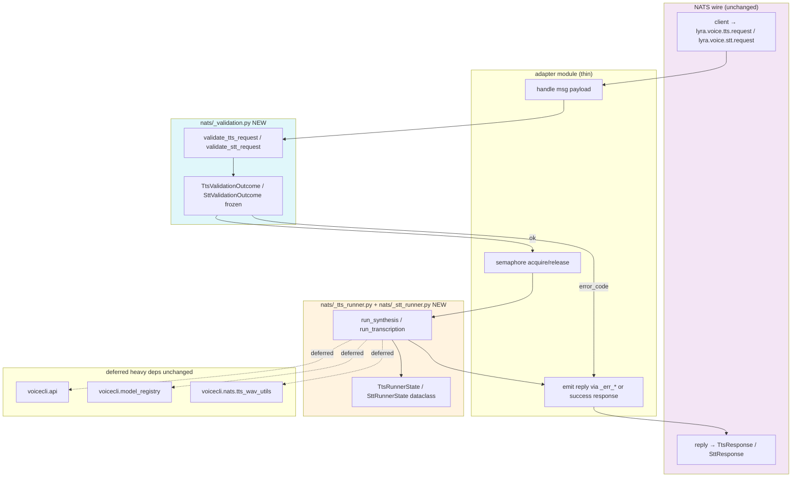
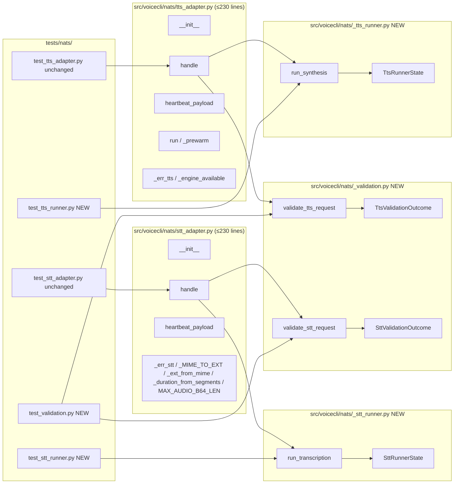

## Summary

Refactor `src/voicecli/nats/{tts,stt}_adapter.py` (over the 300-line cap on `fix/nats-tts-newlines-and-error-codes`) by extracting envelope validation into `nats/_validation.py` and the synthesis/transcription run loops into `nats/_tts_runner.py` / `nats/_stt_runner.py`. 14 micro-tasks across 3 vertical slices; 6 waves; 2 agent instances (tester-A, backend-dev-A). All three architectural decisions (AD-1/2/3) are pre-locked in the spec.

## Architecture

### Data flow



### File × Function map



## Agents

| Agent | Tasks | Files |
|---|---|---|
| tester-A | T1, T6, T10 (RED test authoring for new modules) | `tests/nats/test_validation.py`, `tests/nats/test_tts_runner.py`, `tests/nats/test_stt_runner.py` |
| backend-dev-A | T2–T5, T7–T9, T11–T14 (extraction, adapter rewiring, exemption removal, gate checks) | `src/voicecli/nats/_validation.py` (new), `_tts_runner.py` (new), `_stt_runner.py` (new), `tts_adapter.py`, `stt_adapter.py`, `tools/file_exemptions.txt` |

## Reference patterns

- **TDD shape:** existing `tests/nats/test_tts_adapter.py` (FakeMsg/FakeNatsConn fixtures at `tests/nats/_fakes.py`) — new unit tests follow the same payload-dict driving style.
- **Adapter lifecycle pattern:** `roxabi_nats.NatsAdapterBase` (external SDK) — `handle`, `reply`, `heartbeat_payload`, `_extra_subjects`. Constructors must continue calling `super().__init__(...)` with identical kwargs.
- **Existing helper module convention:** `src/voicecli/nats/tts_wav_utils.py` (~125 lines, pure functions, deferred heavy imports) — template for `_tts_runner.py` and `_stt_runner.py` style.
- **Token validation precedent:** `src/voicecli/nats/_validate.py` — the new `_validation.py` lives next to it; their docstrings cross-reference per AD-1.

## Wave Structure

6 waves, max 1 parallel agent per wave (F-lite tier, intra-slice sequencing dominates). Elapsed ~6 sequential sessions (or 2–3 with single backend-dev-A taking adjacent waves back-to-back); RED tasks (T1/T6/T10) can be drafted ahead during their respective slices.

| Wave | Trigger | Agents | Tasks |
|---|---|---|---|
| 1 | start | tester-A | T1 |
| 2 | Wave 1 done | backend-dev-A | T2 → T3 → T4 → T5 |
| 3 | Wave 2 done | tester-A | T6 |
| 4 | Wave 3 done | backend-dev-A | T7 → T8 → T9 |
| 5 | Wave 4 done | tester-A | T10 |
| 6 | Wave 5 done | backend-dev-A | T11 → T12 → T13 → T14 |

## Consistency Report

- **Slices in spec:** 3 (V1 = validation extraction, V2 = TTS runner extraction, V3 = STT runner extraction + exemption removal)
- **Success criteria in spec:** 8
- **Micro-tasks in plan:** 14 (4 RED-GATE/gate, 3 RED test, 7 GREEN/REFACTOR)
- **Criteria → task coverage:**
  - SC-1 (line counts ≤ 230) → verified in T5, T9, T14
  - SC-2 (new modules ≤ 250) → verified in T5 (validation), T9 (tts_runner), T14 (stt_runner)
  - SC-3 (exemptions file + folder count) → handled by T13, verified in T14
  - SC-4 (existing tests untouched in intent) → verified in T5, T9, T14 (`git diff` checks)
  - SC-5 (new tests exist + coverage ≥ 95%) → built by T1/T6/T10, verified in T5/T9/T14
  - SC-6 (external surface unchanged) → enforced by T3/T4 (handle delegates only), T8/T12 (same), verified in T14
  - SC-7 (quality gates) → verified in T14
  - SC-8 (on-wire grep parity) → verified in T14
- **Untraced tasks:** none
- **Exemptions:** none added; `tools/file_exemptions.txt` cleaned in T13

## Micro-Tasks

### Slice V1 — Carve out `_validation.py`

#### T1 [P=N] — RED: write `tests/nats/test_validation.py` covering every error branch

- **Agent:** tester-A
- **Phase:** RED
- **Slice:** V1
- **Spec trace:** N1, N2 → SC-5
- **Difficulty:** 3
- **Time:** 25 min
- **Files:** `tests/nats/test_validation.py` (new)
- **Snippet:**
  ```python
  # Lazy-import shim so collect-only succeeds before _validation.py exists.
  try:
      from voicecli.nats._validation import (
          validate_tts_request,
          validate_stt_request,
          TtsValidationOutcome,
          SttValidationOutcome,
      )
      _IMPORT_ERROR = None
  except ImportError as e:
      _IMPORT_ERROR = e

  class TestValidateTtsRequest:
      def test_missing_request_id_returns_malformed_request(self): ...
      def test_invalid_request_id_pattern_returns_malformed_request(self): ...
      def test_missing_text_returns_malformed_request(self): ...
      def test_non_string_text_returns_malformed_request(self): ...
      def test_newlines_stripped_and_normalized(self): ...
      def test_text_empty_after_strip_returns_malformed_request(self): ...
      def test_invalid_engine_token_returns_malformed_request(self): ...
      def test_unknown_engine_returns_engine_unavailable(self): ...
      def test_default_engine_used_when_omitted(self): ...
      def test_valid_payload_returns_outcome_with_cleaned_text(self): ...

  class TestValidateSttRequest:
      def test_missing_request_id_returns_malformed_request(self): ...
      def test_invalid_request_id_pattern_returns_malformed_request(self): ...
      def test_missing_audio_b64_returns_malformed_request(self): ...
      def test_non_string_audio_b64_returns_malformed_request(self): ...
      def test_each_optional_field_wrong_type_returns_malformed_request(self): ...  # parametrize
      def test_bool_as_int_in_segments_returns_malformed_request(self): ...
      def test_invalid_task_value_returns_malformed_request(self): ...
      def test_valid_payload_returns_outcome_with_overrides(self): ...
  ```
- **Verify:** `uv run pytest tests/nats/test_validation.py --collect-only`
- **Expected:** collect lists all `test_*` items above; running yields `ImportError`-skipped or `ERROR` (RED state — module not yet present).

#### T2 [P=N] — GREEN: create `src/voicecli/nats/_validation.py`

- **Agent:** backend-dev-A
- **Phase:** GREEN
- **Slice:** V1
- **Spec trace:** AD-1, N1, N2 → SC-5
- **Difficulty:** 3
- **Time:** 30 min
- **Files:** `src/voicecli/nats/_validation.py` (new)
- **Depends:** T1
- **Snippet:**
  ```python
  """Envelope validation for TTS/STT NATS request payloads.

  Companion to `nats/_validate.py` (which validates NATS identifier
  tokens via regex). This module validates per-handler envelope shape
  and field types — see _validate.py for the token-level helper.
  """
  from __future__ import annotations
  import re
  from dataclasses import dataclass

  _REQUEST_ID_RE = re.compile(r"^[A-Za-z0-9_-]{1,128}$")

  @dataclass(frozen=True)
  class TtsValidationOutcome:
      error_code: str | None
      cleaned_text: str | None = None
      engine: str | None = None

  @dataclass(frozen=True)
  class SttValidationOutcome:
      error_code: str | None
      overrides: dict | None = None

  def validate_tts_request(
      payload: dict, *, default_engine: str, engine_available: Callable[[str], bool],
  ) -> TtsValidationOutcome: ...

  def validate_stt_request(payload: dict) -> SttValidationOutcome: ...
  ```
- **Verify:** `uv run pytest tests/nats/test_validation.py`
- **Expected:** all tests authored in T1 pass (GREEN).

#### T3 [P=N] — Rewire `tts_adapter.handle` to call `validate_tts_request`

- **Agent:** backend-dev-A
- **Phase:** GREEN
- **Slice:** V1
- **Spec trace:** U3 → N1 → SC-6
- **Difficulty:** 2
- **Time:** 15 min
- **Files:** `src/voicecli/nats/tts_adapter.py`
- **Depends:** T2
- **Notes:** Delete the inline `request_id`/text/newline/engine checks. Replace with a single `outcome = validate_tts_request(payload, default_engine=self.default_engine, engine_available=_engine_available)`. On `outcome.error_code is not None` → `await self.reply(msg, _err_tts(trace_id, request_id, outcome.error_code))` then `return`. Otherwise use `outcome.cleaned_text` and `outcome.engine` to enter the semaphore + `_run_synthesis` block. Keep `_err_tts` and `_engine_available` in this file.
- **Verify:** `uv run pytest tests/nats/test_tts_adapter.py`
- **Expected:** all pre-existing TTS adapter tests pass with zero edits to their bodies.

#### T4 [P=N] — Rewire `stt_adapter.handle` to call `validate_stt_request`

- **Agent:** backend-dev-A
- **Phase:** GREEN
- **Slice:** V1
- **Spec trace:** U4 → N2 → SC-6
- **Difficulty:** 2
- **Time:** 15 min
- **Files:** `src/voicecli/nats/stt_adapter.py`
- **Depends:** T2
- **Notes:** Delete the inline `request_id` regex, `audio_b64` check, the 6-row optional-field type-check loop, `task` allowlist, and `overrides` dict build. Replace with one `outcome = validate_stt_request(payload)`. Error path: `await self.reply(msg, _err_stt(trace_id, request_id, outcome.error_code))`. Pass `outcome.overrides` to `_run_transcription`.
- **Verify:** `uv run pytest tests/nats/test_stt_adapter.py`
- **Expected:** all pre-existing STT adapter tests pass with zero edits to their bodies.

#### T5 [P=N] — RED-GATE V1: full nats test suite + line-count check

- **Agent:** backend-dev-A
- **Phase:** RED-GATE
- **Slice:** V1
- **Spec trace:** SC-1, SC-2, SC-4
- **Difficulty:** 1
- **Time:** 5 min
- **Files:** none (verification only)
- **Depends:** T3, T4
- **Verify:** `uv run pytest tests/nats/ && wc -l src/voicecli/nats/_validation.py src/voicecli/nats/tts_adapter.py src/voicecli/nats/stt_adapter.py && git diff --stat tests/nats/test_tts_adapter.py tests/nats/test_stt_adapter.py`
- **Expected:** all tests green; `_validation.py` ≤ 250; `tts_adapter.py` ~300 (still above cap — slice 2 finishes it); `stt_adapter.py` ~250 (still above cap — slice 3 finishes it); existing test files unchanged (`git diff --stat` shows 0 lines).

### Slice V2 — Extract TTS run loop

#### T6 [P=N] — RED: write `tests/nats/test_tts_runner.py`

- **Agent:** tester-A
- **Phase:** RED
- **Slice:** V2
- **Spec trace:** N3 → SC-5
- **Difficulty:** 3
- **Time:** 30 min
- **Files:** `tests/nats/test_tts_runner.py` (new)
- **Notes:** Focused unit tests with a fake executor (synchronous stub) and a fake `api.generate` patched via `monkeypatch`. Cover: happy path → returns `(True, fields_dict)`; `ValueError` on first attempt + no `fallback_language` → `(False, "param_validation_failed")`; `ValueError` on first attempt + `fallback_language` succeeds → `(True, fields)`; `ValueError` on first + `ValueError` on fallback → `(False, "param_validation_failed")`; generic `Exception` → `(False, "synthesis_failed")`; chunked-output collection invoked when `_NNN.wav` chunks exist.
- **Verify:** `uv run pytest tests/nats/test_tts_runner.py --collect-only`
- **Expected:** collect succeeds; running yields RED (module missing).

#### T7 [P=N] — GREEN: create `src/voicecli/nats/_tts_runner.py`

- **Agent:** backend-dev-A
- **Phase:** GREEN
- **Slice:** V2
- **Spec trace:** AD-2, N3 → SC-5
- **Difficulty:** 4
- **Time:** 45 min
- **Files:** `src/voicecli/nats/_tts_runner.py` (new)
- **Depends:** T6
- **Snippet:**
  ```python
  """TTS synthesis runner — executor-bound run loop extracted from TtsNatsAdapter.

  Threading: writes to TtsRunnerState fields happen on the executor thread;
  reads from the async loop are limited to TtsRunnerState.model_loaded
  (used by heartbeat_payload). Do not read model_loaded twice in one path
  without acknowledging this can change between reads.

  Optional-kwarg extraction: the lists below ARE the single source of truth
  for which adapter optional kwargs the runner forwards to api.generate.
  Adding a new optional kwarg to the adapter is a no-op unless added here.
  """
  from __future__ import annotations
  from concurrent.futures import ThreadPoolExecutor
  from dataclasses import dataclass
  from typing import Any, Callable

  OPTIONAL_KWARGS = ("language", "voice", "speed", "exaggeration",
                     "cfg_weight", "accent", "personality", "emotion")
  NAMED_KWARGS = ("chunked", "chunk_size", "segment_gap", "crossfade")

  @dataclass
  class TtsRunnerState:
      executor: ThreadPoolExecutor
      set_model_loaded: Callable[[str], None]

  async def run_synthesis(
      state: TtsRunnerState, payload: dict, request_id: str,
      text: str, engine: str, *, trace_id: str,
  ) -> tuple[bool, dict | str]:
      """Return (ok, fields_dict) on success or (False, error_code) on failure."""
      ...
  ```
- **Verify:** `uv run pytest tests/nats/test_tts_runner.py`
- **Expected:** all tests pass (GREEN).

#### T8 [P=N] — Rewire `tts_adapter._run_synthesis` to delegate to `run_synthesis`

- **Agent:** backend-dev-A
- **Phase:** GREEN
- **Slice:** V2
- **Spec trace:** U3 → N3 → SC-6
- **Difficulty:** 3
- **Time:** 20 min
- **Files:** `src/voicecli/nats/tts_adapter.py`
- **Depends:** T7
- **Notes:** Replace the body of `_run_synthesis` with a call to `run_synthesis(self._runner_state, payload, request_id, text, engine, trace_id=trace_id)`. Build `self._runner_state` in `__init__` (`TtsRunnerState(executor=self._executor, set_model_loaded=lambda v: setattr(self, 'model_loaded', v))`). On `(True, fields)` → build `TtsResponse(...)` and emit. On `(False, code)` → `await self.reply(msg, _err_tts(trace_id, request_id, code))`. Keep `out_path` lifecycle (`scoped_path` + `cleanup`) where it currently lives — pass `out_path` into runner.
- **Verify:** `uv run pytest tests/nats/test_tts_adapter.py tests/nats/test_tts_runner.py && wc -l src/voicecli/nats/tts_adapter.py`
- **Expected:** all tests green; `tts_adapter.py` ≤ 230.

#### T9 [P=N] — RED-GATE V2: TTS line-count + existing tests

- **Agent:** backend-dev-A
- **Phase:** RED-GATE
- **Slice:** V2
- **Spec trace:** SC-1, SC-2, SC-4
- **Difficulty:** 1
- **Time:** 5 min
- **Files:** none
- **Depends:** T8
- **Verify:** `uv run pytest tests/nats/ && wc -l src/voicecli/nats/tts_adapter.py src/voicecli/nats/_tts_runner.py && git diff --stat tests/nats/test_tts_adapter.py`
- **Expected:** all green; `tts_adapter.py` ≤ 230; `_tts_runner.py` ≤ 250; `test_tts_adapter.py` unchanged.

### Slice V3 — Extract STT run loop + remove exemptions

#### T10 [P=N] — RED: write `tests/nats/test_stt_runner.py`

- **Agent:** tester-A
- **Phase:** RED
- **Slice:** V3
- **Spec trace:** N4 → SC-5
- **Difficulty:** 3
- **Time:** 30 min
- **Files:** `tests/nats/test_stt_runner.py` (new)
- **Notes:** Cover: happy path → `(True, fields_dict)`; payload larger than `max_audio_b64_len` → `(False, "payload_too_large")`; invalid base64 → `(False, "audio_decode_failed")`; warmup raises → `(False, "model_load_failed")` and state.model_warm stays False; second call after successful warmup does NOT re-warm (idempotency check via call counter on patched warmup); `ValueError` from `api.transcribe` → `(False, "param_validation_failed")`; generic Exception → `(False, "transcription_failed")`.
- **Verify:** `uv run pytest tests/nats/test_stt_runner.py --collect-only`
- **Expected:** collect succeeds; running RED.

#### T11 [P=N] — GREEN: create `src/voicecli/nats/_stt_runner.py`

- **Agent:** backend-dev-A
- **Phase:** GREEN
- **Slice:** V3
- **Spec trace:** AD-2, AD-3, N4 → SC-5
- **Difficulty:** 4
- **Time:** 40 min
- **Files:** `src/voicecli/nats/_stt_runner.py` (new)
- **Depends:** T10
- **Snippet:**
  ```python
  """STT transcription runner — executor-bound run loop extracted from SttNatsAdapter.

  Companion to `nats/_validation.py` (envelope validation). The audio-size
  cap is passed in via `max_audio_b64_len` — the constant MAX_AUDIO_B64_LEN
  lives on the adapter (AD-3) and is forwarded here.

  Threading: state.model_warm and state.model_loaded are written by this
  runner on the executor thread only; the adapter reads model_loaded from
  heartbeat_payload() on the async loop. Do not add reads of model_warm
  outside this module without an asyncio.Event.
  """
  from dataclasses import dataclass

  @dataclass
  class SttRunnerState:
      executor: ThreadPoolExecutor
      model_warm: bool = False
      set_model_warm: Callable[[bool], None] = ...
      set_model_loaded: Callable[[str | None], None] = ...

  async def run_transcription(
      state: SttRunnerState, default_model: str, max_audio_b64_len: int,
      payload: dict, request_id: str, audio_b64: str, overrides: dict,
      *, trace_id: str,
  ) -> tuple[bool, dict | str]: ...
  ```
- **Verify:** `uv run pytest tests/nats/test_stt_runner.py`
- **Expected:** all tests green.

#### T12 [P=N] — Rewire `stt_adapter._run_transcription` to delegate to `run_transcription`

- **Agent:** backend-dev-A
- **Phase:** GREEN
- **Slice:** V3
- **Spec trace:** U4 → N4 → SC-6
- **Difficulty:** 3
- **Time:** 20 min
- **Files:** `src/voicecli/nats/stt_adapter.py`
- **Depends:** T11
- **Notes:** Same pattern as T8. Build `self._runner_state = SttRunnerState(executor=self._executor, set_model_warm=..., set_model_loaded=...)` in `__init__`. `_run_transcription` body becomes a runner call: `ok, fields_or_err = await run_transcription(self._runner_state, self.default_model, MAX_AUDIO_B64_LEN, payload, request_id, audio_b64, overrides, trace_id=trace_id)`. Build `SttResponse(...)` from `fields` on success, else `_err_stt(..., code)`. Keep `MAX_AUDIO_B64_LEN`, `_duration_from_segments`, `_ext_from_mime`, `_MIME_TO_EXT` in `stt_adapter.py` (AD-3).
- **Verify:** `uv run pytest tests/nats/test_stt_adapter.py tests/nats/test_stt_runner.py && wc -l src/voicecli/nats/stt_adapter.py`
- **Expected:** all tests green; `stt_adapter.py` ≤ 230.

#### T13 [P=N] — Remove both NATS adapter rows from `tools/file_exemptions.txt`

- **Agent:** backend-dev-A
- **Phase:** REFACTOR
- **Slice:** V3
- **Spec trace:** SC-3
- **Difficulty:** 1
- **Time:** 2 min
- **Files:** `tools/file_exemptions.txt`
- **Depends:** T12
- **Notes:** Delete the two lines `src/voicecli/nats/tts_adapter.py https://github.com/Roxabi/voiceCLI/issues/147` and `src/voicecli/nats/stt_adapter.py https://github.com/Roxabi/voiceCLI/issues/147`.
- **Verify:** `grep -E "nats/(tts|stt)_adapter" tools/file_exemptions.txt; echo "exit=$?"`
- **Expected:** no match; `exit=1`.

#### T14 [P=N] — RED-GATE V3: full validation suite

- **Agent:** backend-dev-A
- **Phase:** RED-GATE
- **Slice:** V3
- **Spec trace:** SC-1, SC-2, SC-3, SC-5, SC-6, SC-7, SC-8
- **Difficulty:** 2
- **Time:** 10 min
- **Files:** none
- **Depends:** T13
- **Verify:**
  ```bash
  # SC-1: adapter line caps
  test "$(wc -l < src/voicecli/nats/tts_adapter.py)" -le 230 && \
  test "$(wc -l < src/voicecli/nats/stt_adapter.py)" -le 230 && \
  # SC-2: new module caps
  test "$(wc -l < src/voicecli/nats/_validation.py)" -le 250 && \
  test "$(wc -l < src/voicecli/nats/_tts_runner.py)" -le 250 && \
  test "$(wc -l < src/voicecli/nats/_stt_runner.py)" -le 250 && \
  # SC-3: no NATS adapter exemption; folder ≤ 12 files
  ! grep -E "nats/(tts|stt)_adapter" tools/file_exemptions.txt && \
  test "$(ls src/voicecli/nats/*.py | wc -l)" -le 12 && \
  # SC-4: existing test files untouched
  git diff --quiet origin/fix/nats-tts-newlines-and-error-codes -- tests/nats/test_tts_adapter.py tests/nats/test_stt_adapter.py && \
  # SC-5: tests + coverage
  uv run pytest tests/nats/ && \
  uv run pytest tests/nats/test_validation.py tests/nats/test_tts_runner.py tests/nats/test_stt_runner.py \
    --cov=voicecli.nats._validation --cov=voicecli.nats._tts_runner \
    --cov=voicecli.nats._stt_runner --cov-fail-under=95 && \
  # SC-7: quality gates
  uv run ruff check . && uv run ruff format --check . && uv run pyright && \
  # SC-8: on-wire grep parity (compare to baseline captured before refactor)
  bash artifacts/plans/147-on-wire-grep.sh
  ```
- **Expected:** all assertions pass. The on-wire grep script is created as a one-shot in T14 if not already present (it captures literal-string hit counts and diffs against the pre-refactor baseline from `fix/nats-tts-newlines-and-error-codes`).

## Task Seeding Blueprint

<!-- Used by /implement to seed TaskCreate calls on session start.
     Format: T{n} | agent-instance | blockedBy | subject
     blockedBy refs T-numbers within this list (not session task IDs).
     Seed in wave order; within a wave all rows are parallel (∥). -->

### Wave 1 — no deps, 1 agent

| Task | Agent instance | blockedBy | Subject |
|------|---------------|-----------|---------|
| T1 | tester-A | — | RED: write `tests/nats/test_validation.py` covering all error branches |

### Wave 2 — after Wave 1, 1 agent (sequential chain on backend-dev-A)

| Task | Agent instance | blockedBy | Subject |
|------|---------------|-----------|---------|
| T2 | backend-dev-A | T1 | GREEN: create `src/voicecli/nats/_validation.py` |
| T3 | backend-dev-A | T2 | Rewire `tts_adapter.handle` to call `validate_tts_request` |
| T4 | backend-dev-A | T2 | Rewire `stt_adapter.handle` to call `validate_stt_request` |
| T5 | backend-dev-A | T3,T4 | RED-GATE V1: pytest tests/nats/ + wc -l + git diff stat |

### Wave 3 — after Wave 2, 1 agent

| Task | Agent instance | blockedBy | Subject |
|------|---------------|-----------|---------|
| T6 | tester-A | T5 | RED: write `tests/nats/test_tts_runner.py` |

### Wave 4 — after Wave 3, 1 agent

| Task | Agent instance | blockedBy | Subject |
|------|---------------|-----------|---------|
| T7 | backend-dev-A | T6 | GREEN: create `src/voicecli/nats/_tts_runner.py` |
| T8 | backend-dev-A | T7 | Rewire `tts_adapter._run_synthesis` to call `run_synthesis` |
| T9 | backend-dev-A | T8 | RED-GATE V2: TTS line cap + pytest |

### Wave 5 — after Wave 4, 1 agent

| Task | Agent instance | blockedBy | Subject |
|------|---------------|-----------|---------|
| T10 | tester-A | T9 | RED: write `tests/nats/test_stt_runner.py` |

### Wave 6 — after Wave 5, 1 agent

| Task | Agent instance | blockedBy | Subject |
|------|---------------|-----------|---------|
| T11 | backend-dev-A | T10 | GREEN: create `src/voicecli/nats/_stt_runner.py` |
| T12 | backend-dev-A | T11 | Rewire `stt_adapter._run_transcription` to call `run_transcription` |
| T13 | backend-dev-A | T12 | Remove NATS adapter rows from `tools/file_exemptions.txt` |
| T14 | backend-dev-A | T13 | RED-GATE V3: full validation (lint, types, tests, coverage, on-wire grep) |

## Task IDs

<!-- Generated by /plan. Used by /implement to resume tasks on session restart. -->
- T1: 12 — RED: write tests/nats/test_validation.py covering all error branches
- T2: 13 — GREEN: create src/voicecli/nats/_validation.py
- T3: 14 — Rewire tts_adapter.handle to call validate_tts_request
- T4: 15 — Rewire stt_adapter.handle to call validate_stt_request
- T5: 16 — RED-GATE V1: pytest tests/nats/ + wc -l + git diff stat
- T6: 17 — RED: write tests/nats/test_tts_runner.py
- T7: 18 — GREEN: create src/voicecli/nats/_tts_runner.py
- T8: 19 — Rewire tts_adapter._run_synthesis to call run_synthesis
- T9: 20 — RED-GATE V2: TTS line cap + pytest
- T10: 21 — RED: write tests/nats/test_stt_runner.py
- T11: 22 — GREEN: create src/voicecli/nats/_stt_runner.py
- T12: 23 — Rewire stt_adapter._run_transcription to call run_transcription
- T13: 24 — Remove NATS adapter rows from tools/file_exemptions.txt
- T14: 25 — RED-GATE V3: full validation (caps, exemptions, tests, coverage, on-wire grep)
