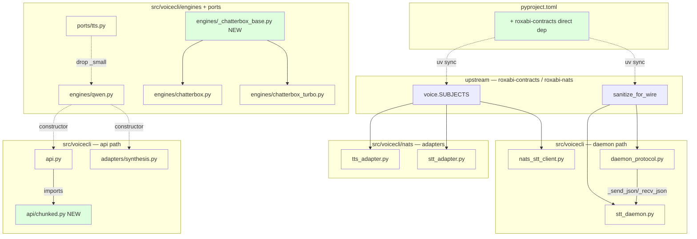
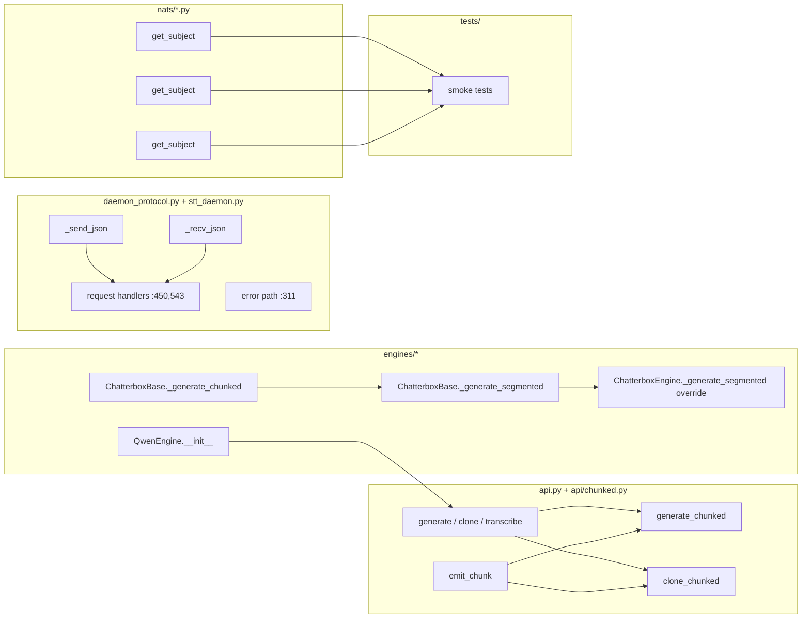

## Summary

Consume now-shipped upstream (`voice.SUBJECTS` + `sanitize_for_wire` from lyra #1291) at 8 sites; extract `ChatterboxBase` mixin; move `_small` off `TTSEngine` ABC; unify `stt_daemon` wire protocol; extract `api.py` chunked helpers. Single PR, 3 commits (one per slice), ~10 src files.

## Architecture

### Data flow

### File × Function map

## Agents

| Agent | Tasks | Files |
|---|---|---|
| devops-A | 1 | `pyproject.toml`, `uv.lock` |
| backend-dev-A (NATS/contracts) | 6 | `nats/tts_adapter.py`, `nats/stt_adapter.py`, `nats_stt_client.py`, `daemon_protocol.py`, `stt_daemon.py` |
| backend-dev-B (engines/api) | 7 | `ports/tts.py`, `engines/qwen.py`, `engines/_chatterbox_base.py` (NEW), `engines/chatterbox.py`, `engines/chatterbox_turbo.py`, `api.py`, `api/chunked.py` (NEW), `adapters/synthesis.py` |
| tester-A | 2 | `tests/` (existing + new smoke) |

## Wave Structure

3 waves, max 3 parallel agents. Elapsed ~1 day vs ~3 days sequential.

| Wave | Trigger | Agents | Tasks |
|------|---------|--------|-------|
| 1 | start | 3 ∥ | devops-A: T1 · backend-dev-A: T2→T3→T4→T5→T6 (Slice 1) · backend-dev-B: T8→T9→T10→T11→T12 (Slice 3 setup) |
| 2 | Wave 1 done | 2 ∥ | backend-dev-A: T7 (Slice 2 — unify wire protocol, depends on Slice 1's stt_daemon edits) · backend-dev-B: T13→T14 (Slice 3 finalize) |
| 3 | Wave 2 done | 1 | tester-A: T15 (full pytest + smoke matrix) · T16 (RED-GATE) |

### Budget

| Task | Items | Class | Est. ops | Split? |
|------|-------|-------|----------|--------|
| T1 (pyproject dep) | 1 | trivial | 2 | — |
| T2–T4 (3 NATS subject migrations) | 3 | bounded | 9 | — |
| T5–T6 (sanitize_for_wire ×3) | 3 | bounded | 9 | — |
| T7 (stt_daemon wire-protocol unify) | 1 | judgmental | 5 | — |
| T8 (extract ChatterboxBase) | 1 | judgmental | 6 | — |
| T9–T10 (rewire 2 Chatterbox subclasses) | 2 | bounded | 6 | — |
| T11 (move `_small` off ABC) | 1 | bounded | 3 | — |
| T12 (rewire 4 `_small` mutation sites) | 1 | judgmental | 5 | — |
| T13 (extract api/chunked.py) | 1 | judgmental | 6 | — |
| T14 (wire api.py to chunked module) | 1 | bounded | 3 | — |
| T15 (pytest + smoke matrix) | 1 | judgmental | 6 | — |
| T16 (RED-GATE: grep counts + LOC checks) | 1 | trivial | 2 | — |

**Total estimated ops: ~62** — within F-lite budget. No splits required.

## Consistency Report

| Spec criterion | Covered by tasks |
|---|---|
| SC1: pyproject roxabi-contracts dep | T1 |
| SC2: 0 `lyra.voice.*` literals (5 sites) | T2, T3, T4 |
| SC3: sanitize_for_wire at 3 sites | T5, T6 |
| SC4: stt_daemon imports `_send/_recv_json` | T7 |
| SC5: ChatterboxBase mixin, ≥70 LOC saved | T8, T9, T10 |
| SC6: `_small` off ABC, QwenEngine constructor | T11, T12 |
| SC7: api.py < 1000 LOC, chunked module extracted | T13, T14 |
| SC8: pytest + smoke matrix passes | T15, T16 (RED-GATE) |

All 8 criteria covered. Zero untraced tasks.

## Micro-Tasks

### Slice 1 — Cross-repo contract integration (covers SC1, SC2, SC3)

**T1 [P]** [devops-A] **Declare `roxabi-contracts` as direct dep** — `pyproject.toml`
- Add to `[project.optional-dependencies]` `nats = [..., "roxabi-contracts"]`
- Add `[tool.uv.sources]` `roxabi-contracts = { git = "https://github.com/Roxabi/lyra.git", subdirectory = "packages/roxabi-contracts", branch = "staging" }`
- Run `uv lock` (no `uv sync` needed; already transitively present)
- **Verify:** `grep -E '^"?roxabi-contracts"?' pyproject.toml | wc -l` → ≥ 1; `uv lock --check` passes
- **Time:** 3 min · **Difficulty:** 1 · **Spec trace:** SC1 · **Phase:** GREEN

**T2 [P]** [backend-dev-A] **Migrate `nats/tts_adapter.py` to `voice.SUBJECTS`** — replace `"lyra.voice.tts.request"` / `"lyra.voice.tts.heartbeat"` literals with `voice.SUBJECTS.tts_request` / `voice.SUBJECTS.tts_heartbeat` imports
- Pattern: `from roxabi_contracts.voice import SUBJECTS as VOICE_SUBJECTS` (or named import per project convention)
- **Verify:** `grep -E 'lyra\.voice\.tts\.(request|heartbeat)' src/voicecli/nats/tts_adapter.py | wc -l` → 0
- **Time:** 4 min · **Difficulty:** 2 · **Spec trace:** SC2 / U1, U2 · **Phase:** GREEN

**T3 [P]** [backend-dev-A] **Migrate `nats/stt_adapter.py`** — same pattern as T2 but for `stt_request` / `stt_heartbeat`
- **Verify:** `grep -E 'lyra\.voice\.stt\.(request|heartbeat)' src/voicecli/nats/stt_adapter.py | wc -l` → 0
- **Time:** 4 min · **Difficulty:** 2 · **Spec trace:** SC2 / U3, U4 · **Phase:** GREEN

**T4 [P]** [backend-dev-A] **Migrate `nats_stt_client.py`** — replace `lyra.voice.stt.request` literal with `voice.SUBJECTS.stt_request`
- Also: drop any import-linter allowlist entries for this file (commit `b8af4c7`)
- **Verify:** `grep 'lyra\.voice\.' src/voicecli/nats_stt_client.py | wc -l` → 0
- **Time:** 4 min · **Difficulty:** 2 · **Spec trace:** SC2 / U3 · **Phase:** GREEN

**T5 [P]** [backend-dev-A] **Replace `str(exc)` at `daemon_protocol.py:311`** with `sanitize_for_wire(exc)`
- Import: `from roxabi_nats import sanitize_for_wire` (verify actual import path with `uv pip show roxabi-nats`)
- **Verify:** `sed -n '305,320p' src/voicecli/daemon_protocol.py | grep 'sanitize_for_wire'` → 1 match
- **Time:** 3 min · **Difficulty:** 2 · **Spec trace:** SC3 / N1 · **Phase:** GREEN

**T6 [P]** [backend-dev-A] **Replace `str(exc)` at `stt_daemon.py:450` and `:543`** with `sanitize_for_wire(exc)`
- Both sites in same file; one import at top suffices
- **Verify:** `grep -nE 'str\(exc\)' src/voicecli/stt_daemon.py | wc -l` → 0
- **Time:** 4 min · **Difficulty:** 2 · **Spec trace:** SC3 / N2, N3 · **Phase:** GREEN

### Slice 2 — Daemon protocol unification (covers SC4)

**T7** [backend-dev-A] **Unify `stt_daemon` wire protocol with `daemon_protocol`** — drop inline `_send_json` / `_recv_json` in `stt_daemon.py`, import from `daemon_protocol`
- Diff `stt_daemon._send_json` / `_recv_json` vs `daemon_protocol._send_json` / `_recv_json` before deleting; confirm byte-compatible. If not, port any differences into `daemon_protocol` first (single source of truth).
- **Verify:** `grep -c 'def _send_json\|def _recv_json' src/voicecli/stt_daemon.py` → 0; `grep 'from .daemon_protocol import' src/voicecli/stt_daemon.py | grep -E '_send_json|_recv_json'` → ≥ 1
- LOC delta: ≥ 20 lines removed from `stt_daemon.py`
- **blockedBy:** T6 (both touch `stt_daemon.py` — sequential)
- **Time:** 8 min · **Difficulty:** 3 · **Spec trace:** SC4 / N4, N5 · **Phase:** REFACTOR

### Slice 3 — Internal refactors (covers SC5, SC6, SC7)

**T8 [P]** [backend-dev-B] **Create `engines/_chatterbox_base.py` mixin** — extract `_generate_chunked` (byte-identical between the 2 Chatterbox engines) and `_generate_segmented` (97% identical; the 1-line language-dispatch diff stays out of the base)
- Class: `class ChatterboxBase(TTSEngine): ...`
- `_generate_segmented` in the base has NO language override; subclass overrides if needed
- **Verify:** `test -f src/voicecli/engines/_chatterbox_base.py && grep -c 'def _generate_chunked\|def _generate_segmented' src/voicecli/engines/_chatterbox_base.py` → 2
- **Time:** 8 min · **Difficulty:** 3 · **Spec trace:** SC5 / S1, S2 · **Phase:** GREEN

**T9** [backend-dev-B] **Rewire `engines/chatterbox.py` to inherit `ChatterboxBase`** — drop the local `_generate_chunked` (verbatim duplicate); override `_generate_segmented` only for the `language_id` dispatch line; keep all other engine-specific construction
- **Verify:** `grep -c 'def _generate_chunked' src/voicecli/engines/chatterbox.py` → 0
- **blockedBy:** T8
- **Time:** 5 min · **Difficulty:** 3 · **Spec trace:** SC5 / S1 · **Phase:** REFACTOR

**T10** [backend-dev-B] **Rewire `engines/chatterbox_turbo.py` to inherit `ChatterboxBase`** — drop both `_generate_chunked` and `_generate_segmented` (no override — Turbo is English-only)
- **Verify:** `grep -c 'def _generate_chunked\|def _generate_segmented' src/voicecli/engines/chatterbox_turbo.py` → 0
- Combined LOC drop (T9+T10): ≥ 70 lines
- **blockedBy:** T8
- **Time:** 5 min · **Difficulty:** 2 · **Spec trace:** SC5 / S2 · **Phase:** REFACTOR

**T11 [P]** [backend-dev-B] **Remove `_small: bool = False` from `ports/tts.py` `TTSEngine` ABC** — pure deletion; QwenEngine will take it via constructor in T12
- **Verify:** `grep -c '_small' src/voicecli/ports/tts.py` → 0
- **Time:** 2 min · **Difficulty:** 1 · **Spec trace:** SC6 / S3 · **Phase:** REFACTOR

**T12** [backend-dev-B] **Move `_small` into `QwenEngine.__init__` + rewire 4 mutation sites** — `QwenEngine.__init__(self, *, small: bool = False, ...)`; rewrite `api.py:727`, `adapters/synthesis.py:143, 201, 249` to construct `QwenEngine(small=True)` (or pass `small=` through their respective factory) instead of `eng._small = True`
- **Verify:** `grep -rE 'eng\._small\s*=\s*True\|engine\._small\s*=\s*True' src/voicecli/ | wc -l` → 0; `grep -c '_small' src/voicecli/engines/qwen.py` → ≥ 1
- **blockedBy:** T11
- **Time:** 6 min · **Difficulty:** 3 · **Spec trace:** SC6 / S3 · **Phase:** REFACTOR

**T13 [P]** [backend-dev-B] **Extract chunked helpers from `api.py` to new `api/chunked.py`** (or `api_chunked.py` — match project module style)
- Move `_emit_chunk`, `_generate_chunked`, `_clone_chunked` verbatim; expose without leading underscore if they're public helpers
- Parameterize the chunked/clone overlap (95% identical) via callable or kwargs; ¬over-engineer
- **Verify:** `test -f src/voicecli/api/chunked.py || test -f src/voicecli/api_chunked.py` ; `grep -c 'def emit_chunk\|def generate_chunked\|def clone_chunked' <new file>` → 3
- **Time:** 8 min · **Difficulty:** 3 · **Spec trace:** SC7 / S4 · **Phase:** REFACTOR

**T14** [backend-dev-B] **Wire `api.py` to import chunked helpers** — replace inline defs with `from .chunked import ...` (or `from .api_chunked import ...`); confirm `api.py` < 1000 LOC after
- **Verify:** `wc -l src/voicecli/api.py | awk '{print ($1 < 1000)}'` → 1
- **blockedBy:** T13
- **Time:** 3 min · **Difficulty:** 2 · **Spec trace:** SC7 · **Phase:** REFACTOR

### Verification (covers SC8)

**T15** [tester-A] **Run pytest + smoke matrix**
- `uv run pytest` → 0 failures
- Manual smoke matrix (document results in PR description; daemons must be running via `make -C ~/projects tts start` / `stt start`):
  - `voicecli generate "hello world" -e qwen-fast`
  - `voicecli generate "hello world" -e chatterbox`
  - `voicecli generate "hello world" -e chatterbox-turbo`
  - `voicecli clone "hello world" -e qwen-fast` (with existing active sample)
  - `voicecli dictate nats` → speak → confirm transcription returns
- **Verify:** all commands exit 0; pytest exit 0
- **blockedBy:** T7, T9, T10, T12, T14
- **Time:** 10 min · **Difficulty:** 3 · **Spec trace:** SC8 · **Phase:** GREEN

**T16 [RED-GATE]** [tester-A] **Final grep + LOC verification** — all 8 spec criteria measurable from disk
- `grep -rE 'lyra\.voice\.(tts|stt)\.(request|heartbeat)' src/voicecli/ | wc -l` → 0 (SC2)
- `grep -rnE 'str\(exc\)' src/voicecli/daemon_protocol.py src/voicecli/stt_daemon.py | wc -l` → 0 (SC3)
- `grep -c 'def _send_json\|def _recv_json' src/voicecli/stt_daemon.py` → 0 (SC4)
- `wc -l src/voicecli/api.py` → < 1000 (SC7)
- `wc -l src/voicecli/engines/chatterbox.py src/voicecli/engines/chatterbox_turbo.py` → combined < (pre-refactor combined − 70) (SC5)
- `grep -c '_small' src/voicecli/ports/tts.py` → 0 (SC6)
- **blockedBy:** T15
- **Time:** 4 min · **Difficulty:** 1 · **Spec trace:** SC1–SC8 · **Phase:** RED-GATE

## Task Seeding Blueprint

<!-- Used by /implement to seed TaskCreate calls on session start. -->

### Wave 1 — no deps, 3 agents ∥

| Task | Agent instance | blockedBy | Subject |
|------|---------------|-----------|---------|
| T1 | devops-A | — | Declare roxabi-contracts as direct dep in pyproject.toml |
| T2 | backend-dev-A | — | Migrate nats/tts_adapter.py to voice.SUBJECTS |
| T3 | backend-dev-A | — | Migrate nats/stt_adapter.py to voice.SUBJECTS |
| T4 | backend-dev-A | — | Migrate nats_stt_client.py to voice.SUBJECTS |
| T5 | backend-dev-A | — | Replace str(exc) at daemon_protocol.py:311 with sanitize_for_wire |
| T6 | backend-dev-A | — | Replace str(exc) at stt_daemon.py:450,543 with sanitize_for_wire |
| T8 | backend-dev-B | — | Create engines/_chatterbox_base.py mixin |
| T11 | backend-dev-B | — | Remove _small from TTSEngine ABC (ports/tts.py) |
| T13 | backend-dev-B | — | Extract chunked helpers from api.py to api/chunked.py |

### Wave 2 — after Wave 1, 2 agents ∥

| Task | Agent instance | blockedBy | Subject |
|------|---------------|-----------|---------|
| T7 | backend-dev-A | T6 | Unify stt_daemon wire protocol with daemon_protocol |
| T9 | backend-dev-B | T8 | Rewire engines/chatterbox.py to inherit ChatterboxBase |
| T10 | backend-dev-B | T8 | Rewire engines/chatterbox_turbo.py to inherit ChatterboxBase |
| T12 | backend-dev-B | T11 | Move _small into QwenEngine.__init__ + rewire 4 mutation sites |
| T14 | backend-dev-B | T13 | Wire api.py to import from chunked module |

### Wave 3 — after Wave 2, 1 agent

| Task | Agent instance | blockedBy | Subject |
|------|---------------|-----------|---------|
| T15 | tester-A | T7,T9,T10,T12,T14 | Run pytest + smoke matrix (5 engines, dictate-nats round-trip) |
| T16 | tester-A | T15 | RED-GATE: grep + LOC verification of all 8 spec criteria |

## Task IDs

<!-- Generated by /plan. Used by /implement to resume tasks on session restart. -->
- T1: 13 — Declare roxabi-contracts as direct dep in pyproject.toml
- T2: 14 — Migrate nats/tts_adapter.py to voice.SUBJECTS
- T3: 15 — Migrate nats/stt_adapter.py to voice.SUBJECTS
- T4: 16 — Migrate nats_stt_client.py to voice.SUBJECTS
- T5: 17 — Replace str(exc) at daemon_protocol.py:311 with sanitize_for_wire
- T6: 18 — Replace str(exc) at stt_daemon.py:450,543 with sanitize_for_wire
- T7: 19 — Unify stt_daemon wire protocol with daemon_protocol
- T8: 20 — Create engines/_chatterbox_base.py mixin
- T9: 21 — Rewire engines/chatterbox.py to inherit ChatterboxBase
- T10: 22 — Rewire engines/chatterbox_turbo.py to inherit ChatterboxBase
- T11: 23 — Remove _small from TTSEngine ABC (ports/tts.py)
- T12: 24 — Move _small into QwenEngine.__init__ + rewire 4 mutation sites
- T13: 25 — Extract chunked helpers from api.py to api/chunked.py
- T14: 26 — Wire api.py to import from chunked module
- T15: 27 — Run pytest + smoke matrix (5 engines, dictate-nats round-trip)
- T16: 28 — RED-GATE: grep + LOC verification of all 8 spec criteria
