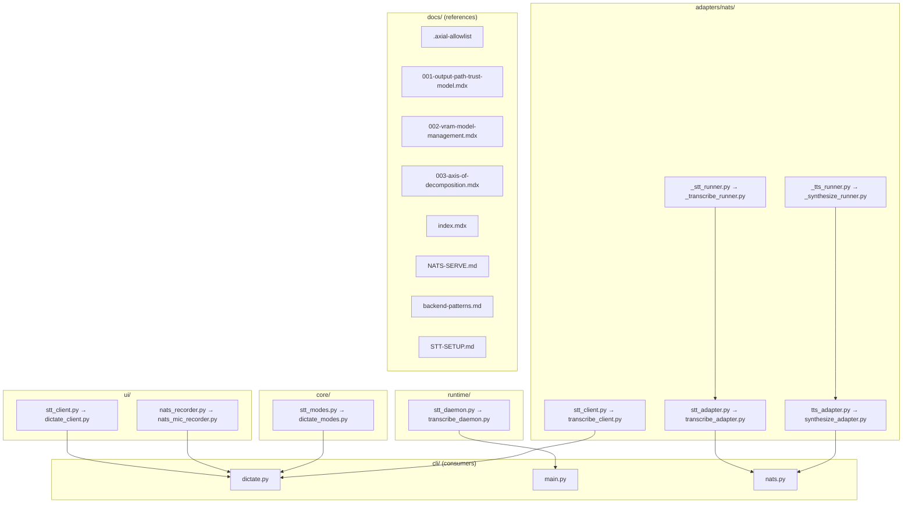
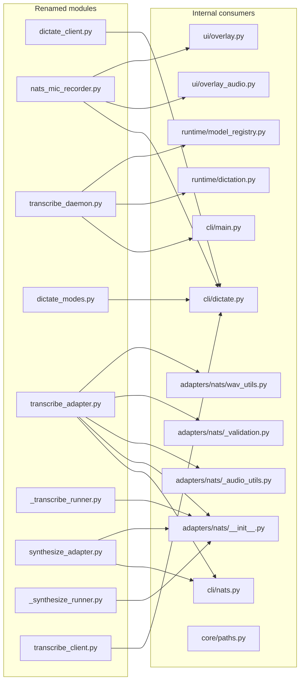

## Summary

Execute 9 `git mv` renames across 4 layer packages (`ui/`, `runtime/`, `core/`, `adapters/nats/`), update ~18 internal import references, update 8 docs/architecture references, and verify zero old-name grep in the repo. All changes in a single PR with atomic commit.

## Architecture

### Data Flow

### File × Consumer Map

## Bootstrap Context

No new architecture — all interfaces frozen. The refactor is a pathname + import-string change only. Every function signature, class definition, and module API remains identical.

## Agents

| Agent | Tasks | Files | Subject |
|---|---|---|---|
| backend-dev-A | T1–T3 | 27 files | rename, imports, verify |
| doc-writer-A | T4–T5 | 8 files | docs |
| tester-A | T6–T9 | repo-wide | verify |

## Wave Structure

5 waves, max 2 parallel agents. Elapsed ~1 session vs ~5 sequential.

| Wave | Trigger | Agents | Tasks |
|---|---|---|---|
| 1 | start | backend-dev-A | T1 |
| 2 | T1 done | backend-dev-A, doc-writer-A | T2, T4 |
| 3 | T2 done | backend-dev-A, doc-writer-A | T3, T5 |
| 4 | T3 + T5 done | tester-A | T6, T7, T8 |
| 5 | T6 + T7 + T8 done | tester-A | T9 |

### Budget — per task

| Task | Items | Class | Est. ops | Split? |
|---|---|---|---|---|
| T1 Rename files | 9 git mv | trivial | 9 | — |
| T2 Update imports | 18 files | bounded | 36 | — |
| T3 Verify src/ clean | 1 grep | trivial | 2 | — |
| T4 Update allowlist | 1 file | bounded | 3 | — |
| T5 Update docs | 7 files | bounded | 21 | — |
| T6 ruff check | 1 command | trivial | 2 | — |
| T7 pyright | 1 command | trivial | 2 | — |
| T8 pytest | 1 command | trivial | 2 | — |
| T9 Final grep | 1 grep | trivial | 2 | — |

**Total estimated ops: 79**

### Budget — per agent instance

| Instance | Tasks | Σ ops | Subjects | Split? |
|---|---|---|---|---|
| backend-dev-A | T1, T2, T3 | 47 | rename | — |
| doc-writer-A | T4, T5 | 24 | docs | — |
| tester-A | T6, T7, T8, T9 | 8 | verify | — |

## Micro-Tasks

### Wave 1 — Rename files

**T1 — Rename all 9 files via git mv**
- Description: Execute `git mv` for all 9 renames, preserving git history.
- Files:
  - `src/voicecli/ui/stt_client.py` → `src/voicecli/ui/dictate_client.py`
  - `src/voicecli/ui/nats_recorder.py` → `src/voicecli/ui/nats_mic_recorder.py`
  - `src/voicecli/runtime/stt_daemon.py` → `src/voicecli/runtime/transcribe_daemon.py`
  - `src/voicecli/core/stt_modes.py` → `src/voicecli/core/dictate_modes.py`
  - `src/voicecli/adapters/nats/stt_adapter.py` → `src/voicecli/adapters/nats/transcribe_adapter.py`
  - `src/voicecli/adapters/nats/_stt_runner.py` → `src/voicecli/adapters/nats/_transcribe_runner.py`
  - `src/voicecli/adapters/nats/tts_adapter.py` → `src/voicecli/adapters/nats/synthesize_adapter.py`
  - `src/voicecli/adapters/nats/_tts_runner.py` → `src/voicecli/adapters/nats/_synthesize_runner.py`
  - `src/voicecli/adapters/nats/stt_client.py` → `src/voicecli/adapters/nats/transcribe_client.py`
- Code snippet: `git mv old_path new_path` for each pair.
- Verify command: `ls new_path && ! ls old_path` for each pair.
- Expected output: All new paths exist; no old paths remain.
- Time estimate: 3 min.
- `[P]` marker: N (atomic rename set).
- Agent: backend-dev-A.
- Subject: rename.
- Spec trace: SC-1–SC-10.
- Slice: V1.
- Phase: REFACTOR.
- Difficulty: 2.

### Wave 2 — Import updates + allowlist

**T2 — Update all internal Python import references**
- Description: Update every `from voicecli...` and `import voicecli...` statement referencing old module names across the codebase.
- Files:
  - `src/voicecli/adapters/nats/__init__.py`
  - `src/voicecli/adapters/nats/_audio_utils.py`
  - `src/voicecli/adapters/nats/_validation.py`
  - `src/voicecli/adapters/nats/wav_utils.py`
  - `src/voicecli/cli/dictate.py`
  - `src/voicecli/cli/main.py`
  - `src/voicecli/cli/nats.py`
  - `src/voicecli/core/paths.py`
  - `src/voicecli/runtime/dictation.py`
  - `src/voicecli/runtime/model_registry.py`
  - `src/voicecli/ui/overlay_audio.py`
  - `src/voicecli/ui/overlay.py`
- Code snippet: Replace `voicecli.X.Y.stt_Z` with `voicecli.X.Y.transcribe_Z` (or appropriate layer-axis name). Also update `__init__.py` lazy-loader name strings.
- Verify command: `uv run ruff check .`
- Expected output: Zero import errors.
- Time estimate: 8 min.
- `[P]` marker: N (depends on T1 renames).
- Agent: backend-dev-A.
- Subject: imports.
- Spec trace: SC-11.
- Slice: V1.
- Phase: REFACTOR.
- Difficulty: 3.

**T4 — Update .axial-allowlist**
- Description: Replace old filenames with new filenames in `docs/architecture/.axial-allowlist`.
- File: `docs/architecture/.axial-allowlist`
- Code snippet: Line-by-line string replacement of listed paths.
- Verify command: `grep -cE "stt_client|nats_recorder|stt_daemon|stt_modes|stt_adapter|_stt_runner|tts_adapter|_tts_runner" docs/architecture/.axial-allowlist`
- Expected output: `0`
- Time estimate: 2 min.
- `[P]` marker: Y (docs-only, independent of code imports).
- Agent: doc-writer-A.
- Subject: docs.
- Spec trace: SC-13.
- Slice: V2.
- Phase: REFACTOR.
- Difficulty: 1.

### Wave 3 — Verification + docs

**T3 — Verify zero old-name references in src/voicecli/**
- Description: Grep for any remaining old module names in the Python source tree (excluding `__pycache__` and `.pyc`).
- Verify command: `grep -rE "stt_client|nats_recorder|stt_daemon|stt_modes|stt_adapter|_stt_runner|tts_adapter|_tts_runner|nats_stt_client" src/voicecli --include="*.py" | grep -v __pycache__ | grep -v ".pyc" | wc -l`
- Expected output: `0`
- Time estimate: 2 min.
- `[P]` marker: N (depends on T2).
- Agent: backend-dev-A.
- Subject: verify.
- Spec trace: SC-11.
- Slice: V1.
- Phase: RED-GATE.
- Difficulty: 1.

**T5 — Update all docs references**
- Description: Update old module names in all docs files.
- Files:
  - `docs/architecture/adr/001-output-path-trust-model.mdx`
  - `docs/architecture/adr/002-vram-model-management.mdx`
  - `docs/architecture/adr/003-axis-of-decomposition.mdx`
  - `docs/architecture/index.mdx`
  - `docs/NATS-SERVE.md`
  - `docs/standards/backend-patterns.md`
  - `docs/STT-SETUP.md`
- Code snippet: Replace old filenames and import path strings with new ones. Preserve prose meaning.
- Verify command: `grep -rE "stt_client|nats_recorder|stt_daemon|stt_modes|stt_adapter|_stt_runner|tts_adapter|_tts_runner|nats_stt_client" docs --include="*.md" --include="*.mdx" | grep -v __pycache__ | wc -l`
- Expected output: `0`
- Time estimate: 5 min.
- `[P]` marker: N (depends on T4).
- Agent: doc-writer-A.
- Subject: docs.
- Spec trace: SC-14.
- Slice: V2.
- Phase: REFACTOR.
- Difficulty: 2.

### Wave 4 — Quality gates

**T6 — Run ruff check**
- Description: Verify lint passes after all renames and import updates.
- Verify command: `uv run ruff check .`
- Expected output: Zero errors.
- Time estimate: 2 min.
- `[P]` marker: Y.
- Agent: tester-A.
- Subject: verify.
- Spec trace: SC-11.
- Slice: V3.
- Phase: GREEN.
- Difficulty: 1.

**T7 — Run pyright**
- Description: Verify typecheck passes after all renames.
- Verify command: `uv run pyright`
- Expected output: Zero errors.
- Time estimate: 3 min.
- `[P]` marker: Y.
- Agent: tester-A.
- Subject: verify.
- Spec trace: SC-12.
- Slice: V3.
- Phase: GREEN.
- Difficulty: 1.

**T8 — Run pytest**
- Description: Verify all tests pass.
- Verify command: `uv run pytest`
- Expected output: All tests pass.
- Time estimate: 3 min.
- `[P]` marker: Y.
- Agent: tester-A.
- Subject: verify.
- Spec trace: SC-15.
- Slice: V3.
- Phase: GREEN.
- Difficulty: 1.

### Wave 5 — Final sentinel

**T9 — Final zero-grep across whole repo**
- Description: Final grep for any remaining old module names across the entire repo (excluding `.git`, `__pycache__`, `.pyc`).
- Verify command: `grep -rE "stt_client|nats_recorder|stt_daemon|stt_modes|stt_adapter|_stt_runner|tts_adapter|_tts_runner|nats_stt_client" --include="*.py" --include="*.md" --include="*.mdx" --include="*.toml" . | grep -v __pycache__ | grep -v ".pyc" | grep -v ".git" | wc -l`
- Expected output: `0`
- Time estimate: 2 min.
- `[P]` marker: N (depends on T6, T7, T8).
- Agent: tester-A.
- Subject: verify.
- Spec trace: SC-11, SC-13, SC-14.
- Slice: V3.
- Phase: RED-GATE.
- Difficulty: 1.

## Consistency Report

| Check | Covered | Total | Status |
|---|---|---|---|
| Success criteria | 14 | 14 | ✓ |
| Slices | 3 | 3 | ✓ |
| Files renamed | 9 | 9 | ✓ |
| Import files updated | 12 | 12 | ✓ |
| Docs files updated | 7 | 7 | ✓ |

**Uncovered:** None.

**Untraced:** None.

**Exemptions:** None.

## Task Seeding Blueprint

### Wave 1 — start, 1 agent

| Task | Agent instance | blockedBy | Subject |
|---|---|---|---|
| T1 | backend-dev-A | — | rename |

### Wave 2 — after T1, 2 agents ∥

| Task | Agent instance | blockedBy | Subject |
|---|---|---|---|
| T2 | backend-dev-A | T1 | imports |
| T4 | doc-writer-A | T1 | docs |

### Wave 3 — after T2, 2 agents ∥

| Task | Agent instance | blockedBy | Subject |
|---|---|---|---|
| T3 | backend-dev-A | T2 | verify |
| T5 | doc-writer-A | T4 | docs |

### Wave 4 — after T3 + T5, 1 agent

| Task | Agent instance | blockedBy | Subject |
|---|---|---|---|
| T6 | tester-A | T2, T5 | verify |
| T7 | tester-A | T2, T5 | verify |
| T8 | tester-A | T2, T5 | verify |

### Wave 5 — after T6 + T7 + T8, 1 agent

| Task | Agent instance | blockedBy | Subject |
|---|---|---|---|
| T9 | tester-A | T6, T7, T8 | verify |

## Task IDs

<!-- Generated by /plan. Used by /implement to resume tasks on session restart. -->
- T1: 10 — rename
- T2: 11 — imports
- T3: 12 — verify
- T4: 13 — docs
- T5: 14 — docs
- T6: 15 — verify
- T7: 16 — verify
- T8: 17 — verify
- T9: 18 — verify
