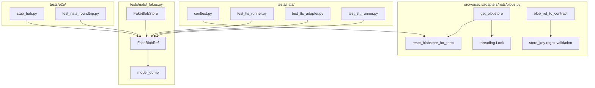
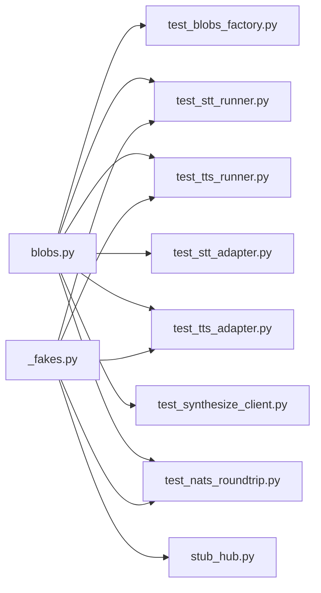

## Summary

Post-merge polish of 8 deferred advisories from PR #180 consensus. Three bundles: tests infra refactor (A7+A9), runtime polish (A2+A4), single-file nits (A8+A10+A11+A12). Estimated ~15 micro-tasks across 2 agent instances.

## Architecture

## Bootstrap Context

- `blobs.py` uses module-level `_INSTANCE` global with lazy init; no lock currently.
- `tests/nats/` has no `__init__.py`; `_fakes.py` is imported via `from _fakes import ...` (pytest pythonpath adds `tests/nats/` for nats tests, but not for e2e tests).
- `_FakeBlobRef` is defined in 3 files: `test_tts_runner.py`, `test_tts_adapter.py`, `stub_hub.py`.
- `test_nats_roundtrip.py` uses `importlib.util` hack to import `_fakes.py` because `tests/nats/` is not on `sys.path` in e2e context.
- `_BLOBSTORE_PATCH_PATH` constant does not exist yet; all patch sites use string literal `"voicecli.adapters.nats.blobs.get_blobstore"`.

## Agents

| Agent | Tasks | Files | Subject |
|-------|-------|-------|---------|
| backend-dev-A | 5 | `blobs.py`, `conftest.py` | blobstore, singleton, validation |
| tester-A | 10 | `tests/nats/*`, `tests/e2e/*` | tests, fixtures, fakes |

## Wave Structure

2 waves, max 2 parallel agents. Elapsed ~30 min vs ~60 min sequential.

| Wave | Trigger | Agents | Tasks |
|------|---------|--------|-------|
| 1 | start | backend-dev-A ∥ tester-A | backend-dev-A: T1–T5; tester-A: T6–T15 |
| 2 | Wave 1 done | backend-dev-A + tester-A | Run CI + fix any regressions |

### Budget — per task

| Task | Items | Class | Est. ops | Split? |
|------|-------|-------|----------|--------|
| T1 (threading.Lock) | 1 | bounded | 2 | — |
| T2 (reset_blobstore) | 1 | bounded | 2 | — |
| T3 (store_key regex) | 1 | bounded | 2 | — |
| T4 (conftest reset fixture) | 1 | bounded | 2 | — |
| T5 (update fake store_keys) | 3 | bounded | 3 | — |
| T6 (add __init__.py) | 1 | trivial | 1 | — |
| T7 (dedup _FakeBlobRef) | 3 | judgmental | 4 | — |
| T8 (remove importlib hack) | 2 | bounded | 3 | — |
| T9 (skip→xfail) | 1 | trivial | 1 | — |
| T10 (Exception→AttributeError) | 2 | trivial | 2 | — |
| T11 (create _BLOBSTORE_PATCH_PATH) | 1 | bounded | 2 | — |
| T12 (replace patch strings) | 17 | bounded | 5 | — |
| T13 (verify A12 absent) | 1 | trivial | 1 | — |
| T14 (RED-GATE: ruff+pyright) | 1 | bounded | 3 | — |
| T15 (GREEN-GATE: pytest) | 1 | bounded | 3 | — |

**Total estimated ops: 36**

### Budget — per agent instance

| Instance | Tasks | Σ ops | Subjects | Split? |
|----------|-------|-------|----------|--------|
| backend-dev-A | T1–T5 | 11 | blobstore, singleton, validation | — |
| tester-A | T6–T15 | 25 | tests, fixtures, fakes, constants | — |

## Micro-Tasks

### Slice 1 — Tests infra refactor (A7 + A9)

| # | Task | Files | Verify | Agent | [P] | Phase |
|---|------|-------|--------|-------|-----|-------|
| T6 | Add `tests/nats/__init__.py` | `tests/nats/__init__.py` | `python -c "from tests.nats import _fakes"` | tester-A | Y | GREEN |
| T7 | Move `_FakeBlobRef` from `test_tts_runner.py`, `test_tts_adapter.py`, `stub_hub.py` to `tests/nats/_fakes.py` | `tests/nats/_fakes.py`, `tests/nats/test_tts_runner.py`, `tests/nats/test_tts_adapter.py`, `tests/e2e/stub_hub.py` | `grep -c "class _FakeBlobRef" tests/nats/_fakes.py` = 1; `grep -c "class _FakeBlobRef" tests/nats/test_tts_runner.py tests/nats/test_tts_adapter.py tests/e2e/stub_hub.py` = 0 | tester-A | Y | GREEN |
| T8 | Replace `importlib.util` hack in `test_nats_roundtrip.py` with direct `from tests.nats._fakes import ...` | `tests/e2e/test_nats_roundtrip.py` | `grep -c "importlib.util" tests/e2e/test_nats_roundtrip.py` = 0 | tester-A | Y | GREEN |

### Slice 2 — Runtime polish (A2 + A4)

| # | Task | Files | Verify | Agent | [P] | Phase |
|---|------|-------|--------|-------|-----|-------|
| T1 | Add `threading.Lock` guard to `_INSTANCE` creation in `get_blobstore()` | `src/voicecli/adapters/nats/blobs.py` | `grep -c "threading.Lock" src/voicecli/adapters/nats/blobs.py` >= 1 | backend-dev-A | Y | GREEN |
| T2 | Add `reset_blobstore_for_tests()` function to `blobs.py` | `src/voicecli/adapters/nats/blobs.py` | `grep -c "def reset_blobstore_for_tests" src/voicecli/adapters/nats/blobs.py` = 1 | backend-dev-A | Y | GREEN |
| T3 | Add `store_key` regex validation in `blob_ref_to_contract()` | `src/voicecli/adapters/nats/blobs.py` | `grep -c "re.match" src/voicecli/adapters/nats/blobs.py` >= 1 | backend-dev-A | Y | GREEN |
| T4 | Add autouse fixture `reset_blobstore` in `tests/nats/conftest.py` that calls `reset_blobstore_for_tests()` | `tests/nats/conftest.py` | `grep -c "reset_blobstore_for_tests" tests/nats/conftest.py` >= 1 | backend-dev-A | Y | GREEN |
| T5 | Update all test fake `store_key` values to valid `sha256:<64hex>` shapes | `tests/nats/test_tts_runner.py`, `tests/nats/test_tts_adapter.py`, `tests/nats/test_envelope_validation.py` | `grep -r "sha256:" tests/nats/ | grep -v "[a-f0-9]\{64\}" | wc -l` = 0 | backend-dev-A | Y | GREEN |

### Slice 3 — Single-file nits (A8 + A10 + A11 + A12)

| # | Task | Files | Verify | Agent | [P] | Phase |
|---|------|-------|--------|-------|-----|-------|
| T9 | Replace `@pytest.mark.skip` with `@pytest.mark.xfail(strict=True)` on `test_nats_roundtrip` | `tests/e2e/test_nats_roundtrip.py` | `grep -c "xfail(strict=True)" tests/e2e/test_nats_roundtrip.py` = 1 | tester-A | Y | GREEN |
| T10 | Replace `pytest.raises(Exception)` with `pytest.raises(AttributeError)` in `test_envelope_validation.py` | `tests/nats/test_envelope_validation.py` | `grep -c "raises(Exception)" tests/nats/test_envelope_validation.py` = 0 | tester-A | Y | GREEN |
| T11 | Create `_BLOBSTORE_PATCH_PATH` constant in `tests/nats/_constants.py` (or `_fakes.py`) | `tests/nats/_fakes.py` or new file | `grep -c "_BLOBSTORE_PATCH_PATH" tests/nats/*.py` >= 1 | tester-A | Y | GREEN |
| T12 | Replace all `"voicecli.adapters.nats.blobs.get_blobstore"` string literals with `_BLOBSTORE_PATCH_PATH` constant | `tests/nats/*.py`, `tests/e2e/*.py` | `grep -r "voicecli.adapters.nats.blobs.get_blobstore" tests/ | grep -v "_BLOBSTORE_PATCH_PATH" | wc -l` = 0 | tester-A | Y | GREEN |
| T13 | Verify `tmp_path.iterdir() == []` assertion is absent from `test_nats_roundtrip.py` | `tests/e2e/test_nats_roundtrip.py` | `grep -c "iterdir() == \[\]" tests/e2e/test_nats_roundtrip.py` = 0 | tester-A | Y | RED-GATE |

### CI Gates

| # | Task | Verify | Agent | Phase |
|---|------|--------|-------|-------|
| T14 | RED-GATE: ruff + pyright | `uv run ruff check . && uv run ruff format --check . && uv run pyright` | backend-dev-A | RED-GATE |
| T15 | GREEN-GATE: pytest | `uv run pytest` | tester-A | GREEN-GATE |

## Consistency Report

| Criteria | Covered | Micro-Task |
|----------|---------|------------|
| A2 | ✓ | T1, T2, T4 |
| A4 | ✓ | T3, T5 |
| A7 | ✓ | T6, T8 |
| A8 | ✓ | T9 |
| A9 | ✓ | T7 |
| A10 | ✓ | T10 |
| A11 | ✓ | T11, T12 |
| A12 | ✓ | T13 |
| CI green | ✓ | T14, T15 |
| Zero blockers | ✓ | (T14+T15 gate) |

**Untraced:** None.
**Exemptions:** None.

## Task Seeding Blueprint

<!-- Used by /implement to seed TaskCreate calls on session start.
     Format: T{n} | agent-instance | blockedBy | subject
     blockedBy refs T-numbers within this list (not session task IDs).
     Agent instances are named (tester-A, backend-dev-A) so parallel tasks map to distinct spawned agents.
     Seed in wave order; within a wave all rows are parallel (∥). -->

### Wave 1 — no deps, 2 agents ∥

| Task | Agent instance | blockedBy | Subject |
|------|---------------|-----------|---------|
| T1 | backend-dev-A | — | singleton |
| T2 | backend-dev-A | — | singleton |
| T3 | backend-dev-A | — | validation |
| T4 | backend-dev-A | — | singleton |
| T5 | backend-dev-A | — | validation |
| T6 | tester-A | — | fixtures |
| T7 | tester-A | — | fixtures |
| T8 | tester-A | T6 | fixtures |
| T9 | tester-A | — | tests |
| T10 | tester-A | — | tests |
| T11 | tester-A | — | constants |
| T12 | tester-A | T11 | constants |
| T13 | tester-A | — | tests |

### Wave 2 — after Wave 1, 2 agents ∥

| Task | Agent instance | blockedBy | Subject |
|------|---------------|-----------|---------|
| T14 | backend-dev-A | T1–T13 | lint |
| T15 | tester-A | T14 | tests |

## Task IDs

<!-- Generated by /plan. Used by /implement to resume tasks on session restart. -->
- T1: task-10 — singleton
- T2: task-11 — singleton
- T3: task-12 — validation
- T4: task-13 — singleton
- T5: task-14 — validation
- T6: task-15 — fixtures
- T7: task-16 — fixtures
- T8: task-17 — fixtures
- T9: task-18 — tests
- T10: task-19 — tests
- T11: task-20 — constants
- T12: task-21 — constants
- T13: task-22 — tests
- T14: task-23 — lint
- T15: task-24 — tests
