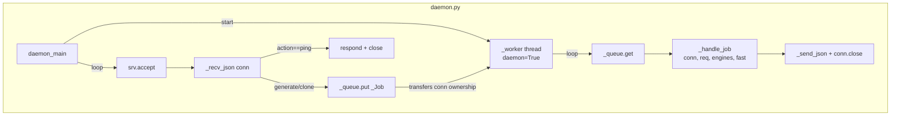
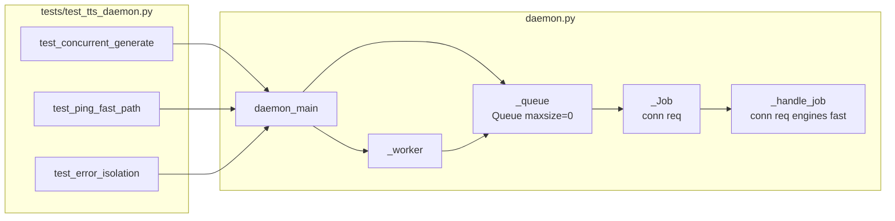

## Summary

Refactor `daemon.py` to serialize synthesis requests through a `queue.Queue` + single daemon worker thread. The accept loop remains the main thread but now handles only connection acceptance, ping fast-path, and job enqueuing. All synthesis runs in the worker.

## Architecture





## Reference Patterns

- `src/voicecli/daemon.py` — existing `_handle()` body → extracted verbatim into `_handle_job()`
- `src/voicecli/stt_daemon.py` — threading pattern for background worker (reference only)
- `tests/test_stt_daemon.py` — socket-based test patterns (use as style reference)

## Agents

| Agent | Tasks | Files |
|-------|-------|-------|
| backend-dev | T01–T04 (4 tasks) | `src/voicecli/daemon.py` |
| tester | T05–T07 (3 tasks) | `tests/test_tts_daemon.py` (new) |

## Consistency Report

- Spec criteria covered: 8/8
- Breadboard nodes traced: N0, U1–U4, N1–N5 (all)
- Slices: S1 (T01–T04), S2+S3 merged into tests (T05–T07)
- Uncovered: none
- Untraced tasks: none

---

## Micro-Tasks

---

### S1 — Worker thread + queue wiring + ping fast path

> RED-GATE S1: daemon started → `echo '{"action":"ping"}' | nc -U ~/.local/share/voicecli/daemon.sock` → `{"status":"ok","state":null}` or `{"status":"ok"}`

---

**T01** — Add `_Job` dataclass and `_queue` module-level queue
- **File:** `src/voicecli/daemon.py`
- **Agent:** backend-dev
- **Phase:** RED
- **Parallel-safe:** N
- **Difficulty:** 1
- **Time:** 2 min
- **Spec trace:** N1, U4

```python
import queue
import threading
from dataclasses import dataclass

@dataclass
class _Job:
    conn: socket.socket
    req: dict
```

- **Verify:** `python -c "from voicecli.daemon import _Job; print('ok')"`
- **Expected:** `ok`

---

**T02** — Extract `_handle_job(conn, req, engines, fast)` from `_handle()`
- **File:** `src/voicecli/daemon.py`
- **Agent:** backend-dev
- **Phase:** RED
- **Parallel-safe:** N
- **Difficulty:** 2
- **Time:** 5 min
- **Spec trace:** N2, N3, N4, N5

Move the body of `_handle()` (everything after `req = _recv_json(conn)`) into `_handle_job(conn, req, engines, fast)`. `_handle()` can be removed or kept as a thin wrapper for backward compat (prefer remove — it is not called externally).

```python
def _handle_job(conn: socket.socket, req: dict, engines: dict, fast: bool = False) -> None:
    """Process one synthesis job. Called exclusively from the worker thread."""
    try:
        action = req.get("action")
        # ... existing body verbatim ...
    except Exception as exc:
        try:
            _send_json(conn, {"status": "error", "message": str(exc)})
        except Exception:
            pass
    finally:
        conn.close()
```

- **Verify:** `uv run ruff check src/voicecli/daemon.py`
- **Expected:** no errors

---

**T03** — Add `_worker(q, engines, fast)` function
- **File:** `src/voicecli/daemon.py`
- **Agent:** backend-dev
- **Phase:** RED
- **Parallel-safe:** N
- **Difficulty:** 1
- **Time:** 3 min
- **Spec trace:** N0, N1, N2

```python
def _worker(q: queue.Queue, engines: dict, fast: bool) -> None:
    """Single worker thread: drain the job queue and synthesize sequentially."""
    while True:
        job: _Job = q.get()
        try:
            _handle_job(job.conn, job.req, engines, fast)
        finally:
            q.task_done()
```

- **Verify:** `uv run ruff check src/voicecli/daemon.py`
- **Expected:** no errors

---

**T04** — Refactor `daemon_main`: start worker thread, update accept loop
- **File:** `src/voicecli/daemon.py`
- **Agent:** backend-dev
- **Phase:** RED
- **Parallel-safe:** N
- **Difficulty:** 2
- **Time:** 5 min
- **Spec trace:** N0, U1, U2, U3, U4

```python
def daemon_main(preload: str | None = None, fast: bool = False) -> None:
    SOCKET_PATH.parent.mkdir(parents=True, exist_ok=True)
    SOCKET_PATH.unlink(missing_ok=True)

    engines: dict[str, object] = {}
    if preload:
        print(f"[voicecli daemon] Preloading {preload}...", flush=True)
        engines[preload] = _load_engine(preload, fast)

    _queue: queue.Queue = queue.Queue()
    worker = threading.Thread(target=_worker, args=(_queue, engines, fast), daemon=True)
    worker.start()

    with socket.socket(socket.AF_UNIX, socket.SOCK_STREAM) as srv:
        srv.bind(str(SOCKET_PATH))
        srv.listen(5)
        print(f"[voicecli daemon] Ready on {SOCKET_PATH}", flush=True)
        try:
            while True:
                conn, _ = srv.accept()
                try:
                    req = _recv_json(conn)
                except Exception:
                    conn.close()
                    continue
                if req.get("action") == "ping":
                    _send_json(conn, {"status": "ok"})
                    conn.close()
                else:
                    # conn ownership transfers to worker
                    _queue.put(_Job(conn=conn, req=req))
        except KeyboardInterrupt:
            pass
        finally:
            SOCKET_PATH.unlink(missing_ok=True)
```

- **Verify:** `uv run pytest tests/ -x -q --ignore=tests/test_tts_daemon.py`
- **Expected:** all existing tests pass

> **RED-GATE S1:** Start daemon in background → `echo '{"action":"ping"}' | nc -U ~/.local/share/voicecli/daemon.sock` → `{"status":"ok"}`

---

### S3 — Tests: concurrent callers serialize

---

**T05** — Write `tests/test_tts_daemon.py`
- **File:** `tests/test_tts_daemon.py` (new)
- **Agent:** tester
- **Phase:** RED
- **Parallel-safe:** N
- **Difficulty:** 3
- **Time:** 10 min
- **Spec trace:** SC-1, SC-2, SC-3, SC-6, SC-8

Three tests using `threading.Thread` to start the daemon in-process with a mock engine:
1. `test_concurrent_generate` — 2 threads send `generate` concurrently → both receive `{"status": "ok"}`, distinct output paths, FIFO order verified via arrival timestamps
2. `test_ping_fast_path` — send `ping` while a synthesis is running (mock with delay) → ping responds in <50 ms
3. `test_error_isolation` — first job raises exception → second job succeeds

Pattern: start `daemon_main` in `threading.Thread(daemon=True)`, wait for socket to appear, connect with `daemon_request()`.

- **Verify:** `uv run pytest tests/test_tts_daemon.py -v --co`
- **Expected:** 3 tests collected

---

**T06** — Run new tests green
- **File:** `tests/test_tts_daemon.py`
- **Agent:** tester
- **Phase:** GREEN
- **Parallel-safe:** N
- **Difficulty:** 2
- **Time:** 5 min
- **Spec trace:** SC-1–SC-8

- **Verify:** `uv run pytest tests/test_tts_daemon.py -v`
- **Expected:** 3 passed

---

**T07** — Full regression
- **File:** —
- **Agent:** tester
- **Phase:** GREEN
- **Parallel-safe:** Y
- **Difficulty:** 1
- **Time:** 3 min
- **Spec trace:** SC-7

- **Verify:** `uv run pytest`
- **Expected:** all tests pass, 0 failures
