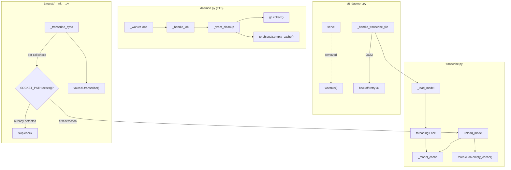
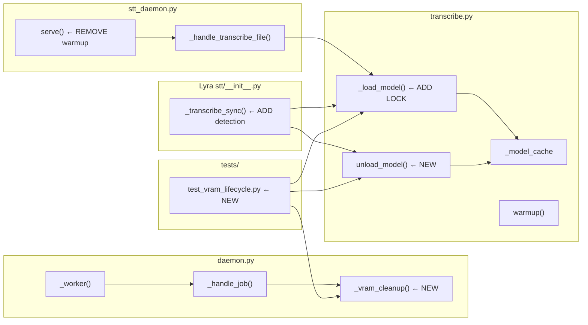

## Summary

Add VRAM lifecycle management across voiceCLI and Lyra to eliminate OOM failures on the production RTX 3080. Four slices: TTS post-job cleanup, unload API with thread-safe model loading, STT lazy warmup with OOM retry, and Lyra daemon-aware unload.

## Architecture





## Agents

| Agent | Tasks | Files |
|-------|-------|-------|
| backend-dev | 7 | `daemon.py`, `transcribe.py`, `stt_daemon.py`, `lyra/stt/__init__.py` |
| tester | 3 | `tests/test_vram_lifecycle.py`, `tests/test_transcribe.py` |

## Consistency Report

| Metric | Value |
|--------|-------|
| Success criteria covered | 10/10 |
| Uncovered criteria | 0 |
| Untraced tasks | 0 |

## Micro-Tasks

### V1 — TTS VRAM Cleanup

#### T01 [P] — Add `_vram_cleanup()` function to `daemon.py` (backend-dev)

**Description:** Add a `_vram_cleanup()` function that calls `gc.collect()` then `torch.cuda.empty_cache()`.

**File:** `src/voicecli/daemon.py`

**Code skeleton:**
```python
def _vram_cleanup() -> None:
    """Reclaim fragmented VRAM after a TTS job."""
    import gc
    gc.collect()
    try:
        import torch
        if torch.cuda.is_available():
            torch.cuda.empty_cache()
    except Exception:
        pass
```

**Verify:** `python -c "from voicecli.daemon import _vram_cleanup"` exits 0
**Expected output:** No error
**Time:** 3 min | **Difficulty:** 1 | **Spec trace:** SC-1, U1

---

#### T02 — Call `_vram_cleanup()` after each job in `_worker` (backend-dev)

**Description:** In the `_worker` loop, call `_vram_cleanup()` in the `finally` block after `_handle_job` completes.

**File:** `src/voicecli/daemon.py` (line 106–113)

**Code skeleton:**
```python
def _worker(q: queue.Queue, engines: dict, fast: bool) -> None:
    while True:
        job: _Job = q.get()
        try:
            _handle_job(job.conn, job.req, engines, fast)
        finally:
            _vram_cleanup()
            q.task_done()
```

**Verify:** `grep -A5 "_handle_job" src/voicecli/daemon.py | grep "_vram_cleanup"`
**Expected output:** `_vram_cleanup()` present in finally block
**Time:** 2 min | **Difficulty:** 1 | **Spec trace:** SC-1, U2
**Depends on:** T01

---

#### T03 [P] — Test: `_vram_cleanup` calls gc + empty_cache (tester)

**Description:** Unit test that `_vram_cleanup()` calls `gc.collect()` and `torch.cuda.empty_cache()` via mocks.

**File:** `tests/test_vram_lifecycle.py` (new)

**Verify:** `uv run pytest tests/test_vram_lifecycle.py::test_vram_cleanup -v`
**Expected output:** PASSED
**Time:** 5 min | **Difficulty:** 2 | **Spec trace:** SC-1
**Depends on:** T01

---

### ── RED-GATE V1 ──
Verify: TTS daemon worker loop includes `_vram_cleanup()` call. Tests pass.

---

### V2 — Unload API + Load Lock

#### T04 [P] — Add `threading.Lock` to `_load_model()` in `transcribe.py` (backend-dev)

**Description:** Add a module-level `_model_lock = threading.Lock()` and wrap the check-and-load in `_load_model()` with it. This prevents concurrent first-request races.

**File:** `src/voicecli/transcribe.py` (line 35, 190–201)

**Code skeleton:**
```python
import threading

_model_cache: dict[str, object] = {}
_model_lock = threading.Lock()

def _load_model(model: str):
    if model not in VALID_MODELS:
        raise ValueError(...)
    with _model_lock:
        if model not in _model_cache:
            from faster_whisper import WhisperModel
            print(f"[stt] Loading faster-whisper {model}...")
            _model_cache[model] = WhisperModel(model, device="cuda", compute_type="float16")
            print("[stt] Model loaded.")
        return _model_cache[model]
```

**Verify:** `grep "_model_lock" src/voicecli/transcribe.py | wc -l` returns ≥2
**Expected output:** 2+ (declaration + usage)
**Time:** 3 min | **Difficulty:** 2 | **Spec trace:** SC-4, U4

---

#### T05 — Add `unload_model()` to `transcribe.py` (backend-dev)

**Description:** Public function that clears `_model_cache`, deletes model references, and calls `torch.cuda.empty_cache()`. No-op if cache is empty.

**File:** `src/voicecli/transcribe.py`

**Code skeleton:**
```python
def unload_model() -> None:
    """Release all cached STT models from VRAM."""
    with _model_lock:
        if not _model_cache:
            return
        _model_cache.clear()
    import gc
    gc.collect()
    try:
        import torch
        if torch.cuda.is_available():
            torch.cuda.empty_cache()
    except Exception:
        pass
    print("[stt] Models unloaded.")
```

**Verify:** `python -c "from voicecli.transcribe import unload_model; unload_model(); print('ok')"`
**Expected output:** `ok` (no crash on empty cache)
**Time:** 4 min | **Difficulty:** 2 | **Spec trace:** SC-2, SC-3, U3
**Depends on:** T04

---

#### T06 [P] — Tests: unload_model + load_model lock (tester)

**Description:** Tests for: (a) `unload_model()` clears `_model_cache` and calls `empty_cache`, (b) `unload_model()` is no-op when empty, (c) concurrent `_load_model` calls result in exactly one model load.

**File:** `tests/test_transcribe.py` (new)

**Verify:** `uv run pytest tests/test_transcribe.py -v`
**Expected output:** All tests PASSED
**Time:** 8 min | **Difficulty:** 3 | **Spec trace:** SC-2, SC-3, SC-4
**Depends on:** T04, T05

---

### ── RED-GATE V2 ──
Verify: `unload_model()` importable and functional. Lock prevents double-load. Tests pass.

---

### V3 — STT Lazy Warmup + Retry

#### T07 — Remove eager warmup from `stt_daemon.py` (backend-dev)

**Description:** In `serve()`, remove the `warmup(self.model)` call (line 565). The model will load lazily on first `_handle_transcribe_file` request via `transcribe()` → `_load_model()`.

**File:** `src/voicecli/stt_daemon.py` (line 565)

**Verify:** `grep -n "warmup" src/voicecli/stt_daemon.py` — no `warmup(self.model)` in `serve()`
**Expected output:** `warmup` import may remain, but `warmup(self.model)` call removed from `serve()`
**Time:** 2 min | **Difficulty:** 1 | **Spec trace:** SC-5, U4

---

#### T08 — Add OOM retry with backoff in `stt_daemon.py` (backend-dev)

**Description:** Wrap the model load path in `_handle_transcribe_file` with a retry loop that catches `torch.cuda.OutOfMemoryError`. 3 retries, 5s initial delay, 2x multiplier. On retry exhaustion, return error response to caller (daemon stays alive).

**File:** `src/voicecli/stt_daemon.py`

**Code skeleton:**
```python
def _handle_transcribe_file(self, conn, req):
    # ... existing param extraction ...
    max_retries = 3
    delay = 5.0
    for attempt in range(max_retries + 1):
        try:
            result = transcribe(path, model=self.model, ...)
            _send_json(conn, {"status": "ok", ...})
            return
        except torch.cuda.OutOfMemoryError:
            if attempt < max_retries:
                print(f"[voicecli stt] OOM loading model, retry {attempt+1}/{max_retries} in {delay}s...")
                import gc; gc.collect()
                torch.cuda.empty_cache()
                time.sleep(delay)
                delay *= 2
            else:
                _send_json(conn, {"status": "error", "message": "CUDA OOM after retries"})
                return
```

**Verify:** `grep -c "OutOfMemoryError" src/voicecli/stt_daemon.py` returns ≥1
**Expected output:** 1+
**Time:** 5 min | **Difficulty:** 3 | **Spec trace:** SC-6, U5

---

#### T09 [P] — Test: STT lazy warmup + OOM retry (tester)

**Description:** Tests: (a) `serve()` no longer calls `warmup()`, (b) OOM retry with backoff (mock `OutOfMemoryError` then succeed), (c) retry exhaustion returns error.

**File:** `tests/test_vram_lifecycle.py` (append)

**Verify:** `uv run pytest tests/test_vram_lifecycle.py -k "stt" -v`
**Expected output:** All PASSED
**Time:** 8 min | **Difficulty:** 3 | **Spec trace:** SC-5, SC-6
**Depends on:** T07, T08

---

### ── RED-GATE V3 ──
Verify: STT daemon starts without warmup. OOM retry works. Tests pass.

---

### V4 — Lyra Daemon-Aware Unload

#### T10 — Add daemon detection + unload to Lyra `STTService` (backend-dev)

**Description:** In `_transcribe_sync`, before calling `transcribe()`, check `SOCKET_PATH.exists()`. On first detection, call `unload_model()` and set `_daemon_detected = True`. Skip future checks.

**File:** `~/projects/lyra/src/lyra/stt/__init__.py`

**Code skeleton:**
```python
class STTService:
    def __init__(self, config):
        # ... existing init ...
        self._daemon_detected = False

    def _transcribe_sync(self, path: str) -> TranscriptionResult:
        from voicecli.transcribe import transcribe as _transcribe
        # ... existing imports ...

        if not self._daemon_detected:
            from voicecli.stt_daemon import SOCKET_PATH
            if SOCKET_PATH.exists():
                from voicecli.transcribe import unload_model
                unload_model()
                self._daemon_detected = True
                log.info("STT daemon detected — unloaded local model, deferring to daemon")

        # ... existing transcribe call (daemon-first pattern handles routing) ...
```

**Verify:** `grep -c "unload_model" ~/projects/lyra/src/lyra/stt/__init__.py` returns ≥1
**Expected output:** 1+
**Time:** 5 min | **Difficulty:** 2 | **Spec trace:** SC-7, SC-8, SC-9, N1, N2
**Depends on:** T05 (unload_model API)

---

### ── RED-GATE V4 ──
Verify: Lyra STTService imports and calls unload_model. Daemon detection flag works.

---

## Production Validation (post-merge)

After deploying to production (RTX 3080):
1. Both daemons running: `make ps` shows `voicecli_tts RUNNING`, `voicecli_stt RUNNING`
2. Send voice message via Telegram → transcription succeeds
3. Request TTS response → generation succeeds
4. `nvidia-smi` shows combined steady-state below 9.0 GiB
5. **Spec trace:** SC-10
