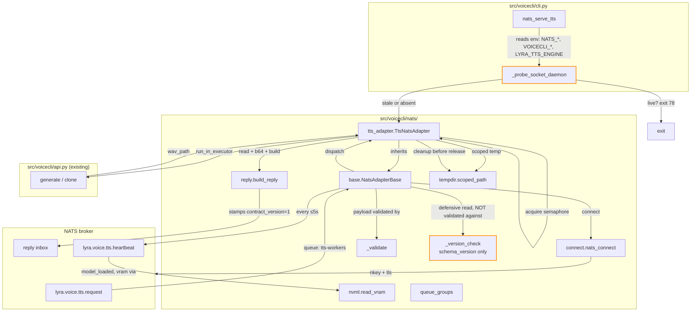

## Summary

Port lyra's NATS mini-framework into `src/voicecli/nats/`, build `TtsNatsAdapter` + `voicecli nats-serve tts` CLI with env-var precedence, ship the operator doc covering env vars / exit codes / supervisord stanza. Slice 1 of 4. Adds `nats` extra (`nats-py>=2.6,<3`, `nkeys>=0.1`, `pynvml>=11.5`). Defensive `contract_version` read per ADR-044 — explicitly bypasses the ported `_version_check` for that field.

## Architecture

### Data flow — request → reply



### File × Function map

```mermaid
flowchart LR
  subgraph nats ["src/voicecli/nats/"]
    base[base.py<br/>NatsAdapterBase.run / handle / reply / _heartbeat_loop]
    conn[connect.py<br/>nats_connect / _read_nkey_seed / _build_tls_context]
    qg[queue_groups.py<br/>TTS_WORKERS / STT_WORKERS]
    val[_validate.py<br/>validate_envelope]
    vc[_version_check.py<br/>check_schema_version]
    rep[reply.py<br/>build_reply / encode_reply]
    nvml[nvml.py<br/>read_vram → tuple\\(int\\|None, int\\|None\\)]
    td[tempdir.py<br/>scoped_path / cleanup]
    tts[tts_adapter.py<br/>TtsNatsAdapter.handle]
  end
  subgraph cli ["src/voicecli/cli.py"]
    cmd[nats_serve_tts]
    probe[_probe_socket_daemon]
  end
  subgraph tests ["tests/nats/"]
    tc[test_connect.py]
    trep[test_reply_builder.py]
    tnv[test_nvml.py]
    ttd[test_tempdir.py]
    tvg[test_vram_guard.py]
    ttts[test_tts_adapter.py]
  end

  base --> conn
  base --> val
  base --> vc
  tts --> base
  tts --> rep
  tts --> td
  tts --> nvml
  tts --> qg
  cmd --> tts
  cmd --> probe
  tc --> conn
  trep --> rep
  tnv --> nvml
  ttd --> td
  tvg --> probe
  ttts --> tts
```

## Bootstrap context

- **Spec:** [42-nats-serve-spec.mdx](../specs/42-nats-serve-spec.mdx) — single source of truth.
- **Reference patterns to mirror (read for conventions, then port):**
  - `/home/mickael/projects/lyra/src/lyra/nats/adapter_base.py` — base class. Drop `readiness.wait_for_hub` per spec Q-RT-5.
  - `/home/mickael/projects/lyra/src/lyra/nats/connect.py` — nats_connect, nkey loading (0600 check), TLS context builder.
  - `/home/mickael/projects/lyra/src/lyra/nats/queue_groups.py` — canonical `TTS_WORKERS = "tts-workers"`.
  - `/home/mickael/projects/lyra/src/lyra/nats/_validate.py` + `_version_check.py` — port verbatim, but adapter MUST bypass `check_schema_version` for the `contract_version` field per spec.
  - `/home/mickael/projects/lyra/src/lyra/bootstrap/tts_adapter_standalone.py` — concrete satellite template (reply assembly, heartbeat extras).
- **Existing voiceCLI patterns to mirror for CLI wiring:**
  - `src/voicecli/cli.py:1240` (`serve`) — Typer subcommand pattern.
  - `src/voicecli/daemon.py:142` (`_sanitize_request`) — payload validation pattern (re-implementable inside the TTS adapter `handle` for ADR-044 fields).
- **Engine call surface:** `src/voicecli/api.py:794` (`clone`) and `:637` (`generate`) — both return `TTSResult.wav_path: Path`. Adapter reads from disk, base64-encodes, deletes temp file.

## Agents

| Agent | Task count | Files |
|---|---|---|
| `tester` | 7 | `tests/nats/__init__.py`, `tests/nats/test_{connect,reply_builder,nvml,tempdir,vram_guard,tts_adapter}.py` |
| `backend-dev` | 11 | `src/voicecli/nats/{__init__,queue_groups,connect,_validate,_version_check,base,reply,nvml,tempdir,tts_adapter}.py`, `src/voicecli/cli.py` |
| `devops` | 1 | `pyproject.toml` |
| `doc-writer` | 1 | `docs/NATS-SERVE.md` |

Plus 2 RED-GATE sentinels (no agent — implementer runs).

## Consistency report (σ ↔ π)

| Spec acceptance (slice 1 scope) | Tasks |
|---|---|
| `voicecli nats-serve tts` connects, subscribes to `lyra.voice.tts.request`, queue group `tts-workers` | T6, T13, T17, T18 |
| Replies match ADR-044 TTS success schema; `contract_version: "1"`; `request_id` echoed | T6, T14, T17 |
| Failing requests reply with `ok: false` + error code from fixed vocabulary | T6, T17 |
| Per-request TTS `engine` overrides startup engine; `engine_unavailable` on miss | T6, T17 |
| Defensive read on `contract_version` (mirrors lyra#688 T7) | T6 (test with `999`), T17 (no version validation) |
| Heartbeat ≤ 5 s with required fields always populated; VRAM nullable | T3, T13, T17 |
| Heartbeats keep firing during inference | T6 (in-flight test), T17 (run_in_executor) |
| SIGTERM clean drain → exit 0; timeout → exit 3 | T17 (handler), T20 |
| Concurrency: TTS default `--max-concurrent 1`; `--reject-when-full` returns `capacity_exceeded` | T6, T17 |
| `--allow-coexist` bypasses VRAM guard; live socket → exit 78; stale socket → INFO + proceed | T5, T18 |
| Temp file uniqueness per `request_id`; cleanup inside semaphore | T4, T17 |
| Env-var fallbacks (`VOICECLI_*`, `LYRA_TTS_ENGINE` alias) | T6, T18 |
| Default install does NOT pull `nats-py` / `nkeys` / `pynvml`; `--all-extras` does | T7, T21 |
| `docs/NATS-SERVE.md` exists with env vars, exit codes, supervisord stanza | T19 |

Coverage: 14/14 slice-scoped acceptance criteria ↔ 21 tasks. STT-specific, E2E-specific, and SKILL.md / CLAUDE.md criteria are deferred to slices 2-4.

Untraced tasks: 0. Exemptions: 0.

## Micro-tasks

### Slice V1 — TTS path

**RED phase — write failing tests first.**

#### T1 — Test: nkey loading + permission check  `[P]`

- **Agent:** `tester`
- **Phase:** RED  ·  **Difficulty:** 2  ·  **Est:** 5 min
- **Files:** `tests/nats/__init__.py` (new, empty), `tests/nats/test_connect.py` (new)
- **Spec trace:** Startup §3
- **Snippet shape:**
  ```python
  def test_nkey_seed_permission_check(tmp_path):
      seed = tmp_path / "voicecli.seed"
      seed.write_text("SUAEXAMPLE...")
      seed.chmod(0o644)
      with pytest.raises(PermissionError, match="0600"):
          _read_nkey_seed(seed)

  def test_nkey_seed_loads_with_correct_perms(tmp_path):
      seed = tmp_path / "voicecli.seed"
      seed.write_text("SUAEXAMPLE...")
      seed.chmod(0o600)
      kp = _read_nkey_seed(seed)
      assert kp is not None
  ```
- **Verify:** `uv run pytest tests/nats/test_connect.py -x` → 2 failed (module not yet implemented).

#### T2 — Test: build_reply stamps contract_version + echoes request_id  `[P]`

- **Agent:** `tester`  ·  **Phase:** RED  ·  **Difficulty:** 1  ·  **Est:** 4 min
- **Files:** `tests/nats/test_reply_builder.py` (new)
- **Spec trace:** Contract version handling, "Every reply ... carries `contract_version: "1"`"
- **Snippet:**
  ```python
  def test_build_reply_stamps_contract_version_on_success():
      out = build_reply(ok=True, request_id="r-1", text="hi", language="en", duration_seconds=0.5)
      assert out["contract_version"] == "1"
      assert out["request_id"] == "r-1"
      assert out["ok"] is True

  def test_build_reply_stamps_contract_version_on_error():
      out = build_reply(ok=False, request_id="r-1", error="model_load_failed")
      assert out["contract_version"] == "1"
      assert out["error"] == "model_load_failed"
      assert "audio_b64" not in out

  def test_build_reply_handles_empty_request_id():
      out = build_reply(ok=False, request_id="", error="malformed_request")
      assert out["request_id"] == ""
  ```
- **Verify:** `uv run pytest tests/nats/test_reply_builder.py -x` → 3 failed.

#### T3 — Test: NVML probe returns nulls on missing pynvml  `[P]`

- **Agent:** `tester`  ·  **Phase:** RED  ·  **Difficulty:** 2  ·  **Est:** 5 min
- **Files:** `tests/nats/test_nvml.py` (new)
- **Spec trace:** "VRAM fields ... `null` when `pynvml` is unavailable"
- **Snippet:**
  ```python
  def test_read_vram_returns_nulls_when_pynvml_missing(monkeypatch):
      monkeypatch.setattr("voicecli.nats.nvml._import_pynvml", lambda: None)
      assert read_vram() == (None, None)

  def test_read_vram_returns_nulls_on_init_error(monkeypatch):
      monkeypatch.setattr("voicecli.nats.nvml._import_pynvml", lambda: _RaisingPynvml())
      assert read_vram() == (None, None)
  ```
- **Verify:** `uv run pytest tests/nats/test_nvml.py -x` → 2 failed.

#### T4 — Test: scoped_path uniqueness per request_id  `[P]`

- **Agent:** `tester`  ·  **Phase:** RED  ·  **Difficulty:** 1  ·  **Est:** 3 min
- **Files:** `tests/nats/test_tempdir.py` (new)
- **Spec trace:** "Two simultaneous requests do not race on the same temp file"
- **Snippet:**
  ```python
  def test_scoped_path_unique_per_request_id():
      p1 = scoped_path("req-1", "wav")
      p2 = scoped_path("req-2", "wav")
      assert p1 != p2
      assert p1.name == "req-1.wav"

  def test_scoped_path_under_voicecli_nats():
      p = scoped_path("req-1", "wav")
      assert "/voicecli-nats/" in str(p)

  def test_cleanup_removes_file(tmp_path):
      p = tmp_path / "x.wav"
      p.write_bytes(b"data")
      cleanup(p)
      assert not p.exists()
  ```
- **Verify:** `uv run pytest tests/nats/test_tempdir.py -x` → 3 failed.

#### T5 — Test: VRAM-sequencing guard distinguishes live / stale / absent  `[P]`

- **Agent:** `tester`  ·  **Phase:** RED  ·  **Difficulty:** 3  ·  **Est:** 8 min
- **Files:** `tests/nats/test_vram_guard.py` (new)
- **Spec trace:** "Stale socket files (present on disk but no live listener) do NOT trigger the guard"
- **Snippet:**
  ```python
  def test_probe_returns_absent_when_no_socket(tmp_path):
      assert _probe_socket_daemon(tmp_path / "missing.sock") == "absent"

  def test_probe_returns_stale_when_econnrefused(tmp_path):
      sock_path = tmp_path / "stale.sock"
      sock_path.touch()  # file exists, no listener
      assert _probe_socket_daemon(sock_path) == "stale"

  def test_probe_returns_live_when_listener_accepts(tmp_path):
      sock_path = tmp_path / "live.sock"
      with _spawn_unix_listener(sock_path):
          assert _probe_socket_daemon(sock_path) == "live"
  ```
- **Verify:** `uv run pytest tests/nats/test_vram_guard.py -x` → 3 failed.

#### T6 — Test: TtsNatsAdapter happy path + error mapping + defensive contract_version + env precedence

- **Agent:** `tester`  ·  **Phase:** RED  ·  **Difficulty:** 4  ·  **Est:** 25 min
- **Files:** `tests/nats/test_tts_adapter.py` (new)
- **Dependencies:** T1-T5 (uses helpers under test)
- **Spec trace:** SC-1 to SC-9, SC-13 to SC-17 (TTS-scoped subset)
- **Required test cases (each a separate `def`):**
  1. `test_handle_success_publishes_adr044_reply` — feed a valid TTS request, assert reply has `ok=True, contract_version="1"`, base64-decodable `audio_b64`, populated `mime_type` + `duration_ms`, echoed `request_id`. Engine call patched with a fake that writes a 1-byte WAV.
  2. `test_handle_unknown_engine_returns_engine_unavailable` — request with `engine: "ghost"`, assert reply has `error: "engine_unavailable"`.
  3. `test_handle_engine_raises_returns_synthesis_failed` — engine fake raises, assert `error: "synthesis_failed"`.
  4. `test_defensive_contract_version_999_is_handled` — request with `contract_version: "999"` succeeds normally (mirrors lyra#688 T7).
  5. `test_missing_request_id_returns_malformed_request` — request without `request_id`, reply has `error: "malformed_request"`, `request_id: ""`.
  6. `test_max_concurrent_default_is_1_for_tts` — fire two requests; second is queued (or rejected if `--reject-when-full`), confirm via timestamps.
  7. `test_reject_when_full_returns_capacity_exceeded` — semaphore held, second request gets `error: "capacity_exceeded"`.
  8. `test_temp_file_cleaned_up_on_success` — assert `/tmp/voicecli-nats/{request_id}.wav` is removed after reply.
  9. `test_temp_file_cleaned_up_on_failure` — assert temp file removed even when engine raises.
  10. `test_heartbeat_continues_during_inference` — slow engine fake (sleep 2s); during the sleep, ≥1 heartbeat fires.
  11. `test_engine_env_var_fallback` — no `--engine` flag; `VOICECLI_ENGINE` set; adapter uses it.
  12. `test_lyra_tts_engine_alias_works` — `LYRA_TTS_ENGINE` set, no `VOICECLI_ENGINE`, adapter uses LYRA value.
- **Verify:** `uv run pytest tests/nats/test_tts_adapter.py -x` → 12 failed.

**GREEN phase — implement.**

#### T7 — Add `nats` extra to `pyproject.toml`

- **Agent:** `devops`  ·  **Phase:** GREEN  ·  **Difficulty:** 1  ·  **Est:** 3 min
- **Files:** `pyproject.toml` (edit)
- **Change:** under `[project.optional-dependencies]`, add:
  ```toml
  nats = [
      "nats-py>=2.6,<3",
      "nkeys>=0.1",
      "pynvml>=11.5",
  ]
  ```
- **Verify:** `uv pip install --dry-run -e ".[nats]" 2>&1 | grep nats-py` shows resolution; `uv pip install --dry-run -e .` does NOT show nats-py.
- **Spec trace:** "Default install ... does NOT pull `nats-py` ..."

#### T8 — `src/voicecli/nats/__init__.py` (package marker)  `[P]`

- **Agent:** `backend-dev`  ·  **Phase:** GREEN  ·  **Difficulty:** 1  ·  **Est:** 1 min
- **Files:** `src/voicecli/nats/__init__.py` (new, empty or 1-line docstring)
- **Verify:** `python -c "import voicecli.nats"` (with extra installed) → no error.

#### T9 — `queue_groups.py` (constants)  `[P]`

- **Agent:** `backend-dev`  ·  **Phase:** GREEN  ·  **Difficulty:** 1  ·  **Est:** 2 min
- **Files:** `src/voicecli/nats/queue_groups.py` (new)
- **Pattern source:** `/home/mickael/projects/lyra/src/lyra/nats/queue_groups.py`
- **Snippet:**
  ```python
  TTS_WORKERS = "tts-workers"
  STT_WORKERS = "stt-workers"
  ```
- **Verify:** `python -c "from voicecli.nats.queue_groups import TTS_WORKERS; assert TTS_WORKERS == 'tts-workers'"`.

#### T10 — `connect.py` (port nats_connect + nkey)  `[P]`

- **Agent:** `backend-dev`  ·  **Phase:** GREEN  ·  **Difficulty:** 3  ·  **Est:** 15 min
- **Files:** `src/voicecli/nats/connect.py` (new)
- **Pattern source:** `/home/mickael/projects/lyra/src/lyra/nats/connect.py` (port verbatim, replace lyra-specific imports/branding)
- **Exports:** `nats_connect(url, **extra) -> NATS`, `_read_nkey_seed(path) -> KeyPair`, `_build_tls_context(ca_cert_path) -> ssl.SSLContext | None`
- **Verify:** `uv run pytest tests/nats/test_connect.py -x` → both T1 cases pass.

#### T11 — `_validate.py` (port validators, NOT for contract_version)  `[P]`

- **Agent:** `backend-dev`  ·  **Phase:** GREEN  ·  **Difficulty:** 2  ·  **Est:** 8 min
- **Files:** `src/voicecli/nats/_validate.py` (new)
- **Pattern source:** `/home/mickael/projects/lyra/src/lyra/nats/_validate.py` — port the envelope validator. **Do NOT route the `contract_version` field through it.** Document in a header comment that `contract_version` follows ADR-044 defensive-read rules and is checked separately (i.e. not at all on incoming).
- **Verify:** `uv run ruff check src/voicecli/nats/_validate.py` clean.

#### T12 — `_version_check.py` (port; used only for `schema_version` envelope)  `[P]`

- **Agent:** `backend-dev`  ·  **Phase:** GREEN  ·  **Difficulty:** 2  ·  **Est:** 8 min
- **Files:** `src/voicecli/nats/_version_check.py` (new)
- **Pattern source:** `/home/mickael/projects/lyra/src/lyra/nats/_version_check.py`
- **Constraint:** function name + signature kept identical (`check_schema_version(payload, ...)`), but module docstring **must** state: "This is for the optional `schema_version` envelope field only. ADR-044's `contract_version` field is read defensively (no validation, log WARN on mismatch) and MUST NOT be routed through this function."
- **Verify:** ruff + pyright clean.

#### T13 — `base.py` (port `NatsAdapterBase`, drop `wait_for_hub`)

- **Agent:** `backend-dev`  ·  **Phase:** GREEN  ·  **Difficulty:** 4  ·  **Est:** 25 min
- **Dependencies:** T10, T11, T12
- **Files:** `src/voicecli/nats/base.py` (new)
- **Pattern source:** `/home/mickael/projects/lyra/src/lyra/nats/adapter_base.py`
- **Required overrides from the lyra version:**
  1. **Drop** the `readiness.wait_for_hub` call in `run()` per spec Q-RT-5. Replace with a 2-line comment explaining why (voiceCLI satellite owns its readiness — no hub probe).
  2. **Heartbeat payload** must call `voicecli.nats.nvml.read_vram()` (T15) and emit `vram_used_mb` / `vram_total_mb` as keys (with `null` values when pynvml unavailable). The `_heartbeat_loop` in lyra omits keys when unset; voiceCLI emits with `None`.
  3. **Stop event + signal handlers:** wire SIGTERM/SIGINT to set `self.stop`, await pending in-flight (semaphore drain) up to `--drain-timeout`, publish final heartbeat with `model_loaded: null, active_requests: 0`, exit 0 / 3.
- **Class shape:**
  ```python
  class NatsAdapterBase:
      def __init__(self, *, subject, queue_group, heartbeat_subject, max_concurrent, ...): ...
      async def run(self, nats_url, stop): ...
      async def handle(self, msg, payload: dict) -> dict: raise NotImplementedError
      async def reply(self, msg, payload: dict) -> None: ...
      async def _heartbeat_loop(self): ...
      def heartbeat_payload(self) -> dict: ...
  ```
- **Verify:** `uv run pyright src/voicecli/nats/base.py` clean; unit-import test in T17.

#### T14 — `reply.py` (build_reply helper)  `[P]`

- **Agent:** `backend-dev`  ·  **Phase:** GREEN  ·  **Difficulty:** 1  ·  **Est:** 5 min
- **Files:** `src/voicecli/nats/reply.py` (new)
- **Snippet:**
  ```python
  CONTRACT_VERSION = "1"

  def build_reply(*, ok: bool, request_id: str, **fields) -> dict:
      base = {"contract_version": CONTRACT_VERSION, "request_id": request_id, "ok": ok}
      base.update(fields)
      return base

  def encode_reply(reply: dict) -> bytes:
      return json.dumps(reply, separators=(",", ":")).encode("utf-8")
  ```
- **Verify:** `uv run pytest tests/nats/test_reply_builder.py -x` → all T2 cases pass.

#### T15 — `nvml.py` (lazy pynvml probe)  `[P]`

- **Agent:** `backend-dev`  ·  **Phase:** GREEN  ·  **Difficulty:** 2  ·  **Est:** 6 min
- **Files:** `src/voicecli/nats/nvml.py` (new)
- **Snippet:**
  ```python
  def _import_pynvml():
      try:
          import pynvml  # type: ignore
          return pynvml
      except ImportError:
          return None

  def read_vram() -> tuple[int | None, int | None]:
      pynvml = _import_pynvml()
      if pynvml is None:
          return (None, None)
      try:
          pynvml.nvmlInit()
          h = pynvml.nvmlDeviceGetHandleByIndex(0)
          info = pynvml.nvmlDeviceGetMemoryInfo(h)
          return (info.used // (1024**2), info.total // (1024**2))
      except Exception:
          return (None, None)
      finally:
          try: pynvml.nvmlShutdown()
          except Exception: pass
  ```
- **Verify:** `uv run pytest tests/nats/test_nvml.py -x` → both T3 cases pass.

#### T16 — `tempdir.py` (scoped_path + cleanup)  `[P]`

- **Agent:** `backend-dev`  ·  **Phase:** GREEN  ·  **Difficulty:** 1  ·  **Est:** 5 min
- **Files:** `src/voicecli/nats/tempdir.py` (new)
- **Snippet:**
  ```python
  TEMP_ROOT = Path("/tmp/voicecli-nats")

  def scoped_path(request_id: str, ext: str) -> Path:
      TEMP_ROOT.mkdir(parents=True, exist_ok=True)
      return TEMP_ROOT / f"{request_id}.{ext.lstrip('.')}"

  def cleanup(p: Path) -> None:
      with contextlib.suppress(FileNotFoundError):
          p.unlink()
  ```
- **Verify:** `uv run pytest tests/nats/test_tempdir.py -x` → all T4 cases pass.

#### T17 — `tts_adapter.py` (TtsNatsAdapter)

- **Agent:** `backend-dev`  ·  **Phase:** GREEN  ·  **Difficulty:** 5  ·  **Est:** 45 min
- **Dependencies:** T13, T14, T15, T16
- **Files:** `src/voicecli/nats/tts_adapter.py` (new)
- **Pattern source:** `/home/mickael/projects/lyra/src/lyra/bootstrap/tts_adapter_standalone.py` (concrete-handler pattern)
- **Class shape:**
  ```python
  class TtsNatsAdapter(NatsAdapterBase):
      def __init__(self, *, default_engine: str, max_concurrent: int = 1, ...):
          super().__init__(
              subject="lyra.voice.tts.request",
              queue_group=TTS_WORKERS,
              heartbeat_subject="lyra.voice.tts.heartbeat",
              max_concurrent=max_concurrent,
              ...,
          )
          self.default_engine = default_engine
          self._sem = asyncio.Semaphore(max_concurrent)
          self._executor = ThreadPoolExecutor(max_workers=max_concurrent)
          self._active = 0

      async def handle(self, msg, payload: dict) -> dict:
          request_id = payload.get("request_id", "")
          if not request_id:
              return build_reply(ok=False, request_id="", error="malformed_request")
          # defensive: do NOT validate contract_version; log WARN once if mismatch
          if payload.get("contract_version") != "1":
              self._warn_contract_version_once()
          engine = payload.get("engine") or self.default_engine
          if engine not in registered_engines():
              return build_reply(ok=False, request_id=request_id, error="engine_unavailable")
          try:
              async with self._guarded():
                  out_path = scoped_path(request_id, "wav")
                  try:
                      result = await asyncio.get_event_loop().run_in_executor(
                          self._executor,
                          functools.partial(api.generate, payload["text"], engine=engine, output=out_path, ...),
                      )
                      audio_b64 = base64.b64encode(out_path.read_bytes()).decode()
                      return build_reply(
                          ok=True, request_id=request_id,
                          audio_b64=audio_b64, mime_type="audio/wav",
                          duration_ms=int(result.duration_seconds * 1000) if result.duration_seconds else None,
                      )
                  finally:
                      cleanup(out_path)
          except CapacityExceeded:
              return build_reply(ok=False, request_id=request_id, error="capacity_exceeded")
          except Exception as e:
              log.exception("synthesis_failed", extra={"request_id": request_id})
              return build_reply(ok=False, request_id=request_id, error="synthesis_failed")
  ```
- **Verify:** `uv run pytest tests/nats/test_tts_adapter.py -x` → all 12 T6 cases pass.

#### T18 — `cli.py` add `nats-serve tts` subcommand + `_probe_socket_daemon`

- **Agent:** `backend-dev`  ·  **Phase:** GREEN  ·  **Difficulty:** 4  ·  **Est:** 25 min
- **Dependencies:** T17
- **Files:** `src/voicecli/cli.py` (edit)
- **Pattern source:** existing `serve` command at `cli.py:1240`
- **Required behavior:**
  1. Add a Typer subcommand group `nats-serve` (or two siblings `nats_serve_tts` + `nats_serve_stt` registered as `nats-serve tts` / `nats-serve stt`; Slice 1 ships TTS only, Slice 2 ships STT).
  2. CLI flags: `--engine`, `--max-concurrent` (default 1), `--heartbeat-interval` (default 5.0), `--drain-timeout` (default 30.0), `--reject-when-full`, `--allow-coexist`.
  3. Env-var fallback chain: CLI > `VOICECLI_ENGINE` (also accepts `LYRA_TTS_ENGINE` as alias) > `voicecli.toml` > hardcoded default `qwen-fast`. Same shape for `--max-concurrent` (`VOICECLI_MAX_CONCURRENT`), `--heartbeat-interval` (`VOICECLI_HEARTBEAT_INTERVAL`), `--drain-timeout` (`VOICECLI_DRAIN_TIMEOUT`), `--reject-when-full` (`VOICECLI_REJECT_WHEN_FULL=1`), `--allow-coexist` (`VOICECLI_ALLOW_COEXIST=1`).
  4. Run `_probe_socket_daemon(Path("~/.local/share/voicecli/daemon.sock").expanduser())`:
     - `live` and not `--allow-coexist` → log ERROR, `raise typer.Exit(78)`.
     - `live` and `--allow-coexist` → log WARN "coexisting with live socket daemon", proceed.
     - `stale` → log INFO "stale socket ignored", proceed.
     - `absent` → proceed silently.
  5. Build `TtsNatsAdapter(...)`, run via `asyncio.run(adapter.run(nats_url=os.environ["NATS_URL"], stop=stop_event))`.
- **Verify:** `uv run pytest tests/nats/test_vram_guard.py -x` → all T5 cases pass; `uv run voicecli nats-serve tts --help` shows expected flags.

**Docs (parallel-safe with backend implementation).**

#### T19 — `docs/NATS-SERVE.md`  `[P]`

- **Agent:** `doc-writer`  ·  **Phase:** GREEN  ·  **Difficulty:** 2  ·  **Est:** 30 min
- **Files:** `docs/NATS-SERVE.md` (new)
- **Required sections:**
  1. **Overview** — what `nats-serve` is, when to use it vs `tts-serve`/`stt-serve`.
  2. **Environment variables** — `NATS_URL`, `NATS_NKEY_SEED_PATH` (with 0600 requirement), `NATS_CA_CERT`, `VOICECLI_ENGINE` (and `LYRA_TTS_ENGINE` alias), `VOICECLI_MAX_CONCURRENT`, `VOICECLI_HEARTBEAT_INTERVAL`, `VOICECLI_DRAIN_TIMEOUT`, `VOICECLI_REJECT_WHEN_FULL`, `VOICECLI_ALLOW_COEXIST`.
  3. **VRAM sequencing** — explain the guard, why exit 78, when to use `--allow-coexist`. Cross-link to `CLAUDE.md` "Gotchas".
  4. **Exit codes** — table of 0 / 3 / 78 with operator action for each.
  5. **Required supervisord stanza** — verbatim block:
     ```ini
     [program:voicecli_nats_tts]
     command=voicecli nats-serve tts
     environment=NATS_URL="nats://...",NATS_NKEY_SEED_PATH="...",LYRA_TTS_ENGINE="qwen-fast"
     autorestart=unexpected
     exitcodes=0,78
     startsecs=10
     ```
  6. **Troubleshooting** — common errors (missing seed, wrong perms, payload too large).
- **Verify:** `grep -E '^## (Overview|Environment|VRAM|Exit|Supervisord|Troubleshooting)' docs/NATS-SERVE.md | wc -l` ≥ 6.

**RED-GATE — verify before slice merge.**

#### T20 — RED-GATE: all unit tests green

- **Agent:** _implementer_  ·  **Phase:** RED-GATE  ·  **Difficulty:** 1  ·  **Est:** 3 min
- **Dependencies:** T1-T18
- **Verify:** `uv run pytest tests/nats/ -v` → 0 failed, 0 errored.

#### T21 — RED-GATE: lint + typecheck + install matrix

- **Agent:** _implementer_  ·  **Phase:** RED-GATE  ·  **Difficulty:** 1  ·  **Est:** 5 min
- **Dependencies:** T7-T19
- **Verify:**
  ```bash
  uv run ruff format . && uv run ruff check .
  uv run pyright src/voicecli/nats src/voicecli/cli.py
  uv pip install --dry-run -e ".[nats]" 2>&1 | grep -E '(nats-py|nkeys|pynvml)'
  uv pip install --dry-run -e . 2>&1 | grep -E '(nats-py|nkeys|pynvml)' && exit 1 || true
  ```
- **Expected:** ruff clean, pyright 0 errors, all 3 packages resolved with `[nats]`, none resolved with default install.

## Task IDs

<!-- Generated by /plan. Used by /implement to resume tasks on session restart. -->
- T1: 12 — Test: nkey loading + permission check
- T2: 13 — Test: build_reply stamps contract_version + echoes request_id
- T3: 14 — Test: NVML probe returns nulls on missing pynvml
- T4: 15 — Test: scoped_path uniqueness per request_id
- T5: 16 — Test: VRAM-sequencing guard distinguishes live/stale/absent
- T6: 17 — Test: TtsNatsAdapter (12 cases — happy/error/defensive/env)
- T7: 18 — Add nats extra to pyproject.toml
- T8: 19 — src/voicecli/nats/__init__.py (package marker)
- T9: 20 — queue_groups.py constants
- T10: 21 — connect.py (port nats_connect + nkey)
- T11: 22 — _validate.py (port validators, NOT for contract_version)
- T12: 23 — _version_check.py (port; schema_version envelope only)
- T13: 24 — base.py port NatsAdapterBase (drop wait_for_hub, NVML in heartbeat)
- T14: 25 — reply.py (build_reply helper)
- T15: 26 — nvml.py (lazy pynvml probe)
- T16: 27 — tempdir.py (scoped_path + cleanup)
- T17: 28 — tts_adapter.py (TtsNatsAdapter)
- T18: 29 — cli.py: nats-serve tts subcommand + _probe_socket_daemon
- T19: 30 — docs/NATS-SERVE.md (operator doc)
- T20: 31 — RED-GATE: pytest tests/nats/ all green
- T21: 32 — RED-GATE: lint + typecheck + install matrix
