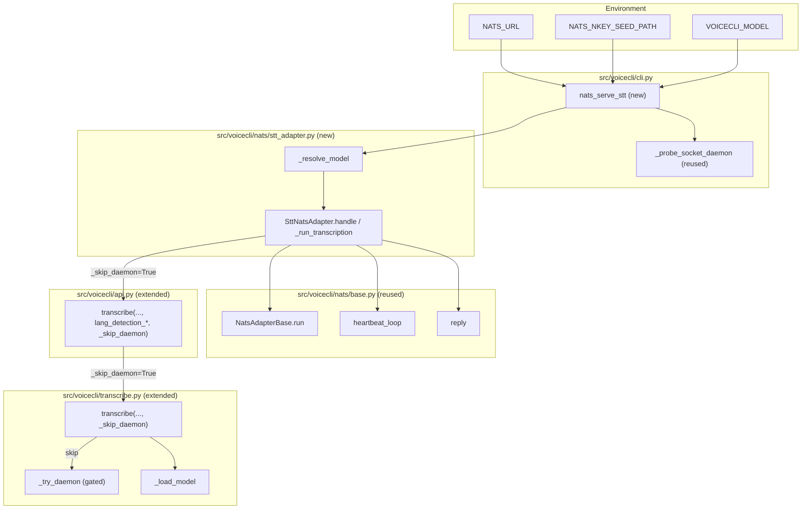
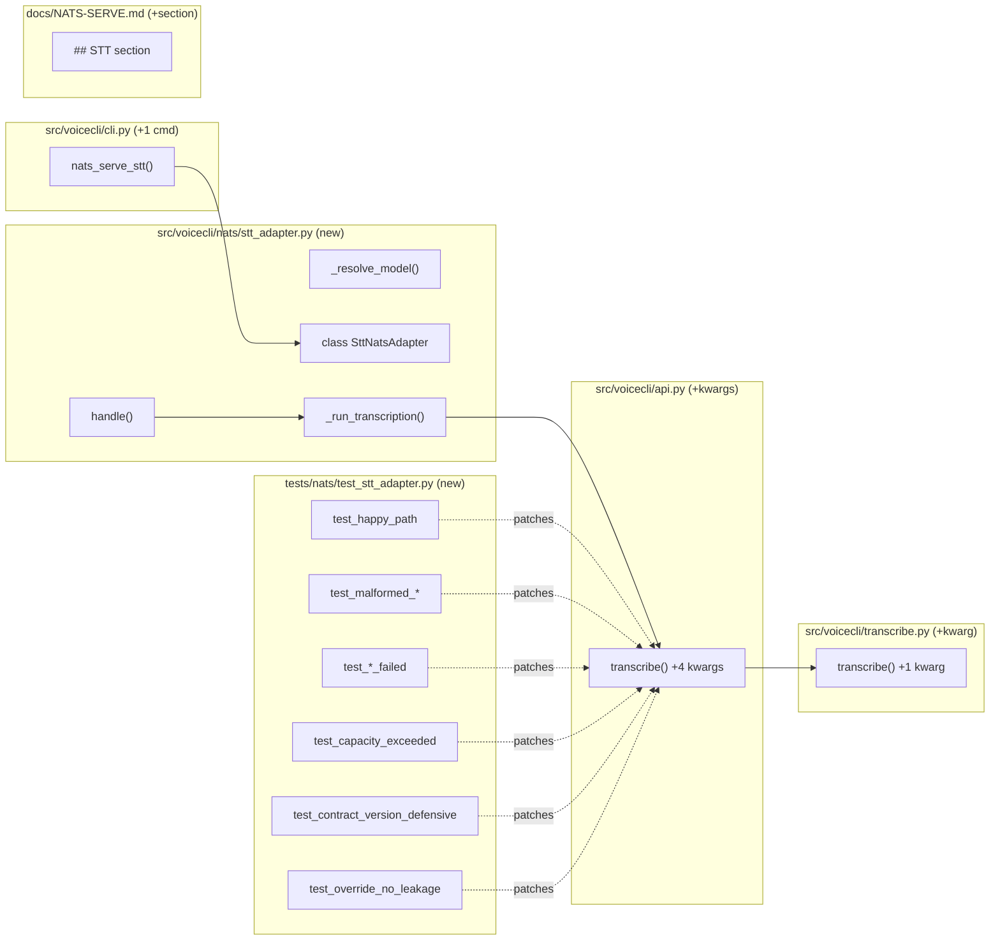

## Summary

Mirror of slice V1 (PR #43) for the STT path: add `SttNatsAdapter`, `nats-serve stt` CLI subcommand, 12-case test file, `NATS-SERVE.md` STT section, and one minimal pass-through signature extension in `api.transcribe()` + `transcribe.transcribe()` for per-request language-detection overrides and `_skip_daemon` bypass.

## Architecture

### Data flow



### File × Function map



## Bootstrap Context

- **Slice V1 framework (reusable as-is):** `NatsAdapterBase` (`src/voicecli/nats/base.py`), `build_reply` (`reply.py`), `scoped_path`/`cleanup` (`tempdir.py`), `read_vram` (`nvml.py`), `STT_WORKERS` queue constant (`queue_groups.py`), `_probe_socket_daemon` (`cli.py:1311` — already takes a path arg).
- **Reference implementation to mirror:** `src/voicecli/nats/tts_adapter.py` (194 LOC).
- **Reference test file to port:** `tests/nats/test_tts_adapter.py` (429 LOC, 12-case structure).
- **Reference CLI command to mirror:** `cli.py:1335-1403` `nats_serve_tts()`.
- **Lower transcribe layer already supports overrides:** `src/voicecli/transcribe.py:115-136` accepts `language_detection_threshold`, `language_detection_segments`, `language_fallback`. Only `_skip_daemon` parameter is new.

## Agents

| Agent | Task count | Files |
|---|---|---|
| `backend-dev` | 4 | `src/voicecli/transcribe.py`, `src/voicecli/api.py`, `src/voicecli/nats/stt_adapter.py`, `src/voicecli/cli.py` |
| `tester` | 1 | `tests/nats/test_stt_adapter.py` |
| `doc-writer` | 1 | `docs/NATS-SERVE.md` |

**Parallelism:** T3 (adapter) and T4 (tests) are parallel-safe once T1 (transcribe extension) + T2 (api extension) land (tests patch the adapter's import site of `api.transcribe`, so both need the extended signature). T6 (docs) is parallel-safe from T1 onward.

## Consistency Report

| Spec success criterion | Covered by task |
|---|---|
| SC-1: `nats-serve stt` starts + subscribes | T5 (CLI), verified in T7 RED-GATE by manual smoke |
| SC-2: Well-formed request → `ok:true` reply | T4 test `test_happy_path` |
| SC-3: Invalid `request_id`/`audio_b64` → `malformed_request` | T4 tests `test_malformed_request_id*`, `test_malformed_audio_b64*` |
| SC-4: `audio_b64` decode failure → `audio_decode_failed` | T4 test `test_audio_decode_failed` |
| SC-5: Transcription raises → `transcription_failed`, process stays up | T4 test `test_transcription_failed` |
| SC-6: `contract_version: "999"` handled normally | T4 test `test_contract_version_defensive` |
| SC-7: Reply echoes `request_id` | T4 test `test_request_id_echoed` |
| SC-8: `language` forced in request → echoed in reply | T4 test `test_language_forced_echoed` |
| SC-9: Per-request overrides applied on that request only | T3 (impl), T4 test `test_overrides_applied` |
| SC-10: Override no-leakage (sequential) | T4 test `test_overrides_no_leakage` |
| SC-11: `api.transcribe()` accepts new kwargs, CLI unchanged | T2 (api extension) + existing `test_api.py` stays green |
| SC-12: Heartbeat fields + cadence | T4 test `test_heartbeat_fields` (inherited from base) |
| SC-13: First heartbeat `model_loaded: null` | T4 test `test_first_heartbeat_null_model` |
| SC-14: Heartbeats during in-flight | covered by slice V1 base tests (not re-tested) |
| SC-15 / SC-16: SIGTERM drain clean / timeout | covered by slice V1 base tests (not re-tested) |
| SC-17: `--max-concurrent` limit | T4 test `test_max_concurrent_limit` |
| SC-18: `--reject-when-full` | T4 test `test_reject_when_full` |
| SC-19: VRAM guard — live daemon aborts 78 | T5 CLI (reused `_probe_socket_daemon` path) — no new test; relies on slice V1's `test_vram_guard.py` coverage + argumented path |
| SC-20: Stale socket ignored | same — inherited |
| SC-21: `stt-serve` tests unchanged | T7 RED-GATE runs full suite |
| SC-22: Docs STT section | T6 |
| SC-23: Docs co-located-GPU recommendation | T6 |

**Coverage:** 23/23 success criteria mapped. Inherited-from-base SCs (14, 15, 16, 19, 20) are explicitly excluded from T4 scope — rationale: slice V1 already proved the base class behavior; re-testing here would duplicate assertions and couple this slice to implementation details of `NatsAdapterBase`.

## Micro-Tasks

### T1 — Extend `transcribe.transcribe()` with `_skip_daemon` kwarg  [phase: GREEN] [P] [difficulty: 1]

**Agent:** `backend-dev`
**File:** `src/voicecli/transcribe.py` (modify, ~5 LOC added)
**Spec trace:** SC-11 (api signature extension)
**Slice:** V2

Add `_skip_daemon: bool = False` kwarg to `transcribe()` at line 115. When `True`, skip the `_try_daemon(...)` block (lines 125-136). Do not forward `_skip_daemon` anywhere; it's a local gate.

```python
def transcribe(
    audio_path: Path,
    model: str = DEFAULT_MODEL,
    language: str | None = None,
    language_detection_threshold: float | None = None,
    language_detection_segments: int | None = None,
    language_fallback: str | None = None,
    task: str = "transcribe",
    initial_prompt: str | None = None,
    _skip_daemon: bool = False,
) -> TranscriptionResult:
    if not _skip_daemon:
        daemon_result = _try_daemon(...)
        if daemon_result is not None:
            return daemon_result
    # ...rest unchanged
```

**Verify:**
```bash
uv run ruff check src/voicecli/transcribe.py && \
  uv run python -c "from voicecli.transcribe import transcribe; import inspect; assert '_skip_daemon' in inspect.signature(transcribe).parameters"
```
**Expected:** ruff green, no assertion error.
**Time:** 3 min.

---

### T2 — Extend `api.transcribe()` with override kwargs + `_skip_daemon`  [phase: GREEN] [difficulty: 1] (blocked by: T1)

**Agent:** `backend-dev`
**File:** `src/voicecli/api.py` (modify, ~10 LOC added)
**Spec trace:** SC-11, SC-9 (per-request overrides)
**Slice:** V2

Add 4 optional kwargs to `api.transcribe()` at line 956: `language_detection_threshold: float | None = None`, `language_detection_segments: int | None = None`, `language_fallback: str | None = None`, `_skip_daemon: bool = False`. Forward all four to the inner `_transcribe(...)` call at/around line 978.

```python
def transcribe(
    audio: str | Path,
    *,
    model: str = "large-v3-turbo",
    language: str | None = None,
    language_detection_threshold: float | None = None,
    language_detection_segments: int | None = None,
    language_fallback: str | None = None,
    output: str | Path | None = None,
    _skip_daemon: bool = False,
):
    # ...
    result = _transcribe(
        Path(audio),
        model=model,
        language=language,
        language_detection_threshold=language_detection_threshold,
        language_detection_segments=language_detection_segments,
        language_fallback=language_fallback,
        _skip_daemon=_skip_daemon,
    )
```

**Verify:**
```bash
uv run ruff check src/voicecli/api.py && \
  uv run python -c "from voicecli.api import transcribe; import inspect; p = inspect.signature(transcribe).parameters; \
    assert all(k in p for k in ('language_detection_threshold','language_detection_segments','language_fallback','_skip_daemon'))"
```
**Expected:** ruff green, no assertion error.
**Time:** 4 min.

---

### T3 — Implement `SttNatsAdapter`  [phase: GREEN] [difficulty: 3] (blocked by: T2)

**Agent:** `backend-dev`
**File:** `src/voicecli/nats/stt_adapter.py` (new, ~150 LOC)
**Spec trace:** U1, S1, S2, N1–N3, A1
**Slice:** V2

Port `tts_adapter.py` structure, adapting for STT:
- `SUBJECT = "lyra.voice.stt.request"`, `HEARTBEAT_SUBJECT = "lyra.voice.stt.heartbeat"`, service `"stt_workers"`, queue group `STT_WORKERS`, worker_id prefix `"stt-"`.
- `DEFAULT_MODEL = "large-v3-turbo"`.
- `_resolve_model(cli_value)` — precedence CLI > `VOICECLI_MODEL` env > `voicecli.toml` `[stt].model` > `DEFAULT_MODEL`.
- `handle(msg, payload)`:
  - Validate `request_id` with same regex as TTS (`^[A-Za-z0-9_-]{1,128}$`).
  - Validate `audio_b64` present + str.
  - Build override dict from non-null `language`, `language_detection_threshold`, `language_detection_segments`, `language_fallback`.
  - Acquire semaphore (same `--reject-when-full` pattern).
  - Call `_run_transcription(msg, payload, request_id, overrides)`.
- `_run_transcription`:
  - `base64.b64decode(audio_b64)` → write to `scoped_path(request_id, ext_from_mime(mime_type))`.
  - On decode failure → reply `audio_decode_failed`, cleanup, return.
  - `self.model_loaded = self.default_model` (this is safe: `_skip_daemon=True` guarantees the satellite owns the inference).
  - `api.transcribe(path, model=self.default_model, output=None, _skip_daemon=True, **overrides)` via executor.
  - Build reply: `ok=True, request_id, text=result.text, language=result.language, duration_seconds=result.duration_seconds`.
  - On exception → reply `transcription_failed`, log exception with request_id.
  - `finally: cleanup(path)`.

**Import discipline:** `from voicecli import api` at top of `_run_transcription` (deferred, same pattern as tts_adapter). Tests will patch `voicecli.nats.stt_adapter.api.transcribe`.

**Verify:**
```bash
uv run ruff check src/voicecli/nats/stt_adapter.py && \
  uv run python -c "from voicecli.nats.stt_adapter import SttNatsAdapter, _resolve_model, DEFAULT_MODEL, SUBJECT, HEARTBEAT_SUBJECT; \
    assert SUBJECT == 'lyra.voice.stt.request' and HEARTBEAT_SUBJECT == 'lyra.voice.stt.heartbeat' and DEFAULT_MODEL == 'large-v3-turbo'"
```
**Expected:** ruff green, no assertion error.
**Time:** 8 min.

---

### T4 — Port `test_stt_adapter.py` (12 cases)  [phase: RED] [P] [difficulty: 3] (blocked by: T3)

**Agent:** `tester`
**File:** `tests/nats/test_stt_adapter.py` (new, ~400 LOC)
**Spec trace:** SC-2 through SC-10, SC-12, SC-13, SC-17, SC-18
**Slice:** V2

Port `tests/nats/test_tts_adapter.py` to `test_stt_adapter.py`. Patch target: `voicecli.nats.stt_adapter.api.transcribe` (NOT `voicecli.api.transcribe` — see spec testing notes). Required 12 cases:

1. `test_happy_path` — well-formed request returns `ok:true`, populated `text`/`language`/`duration_seconds`, `contract_version:"1"`.
2. `test_malformed_request_id_missing` — empty/missing → `malformed_request`, `request_id: ""`.
3. `test_malformed_request_id_bad_chars` — path-traversal / >128 chars → `malformed_request`, `request_id` truncated to 64.
4. `test_malformed_audio_b64` — missing / non-str → `malformed_request`.
5. `test_audio_decode_failed` — invalid base64 → `audio_decode_failed`.
6. `test_transcription_failed` — `api.transcribe` raises → `transcription_failed`, no process crash.
7. `test_contract_version_defensive` — request with `contract_version:"999"` → happy path (log WARN but handle).
8. `test_request_id_echoed` — reply `request_id` matches request.
9. `test_language_forced_echoed` — request with `language:"en"` → reply `language:"en"` (mock returns `TranscriptionResult(text="...", language="en", duration_seconds=1.0)`).
10. `test_overrides_applied` — request with all 3 override fields → mock called with those exact kwargs.
11. `test_overrides_no_leakage` — fire 2 sequential requests on same adapter instance; first has overrides, second does not; assert mock's second `call_args.kwargs` excludes the 3 override keys (or they are `None`).
12. `test_first_heartbeat_null_model` + `test_heartbeat_fields` + `test_max_concurrent_limit` + `test_reject_when_full` — port from TTS counterparts, adapting to STT subjects/fields.

Use `pytest-asyncio`, `unittest.mock.AsyncMock`/`MagicMock`, and the same fixtures pattern as `test_tts_adapter.py`.

**Verify:**
```bash
uv run pytest tests/nats/test_stt_adapter.py -v --tb=short
```
**Expected:** all tests in file PASS (count ≥ 12).
**Time:** 10 min.

---

### T5 — Add `nats_serve_stt` CLI command  [phase: GREEN] [difficulty: 2] (blocked by: T3)

**Agent:** `backend-dev`
**File:** `src/voicecli/cli.py` (modify, ~70 LOC added at end of nats_app block)
**Spec trace:** U1 (CLI affordance)
**Slice:** V2

Add `@nats_app.command("stt")` immediately after `nats_serve_tts`. Mirror signature with `--model` replacing `--engine` and `--max-concurrent` default `2` instead of `1`. Use `Path("~/.local/share/voicecli/stt-daemon.sock").expanduser()` for the VRAM-guard probe (reuse `_probe_socket_daemon`).

```python
@nats_app.command("stt")
def nats_serve_stt(
    model: Annotated[Optional[str], typer.Option("--model", "-m")] = None,
    max_concurrent: Annotated[
        int, typer.Option("--max-concurrent", envvar="VOICECLI_MAX_CONCURRENT")
    ] = 2,
    reject_when_full: Annotated[
        bool, typer.Option("--reject-when-full", envvar="VOICECLI_REJECT_WHEN_FULL")
    ] = False,
    heartbeat_interval: Annotated[
        float, typer.Option("--heartbeat-interval", envvar="VOICECLI_HEARTBEAT_INTERVAL")
    ] = 5.0,
    drain_timeout: Annotated[
        float, typer.Option("--drain-timeout", envvar="VOICECLI_DRAIN_TIMEOUT")
    ] = 30.0,
    allow_coexist: Annotated[
        bool, typer.Option("--allow-coexist", envvar="VOICECLI_ALLOW_COEXIST")
    ] = False,
) -> None:
    """Subscribe to lyra.voice.stt.request and reply with transcription."""
    import asyncio, logging, os
    from voicecli.nats.base import DrainTimeoutError
    from voicecli.nats.stt_adapter import SttNatsAdapter, _resolve_model

    logging.basicConfig(level=logging.INFO)
    log = logging.getLogger("voicecli.nats-serve.stt")

    resolved_model = _resolve_model(model)
    sock_path = Path("~/.local/share/voicecli/stt-daemon.sock").expanduser()
    state = _probe_socket_daemon(sock_path)
    if state == "live":
        if allow_coexist:
            log.warning("coexisting with live socket daemon at %s", sock_path)
        else:
            log.error("live socket daemon at %s — refusing to start (use --allow-coexist or stop the daemon)", sock_path)
            raise typer.Exit(78)
    elif state == "stale":
        log.info("stale socket file at %s ignored", sock_path)

    nats_url = os.environ.get("NATS_URL")
    if not nats_url:
        log.error("NATS_URL env var is required")
        raise typer.Exit(2)

    nkey_seed_path: Path | None = None
    nkey_seed_env = os.environ.get("NATS_NKEY_SEED_PATH")
    if nkey_seed_env:
        nkey_seed_path = Path(nkey_seed_env).expanduser()

    adapter = SttNatsAdapter(
        default_model=resolved_model,
        max_concurrent=max_concurrent,
        reject_when_full=reject_when_full,
        heartbeat_interval=heartbeat_interval,
        drain_timeout=drain_timeout,
    )
    try:
        asyncio.run(adapter.run(nats_url=nats_url, nkey_seed_path=nkey_seed_path))
    except DrainTimeoutError:
        log.error("drain timeout exceeded; some requests may have been dropped")
        raise typer.Exit(3)
```

**Verify:**
```bash
uv run ruff check src/voicecli/cli.py && \
  uv run voicecli nats-serve stt --help | grep -q -- '--model' && \
  uv run voicecli nats-serve stt --help | grep -q -- '--max-concurrent'
```
**Expected:** ruff green, help output contains `--model` and `--max-concurrent`.
**Time:** 5 min.

---

### T6 — Add STT section to `docs/NATS-SERVE.md`  [phase: GREEN] [P] [difficulty: 2] (blocked by: T1)

**Agent:** `doc-writer`
**File:** `docs/NATS-SERVE.md` (modify, ~60 LOC added)
**Spec trace:** SC-22, SC-23
**Slice:** V2

Add a `## STT mode` section (or parallel to the existing TTS structure — whichever matches the current doc's layout). Must cover:
- CLI invocation: `voicecli nats-serve stt --model <model>`
- Env vars: `VOICECLI_MODEL` (new); all other env vars identical to TTS (reference TTS section, don't duplicate).
- Subjects: `lyra.voice.stt.request`, `lyra.voice.stt.heartbeat`, queue group `stt-workers`.
- Exit codes: identical to TTS (0, 3, 78).
- VRAM guard: `~/.local/share/voicecli/stt-daemon.sock`.
- Supervisord stanza: identical to TTS (`autorestart=unexpected`, `exitcodes=0,78`).
- **Co-located GPU recommendation:** on `roxabituwer` (RTX 3080 10 GB), when TTS + STT share the GPU, set `--max-concurrent=1` (TTS ~7.4 GB + STT ~2.2 GB = ~9.6 GB; a second concurrent decode would OOM). Default remains `2` for standalone STT hosts.

**Verify:**
```bash
grep -q "nats-serve stt" docs/NATS-SERVE.md && \
  grep -q "VOICECLI_MODEL" docs/NATS-SERVE.md && \
  grep -q "max-concurrent=1" docs/NATS-SERVE.md && \
  grep -q "stt-daemon.sock" docs/NATS-SERVE.md
```
**Expected:** all four greps succeed.
**Time:** 6 min.

---

### T7 — RED-GATE: full validation  [phase: RED-GATE] [difficulty: 1] (blocked by: T2, T3, T4, T5, T6)

**Agent:** `backend-dev` (coordinator) — runs the full suite to assert nothing regressed.
**File:** none (read-only)
**Spec trace:** SC-21 (existing suite unchanged), all other SCs indirectly
**Slice:** V2

```bash
uv run ruff check . && \
  uv run ruff format --check . && \
  uv run pytest tests/ -v --tb=short
```

**Expected:**
- Ruff clean.
- Format clean.
- All tests pass. Specifically: `test_stt_adapter.py` ≥ 12 passing; `test_tts_adapter.py` unchanged (no new fails); `test_transcribe.py` (if present) unchanged.

**Time:** 3 min (mostly pytest runtime).

**On failure:** any new regression in existing tests is a blocker — root-cause before proceeding to `/pr`. The spec requires `voicecli stt-serve` tests remain green.

## Task IDs

<!-- Generated by /plan. Used by /implement to resume tasks on session restart. -->
- T1: 12 — Extend transcribe.transcribe() with _skip_daemon kwarg
- T2: 13 — Extend api.transcribe() with override kwargs + _skip_daemon
- T3: 14 — Implement SttNatsAdapter
- T4: 15 — Port test_stt_adapter.py (12 cases)
- T5: 16 — Add nats_serve_stt CLI command
- T6: 17 — Add STT section to docs/NATS-SERVE.md
- T7: 18 — RED-GATE full validation (ruff + format + full pytest)
