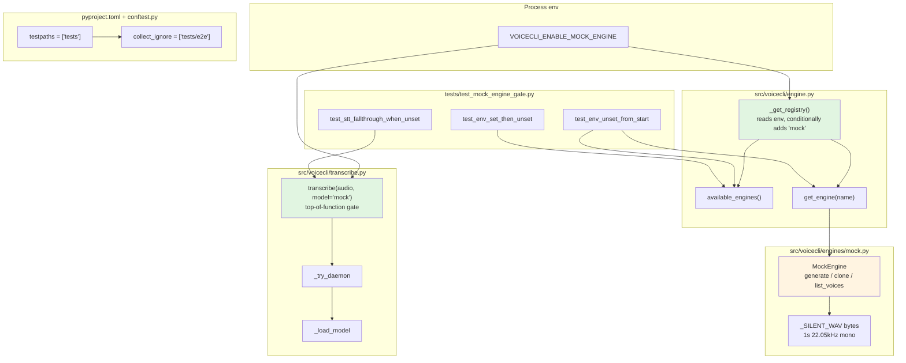
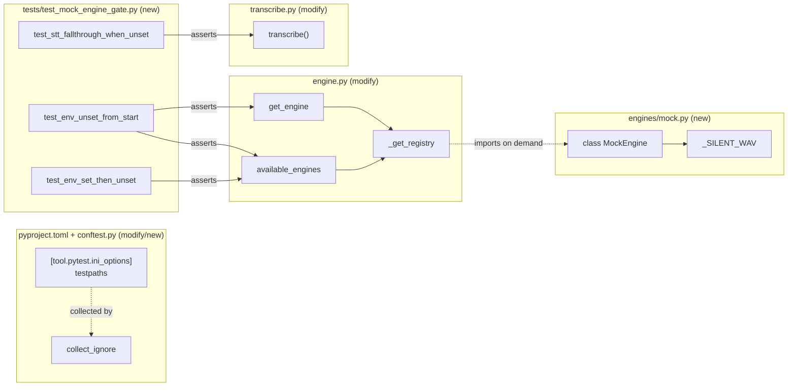

## Summary

Land slice V3a of issue #45: ship a `MockEngine` registered behind a process-env gate (`VOICECLI_ENABLE_MOCK_ENGINE=1`), wire the same gate into `transcribe.transcribe()` for STT, add the anti-leak unit test, and configure the pytest path filter so `tests/e2e/` (not yet present — coming in #50) is skipped on dev machines without Docker.

Slices V3b (compose + fixture), V3c (stub hub + round-trip test), V3d (CI `e2e` job) are deferred to follow-up #50, which is hard-blocked on #44 (slice V2 — `nats-serve stt` adapter).

## Architecture

### Data flow



### File × function map



## Bootstrap Context

Reference patterns to lift from:

| Need | Reference file | What to copy |
|---|---|---|
| Engine class shape (TTS) | `src/voicecli/engines/qwen.py` (header + class signature) | Imports, `class XEngine(TTSEngine):` skeleton, `name` attribute |
| Engine registration | `src/voicecli/engine.py:95-108` (`_get_registry`) | Lazy import inside function, dict return shape |
| Test conventions | `tests/test_validation.py` or `tests/test_voice_priority.py` | `from __future__ import annotations`, plain pytest functions, fixture-free where possible |
| Env-var pattern | `src/voicecli/cli.py:1387` (`os.environ.get("NATS_NKEY_SEED_PATH")`) | Inline env read, no helper module |
| TTSEngine ABC | `src/voicecli/engine.py:62-79` | Required abstractmethods: `generate`, `clone`, `list_voices` |

Files modified or created (full set for V3a):

| Path | Action | LOC est. |
|---|---|---|
| `src/voicecli/engines/mock.py` | new | ~50 |
| `src/voicecli/engine.py` | modify (`_get_registry`) | +5 |
| `src/voicecli/transcribe.py` | modify (top of `transcribe()`) | +5 |
| `tests/test_mock_engine_gate.py` | new | ~60 |
| `pyproject.toml` | modify (`[tool.pytest.ini_options]`) | +3 |
| `conftest.py` (repo root) | new | ~5 |

## Agents

| Agent | Tasks | Files | Why |
|---|---|---|---|
| backend-dev | T3, T4, T5 | `src/voicecli/engines/mock.py`, `src/voicecli/engine.py`, `src/voicecli/transcribe.py` | Production code in `src/voicecli/` |
| devops | T7 | `pyproject.toml`, `conftest.py` | Build / test config |
| tester | T1, T2, T6, T9 | `tests/test_mock_engine_gate.py`, full suite | Test authoring + RED-GATE + GREEN-GATE + regression |
| (lead — main session) | T8, T10 | — | Quick verifications no agent context needed |

F-lite / single domain, so 1 backend-dev agent (no fan-out).

## Consistency Report

| Spec criterion (SC-N) | Covered by tasks | Status |
|---|---|---|
| SC-1: `pytest tests/e2e/test_nats_roundtrip.py` passes in CI | — | **Deferred to #50** (V3c+V3d) |
| SC-2: Fresh nkey per run, mode 0600, no commit | — | **Deferred to #50** (V3b) |
| SC-3: Stub hub asserts both reply schemas | — | **Deferred to #50** (V3c) |
| SC-4: E2E job `needs: [ci]` | — | **Deferred to #50** (V3d) |
| SC-5: MockEngine not exposed when env unset | T1, T3, T4, T6 | covered |
| SC-6: Anti-leak unit test (3 cases) | T1, T6 | covered |
| SC-7: E2E `timeout-minutes: 10` | — | **Deferred to #50** (V3d) |
| SC-8: E2E `if: always()` compose-down + `if: failure()` log capture | — | **Deferred to #50** (V3d) |
| SC-9: Seed-leak CI lint | — | **Deferred to #50** (V3d) |
| SC-10: `pyproject testpaths` + `conftest collect_ignore` skip e2e by default | T7, T8 | covered |

In-scope (V3a) coverage: 3 / 3 applicable criteria covered (SC-5, SC-6, SC-10). Other criteria are explicitly deferred to #50 per slice scope decision.

| Affordance trace | Tasks |
|---|---|
| N1 (env gate) | T3, T4, T5 |
| N2 (MockEngine TTS) | T3 |
| N3 (mock STT branch) | T5 |
| N9 (anti-leak unit test) | T1, T6 |
| N11 (path filter conftest + pyproject) | T7, T8 |

N4–N8, N10 are V3b–V3d affordances — covered in #50.

## Micro-Tasks

### Slice V3a — RED phase

#### T1 [RED] [P] — Write anti-leak unit test (all 3 cases)

- **File:** `tests/test_mock_engine_gate.py` (new)
- **Agent:** tester
- **Spec trace:** SC-5, SC-6, N1, N9
- **Difficulty:** 2/5
- **Estimate:** 8 min
- **Skeleton:**
  ```python
  from __future__ import annotations
  import os
  import importlib
  import pytest
  from pathlib import Path

  def _reload_engine_module():
      import voicecli.engine as eng
      importlib.reload(eng)
      return eng

  def test_env_unset_from_start(monkeypatch):
      monkeypatch.delenv("VOICECLI_ENABLE_MOCK_ENGINE", raising=False)
      eng = _reload_engine_module()
      assert "mock" not in eng.available_engines()
      with pytest.raises(ValueError, match="Unknown engine 'mock'"):
          eng.get_engine("mock")

  def test_env_set_then_unset(monkeypatch):
      monkeypatch.setenv("VOICECLI_ENABLE_MOCK_ENGINE", "1")
      eng = _reload_engine_module()
      assert "mock" in eng.available_engines()
      monkeypatch.delenv("VOICECLI_ENABLE_MOCK_ENGINE", raising=False)
      assert "mock" not in eng.available_engines()  # registry not cached

  def test_stt_fallthrough_when_unset(monkeypatch, tmp_path):
      monkeypatch.delenv("VOICECLI_ENABLE_MOCK_ENGINE", raising=False)
      from voicecli import transcribe
      importlib.reload(transcribe)
      # With env unset, mock model name must NOT short-circuit.
      # We expect either ValueError from _load_model or whisper rejecting "mock".
      audio = tmp_path / "fake.wav"
      audio.write_bytes(b"")
      with pytest.raises(Exception):
          transcribe.transcribe(audio, model="mock")
  ```
- **Verify:** `uv run pytest tests/test_mock_engine_gate.py -v`
- **Expected:** all 3 tests **fail** (ImportError or AttributeError — module changes not yet made). This is the RED phase signal.

#### T2 [RED-GATE] — Confirm RED state is correct

- **Agent:** tester
- **Spec trace:** RED-GATE for V3a
- **Dependencies:** T1
- **Difficulty:** 1/5
- **Estimate:** 2 min
- **Verify:** `uv run pytest tests/test_mock_engine_gate.py -v 2>&1 | tail -20`
- **Expected:** Output includes "3 failed" or similar; failures are real (not collection errors). If failures are because of unrelated import issues, fix T1 before proceeding.

### Slice V3a — GREEN phase

#### T3 [GREEN] — Create MockEngine

- **File:** `src/voicecli/engines/mock.py` (new)
- **Agent:** backend-dev
- **Spec trace:** N2
- **Dependencies:** T2
- **Difficulty:** 2/5
- **Estimate:** 8 min
- **Skeleton:**
  ```python
  """Test-only mock TTS engine — returns a 1-second silent WAV.

  Registered behind VOICECLI_ENABLE_MOCK_ENGINE env gate. Never use in production.
  """
  from __future__ import annotations
  from pathlib import Path
  import struct

  from voicecli.engine import TTSEngine

  # 1s 22.05 kHz mono 16-bit PCM silence — generated inline (no soundfile dep).
  def _silent_wav_bytes() -> bytes:
      sample_rate = 22050
      num_samples = sample_rate
      data = b"\x00\x00" * num_samples
      header = b"RIFF" + struct.pack("<I", 36 + len(data)) + b"WAVE"
      header += b"fmt " + struct.pack("<IHHIIHH", 16, 1, 1, sample_rate, sample_rate * 2, 2, 16)
      header += b"data" + struct.pack("<I", len(data))
      return header + data

  _SILENT_WAV = _silent_wav_bytes()


  class MockEngine(TTSEngine):
      name = "mock"

      def generate(self, text: str, voice: str | None, output_path: Path, **kwargs) -> Path:
          output_path.write_bytes(_SILENT_WAV)
          return output_path

      def clone(self, text: str, ref_audio: Path, output_path: Path, ref_text: str | None = None, **kwargs) -> Path:
          output_path.write_bytes(_SILENT_WAV)
          return output_path

      def list_voices(self) -> list[str]:
          return ["mock-voice"]
  ```
- **Verify:** `uv run python -c "from voicecli.engines.mock import MockEngine, _SILENT_WAV; assert _SILENT_WAV[:4] == b'RIFF'; print(len(_SILENT_WAV))"`
- **Expected:** prints a number around 44144 (header + 22050 samples × 2 bytes); no exceptions.

#### T4 [GREEN] — Gate MockEngine in `_get_registry`

- **File:** `src/voicecli/engine.py` (modify lines 95–108)
- **Agent:** backend-dev
- **Spec trace:** N1
- **Dependencies:** T3
- **Difficulty:** 2/5
- **Estimate:** 5 min
- **Skeleton:** inside `_get_registry`, at the end before `return`:
  ```python
  import os

  registry: dict[str, type[TTSEngine]] = {
      "qwen": QwenEngine,
      "qwen-fast": QwenFastEngine,
      "chatterbox": ChatterboxEngine,
      "chatterbox-turbo": ChatterboxTurboEngine,
      "voxtral": VoxtralEngine,
  }
  if os.environ.get("VOICECLI_ENABLE_MOCK_ENGINE") == "1":
      from voicecli.engines.mock import MockEngine
      registry["mock"] = MockEngine
  return registry
  ```
- **Verify:**
  ```bash
  uv run python -c "from voicecli.engine import available_engines; print(available_engines())"
  VOICECLI_ENABLE_MOCK_ENGINE=1 uv run python -c "from voicecli.engine import available_engines; print(available_engines())"
  ```
- **Expected:** first prints 5 engines (no mock); second prints 6 engines including `mock`.

#### T5 [GREEN] — Add mock branch in `transcribe.transcribe()`

- **File:** `src/voicecli/transcribe.py` (modify, insert at line 124 — top of `transcribe()`)
- **Agent:** backend-dev
- **Spec trace:** N3
- **Dependencies:** T2 (T5 is independent of T3/T4 but logically grouped)
- **Difficulty:** 1/5
- **Estimate:** 3 min
- **Skeleton:** insert as the **first** statement inside `transcribe()`:
  ```python
  import os
  if model == "mock" and os.environ.get("VOICECLI_ENABLE_MOCK_ENGINE") == "1":
      return TranscriptionResult(text="", language="en", segments=[])
  ```
  Note: `import os` may already be present — check imports section first; if not, add to top of file.
- **Verify:**
  ```bash
  VOICECLI_ENABLE_MOCK_ENGINE=1 uv run python -c "
  from pathlib import Path
  from voicecli.transcribe import transcribe
  r = transcribe(Path('/tmp/anything.wav'), model='mock')
  print(r.text, r.language, r.segments)
  "
  ```
- **Expected:** prints `'' en []`; no model load, no daemon connection attempt.

#### T6 [GREEN-GATE] — All 3 anti-leak tests pass

- **Agent:** tester
- **Spec trace:** SC-5, SC-6
- **Dependencies:** T3, T4, T5
- **Difficulty:** 1/5
- **Estimate:** 2 min
- **Verify:** `uv run pytest tests/test_mock_engine_gate.py -v`
- **Expected:** `3 passed`. If any fail, fix the offending production code (T3/T4/T5) — do not relax the test.

### Slice V3a — Path filter (parallel with engine work)

#### T7 [GREEN] [P] — Configure pytest path filter

- **Files:**
  - `pyproject.toml` (modify — add `[tool.pytest.ini_options]` section if absent)
  - `conftest.py` (new — at repo root)
- **Agent:** devops
- **Spec trace:** SC-10, N11
- **Dependencies:** none (parallel-safe with T1–T6)
- **Difficulty:** 1/5
- **Estimate:** 3 min
- **Skeleton:**
  - `pyproject.toml`:
    ```toml
    [tool.pytest.ini_options]
    testpaths = ["tests"]
    ```
  - `conftest.py` (repo root, new file):
    ```python
    """Repo-root pytest config — excludes tests/e2e/ from default collection.

    The e2e suite requires Docker; CI opts in via `pytest tests/e2e/`.
    """
    collect_ignore = ["tests/e2e"]
    ```
- **Verify:**
  ```bash
  mkdir -p tests/e2e && touch tests/e2e/test_dummy_should_be_ignored.py
  echo "def test_dummy(): assert False" > tests/e2e/test_dummy_should_be_ignored.py
  uv run pytest --collect-only -q 2>&1 | grep -c "test_dummy_should_be_ignored"
  rm -rf tests/e2e
  ```
- **Expected:** count is `0` — the dummy file is not collected. Cleanup removes the dummy directory.

#### T8 [GREEN-GATE] — Confirm path filter active across both runners

- **Agent:** lead
- **Spec trace:** SC-10
- **Dependencies:** T7
- **Difficulty:** 1/5
- **Estimate:** 1 min
- **Verify:**
  ```bash
  uv run pytest --collect-only -q 2>&1 | tail -5
  ```
- **Expected:** Last line shows total test count from `tests/` only (no `tests/e2e/` references). No collection errors.

### Slice V3a — REFACTOR

#### T9 [REFACTOR] — Full test suite regression check

- **Agent:** tester
- **Spec trace:** Regression — must not break existing tests.
- **Dependencies:** T6, T8
- **Difficulty:** 1/5
- **Estimate:** 5 min
- **Verify:**
  ```bash
  uv run pytest --ignore=tests/test_overlay.py
  ```
- **Expected:** All previously-passing tests still pass; new `test_mock_engine_gate.py` now in the suite. No new failures.

#### T10 [REFACTOR] [P] — Lint, format, typecheck

- **Agent:** lead
- **Spec trace:** Standards compliance.
- **Dependencies:** T6, T8
- **Difficulty:** 1/5
- **Estimate:** 3 min
- **Verify:**
  ```bash
  uv run ruff check . && uv run ruff format --check . && uv run pyright
  ```
- **Expected:** all three exit 0. If pyright complains about missing stubs in `mock.py`, follow the same `# pyright: ignore` pattern as `qwen.py`'s header — but only if necessary; clean code preferred.

## Implementation Order

```
T1 ──► T2 ──► T3 ──► T4 ──► T6 ──► T9 ──► T10
                      │      ▲
                      └► T5 ─┘
T7 ──► T8 ─────────────────► T9
```

T1–T2 (RED) gates T3–T6 (GREEN). T7 runs in parallel with the engine work. T9–T10 are the final regression sweep.

## Risks & Notes

- **transcribe.py — `os` import:** check whether `import os` is already at the top of the file before T5; if not, T5 must add it. Skeleton above includes it inline for clarity but moving to module-top is cleaner.
- **monkeypatch + importlib.reload:** the test pattern in T1 reloads `voicecli.engine` to defeat any module-level caching. If reload causes issues with already-imported submodules (engines/mock.py captures stale `TTSEngine` reference), prefer the env approach without reload — re-call `_get_registry()` directly via the module's current binding.
- **MockEngine WAV header:** the inline WAV builder in T3 is intentionally dependency-free (no `soundfile`). 22.05 kHz / 16-bit / mono is enough for the contract test — readers in slice V3c only need `audio_b64` to decode to *some* WAV, not a specific format.
- **Slice V3b–V3d defer:** all related tests (`tests/e2e/`), CI changes (`.github/workflows/ci.yml`), and the docker-compose stack are NOT in this plan. They are tracked in #50 and will be planned separately once #44 (slice V2) merges.

## Task IDs

<!-- Generated by /plan. Used by /implement to resume tasks on session restart. -->
- T1: 12 — T1 [RED] Write anti-leak unit test (3 cases)
- T2: 13 — T2 [RED-GATE] Confirm RED state is correct
- T3: 14 — T3 [GREEN] Create MockEngine
- T4: 15 — T4 [GREEN] Gate MockEngine in _get_registry
- T5: 16 — T5 [GREEN] Add mock branch in transcribe.transcribe()
- T6: 17 — T6 [GREEN-GATE] All 3 anti-leak tests pass
- T7: 18 — T7 [GREEN] [P] Configure pytest path filter
- T8: 19 — T8 [GREEN-GATE] Confirm path filter active
- T9: 20 — T9 [REFACTOR] Full test suite regression check
- T10: 21 — T10 [REFACTOR] [P] Lint, format, typecheck
