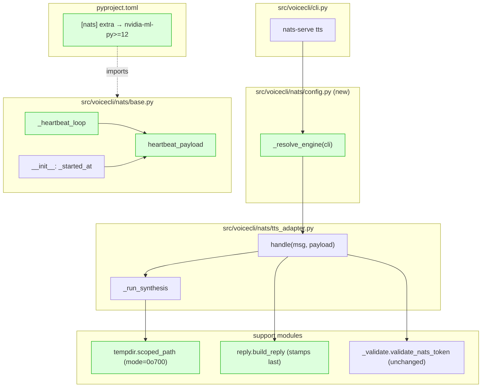
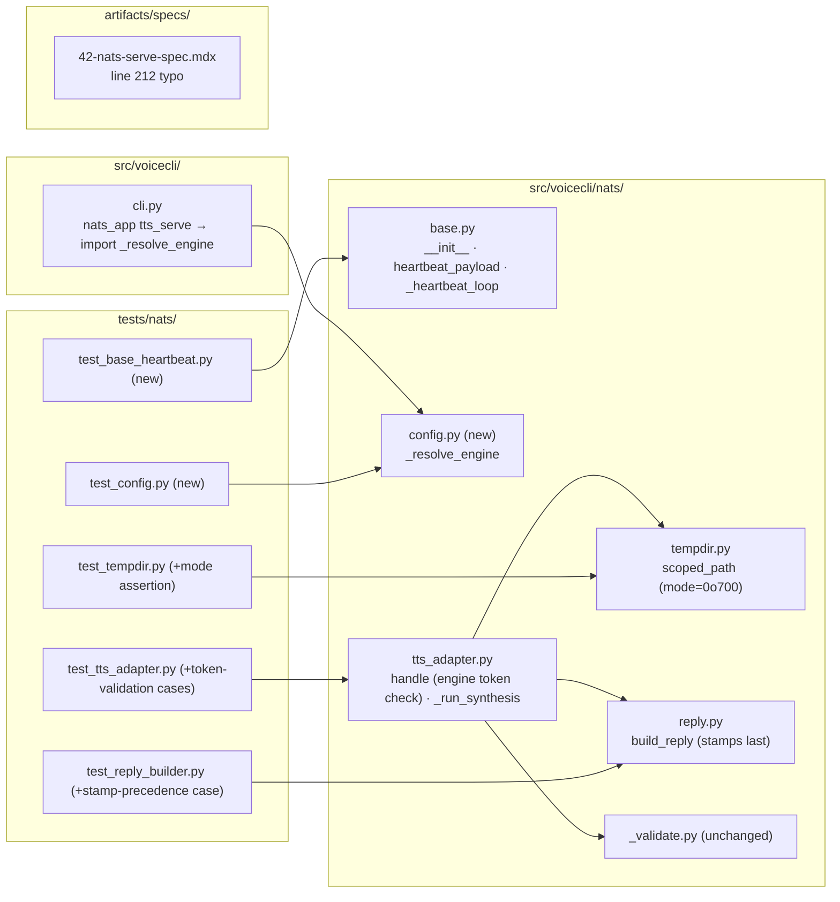

## Summary

Apply 8 bundled review findings from PR #43 in one worktree/PR: tempdir mode, `build_reply`
kwarg order, heartbeat loop leak, `connected`/`uptime_s` payload fields, `_resolve_engine`
relocation to a new `voicecli.nats.config` module, engine-token format validation,
`pynvml` → `nvidia-ml-py` dep swap, and one spec typo. Pure refactor — no new features.

## Architecture

### Data flow (what moves where)

Green = touched by this plan.

### File × Function map

## Agents

| Agent | Task count | Files |
|---|---|---|
| backend-dev | 9 | `src/voicecli/nats/{tempdir,reply,base,config,tts_adapter}.py`, `src/voicecli/cli.py` |
| tester | 6 | `tests/nats/{test_tempdir,test_reply_builder,test_base_heartbeat,test_config,test_tts_adapter}.py` |
| devops | 1 | `pyproject.toml` |
| doc-writer | 1 | `artifacts/specs/42-nats-serve-spec.mdx` |

## Consistency Report

- **Success criteria:** 15 in spec · 15 mapped to ≥1 task (100%)
- **Uncovered:** none
- **Untraced tasks:** none (all tasks carry `spec_trace: SC-N`)
- **Exemptions:** none

## Micro-Tasks

Grouped by slice. Within a slice, RED (tests first) → GREEN (impl) → RED-GATE (slice verify).
Tasks with `[P]` are parallel-safe across agents once dependencies resolve.
**Hard constraint:** S3 and S4 both mutate `tts_adapter.py` — commits must be strictly sequential.

---

### Slice V1 — Tempdir mode + reply stamp guard

| T | Phase | Agent | File | Description | [P] | Difficulty | Spec trace |
|---|---|---|---|---|---|---|---|
| T1 | RED | tester | `tests/nats/test_tempdir.py` | Add test asserting `stat(TEMP_ROOT).st_mode & 0o777 == 0o700` after first `scoped_path()` call. Clean up dir between tests. | Y | 2 | SC-1 |
| T2 | RED | tester | `tests/nats/test_reply_builder.py` | Add test: `build_reply(ok=True, request_id="r", **{"contract_version": "spoof", "ok": False})` and assert `reply["contract_version"] == CONTRACT_VERSION` and `reply["ok"] is True` — proves stamps overwrite caller kwargs. | Y | 2 | SC-2 |
| T3 | GREEN | backend-dev | `src/voicecli/nats/tempdir.py` | Change `TEMP_ROOT.mkdir(parents=True, exist_ok=True)` → `TEMP_ROOT.mkdir(mode=0o700, parents=True, exist_ok=True)`. | Y | 1 | SC-1 |
| T4 | GREEN | backend-dev | `src/voicecli/nats/reply.py` | Reverse dict-merge order in `build_reply`: `{**fields, "contract_version": CONTRACT_VERSION, "ok": ok, "request_id": request_id}` so stamps overwrite any colliding caller fields. | Y | 1 | SC-2 |
| T5 | RED-GATE | tester | `tests/nats/` | Run `uv run pytest tests/nats/test_tempdir.py tests/nats/test_reply_builder.py -x`. Expected: both suites green. | N | 1 | V1 gate |

**Verify V1:** `uv run pytest tests/nats/test_tempdir.py tests/nats/test_reply_builder.py -x` → pass.

---

### Slice V2 — Heartbeat refactor (fix leak + restore fields)

| T | Phase | Agent | File | Description | [P] | Difficulty | Spec trace |
|---|---|---|---|---|---|---|---|
| T6 | RED | tester | `tests/nats/test_base_heartbeat.py` (new) | Test: heartbeat_payload contains `connected: bool` and `uptime_s: float`. Mock `self._nc.is_connected=True`, set `_started_at = time.monotonic()-2.5`, assert `uptime_s >= 2.5` and `connected is True`. | Y | 2 | SC-4 |
| T7 | RED | tester | `tests/nats/test_base_heartbeat.py` | Test: run `_heartbeat_loop` in fast-interval mode (0.01s) for 50 iterations. Count live `stop.wait()` inner coroutines via `asyncio.all_tasks()` pre-loop vs mid-loop. Assert delta == 0. | Y | 4 | SC-5 |
| T8 | GREEN | backend-dev | `src/voicecli/nats/base.py` | In `__init__`, add `self._started_at = time.monotonic()`. In `heartbeat_payload`, add `"connected": self._nc.is_connected if self._nc else False` and `"uptime_s": time.monotonic() - self._started_at`. | Y | 2 | SC-4 |
| T9 | GREEN | backend-dev | `src/voicecli/nats/base.py` | Replace `_heartbeat_loop` waiter: remove `asyncio.wait_for(asyncio.shield(stop.wait()), timeout=interval)` + bare-except pattern. Use `await asyncio.sleep(self.heartbeat_interval)` inside the loop; rely on `hb_task.cancel()` in `run()` for shutdown (already in place). | Y | 3 | SC-5 |
| T10 | RED-GATE | tester | `tests/nats/` | Run `uv run pytest tests/nats/test_base_heartbeat.py -x`. Both tests green. | N | 1 | V2 gate |

**Verify V2:** `uv run pytest tests/nats/test_base_heartbeat.py -x` → pass.

---

### Slice V3 — Relocate `_resolve_engine` to `voicecli.nats.config`

**Sequencing:** V3 must complete before V4 (both write `tts_adapter.py`).

| T | Phase | Agent | File | Description | [P] | Difficulty | Spec trace |
|---|---|---|---|---|---|---|---|
| T11 | RED | tester | `tests/nats/test_config.py` (new) | Tests: CLI arg wins; `VOICECLI_ENGINE` wins over toml; `LYRA_TTS_ENGINE` fallback; toml `[defaults].engine` fallback; `DEFAULT_ENGINE` last resort. Use `monkeypatch` for env + patch `load_config`. | Y | 3 | SC-6, SC-7 |
| T12 | GREEN | backend-dev | `src/voicecli/nats/config.py` (new) | Move `_resolve_engine` body verbatim from `tts_adapter.py`. Also move `DEFAULT_ENGINE = "qwen-fast"` constant (so config module is self-contained). Keep `from voicecli.config import load_config` lazy inside the function. | N | 2 | SC-6 |
| T13 | GREEN | backend-dev | `src/voicecli/nats/tts_adapter.py` | Remove `_resolve_engine` function. Remove `DEFAULT_ENGINE` constant. Import both from `voicecli.nats.config` **only at top-level** if still referenced; otherwise drop. Keep `SUBJECT`, `HEARTBEAT_SUBJECT`, `_engine_available`, `_wav_duration_ms` in-module. | N | 2 | SC-6 |
| T14 | GREEN | backend-dev | `src/voicecli/cli.py` | Change `from voicecli.nats.tts_adapter import TtsNatsAdapter, _resolve_engine` → `from voicecli.nats.tts_adapter import TtsNatsAdapter` + `from voicecli.nats.config import _resolve_engine`. | N | 1 | SC-7 |
| T15 | RED-GATE | tester | tests | Run `uv run pytest tests/nats/ -x` + `uv run python -c "from voicecli.nats.config import _resolve_engine; print(_resolve_engine())"`. Both pass. | N | 1 | V3 gate |

**Verify V3:** `uv run pytest tests/nats/ -x` + no traceback on adapter import.

---

### Slice V4 — Engine allowlist format validation

**Sequencing:** V4 starts only after V3 commits land.

| T | Phase | Agent | File | Description | [P] | Difficulty | Spec trace |
|---|---|---|---|---|---|---|---|
| T16 | RED | tester | `tests/nats/test_tts_adapter.py` | New cases: malformed engine (`"a b"`, `"*.tts"`, 129-char string) → reply `error: "malformed_request"`, registry NOT consulted (mock `_engine_available`, assert not called). Plus: `engine=None` and `engine=""` fall back to `default_engine` and proceed (mock `_engine_available` returning True). | Y | 3 | SC-3, SC-3b |
| T17 | GREEN | backend-dev | `src/voicecli/nats/tts_adapter.py` | In `handle`, after applying the `engine = payload.get("engine") or self.default_engine` default, call `validate_nats_token(engine, kind="engine")` inside a try/except `ValueError`. On failure, reply `malformed_request` and return before `_engine_available`. | N | 2 | SC-3 |
| T18 | RED-GATE | tester | tests | `uv run pytest tests/nats/test_tts_adapter.py -x`. | N | 1 | V4 gate |

**Verify V4:** TTS adapter test file green with new cases.

---

### Slice V5 — `pynvml` → `nvidia-ml-py`

| T | Phase | Agent | File | Description | [P] | Difficulty | Spec trace |
|---|---|---|---|---|---|---|---|
| T19 | GREEN | devops | `pyproject.toml` | In `[project.optional-dependencies].nats`, replace `"pynvml>=11.5"` with `"nvidia-ml-py>=12"`. No change to import lines in `src/voicecli/nats/nvml.py` (both packages expose `pynvml` module). | N | 1 | SC-8 |
| T20 | RED-GATE | tester | repo | Run `uv sync --extra nats` (must succeed). Then `uv run pytest -W error::FutureWarning tests/nats/test_nvml.py tests/nats/test_vram_guard.py -x`. Must produce zero FutureWarnings. | N | 2 | SC-9, SC-10 |

**Verify V5:** `uv sync --extra nats` + warning-clean nvml tests.

---

### Slice V6 — Spec typo

| T | Phase | Agent | File | Description | [P] | Difficulty | Spec trace |
|---|---|---|---|---|---|---|---|
| T21 | GREEN | doc-writer | `artifacts/specs/42-nats-serve-spec.mdx` | Line 212: replace `"aborts with exit code 2"` with `"aborts with exit code 78 (\`EX_CONFIG\`)"`. No other edits in this file. | Y | 1 | SC-11 |
| T22 | RED-GATE | tester | repo | `grep -n "exit code 78" artifacts/specs/42-nats-serve-spec.mdx` returns a hit on the Coexistence & install section. `grep -c "exit code 2" artifacts/specs/42-nats-serve-spec.mdx` decreases (ideally to 0). | N | 1 | V6 gate |

**Verify V6:** grep confirms spec now consistent.

---

### Global gate

| T | Phase | Agent | Description |
|---|---|---|---|
| T23 | FINAL | tester | `uv run ruff check . && uv run ruff format --check . && uv run pytest tests/nats/ -x -W error::FutureWarning` — zero warnings, zero failures. |

## Execution notes

- **Parallel within slices:** V1 (T1+T2+T3+T4) and V2 (T6+T7+T8+T9) are the two slices where RED and GREEN pairs can run fully concurrently — implement and test files are disjoint.
- **Strict sequence:** V3 → V4 (same file). V5 runs after V4 to keep the FutureWarning baseline clean while other slices land. V6 is independent but cheap; bundle at end.
- **Worktree:** single worktree under `.claude/worktrees/49-nats-adapter-hygiene/` off staging.
- **Final PR:** one PR, Conventional Commit title `refactor(nats): adapter hygiene + pynvml deprecation + spec typo`, closes #49.

## Task IDs

<!-- Generated by /plan. Used by /implement to resume tasks on session restart. -->
- T1: 11 — RED: test tempdir mode 0o700
- T2: 12 — RED: test build_reply stamp precedence
- T3: 13 — GREEN: tempdir TEMP_ROOT.mkdir mode=0o700
- T4: 14 — GREEN: build_reply reverse dict-merge order
- T5: 15 — RED-GATE V1
- T6: 16 — RED: test heartbeat_payload fields
- T7: 17 — RED: test heartbeat loop no leak
- T8: 18 — GREEN: base heartbeat fields + _started_at
- T9: 19 — GREEN: base _heartbeat_loop asyncio.sleep
- T10: 20 — RED-GATE V2
- T11: 21 — RED: test _resolve_engine precedence
- T12: 22 — GREEN: create nats/config.py
- T13: 23 — GREEN: remove _resolve_engine from tts_adapter.py
- T14: 24 — GREEN: cli.py import update
- T15: 25 — RED-GATE V3
- T16: 26 — RED: test engine token validation + None fallback
- T17: 27 — GREEN: tts_adapter.handle validate_nats_token
- T18: 28 — RED-GATE V4
- T19: 29 — GREEN: pyproject.toml pynvml → nvidia-ml-py
- T20: 30 — RED-GATE V5 (uv sync + FutureWarning)
- T21: 31 — GREEN: spec #42 line 212 typo fix
- T22: 32 — RED-GATE V6
- T23: 33 — FINAL: ruff + pytest + FutureWarning
