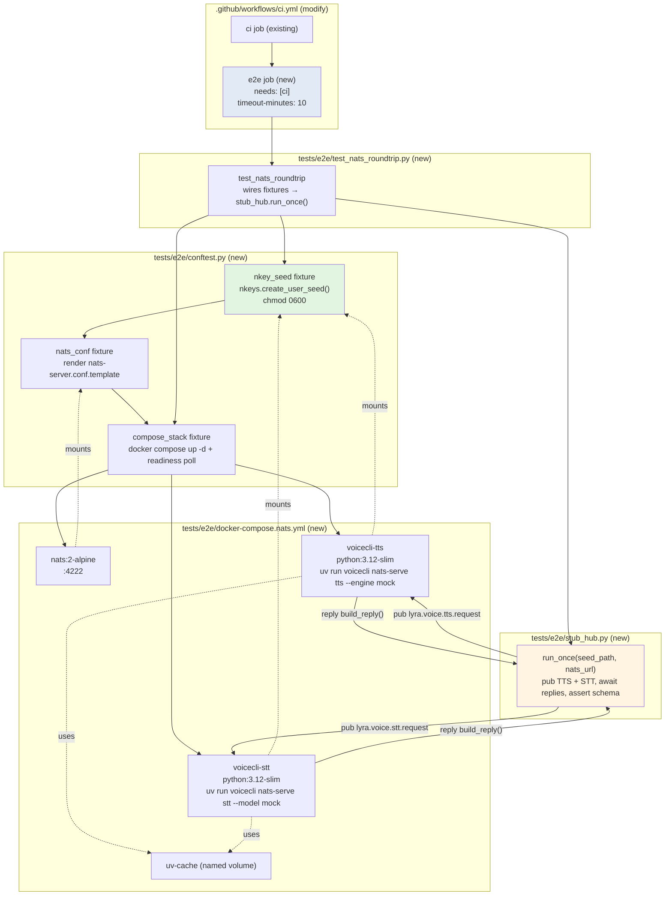
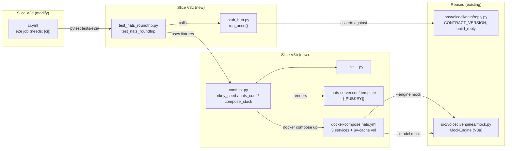

## Summary

Ship the docker-compose E2E gate that proves the ADR-044 NATS contract on `ubuntu-latest`. Bring up NATS + both `voicecli nats-serve {tts,stt}` satellites behind a per-run Ed25519 nkey; publish one TTS and one STT request through a Python stub hub; assert both replies match `build_reply()` shape. Add an `e2e` CI job with `needs: [ci]`, `timeout-minutes: 10`, seed-leak lint, and failure-log capture.

Blockers for this slice (all green): #44 (nats-serve stt, PR #51), #45 V3a (mock engine + env gate, PR #52).

## Architecture

### Data flow



### File × Function map



## Bootstrap Context

Reference patterns to lift from:

| Need | Reference file | What to copy |
|---|---|---|
| Reply schema source of truth | `src/voicecli/nats/reply.py` (13 LOC) | `CONTRACT_VERSION = "1"`, `build_reply()` envelope shape — hub asserts against this literal |
| Satellite env contract | `src/voicecli/cli.py:1335-1500` (`nats_serve_tts`, `nats_serve_stt`) | `NATS_URL`, `NATS_NKEY_SEED_PATH` env vars consumed by adapter base |
| Mock engine + env gate | `src/voicecli/engine.py:95-120`, `src/voicecli/engines/mock.py` | `VOICECLI_ENABLE_MOCK_ENGINE=1` → registry includes `mock`; `TTSEngine` contract |
| STT mock fall-through | `src/voicecli/transcribe.py:125-130` | `model == "mock"` + env set → returns static `{text:"", language:"en", ...}` |
| CI workflow shape | `.github/workflows/ci.yml` (30-LOC single `ci` job today) | setup-uv / apt deps / `uv sync --dev --extra nats` pattern |
| Test-file importability | `tests/nats/test_tts_adapter.py` header (lazy-import shim) | Allow `pytest --collect-only` to succeed even when e2e files error during collection |
| Dev-machine skip | `conftest.py` (root, from V3a) | `collect_ignore = ["tests/e2e"]` already in place |

Files created or modified (full set for this plan):

| Path | Action | LOC est. | Slice |
|---|---|---|---|
| `tests/e2e/__init__.py` | new | 0 | V3b |
| `tests/e2e/nats-server.conf.template` | new | ~8 | V3b |
| `tests/e2e/docker-compose.nats.yml` | new | ~50 | V3b |
| `tests/e2e/conftest.py` | new | ~90 | V3b |
| `tests/e2e/stub_hub.py` | new | ~110 | V3c |
| `tests/e2e/test_nats_roundtrip.py` | new | ~40 | V3c |
| `.github/workflows/ci.yml` | modify (+~40 LOC) | ~40 | V3d |

Total ~338 LOC added.

## Agents

| Agent | Tasks | Files | Why |
|---|---|---|---|
| devops | T1, T2, T3, T9 | `__init__.py`, `nats-server.conf.template`, `docker-compose.nats.yml`, `.github/workflows/ci.yml` | Infra / compose / CI workflow configs |
| tester | T4, T6, T7 | `tests/e2e/conftest.py`, `tests/e2e/stub_hub.py`, `tests/e2e/test_nats_roundtrip.py` | Python test infra — fixtures, NATS client pub/await, pytest driver |
| (lead — main session) | T5, T8, T10 | — | RED-GATE sentinels (local verification commands) |

**Parallelism:** T1, T2, T3 are all devops on disjoint files — spawn in one batch. T4 (conftest) reads T2's conf path and T3's compose path as string literals; safe to run in parallel with T1/T2/T3 if paths are fixed up-front. T6 → T7 serial (test imports from stub_hub).

## Consistency Report

| Spec criterion (SC-N) | Covered by tasks | Status |
|---|---|---|
| SC-1: `pytest tests/e2e/test_nats_roundtrip.py` passes on `ubuntu-latest` in CI | T7, T8, T9, T10 | covered |
| SC-2: Fresh Ed25519 nkey per run, mode 0600, no seed committed | T4 (nkey_seed fixture), T9 (seed-leak CI lint) | covered |
| SC-3: Stub hub asserts both reply schemas | T6 | covered |
| SC-4: E2E job `needs: [ci]` | T9 | covered |
| SC-5: MockEngine not exposed when env unset | — | **Inherited from #45 V3a** (PR #52) |
| SC-6: Anti-leak unit test (3 cases) | — | **Inherited from #45 V3a** (PR #52) |
| SC-7: E2E job `timeout-minutes: 10` | T9 | covered |
| SC-8: `if: always()` compose-down + `if: failure()` log capture | T9 | covered |
| SC-9: Seed-leak CI lint | T9 | covered |
| SC-10: `testpaths` + `collect_ignore` skip e2e by default | — | **Inherited from #45 V3a** (PR #52) |

Coverage for this slice: 7 / 7 V3b–V3d criteria (SC-1, SC-2, SC-3, SC-4, SC-7, SC-8, SC-9) covered. V3a criteria (SC-5, SC-6, SC-10) inherited from previously-merged PR #52.

| Affordance trace | Tasks |
|---|---|
| N4 (nkey_seed fixture) | T4 |
| N5 (nats_conf fixture) | T2, T4 |
| N6 (compose_stack fixture + readiness poll) | T3, T4 |
| N7 (stub_hub.run_once) | T6 |
| N8 (test_nats_roundtrip) | T7 |
| N10 (e2e CI job) | T9 |

N1, N2, N3, N9, N11 inherited from V3a.

## Micro-Tasks

### Slice V3b — Compose + nkey fixture + readiness poll

#### T1 [GREEN] [P] — Create `tests/e2e/__init__.py`

- **File:** `tests/e2e/__init__.py` (new, empty)
- **Agent:** devops
- **Spec trace:** N4–N8 (package marker enables relative imports from stub_hub / test)
- **Dependencies:** none
- **Difficulty:** 1/5
- **Estimate:** 1 min
- **Skeleton:** empty file.
- **Verify:** `ls tests/e2e/__init__.py && [ ! -s tests/e2e/__init__.py ] && echo OK`
- **Expected:** `OK`.

#### T2 [GREEN] [P] — Create `tests/e2e/nats-server.conf.template`

- **File:** `tests/e2e/nats-server.conf.template` (new)
- **Agent:** devops
- **Spec trace:** N5
- **Dependencies:** none
- **Difficulty:** 1/5
- **Estimate:** 2 min
- **Skeleton:**
  ```
  port: 4222
  authorization {
    users: [
      { nkey: "{{PUBKEY}}" }
    ]
  }
  ```
- **Verify:** `grep -q '{{PUBKEY}}' tests/e2e/nats-server.conf.template && grep -q 'port: 4222' tests/e2e/nats-server.conf.template`
- **Expected:** both greps succeed.

#### T3 [GREEN] [P] — Create `tests/e2e/docker-compose.nats.yml`

- **File:** `tests/e2e/docker-compose.nats.yml` (new)
- **Agent:** devops
- **Spec trace:** N6
- **Dependencies:** none
- **Difficulty:** 3/5
- **Estimate:** 8 min
- **Skeleton:**
  ```yaml
  services:
    nats:
      image: nats:2-alpine
      command: ["-c", "/etc/nats/nats-server.conf"]
      ports:
        - "4222:4222"
      volumes:
        - ${NATS_CONF_PATH}:/etc/nats/nats-server.conf:ro

    voicecli-tts:
      image: python:3.12-slim
      depends_on: [nats]
      working_dir: /app
      entrypoint: ["bash", "-lc"]
      command: ["pip install uv -q && uv sync --extra nats -q && uv run voicecli nats-serve tts --engine mock"]
      environment:
        VOICECLI_ENABLE_MOCK_ENGINE: "1"
        NATS_URL: "nats://nats:4222"
        NATS_NKEY_SEED_PATH: /run/secrets/nkey.seed
      volumes:
        - ${REPO_ROOT}:/app:ro
        - ${SEED_PATH}:/run/secrets/nkey.seed:ro
        - uv-cache:/root/.cache/uv

    voicecli-stt:
      image: python:3.12-slim
      depends_on: [nats]
      working_dir: /app
      entrypoint: ["bash", "-lc"]
      command: ["pip install uv -q && uv sync --extra nats -q && uv run voicecli nats-serve stt --model mock"]
      environment:
        VOICECLI_ENABLE_MOCK_ENGINE: "1"
        NATS_URL: "nats://nats:4222"
        NATS_NKEY_SEED_PATH: /run/secrets/nkey.seed
      volumes:
        - ${REPO_ROOT}:/app:ro
        - ${SEED_PATH}:/run/secrets/nkey.seed:ro
        - uv-cache:/root/.cache/uv

  volumes:
    uv-cache:
  ```
  Note: bind-mount repo read-only; `uv sync` writes to `uv-cache` named volume, not the repo.
- **Verify:** `docker compose -f tests/e2e/docker-compose.nats.yml config > /dev/null && echo OK`
- **Expected:** `OK` (yaml valid, env-var substitutions deferred to fixture).

#### T4 [GREEN] — Write `tests/e2e/conftest.py` (nkey + conf + compose fixtures)

- **File:** `tests/e2e/conftest.py` (new, ~90 LOC)
- **Agent:** tester
- **Spec trace:** N4, N5, N6
- **Dependencies:** T2 (reads template path), T3 (reads compose path)
- **Difficulty:** 4/5
- **Estimate:** 15 min
- **Skeleton:**
  ```python
  """Session-scoped fixtures for NATS round-trip E2E.

  Requires Docker; on machines without Docker the whole dir is skipped via
  repo-root conftest.py collect_ignore (landed in #45 V3a).
  """
  from __future__ import annotations
  import os
  import shutil
  import socket
  import subprocess
  import time
  from pathlib import Path

  import pytest

  E2E_DIR = Path(__file__).parent
  REPO_ROOT = E2E_DIR.parent.parent
  COMPOSE_FILE = E2E_DIR / "docker-compose.nats.yml"
  CONF_TEMPLATE = E2E_DIR / "nats-server.conf.template"
  READINESS_TIMEOUT = 30.0
  READINESS_INTERVAL = 0.5


  def _docker_available() -> bool:
      return shutil.which("docker") is not None


  @pytest.fixture(scope="session")
  def nkey_seed(tmp_path_factory: pytest.TempPathFactory) -> tuple[Path, str]:
      """Fresh Ed25519 nkey per session. Returns (seed_path, pubkey)."""
      import nkeys
      seed = nkeys.create_user_seed()  # bytes, starts with b'SU...'
      kp = nkeys.from_seed(seed)
      pubkey = kp.public_key.decode("ascii")
      tmp = tmp_path_factory.mktemp("nkey")
      seed_path = tmp / "nkey.seed"
      seed_path.write_bytes(seed)
      os.chmod(seed_path, 0o600)
      return seed_path, pubkey


  @pytest.fixture(scope="session")
  def nats_conf(nkey_seed, tmp_path_factory: pytest.TempPathFactory) -> Path:
      seed_path, pubkey = nkey_seed
      template = CONF_TEMPLATE.read_text()
      rendered = template.replace("{{PUBKEY}}", pubkey)
      tmp = tmp_path_factory.mktemp("nats-conf")
      conf_path = tmp / "nats-server.conf"
      conf_path.write_text(rendered)
      return conf_path


  def _poll_nats(host: str, port: int, timeout: float) -> None:
      deadline = time.monotonic() + timeout
      while time.monotonic() < deadline:
          try:
              with socket.create_connection((host, port), timeout=1.0):
                  return
          except OSError:
              time.sleep(READINESS_INTERVAL)
      raise TimeoutError(f"NATS did not accept connections at {host}:{port} within {timeout}s")


  @pytest.fixture(scope="session")
  def compose_stack(nkey_seed, nats_conf):
      if not _docker_available():
          pytest.skip("Docker not available — skipping e2e compose stack")
      seed_path, _ = nkey_seed
      env = {
          **os.environ,
          "REPO_ROOT": str(REPO_ROOT),
          "SEED_PATH": str(seed_path),
          "NATS_CONF_PATH": str(nats_conf),
      }
      up = subprocess.run(
          ["docker", "compose", "-f", str(COMPOSE_FILE), "up", "-d"],
          env=env, capture_output=True, text=True,
      )
      if up.returncode != 0:
          pytest.fail(f"docker compose up failed:\nSTDOUT:\n{up.stdout}\nSTDERR:\n{up.stderr}")
      try:
          _poll_nats("localhost", 4222, READINESS_TIMEOUT)
          yield env
      finally:
          subprocess.run(
              ["docker", "compose", "-f", str(COMPOSE_FILE), "down", "-v"],
              env=env, capture_output=True, text=True,
          )
  ```
- **Verify:** `uv run pytest tests/e2e/ --collect-only -q 2>&1 | tail -5`
- **Expected:** conftest collects without import errors (fixtures registered).

#### T5 [RED-GATE V3b] — Smoke: stack comes up + NATS accepts connection

- **Agent:** lead
- **Spec trace:** SC-1 (pre-gate), N6
- **Dependencies:** T1, T2, T3, T4
- **Difficulty:** 1/5
- **Estimate:** 3 min (mostly compose pull/build)
- **Verify:**
  ```bash
  # Inline smoke: start stack via fixture path, assert port 4222 open, tear down.
  uv run python -c "
  import os, socket, subprocess, tempfile
  import nkeys
  repo = '$(pwd)'
  with tempfile.TemporaryDirectory() as tmp:
      seed = nkeys.create_user_seed()
      kp = nkeys.from_seed(seed)
      seed_p = f'{tmp}/nkey.seed'
      open(seed_p, 'wb').write(seed); os.chmod(seed_p, 0o600)
      tmpl = open('tests/e2e/nats-server.conf.template').read().replace('{{PUBKEY}}', kp.public_key.decode())
      conf_p = f'{tmp}/nats-server.conf'; open(conf_p, 'w').write(tmpl)
      env = {**os.environ, 'REPO_ROOT': repo, 'SEED_PATH': seed_p, 'NATS_CONF_PATH': conf_p}
      try:
          subprocess.check_call(['docker','compose','-f','tests/e2e/docker-compose.nats.yml','up','-d','nats'], env=env)
          import time
          for _ in range(60):
              try:
                  socket.create_connection(('localhost',4222), timeout=1).close(); print('NATS OK'); break
              except OSError: time.sleep(0.5)
          else: raise SystemExit('NATS never came up')
      finally:
          subprocess.check_call(['docker','compose','-f','tests/e2e/docker-compose.nats.yml','down','-v'], env=env)
  "
  ```
- **Expected:** `NATS OK`; compose cleanly torn down. Satellites not started in this smoke — just NATS.

### Slice V3c — Stub hub + round-trip test

#### T6 [GREEN] — Write `tests/e2e/stub_hub.py`

- **File:** `tests/e2e/stub_hub.py` (new, ~110 LOC)
- **Agent:** tester
- **Spec trace:** N7, SC-3
- **Dependencies:** T4 (uses nkey seed path conventions)
- **Difficulty:** 4/5
- **Estimate:** 15 min
- **Skeleton:**
  ```python
  """Stub hub: publishes one TTS + one STT request, awaits replies, asserts ADR-044 schema.

  Called by tests/e2e/test_nats_roundtrip.py. Asserts against build_reply() shape
  from src/voicecli/nats/reply.py — contract_version "1", request_id echo, ok=True.
  """
  from __future__ import annotations
  import asyncio
  import base64
  import json
  import uuid
  from pathlib import Path

  import nats

  TTS_REQUEST_SUBJECT = "lyra.voice.tts.request"
  STT_REQUEST_SUBJECT = "lyra.voice.stt.request"
  REPLY_TIMEOUT = 10.0

  # Minimal 1s silent WAV header + payload (mirrors MockEngine output for STT input).
  _SILENT_WAV_B64 = base64.b64encode(
      b"RIFF$\xa0\x00\x00WAVEfmt \x10\x00\x00\x00\x01\x00\x01\x00"
      b"\"V\x00\x00D\xac\x00\x00\x02\x00\x10\x00data\x00\xa0\x00\x00"
      + b"\x00\x00" * 22050
  ).decode("ascii")


  async def _round_trip(nc, subject: str, payload: dict) -> dict:
      raw = json.dumps(payload).encode("utf-8")
      msg = await nc.request(subject, raw, timeout=REPLY_TIMEOUT)
      return json.loads(msg.data.decode("utf-8"))


  def _assert_reply(reply: dict, request_id: str, payload_key: str) -> None:
      assert reply.get("contract_version") == "1", f"contract_version mismatch: {reply!r}"
      assert reply.get("request_id") == request_id, f"request_id mismatch: {reply!r}"
      assert reply.get("ok") is True, f"ok=False: {reply!r}"
      assert payload_key in reply and reply[payload_key] is not None, (
          f"missing {payload_key!r}: {reply!r}"
      )
      if payload_key == "audio_b64":
          raw = base64.b64decode(reply[payload_key])
          assert raw[:4] == b"RIFF", f"audio_b64 not a WAV: {raw[:16]!r}"


  async def _run(seed_path: Path, nats_url: str) -> None:
      nc = await nats.connect(nats_url, nkeys_seed=str(seed_path), connect_timeout=10.0)
      try:
          tts_id = uuid.uuid4().hex
          tts_reply = await _round_trip(nc, TTS_REQUEST_SUBJECT, {
              "contract_version": "1",
              "request_id": tts_id,
              "text": "hello",
              "engine": "mock",
          })
          _assert_reply(tts_reply, tts_id, "audio_b64")

          stt_id = uuid.uuid4().hex
          stt_reply = await _round_trip(nc, STT_REQUEST_SUBJECT, {
              "contract_version": "1",
              "request_id": stt_id,
              "audio_b64": _SILENT_WAV_B64,
              "mime_type": "audio/wav",
              "model": "mock",
          })
          _assert_reply(stt_reply, stt_id, "text")
      finally:
          await nc.drain()


  def run_once(seed_path: Path, nats_url: str) -> None:
      asyncio.run(_run(seed_path, nats_url))
  ```
- **Verify:** `uv run ruff check tests/e2e/stub_hub.py && uv run python -c "from tests.e2e.stub_hub import run_once; assert callable(run_once)"`
- **Expected:** ruff green, import succeeds.

#### T7 [GREEN] — Write `tests/e2e/test_nats_roundtrip.py`

- **File:** `tests/e2e/test_nats_roundtrip.py` (new, ~40 LOC)
- **Agent:** tester
- **Spec trace:** N8, SC-1, SC-3
- **Dependencies:** T4, T6
- **Difficulty:** 2/5
- **Estimate:** 8 min
- **Skeleton:**
  ```python
  """E2E round-trip test: publishes TTS+STT requests through docker-compose stack."""
  from __future__ import annotations
  from pathlib import Path

  import pytest

  from tests.e2e.stub_hub import run_once


  @pytest.mark.timeout(120)  # covers satellite cold start (~30s) + two round-trips
  def test_nats_roundtrip(nkey_seed, compose_stack) -> None:
      """Full contract proof: hub ↔ TTS satellite, hub ↔ STT satellite."""
      seed_path, _pubkey = nkey_seed
      run_once(seed_path=seed_path, nats_url="nats://localhost:4222")
  ```
  Note: `pytest-timeout` needs to be in dev deps — check; if absent, drop the marker and rely on stub_hub's 10s per-request timeout + 30s readiness cap.
- **Verify:** `uv run pytest tests/e2e/test_nats_roundtrip.py --collect-only -q`
- **Expected:** one test collected: `test_nats_roundtrip`.

#### T8 [RED-GATE V3c] — Local round-trip passes

- **Agent:** lead
- **Spec trace:** SC-1, SC-3
- **Dependencies:** T5, T6, T7
- **Difficulty:** 2/5
- **Estimate:** 5 min (satellite cold start dominates)
- **Verify:** `uv run pytest tests/e2e/test_nats_roundtrip.py -v`
- **Expected:** `test_nats_roundtrip PASSED`. Failure modes per spec §Failure modes.
- **On failure:** run `docker compose -f tests/e2e/docker-compose.nats.yml logs voicecli-tts voicecli-stt` and root-cause before moving to T9.

### Slice V3d — CI `e2e` job

#### T9 [GREEN] — Add `e2e` job to `.github/workflows/ci.yml`

- **File:** `.github/workflows/ci.yml` (modify, +~40 LOC)
- **Agent:** devops
- **Spec trace:** N10, SC-1, SC-4, SC-7, SC-8, SC-9
- **Dependencies:** T7
- **Difficulty:** 2/5
- **Estimate:** 6 min
- **Skeleton:** add below the existing `ci` job:
  ```yaml
    e2e:
      needs: [ci]
      runs-on: ubuntu-latest
      timeout-minutes: 10
      steps:
        - uses: actions/checkout@de0fac2e4500dabe0009e67214ff5f5447ce83dd # v6
        - uses: actions/setup-python@a309ff8b426b58ec0e2a45f0f869d46889d02405 # v6
          with:
            python-version: "3.12"
        - uses: astral-sh/setup-uv@94527f2e458b27549849d47d273a16bec83a01e9 # v7
          with:
            enable-cache: true
        - name: Install system dependencies
          run: |
            sudo apt-get update
            sudo apt-get install -y portaudio19-dev libcairo2-dev libgirepository-2.0-dev gir1.2-gtk-3.0
        - name: Install dependencies
          run: uv sync --dev --extra nats
        - name: Seed-leak lint
          run: |
            if find tests/e2e/ \( -name '*.seed' -o -name '*.nk' \) | grep .; then
              echo "::error::seed-shaped file committed under tests/e2e/"
              exit 1
            fi
        - name: Run E2E tests
          run: uv run pytest tests/e2e/ -v
        - name: Dump compose logs on failure
          if: failure()
          run: docker compose -f tests/e2e/docker-compose.nats.yml logs
        - name: Tear down compose
          if: always()
          run: docker compose -f tests/e2e/docker-compose.nats.yml down -v
  ```
  Pin SHAs match the existing `ci` job (consistency with #39 SHA-pinning rule).
- **Verify:**
  ```bash
  uv run python -c "import yaml; y=yaml.safe_load(open('.github/workflows/ci.yml')); \
    j=y['jobs']['e2e']; \
    assert j['needs']==['ci'] and j['timeout-minutes']==10 and \
    any(s.get('if')=='always()' for s in j['steps']) and \
    any(s.get('if')=='failure()' for s in j['steps'])"
  ```
- **Expected:** no assertion error — job has `needs: [ci]`, `timeout-minutes: 10`, both conditional steps.

#### T10 [RED-GATE V3d] — Full validation

- **Agent:** lead
- **Spec trace:** SC-1, SC-2, SC-3, SC-4, SC-7, SC-8, SC-9
- **Dependencies:** T8, T9
- **Difficulty:** 1/5
- **Estimate:** 3 min
- **Verify:**
  ```bash
  uv run ruff check . && \
    uv run ruff format --check . && \
    uv run pyright && \
    uv run pytest --ignore=tests/test_overlay.py -q && \
    # confirm dev-machine default pytest still skips e2e
    uv run pytest --collect-only -q 2>&1 | grep -c 'tests/e2e' | grep -q '^0$'
  ```
- **Expected:** all exit 0. The final grep asserts the path filter from V3a still works (0 e2e tests collected by default).

## Implementation Order

```
T1 ─┐
T2 ─┼─► T4 ──► T5 ──► T6 ──► T7 ──► T8 ──► T9 ──► T10
T3 ─┘
```

T1/T2/T3 run in a single parallel batch (devops, disjoint files). T4 gates on all three. T5 is the V3b smoke gate. T6→T7 serial (import dependency). T8 is the V3c local gate. T9 adds CI; T10 is the final full regression sweep.

## Risks & Notes

- **Satellite cold start:** `pip install uv` + `uv sync --extra nats` inside `python:3.12-slim` is ~30s on first run; the named `uv-cache` volume makes re-runs ~5s. In CI this is a one-shot cost per job.
- **Port collision:** T3's compose pins `4222:4222` — if the dev machine has a NATS already on 4222, smoke will fail with "bind: address already in use". Document in PR description; no code change needed.
- **nkeys import:** `nkeys>=0.1` is in the `nats` extra (verified in `pyproject.toml`). `nats-py`'s `nats.connect(nkeys_seed=...)` accepts the seed path directly.
- **pytest-timeout:** check if it's already in dev deps before using `@pytest.mark.timeout` in T7; otherwise drop the marker.
- **NATS container readiness:** the compose file declares `depends_on: [nats]` for satellites but that only waits for container start, not readiness. Acceptable: satellites use the adapter-base reconnect loop, and the host-side fixture polls port 4222 before yielding. Satellites that fail to reach NATS will reconnect; if they never succeed, stub_hub's request times out at 10s with a clear error.
- **Compose file schema:** docker compose v2 dropped the top-level `version:` field. Omit it.
- **V3a anti-leak unit test interaction:** `tests/test_mock_engine_gate.py` (shipped in V3a) must still pass when this plan lands. T10's full regression sweep covers this.

## Task IDs

<!-- Generated by /plan. Used by /implement to resume tasks on session restart. -->
- T1: 8 — T1 [GREEN] [P] Create tests/e2e/__init__.py
- T2: 9 — T2 [GREEN] [P] Create nats-server.conf.template
- T3: 10 — T3 [GREEN] [P] Create docker-compose.nats.yml
- T4: 11 — T4 [GREEN] Write tests/e2e/conftest.py
- T5: 12 — T5 [RED-GATE V3b] Smoke: stack up + NATS port 4222
- T6: 13 — T6 [GREEN] Write tests/e2e/stub_hub.py
- T7: 14 — T7 [GREEN] Write test_nats_roundtrip.py
- T8: 15 — T8 [RED-GATE V3c] Local round-trip pytest pass
- T9: 16 — T9 [GREEN] Add e2e job to ci.yml
- T10: 17 — T10 [RED-GATE V3d] Full validation sweep
