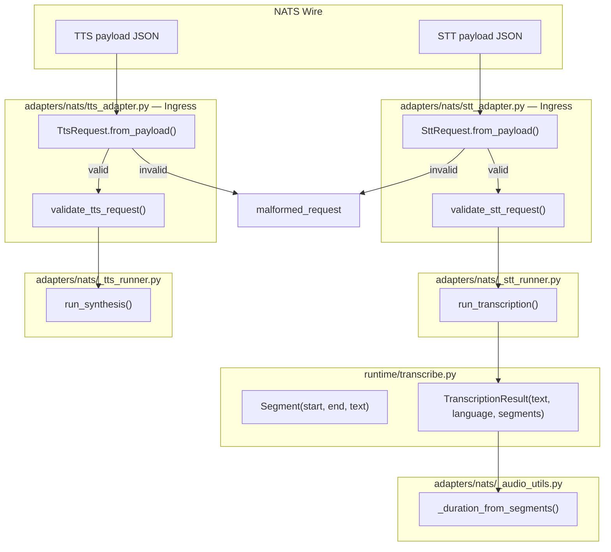
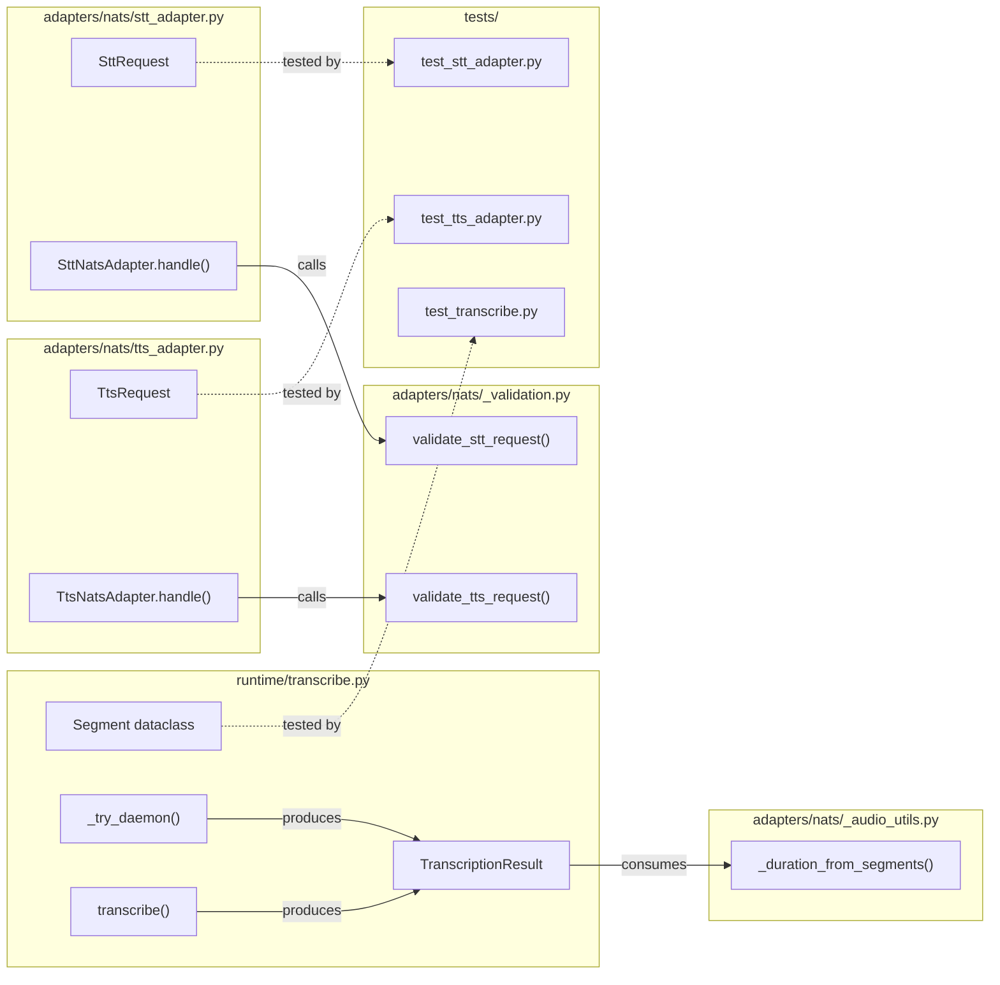

## Summary

Add stdlib dataclasses at the NATS adapter ingress (`SttRequest`, `TtsRequest`) and in the transcription pipeline (`Segment`), replacing raw `dict` forwarding and PR #51 `isinstance` guards with fail-fast typed construction.

## Architecture

### Data Flow



### File × Function Map



## Agents

| Agent | Task count | Files |
|-------|-----------|-------|
| backend-dev-A | 4 | `runtime/transcribe.py`, `adapters/nats/_audio_utils.py` |
| backend-dev-B | 8 | `adapters/nats/stt_adapter.py`, `adapters/nats/tts_adapter.py`, `adapters/nats/_validation.py`, `adapters/nats/_stt_runner.py`, `adapters/nats/_tts_runner.py` |
| tester-A | 9 | `tests/test_transcribe.py`, `tests/nats/test_stt_adapter.py`, `tests/nats/test_tts_adapter.py` |

## Wave Structure

7 waves, max 1 agent active per wave. Elapsed ~30 min sequential.

| Wave | Trigger | Agents | Tasks |
|------|---------|--------|-------|
| 1 | start | backend-dev-A | T1→T2→T3→T4 |
| 2 | T4 done | tester-A | RG1 |
| 3 | RG1 green | backend-dev-B | T5→T6→T7→T8 |
| 4 | T8 done | tester-A | RG2 |
| 5 | RG2 green | backend-dev-B | T9→T10→T11→T12 |
| 6 | T12 done | tester-A | RG3 |
| 7 | RG3 green | tester-A | T13→T14→T15→T16→T17→T18 |

### Budget — per task

| Task | Items | Class | Est. ops | Split? |
|------|-------|-------|----------|--------|
| T1 | add Segment + change type | bounded | 3 | — |
| T2 | daemon path constructor | bounded | 2 | — |
| T3 | local Whisper constructor | bounded | 2 | — |
| T4 | simplify _duration_from_segments | trivial | 1 | — |
| T5 | SttRequest dataclass | bounded | 3 | — |
| T6 | refactor validate_stt_request | judgmental | 5 | — |
| T7 | update stt_adapter.handle() | bounded | 2 | — |
| T8 | update _stt_runner signature | bounded | 2 | — |
| T9 | TtsRequest dataclass | bounded | 3 | — |
| T10 | refactor validate_tts_request | judgmental | 5 | — |
| T11 | update tts_adapter.handle() | bounded | 2 | — |
| T12 | update _tts_runner signature | bounded | 2 | — |
| T13-T18 | test updates + new tests | bounded | 12 | — |
| RG1-RG3 | run tests | trivial | 3 | — |

**Total estimated ops: 47**

### Budget — per agent instance

| Instance | Tasks | Σ ops | Subjects | Split? |
|----------|-------|-------|----------|--------|
| backend-dev-A | T1-T4 | 8 | typing, transcribe | — |
| backend-dev-B | T5-T12 | 24 | adapter, validation | — |
| tester-A | T13-T18, RG1-RG3 | 15 | tests | — |

## Consistency Report

- Criteria covered: 12/12
- Uncovered criteria: none
- Tasks without spec backing: none
- Gold plating exemptions applied: 0

## Micro-Tasks

### Slice V1: Segment dataclass + transcription constructors

#### Task 1: Add `Segment` dataclass and update `TranscriptionResult.segments`
- **File:** `src/voicecli/runtime/transcribe.py`
- **Snippet:**
  ```python
  @dataclass
  class Segment:
      start: float
      end: float
      text: str

  @dataclass
  class TranscriptionResult:
      text: str
      language: str | None
      segments: list[Segment]
  ```
- **Verify:** `grep -n "class Segment" src/voicecli/runtime/transcribe.py`
- **Expected:** match found
- **Time:** 3 min
- **Difficulty:** 2
- **Traces:** SC-5, SC-6
- **Phase:** RED

#### Task 2: Update daemon path to construct `Segment` objects
- **File:** `src/voicecli/runtime/transcribe.py`
- **Snippet:**
  ```python
  segments = [
      Segment(start=s["start"], end=s["end"], text=s["text"])
      for s in resp.get("segments", []) or []
  ]
  return TranscriptionResult(text=..., language=..., segments=segments)
  ```
- **Verify:** `grep -n "Segment(" src/voicecli/runtime/transcribe.py | head -5`
- **Expected:** 2+ matches
- **Time:** 3 min
- **Difficulty:** 2
- **Traces:** SC-7
- **Phase:** RED

#### Task 3: Update local Whisper path to construct `Segment` objects
- **File:** `src/voicecli/runtime/transcribe.py`
- **Snippet:**
  ```python
  seg_list.append(Segment(start=s.start, end=s.end, text=seg_text))
  ```
- **Verify:** `grep -n "Segment(start=s.start" src/voicecli/runtime/transcribe.py`
- **Expected:** match found
- **Time:** 2 min
- **Difficulty:** 1
- **Traces:** SC-8
- **Phase:** RED

#### Task 4: Simplify `_duration_from_segments` to use attribute access
- **File:** `src/voicecli/adapters/nats/_audio_utils.py`
- **Snippet:**
  ```python
  def _duration_from_segments(segments: list[Segment]) -> float:
      if not segments:
          return 0.0
      return segments[-1].end
  ```
- **Verify:** `grep -A3 "def _duration_from_segments" src/voicecli/adapters/nats/_audio_utils.py`
- **Expected:** shows `segments[-1].end` with no `.get()` or `float()`
- **Time:** 2 min
- **Difficulty:** 1
- **Traces:** SC-9
- **Phase:** RED

#### RED-GATE: V1 — run transcribe tests
- **Verify:** `uv run pytest tests/test_transcribe.py -v`
- **Expected:** all pass
- **Phase:** RED-GATE

### Slice V2: SttRequest dataclass + STT adapter ingress

#### Task 5: Add `SttRequest` dataclass with `from_payload` factory
- **File:** `src/voicecli/adapters/nats/stt_adapter.py`
- **Snippet:**
  ```python
  @dataclass
  class SttRequest:
      audio_b64: str
      request_id: str
      trace_id: str = ""
      contract_version: str = ""
      mime_type: str = ""
      language: str | None = None
      language_detection_threshold: float | None = None
      language_detection_segments: int | None = None
      language_fallback: str | None = None
      initial_prompt: str | None = None
      task: str | None = None

      @classmethod
      def from_payload(cls, payload: dict) -> "SttRequest": ...
  ```
- **Verify:** `grep -n "class SttRequest" src/voicecli/adapters/nats/stt_adapter.py`
- **Expected:** match found
- **Time:** 4 min
- **Difficulty:** 2
- **Traces:** SC-1
- **Phase:** RED

#### Task 6: Refactor `validate_stt_request` to construct `SttRequest`, remove isinstance guards
- **File:** `src/voicecli/adapters/nats/_validation.py`
- **Snippet:**
  ```python
  def validate_stt_request(payload: dict) -> SttValidationOutcome:
      try:
          req = SttRequest.from_payload(payload)
      except (ValueError, TypeError, KeyError):
          return _STT_MALFORMED
      # ... format checks (request_id regex, task value, etc.) ...
      return SttValidationOutcome(error_code=None, request=req)
  ```
- **Verify:** `grep -n "isinstance" src/voicecli/adapters/nats/_validation.py | grep stt`
- **Expected:** no matches
- **Time:** 6 min
- **Difficulty:** 3
- **Traces:** SC-1, SC-4
- **Phase:** RED

#### Task 7: Update `SttNatsAdapter.handle()` to use `SttRequest`
- **File:** `src/voicecli/adapters/nats/stt_adapter.py`
- **Snippet:**
  ```python
  async def handle(self, msg: Any, payload: dict) -> None:
      try:
          req = SttRequest.from_payload(payload)
      except (ValueError, TypeError, KeyError):
          await self.reply(msg, _err_stt("unknown", "", "malformed_request"))
          return
      # ... use req.audio_b64, req.request_id, req.trace_id ...
  ```
- **Verify:** `grep -n "SttRequest.from_payload" src/voicecli/adapters/nats/stt_adapter.py`
- **Expected:** match found
- **Time:** 3 min
- **Difficulty:** 2
- **Traces:** SC-2
- **Phase:** RED

#### Task 8: Update `_stt_runner.run_transcription()` to accept `SttRequest`
- **File:** `src/voicecli/adapters/nats/_stt_runner.py`
- **Snippet:**
  ```python
  async def run_transcription(
      state: SttRunnerState,
      default_model: str,
      max_audio_b64_len: int,
      request: SttRequest,
      *,
      trace_id: str,
  ) -> tuple[bool, dict | str]: ...
  ```
- **Verify:** `grep -n "SttRequest" src/voicecli/adapters/nats/_stt_runner.py`
- **Expected:** match found in signature
- **Time:** 3 min
- **Difficulty:** 2
- **Traces:** SC-1
- **Phase:** RED

#### RED-GATE: V2 — run STT adapter tests
- **Verify:** `uv run pytest tests/nats/test_stt_adapter.py tests/nats/test_stt_runner.py -v`
- **Expected:** all pass
- **Phase:** RED-GATE

### Slice V3: TtsRequest dataclass + TTS adapter ingress

#### Task 9: Add `TtsRequest` dataclass with `from_payload` factory
- **File:** `src/voicecli/adapters/nats/tts_adapter.py`
- **Snippet:**
  ```python
  @dataclass
  class TtsRequest:
      text: str
      request_id: str
      trace_id: str = ""
      contract_version: str = ""
      engine: str = ""
      language: str | None = None
      voice: str | None = None
      speed: float | None = None
      exaggeration: float | None = None
      cfg_weight: float | None = None
      accent: str | None = None
      personality: str | None = None
      emotion: str | None = None
      chunked: bool | None = None
      chunk_size: int | None = None
      segment_gap: float | None = None
      crossfade: float | None = None
      fallback_language: str | None = None

      @classmethod
      def from_payload(cls, payload: dict) -> "TtsRequest": ...
  ```
- **Verify:** `grep -n "class TtsRequest" src/voicecli/adapters/nats/tts_adapter.py`
- **Expected:** match found
- **Time:** 4 min
- **Difficulty:** 2
- **Traces:** SC-1
- **Phase:** RED

#### Task 10: Refactor `validate_tts_request` to construct `TtsRequest`, remove isinstance guards
- **File:** `src/voicecli/adapters/nats/_validation.py`
- **Snippet:**
  ```python
  def validate_tts_request(...) -> TtsValidationOutcome:
      try:
          req = TtsRequest.from_payload(payload)
      except (ValueError, TypeError, KeyError):
          return _MALFORMED
      # ... format checks ...
      return TtsValidationOutcome(error_code=None, request=req)
  ```
- **Verify:** `grep -n "isinstance" src/voicecli/adapters/nats/_validation.py | grep tts`
- **Expected:** no matches
- **Time:** 6 min
- **Difficulty:** 3
- **Traces:** SC-1, SC-4
- **Phase:** RED

#### Task 11: Update `TtsNatsAdapter.handle()` to use `TtsRequest`
- **File:** `src/voicecli/adapters/nats/tts_adapter.py`
- **Snippet:**
  ```python
  async def handle(self, msg: Any, payload: dict) -> None:
      try:
          req = TtsRequest.from_payload(payload)
      except (ValueError, TypeError, KeyError):
          await self.reply(msg, _err_tts("unknown", "", "malformed_request"))
          return
  ```
- **Verify:** `grep -n "TtsRequest.from_payload" src/voicecli/adapters/nats/tts_adapter.py`
- **Expected:** match found
- **Time:** 3 min
- **Difficulty:** 2
- **Traces:** SC-2
- **Phase:** RED

#### Task 12: Update `_tts_runner.run_synthesis()` to accept `TtsRequest`
- **File:** `src/voicecli/adapters/nats/_tts_runner.py`
- **Snippet:**
  ```python
  async def run_synthesis(
      state: TtsRunnerState,
      request: TtsRequest,
      out_path: Path,
      *,
      trace_id: str,
  ) -> tuple[bool, dict | str]: ...
  ```
- **Verify:** `grep -n "TtsRequest" src/voicecli/adapters/nats/_tts_runner.py`
- **Expected:** match found in signature
- **Time:** 3 min
- **Difficulty:** 2
- **Traces:** SC-1
- **Phase:** RED

#### RED-GATE: V3 — run TTS adapter tests
- **Verify:** `uv run pytest tests/nats/test_tts_adapter.py tests/nats/test_tts_runner.py -v`
- **Expected:** all pass
- **Phase:** RED-GATE

### Slice V4: Test alignment

#### Task 13: Update `test_transcribe.py` for `list[Segment]`
- **File:** `tests/test_transcribe.py`
- **Verify:** `uv run pytest tests/test_transcribe.py -v`
- **Expected:** all pass
- **Time:** 5 min
- **Difficulty:** 2
- **Traces:** SC-10
- **Phase:** GREEN

#### Task 14: Update `test_stt_adapter.py` for `SttRequest`
- **File:** `tests/nats/test_stt_adapter.py`
- **Verify:** `uv run pytest tests/nats/test_stt_adapter.py -v`
- **Expected:** all pass
- **Time:** 4 min
- **Difficulty:** 2
- **Traces:** SC-10
- **Phase:** GREEN

#### Task 15: Update `test_tts_adapter.py` for `TtsRequest`
- **File:** `tests/nats/test_tts_adapter.py`
- **Verify:** `uv run pytest tests/nats/test_tts_adapter.py -v`
- **Expected:** all pass
- **Time:** 4 min
- **Difficulty:** 2
- **Traces:** SC-10
- **Phase:** GREEN

#### Task 16: Add type-mismatch STT unit tests
- **File:** `tests/nats/test_stt_adapter.py`
- **Snippet:**
  ```python
  def test_stt_malformed_language_detection_threshold_type(self, ...):
      payload = _valid_payload(language_detection_threshold="high")
      # assert reply error == "malformed_request"
  ```
- **Verify:** `uv run pytest tests/nats/test_stt_adapter.py -v -k "malformed"`
- **Expected:** new tests pass
- **Time:** 5 min
- **Difficulty:** 2
- **Traces:** SC-3
- **Phase:** GREEN

#### Task 17: Add type-mismatch TTS unit tests
- **File:** `tests/nats/test_tts_adapter.py`
- **Snippet:**
  ```python
  def test_tts_malformed_speed_type(self, ...):
      payload = _valid_payload(speed="fast")
      # assert reply error == "malformed_request"
  ```
- **Verify:** `uv run pytest tests/nats/test_tts_adapter.py -v -k "malformed"`
- **Expected:** new tests pass
- **Time:** 5 min
- **Difficulty:** 2
- **Traces:** SC-3
- **Phase:** GREEN

#### Task 18: Final validation — full test suite + lint
- **Verify:** `uv run pytest && uv run ruff check . && uv run pyright`
- **Expected:** all pass
- **Time:** 5 min
- **Difficulty:** 1
- **Traces:** SC-10, SC-11, SC-12
- **Phase:** GREEN

## Task Seeding Blueprint

### Wave 1 — no deps, 1 agent

| Task | Agent instance | blockedBy | Subject |
|------|---------------|-----------|---------|
| T1 | backend-dev-A | — | typing |
| T2 | backend-dev-A | T1 | typing |
| T3 | backend-dev-A | T2 | typing |
| T4 | backend-dev-A | T3 | typing |

### Wave 2 — after T4

| Task | Agent instance | blockedBy | Subject |
|------|---------------|-----------|---------|
| RG1 | tester-A | T4 | tests |

### Wave 3 — after RG1

| Task | Agent instance | blockedBy | Subject |
|------|---------------|-----------|---------|
| T5 | backend-dev-B | RG1 | adapter |
| T6 | backend-dev-B | T5 | validation |
| T7 | backend-dev-B | T6 | adapter |
| T8 | backend-dev-B | T7 | adapter |

### Wave 4 — after T8

| Task | Agent instance | blockedBy | Subject |
|------|---------------|-----------|---------|
| RG2 | tester-A | T8 | tests |

### Wave 5 — after RG2

| Task | Agent instance | blockedBy | Subject |
|------|---------------|-----------|---------|
| T9 | backend-dev-B | RG2 | adapter |
| T10 | backend-dev-B | T9 | validation |
| T11 | backend-dev-B | T10 | adapter |
| T12 | backend-dev-B | T11 | adapter |

### Wave 6 — after T12

| Task | Agent instance | blockedBy | Subject |
|------|---------------|-----------|---------|
| RG3 | tester-A | T12 | tests |

### Wave 7 — after RG3

| Task | Agent instance | blockedBy | Subject |
|------|---------------|-----------|---------|
| T13 | tester-A | RG3 | tests |
| T14 | tester-A | T13 | tests |
| T15 | tester-A | T14 | tests |
| T16 | tester-A | T15 | tests |
| T17 | tester-A | T16 | tests |
| T18 | tester-A | T17 | tests |

## Task IDs

<!-- Generated by /plan. Used by /implement to resume tasks on session restart. -->
- T1: 10 — typing
- T2: 11 — typing
- T3: 12 — typing
- T4: 13 — typing
- RG1: 14 — tests
- T5: 15 — adapter
- T6: 16 — validation
- T7: 17 — adapter
- T8: 18 — adapter
- RG2: 19 — tests
- T9: 20 — adapter
- T10: 21 — validation
- T11: 22 — adapter
- T12: 23 — adapter
- RG3: 24 — tests
- T13: 25 — tests
- T14: 26 — tests
- T15: 27 — tests
- T16: 28 — tests
- T17: 29 — tests
- T18: 30 — tests
