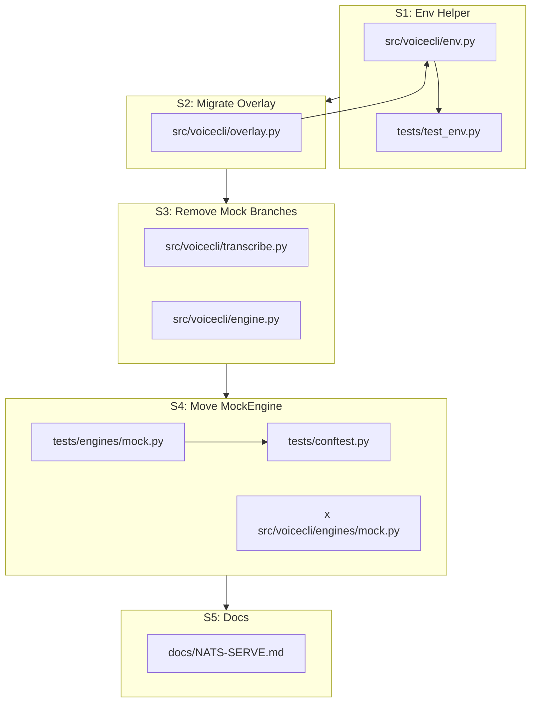
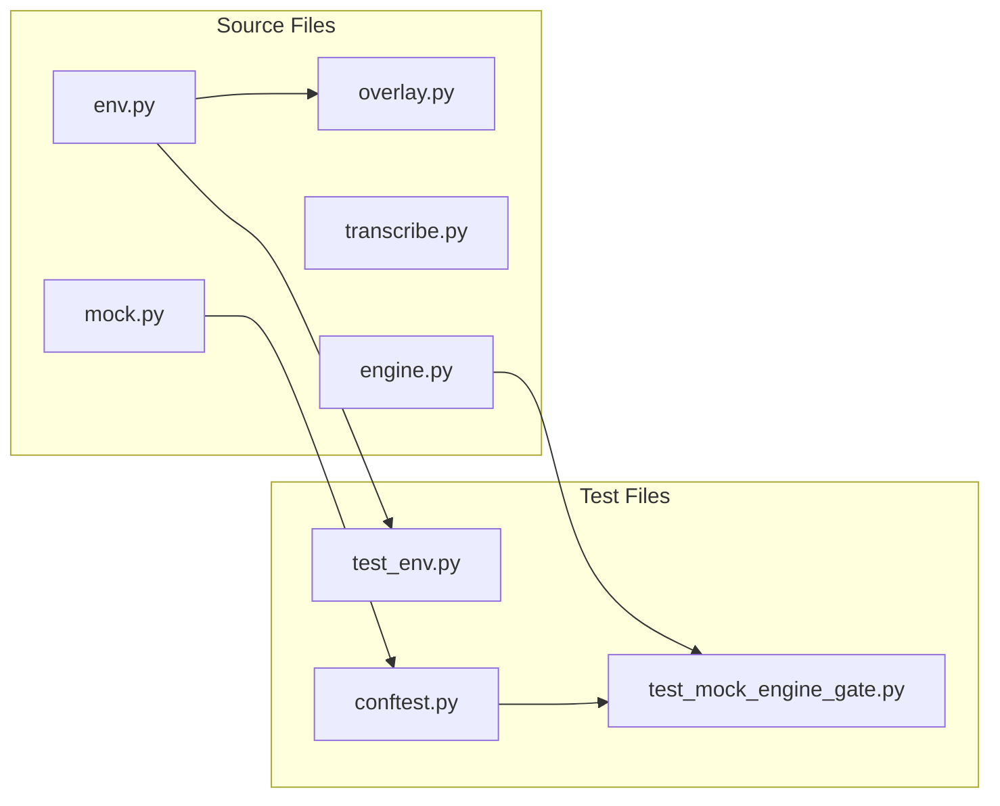

## Summary

Move MockEngine entirely into test scope and centralize boolean env-var parsing. Five atomic slices: (1) env helper, (2) migrate overlay check, (3) remove production mock branches, (4) move MockEngine + fixture, (5) docs.

## Architecture

## Bootstrap Context

- Existing `MockEngine` at `src/voicecli/engines/mock.py` is self-contained (no external deps beyond struct)
- Engine registry in `engine.py:_get_registry()` uses lazy imports per-engine
- Transcribe has two mock branches: line 128 (short-circuit) and line 232 (_load_model guard)
- Overlay uses `VOICECLI_OVERLAY_TEST` at line 424
- No existing `tests/conftest.py` — will create

## Agents

| Agent | Tasks | Files |
|-------|-------|-------|
| backend-dev | 4 | env.py, overlay.py, engine.py, transcribe.py |
| tester | 5 | test_env.py, mock.py, conftest.py, test_mock_engine_gate.py |
| doc-writer | 1 | NATS-SERVE.md |

## Consistency Report

| Aspect | Covered | Total | Status |
|--------|---------|-------|--------|
| Success Criteria | 11 | 11 | ✓ Complete |
| Slices | 5 | 5 | ✓ Complete |
| Files | 9 | 9 | ✓ Complete |
| Uncovered | 0 | — | — |
| Untraced | 0 | — | — |

## Micro-Tasks

### Slice V1: `coerce_bool_env()` helper

| # | Phase | Description | File | Agent | Time | [P] | Diff | Verify | Expected |
|---|-------|-------------|------|-------|------|-----|------|--------|----------|
| T1 | RED | Create `src/voicecli/env.py` with `coerce_bool_env()` stub | `src/voicecli/env.py` | backend-dev | 3m | Y | 2 | `grep -q "def coerce_bool_env" src/voicecli/env.py` | exit 0 |
| T2 | RED | Create `tests/test_env.py` with failing tests for true/false/unset cases | `tests/test_env.py` | tester | 5m | Y | 3 | `uv run pytest tests/test_env.py -v 2>&1 \| grep -c FAILED` | ≥3 |
| T3 | GREEN | Implement `coerce_bool_env()` to pass tests | `src/voicecli/env.py` | backend-dev | 3m | N | 2 | `uv run pytest tests/test_env.py -v` | 0 failed |
| T4 | REFACTOR | Add `TRUE_VALUES` frozen constant, docstring polish | `src/voicecli/env.py` | backend-dev | 2m | N | 1 | `grep -q "TRUE_VALUES.*frozenset" src/voicecli/env.py` | exit 0 |
| T5 | RED-GATE | Verify all tests pass, no regressions | — | tester | 2m | N | 1 | `uv run pytest tests/test_env.py` | 0 failed |

**Dependencies:** T2 → T3 → T4 → T5

### Slice V2: Migrate `VOICECLI_OVERLAY_TEST`

| # | Phase | Description | File | Agent | Time | [P] | Diff | Verify | Expected |
|---|-------|-------------|------|-------|------|-----|------|--------|----------|
| T6 | RED | Add failing test for overlay using `coerce_bool_env` | `tests/test_overlay.py` | tester | 3m | Y | 2 | `uv run pytest tests/test_overlay.py -k overlay_env -v 2>&1 \| grep -c FAILED` | ≥1 |
| T7 | GREEN | Replace `os.environ.get(...) == "1"` with `coerce_bool_env()` at line 424 | `src/voicecli/overlay.py` | backend-dev | 2m | N | 2 | `grep -q "from voicecli.env import coerce_bool_env" src/voicecli/overlay.py` | exit 0 |
| T8 | RED-GATE | Verify overlay tests pass | — | tester | 2m | N | 1 | `uv run pytest tests/test_overlay.py` | 0 failed |

**Dependencies:** T1 → T6 → T7 → T8

### Slice V3: Remove production mock branches

| # | Phase | Description | File | Agent | Time | [P] | Diff | Verify | Expected |
|---|-------|-------------|------|-------|------|-----|------|--------|----------|
| T9 | RED | Add failing test: `available_engines()` never returns "mock" without fixture | `tests/test_mock_engine_gate.py` | tester | 3m | Y | 2 | `uv run pytest tests/test_mock_engine_gate.py::test_env_unset_from_start -v` | pass |
| T10 | GREEN | Delete mock branch from `_get_registry()` (lines 117–120) | `src/voicecli/engine.py` | backend-dev | 2m | N | 2 | `grep -c "VOICECLI_ENABLE_MOCK_ENGINE" src/voicecli/engine.py` | 0 |
| T11 | GREEN | Delete mock branch from `transcribe()` (line 128) | `src/voicecli/transcribe.py` | backend-dev | 2m | Y | 2 | `grep -c "mock.*VOICECLI_ENABLE_MOCK_ENGINE" src/voicecli/transcribe.py` | 1 |
| T12 | GREEN | Delete mock branch from `_load_model()` (line 232) | `src/voicecli/transcribe.py` | backend-dev | 2m | N | 2 | `grep -c "VOICECLI_ENABLE_MOCK_ENGINE" src/voicecli/transcribe.py` | 0 |
| T13 | RED-GATE | Verify mock never appears in prod registry | — | tester | 2m | N | 1 | `uv run pytest tests/test_mock_engine_gate.py -k "env_unset"` | 0 failed |

**Dependencies:** T9 → T10 → T11 → T12 → T13

### Slice V4: Move MockEngine + create fixture (atomic)

| # | Phase | Description | File | Agent | Time | [P] | Diff | Verify | Expected |
|---|-------|-------------|------|-------|------|-----|------|--------|----------|
| T14 | RED | Create `tests/engines/` dir, copy `mock.py` with updated import path | `tests/engines/mock.py` | tester | 3m | Y | 3 | `test -f tests/engines/mock.py` | exit 0 |
| T15 | GREEN | Create `tests/conftest.py` with `mock_engine` fixture | `tests/conftest.py` | tester | 5m | N | 3 | `grep -q "def mock_engine" tests/conftest.py` | exit 0 |
| T16 | GREEN | Update `tests/test_mock_engine_gate.py` to use fixture instead of env var | `tests/test_mock_engine_gate.py` | tester | 4m | N | 3 | `grep -q "mock_engine" tests/test_mock_engine_gate.py` | exit 0 |
| T17 | GREEN | Delete `src/voicecli/engines/mock.py` | `src/voicecli/engines/mock.py` | backend-dev | 1m | N | 1 | `test ! -f src/voicecli/engines/mock.py` | exit 0 |
| T18 | RED-GATE | Verify all mock gate tests pass with fixture | — | tester | 3m | N | 1 | `uv run pytest tests/test_mock_engine_gate.py` | 0 failed |

**Dependencies:** T14 → T15 → T16 → T17 → T18

### Slice V5: Update E2E compose docs

| # | Phase | Description | File | Agent | Time | [P] | Diff | Verify | Expected |
|---|-------|-------------|------|-------|------|-----|------|--------|----------|
| T19 | GREEN | Add "CI Hygiene for Mock Engine" section to `docs/NATS-SERVE.md` | `docs/NATS-SERVE.md` | doc-writer | 4m | Y | 2 | `grep -q "CI Hygiene" docs/NATS-SERVE.md` | exit 0 |
| T20 | RED-GATE | Full test suite passes | — | tester | 3m | N | 1 | `uv run pytest tests/` | 0 failed |

**Dependencies:** T18 → T19 → T20

## Task IDs

<!-- Generated by /plan. Used by /implement to resume tasks on session restart. -->
- T1: 10 — Create env.py with coerce_bool_env stub
- T2: 11 — Create failing tests for coerce_bool_env
- T3: 12 — Implement coerce_bool_env
- T4: 13 — Refactor env.py with TRUE_VALUES constant
- T5: 14 — Verify env tests pass
- T6: 15 — Add failing overlay env test
- T7: 16 — Migrate overlay to coerce_bool_env
- T8: 17 — Verify overlay tests pass
- T9: 18 — Add failing test for mock-free registry
- T10: 19 — Remove mock branch from engine.py
- T11: 20 — Remove mock branch from transcribe()
- T12: 21 — Remove mock branch from _load_model()
- T13: 22 — Verify mock never in prod registry
- T14: 23 — Create tests/engines/mock.py
- T15: 24 — Create mock_engine fixture
- T16: 25 — Update test_mock_engine_gate.py
- T17: 26 — Delete src/voicecli/engines/mock.py
- T18: 27 — Verify mock gate tests pass
- T19: 28 — Add CI Hygiene docs
- T20: 29 — Run full test suite
