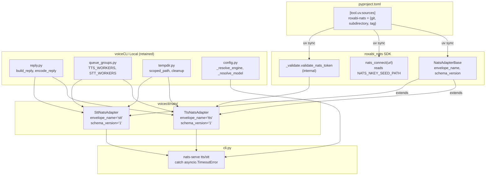
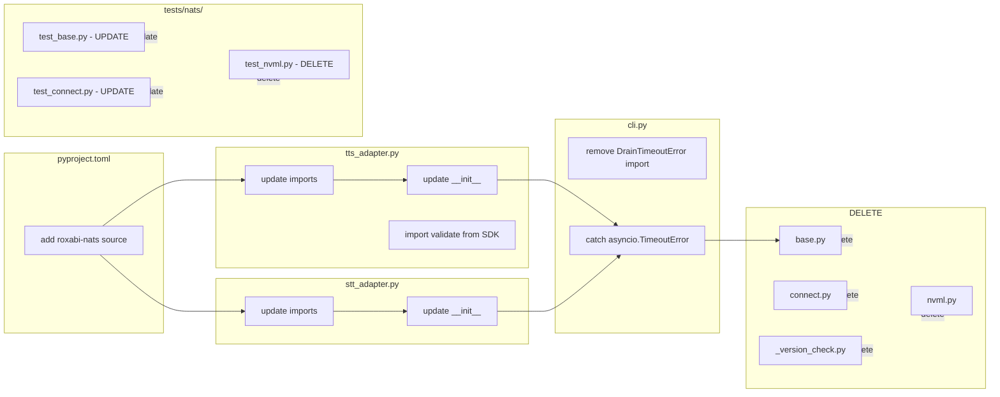

## Summary

Migrate voiceCLI's NATS primitives to `roxabi-nats` SDK v0.1.0. The SDK has an incompatible constructor signature requiring adapter refactoring. Delete local port files, update CLI error handling, and retain voiceCLI-specific helpers.

## Architecture

### Data Flow (Post-Migration)

### File × Function Map

## Bootstrap Context

- **SDK Source:** `https://github.com/Roxabi/lyra.git`, subdirectory `packages/roxabi-nats`, tag `roxabi-nats/v0.1.0`
- **SDK Public API:** `NatsAdapterBase`, `nats_connect`, `CONTRACT_VERSION` (from `__all__`)
- **SDK Constructor:** `(subject, queue_group, envelope_name, schema_version, timeout=30.0, drain_timeout=30.0, *, heartbeat_subject, heartbeat_interval=5.0)`
- **SDK Internal:** `_validate.validate_nats_token` — importable but may change pre-v1.0
- **Behavior Change:** SDK's `run()` waits for hub readiness (30s timeout); voiceCLI currently skips this

## Agents

| Agent | Tasks | Files |
|-------|-------|-------|
| backend-dev | 5 | tts_adapter.py, stt_adapter.py, cli.py, pyproject.toml, __init__.py |
| tester | 3 | test_base.py, test_connect.py, test_nvml.py |

## Consistency Report

- **Covered:** 17/17 success criteria
- **Uncovered:** 0
- **Untraced:** 0
- **Exemptions:** None

## Micro-Tasks

### Slice S1: Dependency

| # | Description | File | Code Snippet | Verify | Expected | Time | Agent | Trace | Phase |
|---|-------------|------|--------------|--------|----------|------|-------|-------|-------|
| 1 | Add roxabi-nats git source to pyproject.toml | `pyproject.toml` | `[tool.uv.sources]\nroxabi-nats = { git = "https://github.com/Roxabi/lyra.git", subdirectory = "packages/roxabi-nats", tag = "roxabi-nats/v0.1.0" }` | `uv sync && python -c "from roxabi_nats import NatsAdapterBase; print('OK')"` | `OK` | 3m | backend-dev | SC-1, U1 | RED |
| 2 | Add roxabi-nats to [project.optional-dependencies] nats | `pyproject.toml` | `[project.optional-dependencies]\nnats = ["roxabi-nats", "nats-py>=2.6,<3", "nkeys>=0.1"]` | `uv sync` | success | 2m | backend-dev | SC-1 | GREEN |

### Slice S2: TTS Constructor

| # | Description | File | Code Snippet | Verify | Expected | Time | Agent | Trace | Phase |
|---|-------------|------|--------------|--------|----------|------|-------|-------|-------|
| 3 | Update TtsNatsAdapter import | `tts_adapter.py` | `from roxabi_nats import NatsAdapterBase` | `python -c "from voicecli.nats.tts_adapter import TtsNatsAdapter"` | no import error | 2m | backend-dev | SC-4, N1 | RED |
| 4 | Update TtsNatsAdapter constructor | `tts_adapter.py` | `super().__init__(\n    subject=SUBJECT,\n    queue_group=TTS_WORKERS,\n    envelope_name="tts",\n    schema_version="1",\n    heartbeat_subject=HEARTBEAT_SUBJECT,\n    heartbeat_interval=heartbeat_interval,\n    drain_timeout=drain_timeout,\n)` | `python -c "from voicecli.nats.tts_adapter import TtsNatsAdapter; TtsNatsAdapter(default_engine='qwen-fast')"` | no error | 5m | backend-dev | SC-2, M1 | GREEN |
| 5 | Import validate_nats_token from SDK | `tts_adapter.py` | `from roxabi_nats._validate import validate_nats_token` | `python -c "from voicecli.nats.tts_adapter import validate_nats_token; print('OK')"` | `OK` | 2m | backend-dev | SC-6, N2 | GREEN |

### Slice S3: STT Constructor

| # | Description | File | Code Snippet | Verify | Expected | Time | Agent | Trace | Phase |
|---|-------------|------|--------------|--------|----------|------|-------|-------|-------|
| 6 | Update SttNatsAdapter import | `stt_adapter.py` | `from roxabi_nats import NatsAdapterBase` | `python -c "from voicecli.nats.stt_adapter import SttNatsAdapter"` | no import error | 2m | backend-dev | SC-5, N1 | RED |
| 7 | Update SttNatsAdapter constructor | `stt_adapter.py` | `super().__init__(\n    subject=SUBJECT,\n    queue_group=STT_WORKERS,\n    envelope_name="stt",\n    schema_version="1",\n    heartbeat_subject=HEARTBEAT_SUBJECT,\n    heartbeat_interval=heartbeat_interval,\n    drain_timeout=drain_timeout,\n)` | `python -c "from voicecli.nats.stt_adapter import SttNatsAdapter; SttNatsAdapter(default_model='large-v3')"` | no error | 5m | backend-dev | SC-3, M2 | GREEN |

### Slice S4: CLI Error Handling

| # | Description | File | Code Snippet | Verify | Expected | Time | Agent | Trace | Phase |
|---|-------------|------|--------------|--------|----------|------|-------|-------|-------|
| 8 | Remove DrainTimeoutError import in CLI | `cli.py` | `# remove: from voicecli.nats.base import DrainTimeoutError` | `grep -c "DrainTimeoutError" src/voicecli/cli.py` | `0` | 2m | backend-dev | SC-8, M3 | RED |
| 9 | Catch asyncio.TimeoutError instead | `cli.py` | `except asyncio.TimeoutError:\n    log.error("drain timeout exceeded")\n    raise typer.Exit(3)` | `grep -c "asyncio.TimeoutError" src/voicecli/cli.py` | `2` | 3m | backend-dev | SC-8, M3 | GREEN |

### Slice S5: Delete Port Files

| # | Description | File | Code Snippet | Verify | Expected | Time | Agent | Trace | Phase |
|---|-------------|------|--------------|--------|----------|------|-------|-------|-------|
| 10 | Delete base.py | `base.py` | `rm src/voicecli/nats/base.py` | `ls src/voicecli/nats/base.py 2>&1` | `No such file` | 1m | backend-dev | SC-9, D1 | GREEN |
| 11 | Delete connect.py | `connect.py` | `rm src/voicecli/nats/connect.py` | `ls src/voicecli/nats/connect.py 2>&1` | `No such file` | 1m | backend-dev | SC-9, D1 | GREEN |
| 12 | Delete _version_check.py | `_version_check.py` | `rm src/voicecli/nats/_version_check.py` | `ls src/voicecli/nats/_version_check.py 2>&1` | `No such file` | 1m | backend-dev | SC-9, D1 | GREEN |
| 13 | Delete nvml.py | `nvml.py` | `rm src/voicecli/nats/nvml.py` | `ls src/voicecli/nats/nvml.py 2>&1` | `No such file` | 1m | backend-dev | SC-9, D1 | GREEN |
| 14 | Update __init__.py exports | `__init__.py` | `"""voicecli NATS adapters."""\nfrom voicecli.nats.tts_adapter import TtsNatsAdapter\nfrom voicecli.nats.stt_adapter import SttNatsAdapter\n\n__all__ = ["TtsNatsAdapter", "SttNatsAdapter"]` | `python -c "from voicecli.nats import TtsNatsAdapter, SttNatsAdapter"` | no error | 2m | backend-dev | SC-10 | GREEN |

### Slice S6: Test Updates

| # | Description | File | Code Snippet | Verify | Expected | Time | Agent | Trace | Phase |
|---|-------------|------|--------------|--------|----------|------|-------|-------|-------|
| 15 | Delete test_nvml.py | `test_nvml.py` | `rm tests/nats/test_nvml.py` | `ls tests/nats/test_nvml.py 2>&1` | `No such file` | 1m | tester | — | GREEN |
| 16 | Update test_base.py constructor params | `test_base.py` | Update `_make_adapter` to use `envelope_name`, `schema_version` instead of `service`, `worker_id` | `uv run pytest tests/nats/test_base.py -v` | pass | 10m | tester | — | GREEN |
| 17 | Update test_connect.py for SDK behavior | `test_connect.py` | Remove or adjust tests for `_read_nkey_seed` (SDK reads from env var) | `uv run pytest tests/nats/test_connect.py -v` | pass | 15m | tester | — | GREEN |

### Slice S7: CI Verify

| # | Description | File | Code Snippet | Verify | Expected | Time | Agent | Trace | Phase |
|---|-------------|------|--------------|--------|----------|------|-------|-------|-------|
| 18 | Run pytest | — | — | `uv run pytest` | all pass | 5m | tester | SC-11, V1 | GREEN |
| 19 | Run ruff check | — | — | `uv run ruff check .` | no errors | 2m | tester | SC-12, V2 | GREEN |
| 20 | Run ruff format --check | — | — | `uv run ruff format --check .` | no changes | 2m | tester | SC-13, V3 | GREEN |
| 21 | Run pyright | — | — | `uv run pyright` | no errors | 5m | tester | SC-14, V4 | GREEN |

### Slice S8: e2e Verify

| # | Description | File | Code Snippet | Verify | Expected | Time | Agent | Trace | Phase |
|---|-------------|------|--------------|--------|----------|------|-------|-------|-------|
| 22 | Run e2e docker-compose test | — | — | `uv run pytest tests/e2e/` | pass | 10m | tester | SC-15, V5 | GREEN |

### RED-GATE Sentinels

| Slice | Sentinel Task |
|-------|---------------|
| S2 | #3 (import) must pass before #4 (constructor) |
| S3 | #6 (import) must pass before #7 (constructor) |
| S4 | #8 (remove import) must pass before #9 (add new handler) |
| S5 | All #10-14 complete before S6 tests |
| S6 | All test updates complete before S7 CI |

## Task IDs

<!-- Generated by /plan. Used by /implement to resume tasks on session restart. -->
- T9: Add roxabi-nats git source to pyproject.toml
- T10: Add roxabi-nats to [project.optional-dependencies] nats
- T11: Update TtsNatsAdapter import
- T12: Update TtsNatsAdapter constructor
- T13: Import validate_nats_token from SDK
- T14: Update SttNatsAdapter import
- T15: Update SttNatsAdapter constructor
- T16: Remove DrainTimeoutError import in CLI
- T17: Catch asyncio.TimeoutError instead
- T18: Delete base.py
- T19: Delete connect.py
- T20: Delete _version_check.py
- T21: Delete nvml.py
- T22: Update __init__.py exports
- T23: Delete test_nvml.py
- T24: Update test_base.py constructor params
- T25: Update test_connect.py for SDK behavior
- T26: Run pytest
- T27: Run ruff check
- T28: Run ruff format --check
- T29: Run pyright
- T30: Run e2e docker-compose test
