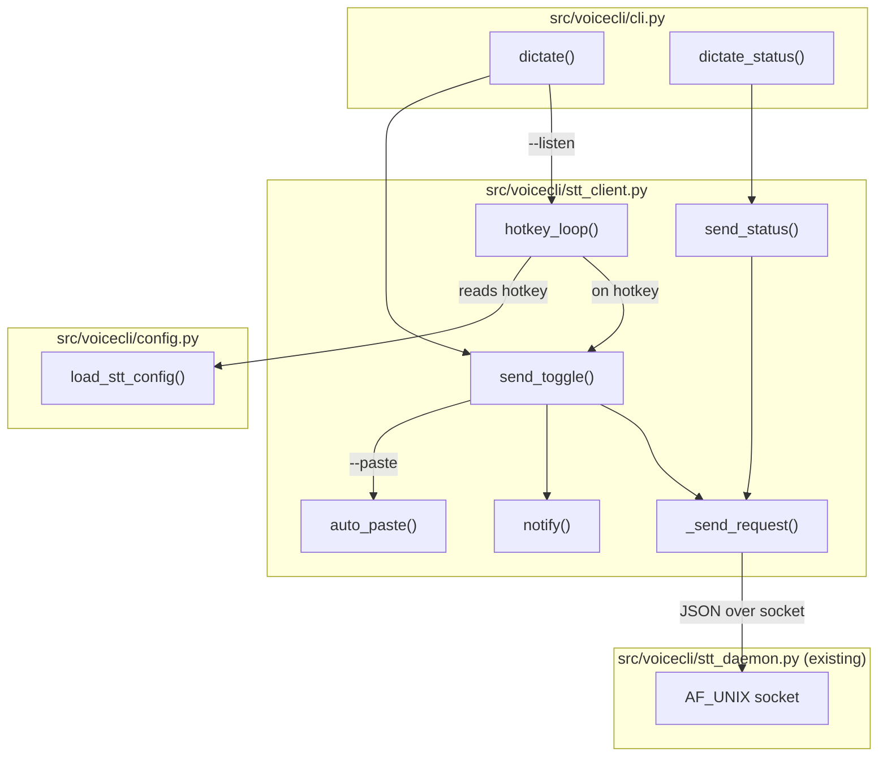
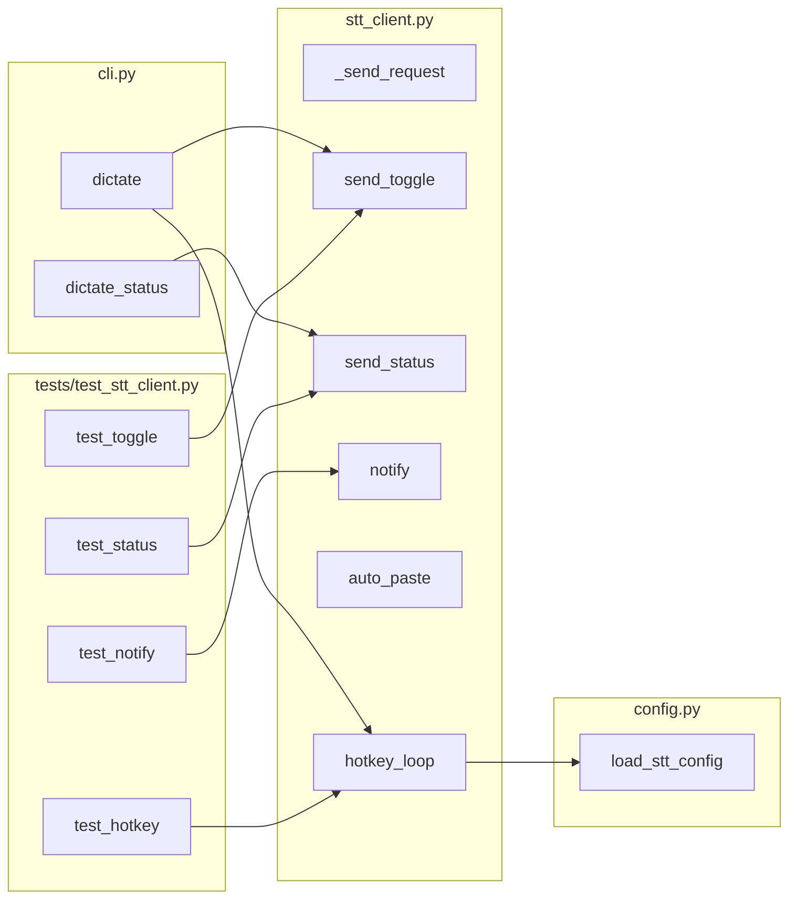

## Summary

Add `voicecli dictate` command group — a thin socket client that talks to the STT daemon (#6), with desktop notifications, optional auto-paste, and a pynput global hotkey listener. 3 slices, 13 success criteria, 3 agents.

## Architecture





## Agents

| Agent | Tasks | Files |
|-------|-------|-------|
| backend-dev | T1-T8 | `stt_client.py`, `cli.py`, `config.py`, `pyproject.toml` |
| tester | T9-T10 | `tests/test_stt_client.py` |
| doc-writer | T11 | `docs/dictation-setup.md` |

## Ref Patterns

- `daemon.py:daemon_request()` — existing TTS daemon client pattern (connect, send JSON, recv JSON, close). STT client follows same shape.
- `cli.py:samples_app` — existing sub-typer pattern for command groups. `dictate_app` follows same registration.
- `stt_daemon.py:_send_json/_recv_json` — wire protocol helpers to replicate in client.

## Consistency Report

13/13 success criteria covered. 0 uncovered. 0 untraced.

| SC | Criteria | Tasks |
|----|----------|-------|
| SC-1 | dictate connects + sends toggle | T1, T3 |
| SC-2 | Toggle response printed to stdout | T3 |
| SC-3 | Toggling during transcription prints queued | T3 |
| SC-4 | dictate status prints state | T4 |
| SC-5 | Exit code 0/1 | T1, T3 |
| SC-6 | notify-send called on events | T5 |
| SC-7 | Notifications use replace-id | T5 |
| SC-8 | Notifications degrade gracefully | T5 |
| SC-9 | --paste triggers xdotool | T6 |
| SC-10 | --listen starts pynput listener | T8 |
| SC-11 | Hotkey configurable via toml | T7 |
| SC-12 | --listen exits cleanly on Ctrl+C | T8 |
| SC-13 | docs/dictation-setup.md | T11 |

## Micro-Tasks

### Slice 1: Socket client + toggle

#### T1 — Wire protocol client `[P]`
- **Agent:** backend-dev
- **File:** `src/voicecli/stt_client.py` (new)
- **Spec trace:** SC-1, SC-5, N1→N2
- **Phase:** RED
- **Difficulty:** 2
- **Description:** Create `stt_client.py` with `_send_request(action, **kwargs)` that connects to `~/.local/share/voicecli/stt-daemon.sock`, sends newline-delimited JSON, receives response, returns dict. Follow `daemon.py:daemon_request()` pattern. Handle `ConnectionRefusedError` and `FileNotFoundError` → return `{"status": "error", "message": "STT daemon not running"}`.
- **Code snippet:**
```python
SOCKET_PATH = Path.home() / ".local" / "share" / "voicecli" / "stt-daemon.sock"

def _send_request(action: str, timeout: int = 10) -> dict:
    sock = socket.socket(socket.AF_UNIX, socket.SOCK_STREAM)
    sock.settimeout(timeout)
    try:
        sock.connect(str(SOCKET_PATH))
        payload = json.dumps({"action": action}) + "\n"
        sock.sendall(payload.encode())
        # recv until newline
        buf = bytearray()
        while b"\n" not in buf:
            chunk = sock.recv(4096)
            if not chunk:
                break
            buf.extend(chunk)
        return json.loads(buf.split(b"\n")[0])
    except (ConnectionRefusedError, FileNotFoundError, OSError):
        return {"status": "error", "message": "STT daemon not running"}
    finally:
        sock.close()
```
- **Verify:** `python -c "from voicecli.stt_client import _send_request; print('ok')"`
- **Expected output:** `ok`
- **Time:** 3 min

#### T2 — Public send_toggle() and send_status() `[P]`
- **Agent:** backend-dev
- **File:** `src/voicecli/stt_client.py`
- **Spec trace:** N1, N2
- **Phase:** GREEN
- **Difficulty:** 1
- **Description:** Add `send_toggle() -> dict` and `send_status() -> dict` thin wrappers around `_send_request`.
- **Code snippet:**
```python
def send_toggle() -> dict:
    return _send_request("toggle")

def send_status() -> dict:
    return _send_request("status")
```
- **Verify:** `python -c "from voicecli.stt_client import send_toggle, send_status; print('ok')"`
- **Expected output:** `ok`
- **Time:** 2 min

#### T3 — CLI dictate command (toggle)
- **Agent:** backend-dev
- **File:** `src/voicecli/cli.py`
- **Spec trace:** SC-1, SC-2, SC-3, SC-5, U1
- **Phase:** GREEN
- **Difficulty:** 3
- **Description:** Create `dictate_app = typer.Typer()` sub-app, register with `app.add_typer(dictate_app, name="dictate")`. Add default callback that calls `send_toggle()`, prints `response["state"]` or `response["text"]` based on state, raises `typer.Exit(code=1)` on error. Handle all 4 daemon states (idle→recording, recording→idle+text, transcribing→queued, queued→no-op).
- **Code snippet:**
```python
dictate_app = typer.Typer(help="Dictation client for STT daemon")
app.add_typer(dictate_app, name="dictate", invoke_without_command=True)

@dictate_app.callback(invoke_without_command=True)
def dictate(
    ctx: typer.Context,
    listen: bool = typer.Option(False, "--listen", help="..."),
    paste: bool = typer.Option(False, "--paste", help="..."),
):
    if ctx.invoked_subcommand is not None:
        return
    from voicecli.stt_client import send_toggle
    resp = send_toggle()
    if resp.get("status") == "error":
        print(resp.get("message", "unknown error"), file=sys.stderr)
        raise typer.Exit(code=1)
    state = resp.get("state", "")
    text = resp.get("text", "")
    if text:
        print(text)
    else:
        print(state)
```
- **Verify:** `uv run voicecli dictate --help`
- **Expected output:** Shows dictate help with --listen and --paste options
- **Time:** 5 min

#### T4 — CLI dictate status subcommand
- **Agent:** backend-dev
- **File:** `src/voicecli/cli.py`
- **Spec trace:** SC-4, U2
- **Phase:** GREEN
- **Difficulty:** 1
- **Description:** Add `@dictate_app.command("status")` that calls `send_status()` and prints `response["state"]`.
- **Code snippet:**
```python
@dictate_app.command("status")
def dictate_status():
    """Show current STT daemon state."""
    from voicecli.stt_client import send_status
    resp = send_status()
    if resp.get("status") == "error":
        print(resp.get("message"), file=sys.stderr)
        raise typer.Exit(code=1)
    print(resp.get("state", "unknown"))
```
- **Verify:** `uv run voicecli dictate status --help`
- **Expected output:** Shows status help
- **Time:** 2 min

---
**RED-GATE: Slice 1** — Verify `voicecli dictate --help` and `voicecli dictate status --help` work. Socket client importable.

---

### Slice 2: Notifications + auto-paste

#### T5 — notify() helper
- **Agent:** backend-dev
- **File:** `src/voicecli/stt_client.py`
- **Spec trace:** SC-6, SC-7, SC-8, N3
- **Phase:** RED
- **Difficulty:** 2
- **Description:** Add `notify(title: str, body: str, timeout: int = 3000)` that calls `notify-send -r voicecli-dictate "{title}" "{body}" -t {timeout}` via `subprocess.run`. Use `shutil.which("notify-send")` to check availability — skip silently if missing. Catch all exceptions silently.
- **Code snippet:**
```python
def notify(body: str, timeout: int = 3000) -> None:
    import shutil, subprocess
    if not shutil.which("notify-send"):
        return
    try:
        subprocess.run(
            ["notify-send", "-r", "voicecli-dictate", "VoiceCLI", body, "-t", str(timeout)],
            check=False, capture_output=True,
        )
    except Exception:
        pass
```
- **Verify:** `python -c "from voicecli.stt_client import notify; notify('test', 3000); print('ok')"`
- **Expected output:** `ok`
- **Time:** 3 min

#### T5b — Wire notifications into toggle flow
- **Agent:** backend-dev
- **File:** `src/voicecli/cli.py`
- **Spec trace:** SC-6, SC-7
- **Phase:** GREEN
- **Difficulty:** 2
- **Description:** After `send_toggle()` in the `dictate` callback, call `notify()` based on response state: `recording` → `notify("Recording...", 0)`, `idle` + text → `notify(f"[{lang}]: {text[:50]}...", 3000)`, `queued` → `notify("Queued...", 3000)`, error → `notify("STT daemon not running", 3000)`.
- **Time:** 3 min

#### T6 — auto_paste() helper
- **Agent:** backend-dev
- **File:** `src/voicecli/stt_client.py`
- **Spec trace:** SC-9, N4
- **Phase:** RED
- **Difficulty:** 2
- **Description:** Add `auto_paste(text: str)` that checks `shutil.which("xdotool")`, sleeps 150ms for focus, then runs `xdotool type --clearmodifiers -- "{text}"`. Skip silently if xdotool missing or any error.
- **Code snippet:**
```python
def auto_paste(text: str) -> None:
    import shutil, subprocess, time
    if not shutil.which("xdotool"):
        return
    try:
        time.sleep(0.15)
        subprocess.run(
            ["xdotool", "type", "--clearmodifiers", "--", text],
            check=False, capture_output=True,
        )
    except Exception:
        pass
```
- **Verify:** `python -c "from voicecli.stt_client import auto_paste; print('ok')"`
- **Expected output:** `ok`
- **Time:** 2 min

#### T6b — Wire --paste into toggle flow
- **Agent:** backend-dev
- **File:** `src/voicecli/cli.py`
- **Spec trace:** SC-9, U4
- **Phase:** GREEN
- **Difficulty:** 1
- **Description:** In `dictate` callback, after printing transcription text, if `paste=True` and text exists, call `auto_paste(text)`.
- **Time:** 2 min

---
**RED-GATE: Slice 2** — Verify toggle with daemon produces notification. `--paste` importable.

---

### Slice 3: Hotkey listener

#### T7 — Config: load_stt_config()
- **Agent:** backend-dev
- **File:** `src/voicecli/config.py`
- **Spec trace:** SC-11, S1
- **Phase:** RED
- **Difficulty:** 2
- **Description:** Add `load_stt_config() -> dict` that reads `[stt]` table from `voicecli.toml`. Returns `{"hotkey": "alt+space"}` (default). Known keys: `hotkey` (str).
- **Code snippet:**
```python
_KNOWN_STT: dict[str, object] = {
    "hotkey": str,
}

def load_stt_config(config: "Path | None" = None) -> dict:
    path = config if config is not None else _find_config()
    if path is None:
        return {"hotkey": "alt+space"}
    with open(path, "rb") as f:
        data = tomllib.load(f)
    raw = data.get("stt", {})
    result: dict[str, object] = {"hotkey": "alt+space"}
    for key, expected_type in _KNOWN_STT.items():
        if key in raw:
            try:
                result[key] = expected_type(raw[key])
            except (ValueError, TypeError):
                pass
    return result
```
- **Verify:** `python -c "from voicecli.config import load_stt_config; print(load_stt_config())"`
- **Expected output:** `{'hotkey': 'alt+space'}`
- **Time:** 3 min

#### T7b — Add pynput optional dependency
- **Agent:** backend-dev
- **File:** `pyproject.toml`
- **Spec trace:** SC-10
- **Phase:** GREEN
- **Difficulty:** 1
- **Description:** Add `pynput` as optional dependency under `[project.optional-dependencies]` group `hotkey` (or inline if no groups exist). Also add to dev deps if needed.
- **Time:** 2 min

#### T8 — hotkey_loop()
- **Agent:** backend-dev
- **File:** `src/voicecli/stt_client.py`
- **Spec trace:** SC-10, SC-12, N5
- **Phase:** RED
- **Difficulty:** 3
- **Description:** Add `hotkey_loop(hotkey: str, paste: bool)` that uses `pynput.keyboard.GlobalHotKeys` to listen for the configured hotkey. 300ms debounce via `time.monotonic()`. On hotkey: call `send_toggle()` + `notify()` + optional `auto_paste()`. Block until Ctrl+C (KeyboardInterrupt). Print "Listening for {hotkey}... (Ctrl+C to stop)" on start.
- **Code snippet:**
```python
def hotkey_loop(hotkey: str = "alt+space", paste: bool = False) -> None:
    from pynput import keyboard
    import time

    last_trigger = 0.0
    DEBOUNCE = 0.3

    def on_hotkey():
        nonlocal last_trigger
        now = time.monotonic()
        if now - last_trigger < DEBOUNCE:
            return
        last_trigger = now
        resp = send_toggle()
        # handle response same as single-shot...

    hotkey_str = f"<{hotkey.replace('+', '>+<')}>"  # pynput format
    with keyboard.GlobalHotKeys({hotkey_str: on_hotkey}) as listener:
        print(f"Listening for {hotkey}... (Ctrl+C to stop)", flush=True)
        listener.join()
```
- **Verify:** `python -c "from voicecli.stt_client import hotkey_loop; print('ok')"`
- **Expected output:** `ok`
- **Time:** 5 min

#### T8b — Wire --listen into CLI
- **Agent:** backend-dev
- **File:** `src/voicecli/cli.py`
- **Spec trace:** SC-10, SC-12, U3
- **Phase:** GREEN
- **Difficulty:** 2
- **Description:** In `dictate` callback, if `listen=True`: load `stt_config = load_stt_config()`, call `hotkey_loop(stt_config["hotkey"], paste)`. This replaces the single-shot toggle flow.
- **Time:** 2 min

---
**RED-GATE: Slice 3** — Verify `voicecli dictate --listen --help` shows options. Config loads hotkey default.

---

### Cross-cutting

#### T9 — Unit tests for stt_client `[P]`
- **Agent:** tester
- **File:** `tests/test_stt_client.py` (new)
- **Spec trace:** SC-1 through SC-12
- **Phase:** GREEN
- **Difficulty:** 3
- **Description:** Test `_send_request` with mocked socket (patch `socket.socket`), test `send_toggle`/`send_status` delegation, test `notify` with `shutil.which` returning None (silent skip), test `auto_paste` with xdotool missing, test `hotkey_loop` starts and responds to keyboard interrupt. Mock `subprocess.run` for notify/paste tests.
- **Verify:** `uv run pytest tests/test_stt_client.py -v`
- **Expected output:** All tests pass
- **Time:** 8 min

#### T10 — Unit tests for config load_stt_config
- **Agent:** tester
- **File:** `tests/test_stt_client.py`
- **Spec trace:** SC-11
- **Phase:** GREEN
- **Difficulty:** 1
- **Description:** Test `load_stt_config()` returns default hotkey when no config, and reads `[stt]` table when present (use tmp_path with toml file).
- **Verify:** `uv run pytest tests/test_stt_client.py -v -k stt_config`
- **Expected output:** Tests pass
- **Time:** 3 min

#### T11 — Documentation `[P]`
- **Agent:** doc-writer
- **File:** `docs/dictation-setup.md` (new)
- **Spec trace:** SC-13
- **Phase:** GREEN
- **Difficulty:** 2
- **Description:** Write setup guide covering: (1) Recommended: Windows keyboard shortcut → `wsl voicecli dictate`, (2) Alternative: `voicecli dictate --listen` with pynput, (3) KDE Custom Shortcuts setup, (4) GNOME Keyboard Shortcuts setup, (5) voicecli.toml `[stt]` config, (6) Troubleshooting (daemon not running, no notifications).
- **Verify:** `test -f docs/dictation-setup.md && echo ok`
- **Expected output:** `ok`
- **Time:** 5 min
