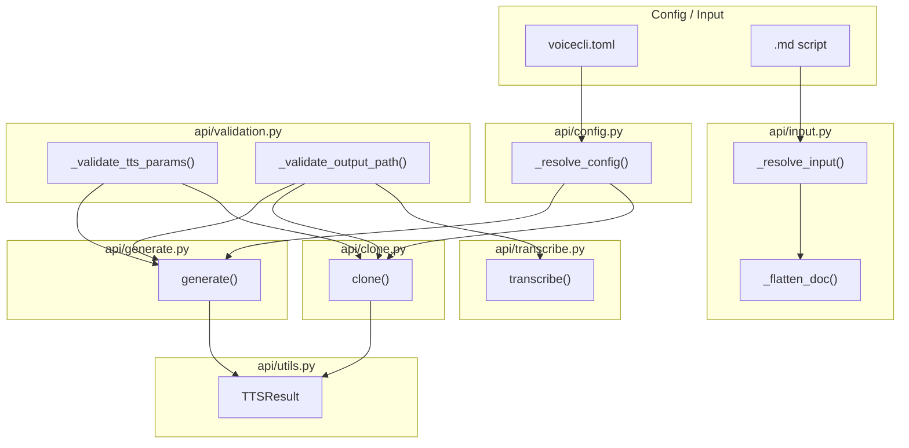
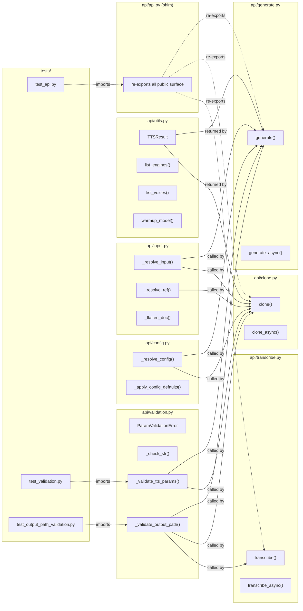

## Summary

Extract 850-line `src/voicecli/api/api.py` into 7 focused api-layer modules (validation, config, input, utils, generate, clone, transcribe), leaving a thin re-export shim. Update test imports and file-length exemptions. Pure refactor — zero public API changes.

## Architecture

### Data Flow

### File × Function Map

## Agents

| Agent | Task count | Files |
|-------|-----------|-------|
| backend-dev-A | 2 | `api/validation.py`, `api/utils.py` |
| backend-dev-B | 2 | `api/config.py`, `api/input.py` |
| backend-dev-C | 3 | `api/generate.py`, `api/clone.py`, `api/transcribe.py` |
| backend-dev-D | 2 | `api/api.py`, `api/__init__.py` |
| tester-A | 3 | `tests/test_validation.py`, `tests/test_output_path_validation.py`, gates |

## Wave Structure

4 waves, max 2 parallel agents. Elapsed ~1 day vs ~2 days sequential.

| Wave | Trigger | Agents | Tasks |
|------|---------|--------|-------|
| 1 | start | 2 ∥ | backend-dev-A: T1+T2 · backend-dev-B: T3+T4 |
| 2 | Wave 1 done | 1 | backend-dev-C: T5+T6+T7 |
| 3 | Wave 2 done | 1 | backend-dev-D: T8+T9 |
| 4 | Wave 3 done | 1 | tester-A: T10+T11+T12 |

### Budget — per task

| Task | Items | Class | Est. ops | Split? |
|------|-------|-------|----------|--------|
| T1: Extract validation | ~15 symbols | judgmental | 6 | — |
| T2: Extract utils | ~4 symbols + dataclass | bounded | 3 | — |
| T3: Extract config | ~3 functions | bounded | 3 | — |
| T4: Extract input | ~3 functions | bounded | 3 | — |
| T5: Extract generate | 1 function + async | judgmental | 6 | — |
| T6: Extract clone | 1 function + async | judgmental | 6 | — |
| T7: Extract transcribe | 1 function + async | bounded | 3 | — |
| T8: Thin shim | re-exports only | trivial | 2 | — |
| T9: __init__ cleanup | import update | trivial | 2 | — |
| T10: Update test imports | 2 files | bounded | 3 | — |
| T11: Smoke test | 1 command | trivial | 1 | — |
| T12: Run gates | ruff + pyright + pytest | bounded | 4 | — |

**Total estimated ops: 42**

### Budget — per agent instance

| Instance | Tasks | Σ ops | Subjects | Split? |
|----------|-------|-------|----------|--------|
| backend-dev-A | T1, T2 | 9 | validation, types | — |
| backend-dev-B | T3, T4 | 6 | config, input | — |
| backend-dev-C | T5, T6, T7 | 15 | generate, clone, transcribe | — |
| backend-dev-D | T8, T9 | 4 | shim | — |
| tester-A | T10, T11, T12 | 8 | tests | — |

## Consistency Report

- Criteria covered: 13/13
- Uncovered criteria: none
- Tasks without spec backing: none
- Gold plating exemptions applied: 0

## Micro-Tasks

### Slice V1: Extract shared helpers

#### Task 1: Extract validation.py from api.py [P] → backend-dev-A
- **File:** `src/voicecli/api/validation.py` (new)
- **Snippet:** Move `ParamValidationError`, `_check_str`, `_check_float`, `_check_int`, `_validate_tts_params`, `_validate_output_path` from `api/api.py`.
- **Verify:** `python -c "from voicecli.api.validation import ParamValidationError, _validate_tts_params, _validate_output_path; print('ok')"` (ready)
- **Expected:** `ok`
- **Time:** 5 min
- **Difficulty:** 2
- **Traces:** SC-1, SC-2, SC-5
- **Phase:** REFACTOR

#### Task 2: Extract utils.py from api.py [P] → backend-dev-A
- **File:** `src/voicecli/api/utils.py` (new)
- **Snippet:** Move `TTSResult`, `list_engines`, `list_voices`, `warmup_model` from `api/api.py`.
- **Verify:** `python -c "from voicecli.api.utils import TTSResult, list_engines, list_voices, warmup_model; print('ok')"` (ready)
- **Expected:** `ok`
- **Time:** 3 min
- **Difficulty:** 1
- **Traces:** SC-1, SC-2, SC-5
- **Phase:** REFACTOR

#### Task 3: Extract config.py from api.py [P] → backend-dev-B
- **File:** `src/voicecli/api/config.py` (new)
- **Snippet:** Move `_resolve_config`, `_apply_config_defaults` from `api/api.py`.
- **Verify:** `python -c "from voicecli.api.config import _resolve_config, _apply_config_defaults; print('ok')"` (ready)
- **Expected:** `ok`
- **Time:** 3 min
- **Difficulty:** 1
- **Traces:** SC-1, SC-2
- **Phase:** REFACTOR

#### Task 4: Extract input.py from api.py [P] → backend-dev-B
- **File:** `src/voicecli/api/input.py` (new)
- **Snippet:** Move `_resolve_input`, `_resolve_ref`, `_flatten_doc` from `api/api.py`.
- **Verify:** `python -c "from voicecli.api.input import _resolve_input, _resolve_ref, _flatten_doc; print('ok')"` (ready)
- **Expected:** `ok`
- **Time:** 3 min
- **Difficulty:** 1
- **Traces:** SC-1, SC-2
- **Phase:** REFACTOR

#### RED-GATE: V1 helpers extracted
- **Verify:** `python -c "from voicecli.api.validation import _validate_tts_params; from voicecli.api.utils import TTSResult; from voicecli.api.config import _resolve_config; from voicecli.api.input import _resolve_input; print('all ok')"`
- **Phase:** RED-GATE

### Slice V2: Extract TTS pipelines

#### Task 5: Extract generate.py from api.py → backend-dev-C
- **File:** `src/voicecli/api/generate.py` (new)
- **Snippet:** Move `generate`, `generate_async` from `api/api.py`. Update imports to pull from `validation`, `config`, `input`, `utils`.
- **Verify:** `python -c "from voicecli.api.generate import generate, generate_async; print('ok')"` (ready)
- **Expected:** `ok`
- **Time:** 5 min
- **Difficulty:** 2
- **Traces:** SC-1, SC-4, SC-6
- **Phase:** REFACTOR

#### Task 6: Extract clone.py from api.py → backend-dev-C
- **File:** `src/voicecli/api/clone.py` (new)
- **Snippet:** Move `clone`, `clone_async` from `api/api.py`. Update imports to pull from `validation`, `config`, `input`, `utils`.
- **Verify:** `python -c "from voicecli.api.clone import clone, clone_async; print('ok')"` (ready)
- **Expected:** `ok`
- **Time:** 5 min
- **Difficulty:** 2
- **Traces:** SC-1, SC-4, SC-6
- **Phase:** REFACTOR

#### Task 7: Extract transcribe.py from api.py → backend-dev-C
- **File:** `src/voicecli/api/transcribe.py` (new)
- **Snippet:** Move `transcribe`, `transcribe_async` from `api/api.py`. Update imports to pull from `validation`.
- **Verify:** `python -c "from voicecli.api.transcribe import transcribe, transcribe_async; print('ok')"` (ready)
- **Expected:** `ok`
- **Time:** 3 min
- **Difficulty:** 1
- **Traces:** SC-1, SC-4, SC-6
- **Phase:** REFACTOR

#### RED-GATE: V2 pipelines extracted
- **Verify:** `python -c "from voicecli.api.generate import generate; from voicecli.api.clone import clone; from voicecli.api.transcribe import transcribe; print('all ok')"`
- **Phase:** RED-GATE

### Slice V3: Extract transcribe pipeline

*(merged into V2 above — transcribe extracted alongside generate/clone)*

### Slice V4: Thin shim + __init__ cleanup

#### Task 8: Convert api.py to thin re-export shim → backend-dev-D
- **File:** `src/voicecli/api/api.py`
- **Snippet:** Replace all implementation with imports and re-exports from `validation`, `config`, `input`, `utils`, `generate`, `clone`, `transcribe`.
- **Verify:** `python -c "from voicecli.api.api import generate, clone, transcribe, TTSResult, ParamValidationError; print('ok')"` (ready)
- **Expected:** `ok`
- **Time:** 3 min
- **Difficulty:** 1
- **Traces:** SC-1, SC-6, SC-7
- **Phase:** REFACTOR

#### Task 9: Update api/__init__.py imports → backend-dev-D
- **File:** `src/voicecli/api/__init__.py`
- **Snippet:** Ensure `__init__.py` re-exports from `api.api` (the shim) remain valid. Add any missing re-exports if new modules expose public symbols.
- **Verify:** `python -c "from voicecli.api import generate, clone, transcribe, TTSResult, ParamValidationError; print('ok')"` (ready)
- **Expected:** `ok`
- **Time:** 2 min
- **Difficulty:** 1
- **Traces:** SC-4, SC-5
- **Phase:** REFACTOR

#### RED-GATE: V4 shim complete
- **Verify:** `python -c "from voicecli import generate, clone, transcribe; from voicecli.api.api import generate, clone, transcribe; print('all ok')"`
- **Phase:** RED-GATE

### Slice V5: Update exemptions + gates

#### Task 10: Update test imports for moved private helpers → tester-A
- **File:** `tests/test_validation.py`, `tests/test_output_path_validation.py`
- **Snippet:** Update `from voicecli.api.api import _validate_tts_params` → `from voicecli.api.validation import _validate_tts_params`. Update `from voicecli.api.api import _validate_output_path` → `from voicecli.api.validation import _validate_output_path`.
- **Verify:** `python -m pytest tests/test_validation.py tests/test_output_path_validation.py -q` (ready)
- **Expected:** All tests pass
- **Time:** 3 min
- **Difficulty:** 1
- **Traces:** SC-8, SC-9, SC-10
- **Phase:** GREEN

#### Task 11: Smoke test downstream import paths → tester-A
- **File:** n/a (inline command)
- **Snippet:** `python -c "from voicecli import generate, clone, transcribe; from voicecli.api.api import generate, clone, transcribe; from voicecli import TTSResult, ParamValidationError; print('smoke ok')"`
- **Verify:** Run command directly (ready)
- **Expected:** `smoke ok`
- **Time:** 1 min
- **Difficulty:** 1
- **Traces:** SC-7
- **Phase:** GREEN

#### Task 12: Run lint, typecheck, file-length gates → tester-A
- **File:** `tools/file_exemptions.txt`
- **Snippet:** Remove or update exemption row for `src/voicecli/api/api.py`. Run `ruff check .`, `pyright`, `pytest tests/test_api.py`.
- **Verify:** `bash -c "uv run ruff check . && uv run pyright && uv run pytest tests/test_api.py -q"` (ready)
- **Expected:** All pass
- **Time:** 5 min
- **Difficulty:** 2
- **Traces:** SC-11, SC-12, SC-13
- **Phase:** GREEN

## Task Seeding Blueprint

<!-- Used by /implement to seed TaskCreate calls on session start.
     Format: T{n} | agent-instance | blockedBy | subject
     blockedBy refs T-numbers within this list (not session task IDs).
     Agent instances are named so parallel tasks map to distinct spawned agents.
     Seed in wave order; within a wave all rows are parallel (∥). -->

### Wave 1 — no deps, 2 agents ∥

| Task | Agent instance | blockedBy | Subject |
|------|---------------|-----------|---------|
| T1 | backend-dev-A | — | validation |
| T2 | backend-dev-A | — | types |
| T3 | backend-dev-B | — | config |
| T4 | backend-dev-B | — | input |

### Wave 2 — after Wave 1, 1 agent

| Task | Agent instance | blockedBy | Subject |
|------|---------------|-----------|---------|
| T5 | backend-dev-C | T1,T2,T3,T4 | generate |
| T6 | backend-dev-C | T1,T2,T3,T4 | clone |
| T7 | backend-dev-C | T1,T2,T3,T4 | transcribe |

### Wave 3 — after Wave 2, 1 agent

| Task | Agent instance | blockedBy | Subject |
|------|---------------|-----------|---------|
| T8 | backend-dev-D | T5,T6,T7 | shim |
| T9 | backend-dev-D | T5,T6,T7 | exports |

### Wave 4 — after Wave 3, 1 agent

| Task | Agent instance | blockedBy | Subject |
|------|---------------|-----------|---------|
| T10 | tester-A | T8,T9 | test-fixes |
| T11 | tester-A | T8,T9 | smoke-test |
| T12 | tester-A | T8,T9 | gates |

## Task IDs

<!-- Generated by /plan. Used by /implement to resume tasks on session restart. -->
- T1: 10 — validation
- T2: 11 — types
- T3: 12 — config
- T4: 13 — input
- T5: 14 — generate
- T6: 15 — clone
- T7: 16 — transcribe
- T8: 17 — shim
- T9: 18 — exports
- T10: 19 — test-fixes
- T11: 20 — smoke-test
- T12: 21 — gates
