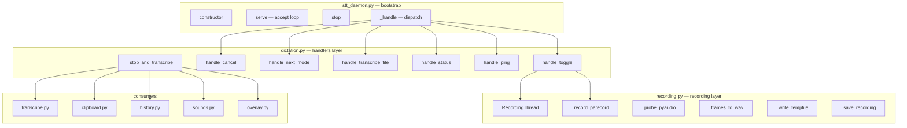
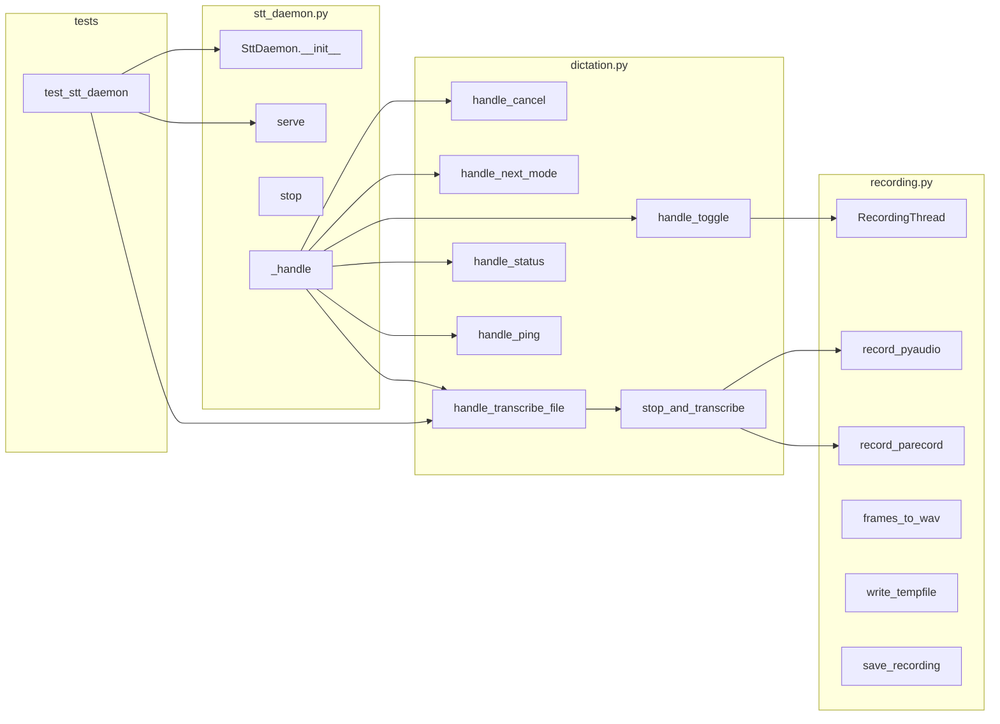

## Summary

Extract recording infrastructure and dictation handlers from `runtime/stt_daemon.py` into layer-named modules (`recording.py`, `dictation.py`), then thin the bootstrap to ≤ 300 LOC. Single-domain refactor with sequential dependency chain.

## Architecture

## Wave Structure

1 wave, 1 agent sequential. Elapsed ~1–2 hours vs ~3 hours sequential (negligible parallelization gain due to dependency chain).

| Wave | Trigger | Agents | Tasks |
|------|---------|--------|-------|
| 1 | start | backend-dev-A: T1→T2→T3→T4 | T1(recording) → T2(handlers) → T3(bootstrap) → T4(integration) |
| 2 | Wave 1 done | tester-A: T5→T6 | T5(RED-GATE) → T6(full suite) |

### Budget — per task

| Task | Items | Class | Est. ops | Split? |
|------|-------|-------|----------|--------|
| T1 Extract recording | 6 functions moved | bounded | 12 | — |
| T2 Extract handlers | 7 functions moved | bounded | 14 | — |
| T3 Thin bootstrap | 1 file trimmed | bounded | 4 | — |
| T4 Integration | 1 config + tests | bounded | 5 | — |
| T5 RED-GATE | 1 binary-compat check | trivial | 2 | — |
| T6 Full pytest | 1 suite run | bounded | 3 | — |

**Total estimated ops: 40**

### Budget — per agent instance

| Instance | Tasks | Σ ops | Subjects | Split? |
|----------|-------|-------|----------|--------|
| backend-dev-A | T1, T2, T3, T4 | 35 | recording, handlers, bootstrap, integration | — |
| tester-A | T5, T6 | 5 | verification | — |

## Micro-Tasks

### Slice V1 — Extract recording infrastructure

#### T1 — Extract recording infrastructure to `runtime/recording.py`

| Field | Value |
|---|---|
| Description | Move `_probe_pyaudio`, `_frames_to_wav`, `_write_tempfile`, `_save_recording`, `RecordingThread`, `_record_parecord` to `runtime/recording.py`. Update imports in `stt_daemon.py`. |
| File path | `src/voicecli/runtime/recording.py` (new), `src/voicecli/runtime/stt_daemon.py` |
| Code snippet | `from voicecli.runtime.recording import RecordingThread, record_parecord, probe_pyaudio` |
| Verify command | `python -c "from voicecli.runtime.recording import RecordingThread; print('ok')"` |
| Expected output | `ok` |
| Time estimate | 15 min |
| [P] marker | N |
| Agent | backend-dev-A |
| Agent instance | backend-dev-A |
| Subject | recording |
| Spec trace | SC-4 |
| Slice | V1 |
| Phase | REFACTOR |
| Difficulty | 3 |

### Slice V2 — Extract dictation handlers

#### T2 — Extract dictation handlers to `runtime/dictation.py`

| Field | Value |
|---|---|
| Description | Move all `_handle_*` methods plus `_stop_and_transcribe` to module-level functions in `runtime/dictation.py`. Functions take `daemon` as first parameter. Update `_handle()` dispatch in `stt_daemon.py` to call through. Preserve conn ownership transfer for `_stop_and_transcribe`. |
| File path | `src/voicecli/runtime/dictation.py` (new), `src/voicecli/runtime/stt_daemon.py` |
| Code snippet | `from voicecli.runtime.dictation import handle_toggle, handle_cancel, handle_transcribe_file` |
| Verify command | `python -c "from voicecli.runtime.dictation import handle_toggle; print('ok')"` |
| Expected output | `ok` |
| Time estimate | 20 min |
| [P] marker | N |
| Agent | backend-dev-A |
| Agent instance | backend-dev-A |
| Subject | handlers |
| Spec trace | SC-4 |
| Slice | V2 |
| Phase | REFACTOR |
| Difficulty | 4 |

### Slice V3 — Thin bootstrap

#### T3 — Thin `stt_daemon.py` to ≤ 300 LOC

| Field | Value |
|---|---|
| Description | Remove all code now in `recording.py` and `dictation.py`. Keep: `State` enum, `SttDaemon.__init__`, `serve()`, `stop()`, `_handle()` dispatch, state machine wiring. Verify line count ≤ 300. |
| File path | `src/voicecli/runtime/stt_daemon.py` |
| Code snippet | `class SttDaemon: ... def serve(self): ... def _handle(self, conn): ...` |
| Verify command | `wc -l src/voicecli/runtime/stt_daemon.py` |
| Expected output | ≤ 300 |
| Time estimate | 10 min |
| [P] marker | N |
| Agent | backend-dev-A |
| Agent instance | backend-dev-A |
| Subject | bootstrap |
| Spec trace | SC-1 |
| Slice | V3 |
| Phase | REFACTOR |
| Difficulty | 2 |

#### T5 — RED-GATE — Verify `voicecli stt-serve` binary-compatible

| Field | Value |
|---|---|
| Description | Start daemon, send ping + toggle + transcribe_file via socket. Confirm responses match pre-split behavior. |
| File path | `src/voicecli/runtime/stt_daemon.py` |
| Code snippet | `echo '{"action":"ping"}' | nc -U ~/.local/share/voicecli/stt-daemon.sock` |
| Verify command | `python -c "import socket; s=socket.socket(socket.AF_UNIX); s.connect('...'); s.send(b'{\"action\":\"ping\"}\\n'); print(s.recv(1024))"` |
| Expected output | `{"status": "ok"}` |
| Time estimate | 5 min |
| [P] marker | N |
| Agent | backend-dev-A |
| Agent instance | backend-dev-A |
| Subject | verification |
| Spec trace | SC-3 |
| Slice | V3 |
| Phase | RED-GATE |
| Difficulty | 2 |

### Slice V4 — Integration + cleanup

#### T4 — Update exemption + run tests

| Field | Value |
|---|---|
| Description | Remove/update `tools/file_exemptions.txt` row for `runtime/stt_daemon.py`. Preserve `warmup()` import path or update tests. Run pre-commit hooks. |
| File path | `tools/file_exemptions.txt`, tests |
| Code snippet | `uv run pytest tests/ -k stt` |
| Verify command | `uv run pytest tests/ -k stt --tb=short` |
| Expected output | `passed` |
| Time estimate | 10 min |
| [P] marker | N |
| Agent | backend-dev-A |
| Agent instance | backend-dev-A |
| Subject | integration |
| Spec trace | SC-5, SC-6, SC-7 |
| Slice | V4 |
| Phase | GREEN |
| Difficulty | 2 |

#### T6 — Full pytest suite

| Field | Value |
|---|---|
| Description | Run full test suite to catch cross-module regressions. |
| File path | tests/ |
| Code snippet | `uv run pytest` |
| Verify command | `uv run pytest --tb=short` |
| Expected output | `passed` |
| Time estimate | 5 min |
| [P] marker | N |
| Agent | tester-A |
| Agent instance | tester-A |
| Subject | verification |
| Spec trace | SC-5 |
| Slice | V4 |
| Phase | GREEN |
| Difficulty | 1 |

## Task Seeding Blueprint

### Wave 1 — no deps, 1 agent sequential

| Task | Agent instance | blockedBy | Subject |
|------|---------------|-----------|---------|
| T1 | backend-dev-A | — | recording |
| T2 | backend-dev-A | T1 | handlers |
| T3 | backend-dev-A | T1,T2 | bootstrap |
| T5 | backend-dev-A | T3 | verification |
| T4 | backend-dev-A | T3 | integration |

### Wave 2 — after Wave 1, 1 agent

| Task | Agent instance | blockedBy | Subject |
|------|---------------|-----------|---------|
| T6 | tester-A | T4 | verification |

## Task IDs

<!-- Generated by /plan. Used by /implement to resume tasks on session restart. -->
- T1: 10 — recording
- T2: 11 — handlers
- T3: 12 — bootstrap
- T4: 13 — integration
- T5: 14 — verification
- T6: 15 — verification
