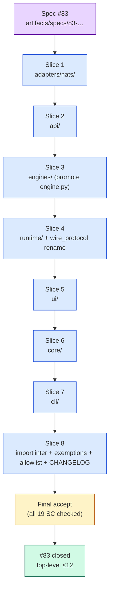
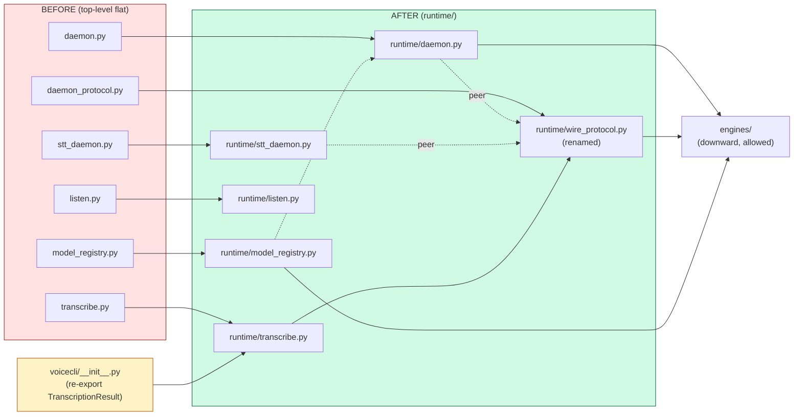

## Summary

Move 37 top-level modules in `src/voicecli/` into 5 new layer-named sub-packages (`cli/`, `api/`, `runtime/`, `ui/`, `core/`) and absorb `nats/` into existing `adapters/nats/`. Rename `daemon_protocol.py` → `runtime/wire_protocol.py` (ADR-003 debt #4). Strict test rewrite (no shims). 8 sequential slices, each independently green before the next starts; one final acceptance-verification wave.

## Architecture

### Data flow — slice progression



### File × Function map — slice 4 (runtime) example



## Bootstrap Context

From analysis (`artifacts/analyses/83-restructure-src-voicecli-analysis.mdx`):
- **Recommended shape:** B (9-package layout) — covered in spec.
- **Test consumer surface:** 11 `from voicecli.X import …` sites in `tests/` — strict rewrite.
- **CHANGELOG consumer:** `lyra` confirmed to use only public API.
- **Existing `.importlinter`:** every current `ignore_imports` row maps to "removed" or "no longer needed" (spec breadboard table).
- **Pre-existing modality-tagged files:** `stt_client.py`, `stt_daemon.py`, `stt_modes.py`, `nats_stt_client.py`, `nats_recorder.py` — kept by name, allowlisted; rename = follow-up issue.

From spec (`artifacts/specs/83-restructure-src-voicecli-spec.mdx`):
- **Public API frozen:** `generate`, `clone`, `transcribe`, `TTSDocument`, `Segment`, `TranscriptionResult`, `TTSResult`, `list_engines`, `list_voices`, `__version__`.
- **Console script:** `voicecli = "voicecli.cli:app"` — preserved via `voicecli/cli/__init__.py` re-exporting `app` from `voicecli/cli/main.py`.
- **Submodule attribute trick:** `voicecli.transcribe = <submodule>` must keep working (pin to `voicecli.runtime.transcribe`).

## Agents

| Agent | Instance | Tasks | Files touched | Subject |
|---|---|---|---|---|
| `backend-dev` | A | T1, T2 | `src/voicecli/nats/**`, `src/voicecli/adapters/**`, `src/voicecli/api/**`, `src/voicecli/{api,api_chunked,markdown,markdown_types,_markdown_directives,translate,engine_caps}.py`, `voicecli/__init__.py`, `tests/**` | adapters, api |
| `backend-dev` | B | T3, T4 | `src/voicecli/engines/**`, `src/voicecli/{engine,daemon,stt_daemon,daemon_protocol,model_registry,transcribe,listen}.py`, `src/voicecli/runtime/**`, `voicecli/__init__.py`, `tests/**` | engines, runtime |
| `backend-dev` | C | T5, T6 | `src/voicecli/{overlay*,clipboard,ui_sounds,stt_client,nats_recorder,tg}.py`, `src/voicecli/ui/**`, `src/voicecli/{config,paths,utils,env,models,samples,stt_modes,history}.py`, `src/voicecli/core/**`, `tests/**` | ui, core |
| `backend-dev` | D | T7 | `src/voicecli/{cli,cli_samples,cli_dictate,cli_doctor,cli_nats}.py`, `src/voicecli/cli/**` | cli |
| `devops` | A | T8 | `.importlinter`, `tools/file_exemptions.txt`, `tools/folder_exemptions.txt`, `docs/architecture/.axial-allowlist`, `CHANGELOG.md` (+ `gh issue create` for follow-up) | tooling |
| `tester` | A | T9 | (read-only) — runs all 19 acceptance criteria | accept |

Subject diversity per instance: max 2 (per `subject-surface cap`). ✓

## Wave Structure

9 waves, **mostly sequential** (each slice depends on the previous slice being green to avoid mid-refactor import breakage). Max parallelism = 1 (this is the inherent cost of a coordinated codebase restructure — running slices in parallel would race on shared `voicecli/__init__.py` re-exports and `.importlinter` state).

| Wave | Trigger | Agents | Tasks |
|------|---------|--------|-------|
| 1 | start | backend-dev-A | T1 (adapters/nats move) |
| 2 | Wave 1 done | backend-dev-A | T2 (api/ creation) |
| 3 | Wave 2 done | backend-dev-B | T3 (engines/ promotion) |
| 4 | Wave 3 done | backend-dev-B | T4 (runtime/ + wire_protocol rename) |
| 5 | Wave 4 done | backend-dev-C | T5 (ui/) |
| 6 | Wave 5 done | backend-dev-C | T6 (core/) |
| 7 | Wave 6 done | backend-dev-D | T7 (cli/) |
| 8 | Wave 7 done | devops-A | T8 (.importlinter + exemptions + allowlist + CHANGELOG + follow-up issue) |
| 9 | Wave 8 done | tester-A | T9 (final acceptance verification — all 19 SC) |

Total elapsed: ~2–3 days (sequential by design). A non-restructure feature this size could parallelize across 3–4 days of agent time; here parallelism is structurally bounded to 1.

### Budget — per task

Each slice-task is a coordinated multi-file move + import rewrite. Per spec, every slice independently green before next. Each task internally bundles ~8–20 file edits, ~1–3 verify commands.

| Task | Items moved/edited | Class | Est. ops | Split? |
|------|---|-------|----------|--------|
| T1 — adapters/nats | 12 files renamed (dir-level), ~15 import sites rewritten | bounded | 18 | — |
| T2 — api/ | 7 files moved, `__init__.py` re-exports, ~20 sites rewritten | judgmental | 32 | — |
| T3 — engines/ promote | 1 file moved, ~5 sites rewritten | trivial | 8 | — |
| T4 — runtime/ + rename | 6 files moved (1 renamed), ~15 sites rewritten | judgmental | 30 | — |
| T5 — ui/ | 8 files moved (1 renamed), ~12 sites rewritten | judgmental | 28 | — |
| T6 — core/ | 8 files moved, ~25 sites rewritten | judgmental | 38 | — |
| T7 — cli/ | 5 files moved + `__init__.py` re-export, console-script smoke | judgmental | 24 | — |
| T8 — tooling | `.importlinter` rewrite, 4 exemption rows removed, `.axial-allowlist` created, CHANGELOG entry, follow-up issue opened | bounded | 22 | — |
| T9 — final accept | 19 SC commands run | bounded | 22 | — |

**Total estimated ops: ~222** (sequential — no parallel speedup).

### Budget — per agent instance

| Instance | Tasks | Σ ops | Subjects | Split? |
|----------|-------|-------|----------|--------|
| backend-dev-A | T1, T2 | 50 | adapters, api | — |
| backend-dev-B | T3, T4 | 38 | engines, runtime | — |
| backend-dev-C | T5, T6 | 66 | ui, core | — (within 2-subject cap; close to ops cap but tasks=2) |
| backend-dev-D | T7 | 24 | cli | — |
| devops-A | T8 | 22 | tooling | — |
| tester-A | T9 | 22 | accept | — |

No split required: `|tasks/instance| ≤ 2` and subject diversity ≤ 2 everywhere.

## Consistency Report

| Metric | Value |
|---|---|
| Spec success criteria (SC) | 19 |
| Plan tasks (T) | 9 (1 per slice + 1 final accept) |
| SC traced to ≥1 task | 19/19 (T9 verifies all SC; T1–T8 each verify their slice's subset) |
| Tasks with no SC trace | 0 |
| Spec slices | 8 |
| Plan slices | 8 (1:1 mapping) |
| Spec affordances (A1–A9) | 9 |
| Affordances trace to ≥1 slice | 9/9 (A1→T7, A2→T2, A3→T2, A4→T4, A5→T3, A6→T6, A7→T7, A8→T8, A9→T8) |
| Open `[NEEDS CLARIFICATION]` in spec | 0 |
| Tasks > 50 ops (per-task cap) | 0 |
| Instances > 4 tasks or > 2 subjects (per-instance cap) | 0 |

## Micro-Tasks

Granularity: **slice = task**. Each task internally executes 4 phases (RED-prep → GREEN-move → REFACTOR-imports → RED-GATE-verify) but is checked in as one logical unit. Sub-steps are listed in each task's `Code snippet` field so the implementing agent has the full procedure.

### T1 — Slice 1: `nats/` → `adapters/nats/` [agent: backend-dev-A, subject: adapters, slice: V1, wave: 1, parallel-safe: N]

**Description:** Move existing `src/voicecli/nats/` directory wholesale into `src/voicecli/adapters/nats/`. Rewrite ~15 intra-package import sites. Tests + lint-imports green.

**Files:**
- Rename: `src/voicecli/nats/` → `src/voicecli/adapters/nats/`
- Edit imports: any `src/voicecli/**/*.py` that imports `voicecli.nats.*`
- Edit imports: `tests/**/*.py` and `tests/nats/**` if any
- Edit: `.importlinter` (defer to T8 for full rewrite — for this slice just update the lines that reference `voicecli.nats` so lint-imports doesn't fail mid-flight)

**Code snippet (sub-steps):**

```bash
# RED-prep: confirm current import sites
grep -rE 'from voicecli\.nats|import voicecli\.nats' src/ tests/ | wc -l   # ~15
# GREEN: move dir
git mv src/voicecli/nats src/voicecli/adapters/nats
# REFACTOR: rewrite imports
grep -rl 'from voicecli\.nats' src/ tests/ | xargs sed -i 's|from voicecli\.nats|from voicecli.adapters.nats|g'
grep -rl 'import voicecli\.nats' src/ tests/ | xargs sed -i 's|import voicecli\.nats|import voicecli.adapters.nats|g'
# Patch .importlinter — replace voicecli.nats → voicecli.adapters.nats in tier lines (NOT a full rewrite — that's T8)
sed -i 's|voicecli\.nats|voicecli.adapters.nats|g' .importlinter
# RED-GATE: verify
uv run lint-imports
uv run pytest -x
```

**Verify command:** `uv run lint-imports && uv run pytest -x -q tests/nats tests/test_local_synthesis_adapter.py 2>&1 | tail -5`
**Expected output:** `passed` ∧ lint-imports exit 0
**Spec trace:** SC-2 (sub-package list), SC-13 (`src/voicecli/nats/` no longer exists; `src/voicecli/adapters/nats/` exists)
**Phase:** RED-prep → GREEN → REFACTOR → RED-GATE
**Difficulty:** 2

### T2 — Slice 2: `api/` sub-package [agent: backend-dev-A, subject: api, slice: V2, wave: 2, parallel-safe: N]

**Description:** Create `src/voicecli/api/` with 7 modules. Update `voicecli/__init__.py` to re-export from new paths. Rewrite ~20 import sites.

**Files:**
- Create: `src/voicecli/api/__init__.py` (re-exports `generate`, `clone`, `transcribe`, etc.)
- Move: `api.py` → `api/api.py`; `api_chunked.py` → `api/chunked.py`; `markdown.py` → `api/markdown.py`; `markdown_types.py` → `api/markdown_types.py`; `_markdown_directives.py` → `api/_markdown_directives.py`; `translate.py` → `api/translate.py`; `engine_caps.py` → `api/engine_caps.py`
- Edit: `src/voicecli/__init__.py` (point re-exports to `voicecli.api.api` and `voicecli.api.markdown`)
- Edit: all importers in `src/voicecli/**` and `tests/**`

**Code snippet (sub-steps):**

```bash
# GREEN: create package + move
mkdir -p src/voicecli/api
git mv src/voicecli/api.py            src/voicecli/api/api.py
git mv src/voicecli/api_chunked.py    src/voicecli/api/chunked.py
git mv src/voicecli/markdown.py       src/voicecli/api/markdown.py
git mv src/voicecli/markdown_types.py src/voicecli/api/markdown_types.py
git mv src/voicecli/_markdown_directives.py src/voicecli/api/_markdown_directives.py
git mv src/voicecli/translate.py      src/voicecli/api/translate.py
git mv src/voicecli/engine_caps.py    src/voicecli/api/engine_caps.py
# Write src/voicecli/api/__init__.py with re-exports matching public surface
# REFACTOR: rewrite imports
for old in api api_chunked markdown markdown_types _markdown_directives translate engine_caps; do
  case "$old" in
    api_chunked) new="api.chunked" ;;
    api)         new="api.api"     ;;
    *)           new="api.$old"    ;;
  esac
  grep -rlE "from voicecli\.${old}( |\\.|$|\$|import)" src/ tests/ | \
    xargs -r sed -i -E "s|from voicecli\.${old}([. ])|from voicecli.${new}\1|g"
done
# Update voicecli/__init__.py
# - `from voicecli.markdown import Segment, TTSDocument` → `from voicecli.api.markdown import Segment, TTSDocument`
# - `from voicecli.api import (...)` → `from voicecli.api.api import (...)`
# Patch .importlinter to reflect new sub-paths
# RED-GATE:
uv run lint-imports
uv run pytest -x
python -c "from voicecli import generate, clone, transcribe, TTSDocument, Segment"
python -c "from voicecli.api import generate"  # via api/__init__.py re-export
```

**Verify command:** `uv run pytest -x -q tests/test_api.py tests/test_api_chunked.py tests/test_markdown.py 2>&1 | tail -5 && python -c "from voicecli import generate, TTSDocument, Segment"`
**Expected output:** `passed` ∧ python exits 0
**Spec trace:** SC-2, SC-4 (public API), SC-5 (`voicecli.api` re-exports)
**Phase:** GREEN → REFACTOR → RED-GATE
**Difficulty:** 4

### T3 — Slice 3: promote `engine.py` into `engines/` [agent: backend-dev-B, subject: engines, slice: V3, wave: 3, parallel-safe: N]

**Description:** Move `src/voicecli/engine.py` into `src/voicecli/engines/engine.py`. Add re-exports to `engines/__init__.py` for `get_engine`, `available_engines`, `QWEN_ENGINES`. Rewrite ~5 import sites.

**Code snippet:**

```bash
git mv src/voicecli/engine.py src/voicecli/engines/engine.py
# Append to engines/__init__.py (preserve existing engine-class re-exports):
#   from voicecli.engines.engine import get_engine, available_engines, QWEN_ENGINES
grep -rl 'from voicecli\.engine\b' src/ tests/ | xargs sed -i 's|from voicecli\.engine\b|from voicecli.engines.engine|g'
# Patch .importlinter
uv run lint-imports
uv run pytest -x
```

**Verify command:** `uv run pytest -x -q tests/test_mock_engine_gate.py tests/engines/ 2>&1 | tail -5 && python -c "from voicecli.engines import get_engine, available_engines"`
**Expected output:** `passed` ∧ python exits 0
**Spec trace:** SC-2, A5 (engine registry)
**Phase:** GREEN → REFACTOR → RED-GATE
**Difficulty:** 2

### T4 — Slice 4: `runtime/` + `daemon_protocol.py` → `wire_protocol.py` [agent: backend-dev-B, subject: runtime, slice: V4, wave: 4, parallel-safe: N]

**Description:** Create `src/voicecli/runtime/`. Move 6 files; rename `daemon_protocol.py` → `wire_protocol.py`. Update `voicecli/__init__.py` for `TranscriptionResult` + `voicecli.transcribe` submodule attribute trick. Rewrite ~15 import sites including the `daemon_protocol` rename.

**Code snippet:**

```bash
mkdir -p src/voicecli/runtime
git mv src/voicecli/daemon.py          src/voicecli/runtime/daemon.py
git mv src/voicecli/stt_daemon.py      src/voicecli/runtime/stt_daemon.py
git mv src/voicecli/daemon_protocol.py src/voicecli/runtime/wire_protocol.py
git mv src/voicecli/model_registry.py  src/voicecli/runtime/model_registry.py
git mv src/voicecli/transcribe.py      src/voicecli/runtime/transcribe.py
git mv src/voicecli/listen.py          src/voicecli/runtime/listen.py
# Add src/voicecli/runtime/__init__.py (re-export TranscriptionResult, recv_json, etc. — match the public surface tests import)
# Rewrite import sites:
#   from voicecli.daemon          → from voicecli.runtime.daemon
#   from voicecli.stt_daemon      → from voicecli.runtime.stt_daemon
#   from voicecli.daemon_protocol → from voicecli.runtime.wire_protocol  ← NAME CHANGE
#   from voicecli.model_registry  → from voicecli.runtime.model_registry
#   from voicecli.transcribe      → from voicecli.runtime.transcribe
#   from voicecli.listen          → from voicecli.runtime.listen
#   import voicecli.transcribe    → import voicecli.runtime.transcribe (then alias voicecli.transcribe = voicecli.runtime.transcribe via voicecli/__init__.py)
# Update voicecli/__init__.py: preserve the submodule attribute trick
#   import voicecli.runtime.transcribe as _runtime_transcribe
#   import sys
#   sys.modules['voicecli.transcribe'] = _runtime_transcribe
#   from voicecli.runtime.transcribe import TranscriptionResult
uv run lint-imports
uv run pytest -x
python -c "import voicecli.transcribe; assert hasattr(voicecli.transcribe, 'TranscriptionResult')"
```

**Verify command:** `uv run pytest -x -q tests/test_daemon_protocol.py tests/test_model_registry.py tests/test_transcribe_extension.py 2>&1 | tail -5 && python -c "import voicecli.transcribe; from voicecli import TranscriptionResult"`
**Expected output:** `passed` ∧ python exits 0
**Spec trace:** SC-2, SC-6 (submodule attribute trick), SC-12 (`wire_protocol` rename)
**Phase:** GREEN → REFACTOR → RED-GATE
**Difficulty:** 5 (submodule attribute trick is the trickiest part)

### T5 — Slice 5: `ui/` [agent: backend-dev-C, subject: ui, slice: V5, wave: 5, parallel-safe: N]

**Description:** Create `src/voicecli/ui/`. Move 8 files (overlay×3, clipboard, ui_sounds→sounds, stt_client, nats_recorder, tg). Rewrite ~12 import sites.

**Code snippet:**

```bash
mkdir -p src/voicecli/ui
git mv src/voicecli/overlay.py       src/voicecli/ui/overlay.py
git mv src/voicecli/overlay_audio.py src/voicecli/ui/overlay_audio.py
git mv src/voicecli/overlay_draw.py  src/voicecli/ui/overlay_draw.py
git mv src/voicecli/clipboard.py     src/voicecli/ui/clipboard.py
git mv src/voicecli/ui_sounds.py     src/voicecli/ui/sounds.py     # drop redundant ui_ prefix
git mv src/voicecli/stt_client.py    src/voicecli/ui/stt_client.py
git mv src/voicecli/nats_recorder.py src/voicecli/ui/nats_recorder.py
git mv src/voicecli/tg.py            src/voicecli/ui/tg.py
# Rewrite imports — sed map per filename
for pair in 'overlay:overlay' 'overlay_audio:overlay_audio' 'overlay_draw:overlay_draw' \
            'clipboard:clipboard' 'ui_sounds:sounds' 'stt_client:stt_client' \
            'nats_recorder:nats_recorder' 'tg:tg'; do
  old=${pair%:*}; new=${pair#*:}
  grep -rlE "from voicecli\.${old}( |\\.|$|import)" src/ tests/ | \
    xargs -r sed -i -E "s|from voicecli\.${old}([. ])|from voicecli.ui.${new}\1|g"
done
# Patch .importlinter
uv run lint-imports
uv run pytest -x
```

**Verify command:** `uv run pytest -x -q tests/test_overlay_*.py tests/test_notify_replace_id.py tests/test_nats_recorder_log_path.py 2>&1 | tail -5`
**Expected output:** `passed`
**Spec trace:** SC-2, A1/A2/A3 (UI affordances reachable from CLI)
**Phase:** GREEN → REFACTOR → RED-GATE
**Difficulty:** 4

### T6 — Slice 6: `core/` [agent: backend-dev-C, subject: core, slice: V6, wave: 6, parallel-safe: N]

**Description:** Create `src/voicecli/core/`. Move 8 files (config, paths, utils, env, models, samples, stt_modes, history). Rewrite ~25 import sites (this is the highest fan-in slice).

**Code snippet:**

```bash
mkdir -p src/voicecli/core
git mv src/voicecli/config.py    src/voicecli/core/config.py
git mv src/voicecli/paths.py     src/voicecli/core/paths.py
git mv src/voicecli/utils.py     src/voicecli/core/utils.py
git mv src/voicecli/env.py       src/voicecli/core/env.py
git mv src/voicecli/models.py    src/voicecli/core/models.py
git mv src/voicecli/samples.py   src/voicecli/core/samples.py
git mv src/voicecli/stt_modes.py src/voicecli/core/stt_modes.py
git mv src/voicecli/history.py   src/voicecli/core/history.py
# Rewrite imports — bulk
for name in config paths utils env models samples stt_modes history; do
  grep -rlE "from voicecli\.${name}( |\\.|$|import)" src/ tests/ | \
    xargs -r sed -i -E "s|from voicecli\.${name}([. ])|from voicecli.core.${name}\1|g"
done
# Patch .importlinter
uv run lint-imports
uv run pytest -x
```

**Verify command:** `uv run pytest -x -q tests/test_env.py tests/test_output_path_validation.py tests/test_nats_config_fallback.py 2>&1 | tail -5`
**Expected output:** `passed`
**Spec trace:** SC-2, A6 (daemon socket path constant via `core.paths`)
**Phase:** GREEN → REFACTOR → RED-GATE
**Difficulty:** 4

### T7 — Slice 7: `cli/` [agent: backend-dev-D, subject: cli, slice: V7, wave: 7, parallel-safe: N]

**Description:** Create `src/voicecli/cli/` with `__init__.py` re-exporting `app` from `cli/main.py`. Move 5 files: `cli.py` → `cli/main.py`; `cli_samples.py` → `cli/samples.py`; etc. Console-script entry-point unchanged (`voicecli.cli:app` resolves via `cli/__init__.py`).

**Code snippet:**

```bash
mkdir -p src/voicecli/cli
git mv src/voicecli/cli.py          src/voicecli/cli/main.py
git mv src/voicecli/cli_samples.py  src/voicecli/cli/samples.py
git mv src/voicecli/cli_dictate.py  src/voicecli/cli/dictate.py
git mv src/voicecli/cli_doctor.py   src/voicecli/cli/doctor.py
git mv src/voicecli/cli_nats.py     src/voicecli/cli/nats.py
# Write src/voicecli/cli/__init__.py:
#   from voicecli.cli.main import app
#   __all__ = ["app"]
# Rewrite Typer sub-app imports inside cli/main.py:
#   from voicecli.cli_samples → from voicecli.cli.samples
#   from voicecli.cli_dictate → from voicecli.cli.dictate
#   from voicecli.cli_doctor  → from voicecli.cli.doctor
#   from voicecli.cli_nats    → from voicecli.cli.nats
# Also rewrite anywhere else that imports cli_*: tests, plugin SKILL.md (if any)
for name in cli_samples cli_dictate cli_doctor cli_nats; do
  new="cli.${name#cli_}"
  grep -rlE "from voicecli\.${name}( |\\.|$|import)" src/ tests/ | \
    xargs -r sed -i -E "s|from voicecli\.${name}([. ])|from voicecli.${new}\1|g"
done
# Patch .importlinter
uv run lint-imports
uv run pytest -x
voicecli --help > /dev/null
voicecli nats-serve --help > /dev/null
```

**Verify command:** `voicecli --help && voicecli nats-serve --help && uv run pytest -x -q 2>&1 | tail -5`
**Expected output:** help renders ∧ all tests pass
**Spec trace:** SC-2, SC-15 (`voicecli` console script), A1, A7 (NATS satellite invocation)
**Phase:** GREEN → REFACTOR → RED-GATE
**Difficulty:** 3

### T8 — Slice 8: `.importlinter` rewrite + exemption removal + `.axial-allowlist` + CHANGELOG + follow-up issue [agent: devops-A, subject: tooling, slice: V8, wave: 8, parallel-safe: N]

**Description:** Fully rewrite `.importlinter` to reflect the new sub-package tier order (drop every `ignore_imports` row that collapsed). Remove 4 exemption rows. Create `docs/architecture/.axial-allowlist` with the 5 pre-existing modality-tagged filenames. Add a CHANGELOG entry. Open follow-up issue for stt_*/nats_* renames.

**Files:**
- Rewrite: `.importlinter`
- Edit: `tools/file_exemptions.txt` (remove rows 8–9)
- Edit: `tools/folder_exemptions.txt` (remove rows 4–5)
- Create: `docs/architecture/.axial-allowlist` (path + format TBD by axial-adr-review consumer; if no consumer reads `.axial-allowlist` yet, inline-comment the regex exception in the ADR or in the review skill)
- Edit: `CHANGELOG.md` (Unreleased section)
- `gh issue create` — follow-up: "Rename pre-existing modality-tagged filenames (`stt_*`, `nats_*`) to layer-axis names"

**Code snippet:**

```bash
# .importlinter rewrite — new tier order:
cat > .importlinter <<'EOF'
[importlinter]
root_packages = voicecli
include_external_packages = False

[importlinter:contract:layer-boundaries]
name = Layer dependency rule
type = layers
layers =
    voicecli.cli
    voicecli.api
    voicecli.ui
    voicecli.adapters
    voicecli.runtime
    voicecli.engines
    voicecli.ports
    voicecli.core

[importlinter:contract:api-no-direct-infra]
name = api must not import runtime daemon or model_registry directly
type = forbidden
source_modules = voicecli.api
forbidden_modules =
    voicecli.runtime.daemon
    voicecli.runtime.stt_daemon
    voicecli.runtime.model_registry
allow_indirect_imports = True
EOF

# Remove exemption rows pointing to #83
sed -i '\|issues/83$|d' tools/file_exemptions.txt tools/folder_exemptions.txt

# Create axial allowlist (or equivalent — coordinate format with axial-adr-review)
mkdir -p docs/architecture
cat > docs/architecture/.axial-allowlist <<'EOF'
# Pre-existing modality-tagged filenames — accepted as historical residuals.
# Rename to layer-axis names tracked in issue #<follow-up>.
src/voicecli/ui/stt_client.py
src/voicecli/ui/nats_recorder.py
src/voicecli/runtime/stt_daemon.py
src/voicecli/core/stt_modes.py
src/voicecli/adapters/nats/stt_client.py
src/voicecli/adapters/nats/stt_adapter.py
src/voicecli/adapters/nats/_stt_runner.py
src/voicecli/adapters/nats/tts_adapter.py
src/voicecli/adapters/nats/_tts_runner.py
EOF

# Add CHANGELOG entry under Unreleased
# (Use a HEREDOC to inject the section; preserve existing release entries.)

# Open follow-up issue
gh issue create \
  --title "chore(refactor): rename pre-existing modality-tagged filenames to layer-axis names" \
  --body "Follow-up to #83. After the layer restructure, the following files retain modality-tagged names that match the axial-adr-review anti-pattern regex and are currently allowlisted in docs/architecture/.axial-allowlist:

- src/voicecli/ui/stt_client.py
- src/voicecli/ui/nats_recorder.py
- src/voicecli/runtime/stt_daemon.py
- src/voicecli/core/stt_modes.py
- src/voicecli/adapters/nats/{stt_client,stt_adapter,_stt_runner,tts_adapter,_tts_runner}.py

Rename to layer-axis names (e.g. \`stt_daemon\` → \`daemon_stt\` or merge with \`daemon.py\` as a single module per ADR-003). Remove allowlist row per rename. Out of scope for #83 — that was a pure folder restructure."

# Final gate
uv run lint-imports
uv run pytest -x
uv run pre-commit run --all-files
```

**Verify command:** `uv run lint-imports && uv run pre-commit run --all-files && ! grep -E '#83' tools/file_exemptions.txt tools/folder_exemptions.txt && grep -c '^voicecli\\.' .importlinter | grep -q ignore_imports || echo "OK no voicecli ignore_imports"`
**Expected output:** all greens; no `#83` matches in exemption files; `.importlinter` contains zero `ignore_imports` for `voicecli.*`
**Spec trace:** SC-8, SC-9, SC-10, SC-11, SC-14, SC-16 (CHANGELOG)
**Phase:** GREEN → REFACTOR → RED-GATE
**Difficulty:** 3

### T9 — Final acceptance verification (RED-GATE for the whole issue) [agent: tester-A, subject: accept, slice: Vfinal, wave: 9, parallel-safe: N]

**Description:** Run every one of the 19 spec acceptance criteria as a verification script. Produce a checklist report. Any failure → escalate (do not mark done).

**Code snippet:**

```bash
set -e

# SC-1: top-level count ≤ 12
test "$(ls src/voicecli/ | wc -l)" -le 12

# SC-2: exactly 9 sub-dirs
test "$(ls -d src/voicecli/*/ | sort)" = "$(printf 'src/voicecli/adapters/\nsrc/voicecli/api/\nsrc/voicecli/assets/\nsrc/voicecli/cli/\nsrc/voicecli/core/\nsrc/voicecli/engines/\nsrc/voicecli/ports/\nsrc/voicecli/runtime/\nsrc/voicecli/ui/' | sort)"

# SC-3: only __init__.py at top
test -z "$(find src/voicecli -maxdepth 1 -name '*.py' ! -name '__init__.py')"

# SC-4: public API symbols
python -c "from voicecli import generate, clone, transcribe, TTSDocument, Segment, TranscriptionResult, TTSResult, list_engines, list_voices"

# SC-5: voicecli.api re-exports
python -c "from voicecli.api import generate, clone, transcribe"

# SC-6: submodule attribute trick
python -c "import voicecli.transcribe; assert hasattr(voicecli.transcribe, 'TranscriptionResult')"

# SC-7: pytest green
uv run pytest -q

# SC-8: lint-imports
uv run lint-imports

# SC-9: pre-commit all gates
uv run pre-commit run --all-files

# SC-10: no #83 exemption rows
! grep -E '#83' tools/file_exemptions.txt tools/folder_exemptions.txt

# SC-11: zero voicecli.* ignore_imports
! grep -E 'voicecli\.[a-z_]+ ->' .importlinter

# SC-12: wire_protocol exists, daemon_protocol does not
test ! -f src/voicecli/daemon_protocol.py
test -f src/voicecli/runtime/wire_protocol.py

# SC-13: adapters/nats exists, top-level nats does not
test ! -d src/voicecli/nats
test -d src/voicecli/adapters/nats

# SC-14: axial allowlist exists
test -f docs/architecture/.axial-allowlist

# SC-15: console script
voicecli --help > /dev/null

# SC-16: CHANGELOG entry exists
grep -q "Restructure src/voicecli" CHANGELOG.md

# SC-17: voicecli serve smoke (skipped if no GPU; ¬gating)
# voicecli serve --help

# SC-18: voicecli nats-serve help
voicecli nats-serve --help > /dev/null

# SC-19: no remaining old top-level imports
! grep -rE 'from voicecli\.(daemon|engine|config|paths|utils|env|models|samples|markdown|markdown_types|translate|transcribe|listen|overlay|clipboard|ui_sounds|stt_client|stt_daemon|nats_recorder|tg|api|api_chunked|cli|cli_samples|cli_dictate|cli_doctor|cli_nats|model_registry|daemon_protocol|history|stt_modes|engine_caps|_markdown_directives) ' src/ tests/

echo "ALL 19 ACCEPTANCE CRITERIA PASS ✓"
```

**Verify command:** the script itself (set -e exits on any failure).
**Expected output:** `ALL 19 ACCEPTANCE CRITERIA PASS ✓`
**Spec trace:** SC-1 through SC-19 (all of them)
**Phase:** RED-GATE
**Difficulty:** 2 (mechanical — but the test of the whole effort)

## Task Seeding Blueprint

<!-- Used by /implement to seed TaskCreate calls. Format: T{n} | agent-instance | blockedBy | subject -->

### Wave 1 — no deps, 1 agent

| Task | Agent instance | blockedBy | Subject |
|------|---------------|-----------|---------|
| T1 | backend-dev-A | — | adapters |

### Wave 2 — after T1

| Task | Agent instance | blockedBy | Subject |
|------|---------------|-----------|---------|
| T2 | backend-dev-A | T1 | api |

### Wave 3 — after T2

| Task | Agent instance | blockedBy | Subject |
|------|---------------|-----------|---------|
| T3 | backend-dev-B | T2 | engines |

### Wave 4 — after T3

| Task | Agent instance | blockedBy | Subject |
|------|---------------|-----------|---------|
| T4 | backend-dev-B | T3 | runtime |

### Wave 5 — after T4

| Task | Agent instance | blockedBy | Subject |
|------|---------------|-----------|---------|
| T5 | backend-dev-C | T4 | ui |

### Wave 6 — after T5

| Task | Agent instance | blockedBy | Subject |
|------|---------------|-----------|---------|
| T6 | backend-dev-C | T5 | core |

### Wave 7 — after T6

| Task | Agent instance | blockedBy | Subject |
|------|---------------|-----------|---------|
| T7 | backend-dev-D | T6 | cli |

### Wave 8 — after T7

| Task | Agent instance | blockedBy | Subject |
|------|---------------|-----------|---------|
| T8 | devops-A | T7 | tooling |

### Wave 9 — after T8

| Task | Agent instance | blockedBy | Subject |
|------|---------------|-----------|---------|
| T9 | tester-A | T8 | accept |

## Task IDs

<!-- Generated by /plan. Used by /implement to resume tasks on session restart. -->
- T1: 9 — adapters (Move src/voicecli/nats/ → src/voicecli/adapters/nats/)
- T2: 10 — api (Create src/voicecli/api/ — 7 modules + re-exports)
- T3: 11 — engines (Promote engine.py into engines/engine.py)
- T4: 12 — runtime (Create runtime/ + rename daemon_protocol → wire_protocol)
- T5: 13 — ui (Create ui/ — 8 files)
- T6: 14 — core (Create core/ — 8 files, highest fan-in)
- T7: 15 — cli (Create cli/ — 5 files + __init__.py re-export)
- T8: 16 — tooling (.importlinter rewrite + exemption removal + axial allowlist + CHANGELOG + follow-up issue)
- T9: 17 — accept (Final acceptance verification — all 19 SC)
