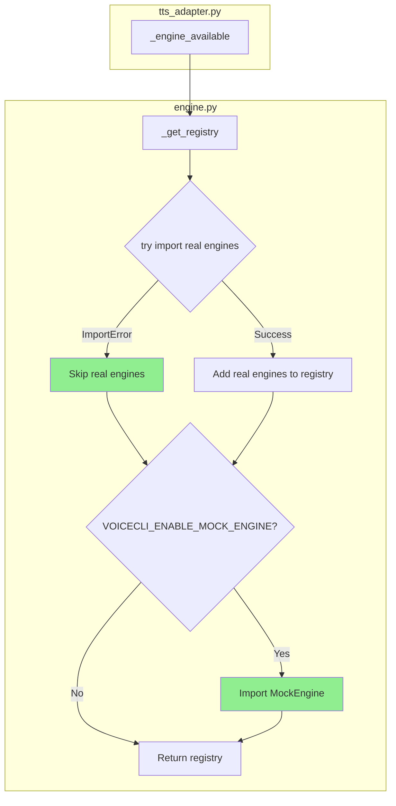
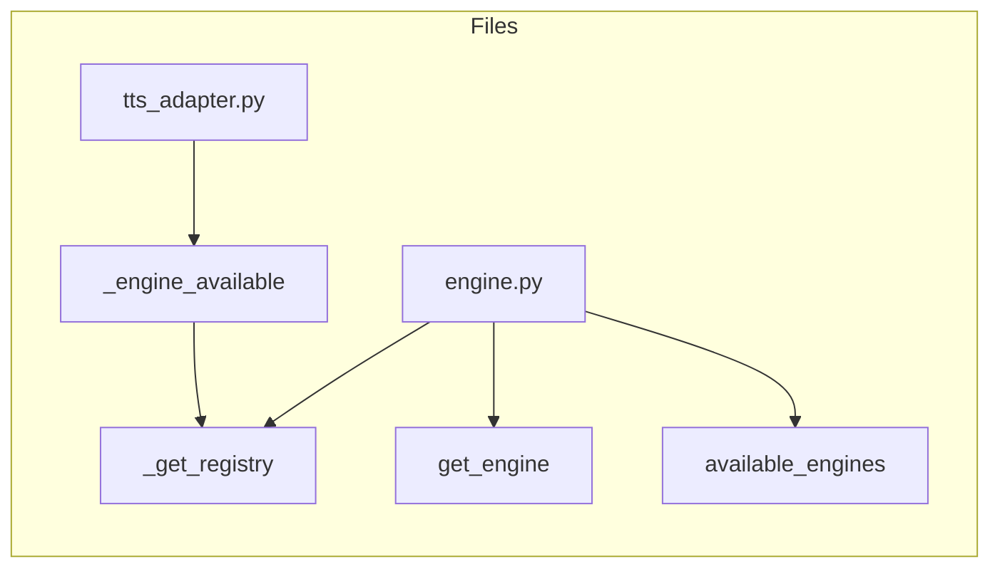

## Summary

Make `_get_registry()` robust to missing torch by wrapping real engine imports in try/except blocks. Mock engine remains gated by `VOICECLI_ENABLE_MOCK_ENGINE` env var.

## Architecture

## Agents

| Agent | Tasks | Files |
|-------|-------|-------|
| backend-dev | 2 | engine.py |
| tester | 1 | tests/e2e/ |

## Consistency Report

- Covered: 5/5 success criteria
- Uncovered: 0
- Untraced: 0

## Micro-Tasks

### V1: Lazy Registry

| # | Description | File | Agent | Phase | Verify |
|---|-------------|------|-------|-------|--------|
| 1 | Wrap real engine imports in try/except | engine.py:102-115 | backend-dev | RED | `uv run python -c "import sys; sys.modules['torch']=None; from voicecli.engine import _get_registry; print(list(_get_registry().keys()))"` |
| 2 | Verify mock in registry when env set | engine.py | backend-dev | GREEN | `VOICECLI_ENABLE_MOCK_ENGINE=1 uv run python -c "import sys; sys.modules['torch']=None; from voicecli.engine import _get_registry; print(list(_get_registry().keys()))"` → `['mock']` |

### V2: E2E Passes

| # | Description | File | Agent | Phase | Verify |
|---|-------------|------|-------|-------|--------|
| 3 | Run e2e test locally to verify fix | tests/e2e/ | tester | GREEN | `pytest tests/e2e/ -v` → passes |

## Task IDs

<!-- Generated by /plan. Used by /implement to resume tasks on session restart. -->
- T1: 10 — Wrap real engine imports in try/except
- T2: 11 — Verify mock in registry when env set
- T3: 12 — Run e2e test to verify fix
