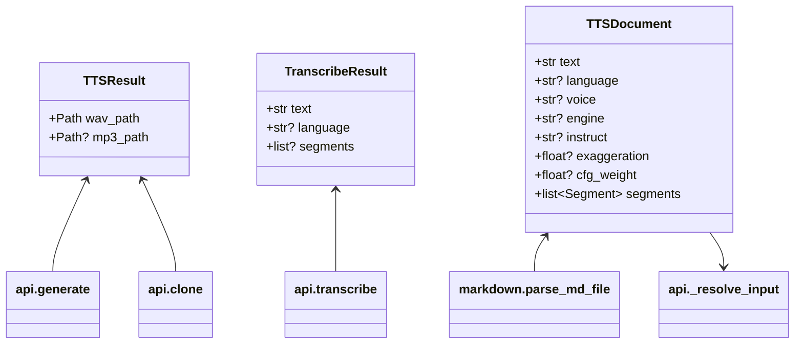
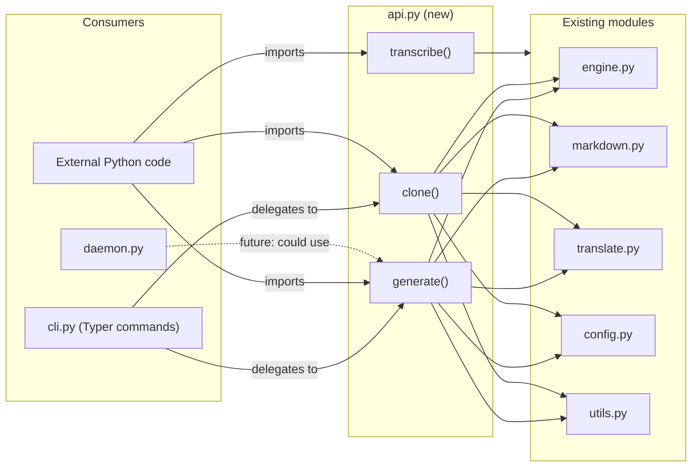

## Context

voiceCLI is CLI-only. The orchestration logic (config loading, markdown detection, config backfill,
engine translation, daemon fallback, MP3 conversion) lives in `cli.py` command handlers, tightly
coupled to Typer. Other Python projects must shell out to use voice generation.

The core modules (`engine.py`, `translate.py`, `markdown.py`, `config.py`, `utils.py`) are already
CLI-independent. This spec designs the extraction of orchestration into a library API.

## Goal

Expose `generate`, `clone`, and `transcribe` as importable Python functions with both sync and async
variants, so any Python project can use voiceCLI programmatically without shelling out.

## Users

- **Primary:** Python developers integrating voice generation into scripts, services, or plugins
- **Secondary:** voiceCLI maintainers — cleaner separation between orchestration and CLI presentation

## Expected Behavior

### Import and use

```python
from voicecli import generate, clone, transcribe
from voicecli import generate_async, clone_async, transcribe_async
from voicecli import TTSResult, TranscribeResult

# Generate speech from text
result = generate("Hello world", engine="qwen", language="French")
# result.wav_path → Path("TTS/voices_out/20260307/qwen_fr_20260307_143022.wav")

# Generate from a markdown script
result = generate("TTS/texts_in/script.md", mp3=True)
# result.wav_path, result.mp3_path both set

# Clone a voice
result = clone("Hello", ref="TTS/samples/voice.wav", engine="chatterbox")

# Clone using active sample
result = clone("Hello")  # uses active sample from voicecli samples use

# Transcribe audio
result = transcribe("STT/audio_in/recording.wav")
# result.text, result.language, result.segments

# Chunked output (separate file per segment/chunk)
result = generate("long_article.txt", chunked=True, chunk_size=300)

# Explicit config file (useful in tests / non-project directories)
result = generate("Hello", config=Path("/path/to/voicecli.toml"))

# Async variant (for event loop integration — wraps sync in asyncio.to_thread)
result = await generate_async("Bonjour", engine="qwen", language="French")
```

All path parameters (`text`, `ref`, `output`, `audio`, `config`) accept both `str` and `pathlib.Path`.

### Priority chain preserved

`kwargs > markdown frontmatter > voicecli.toml > hardcoded defaults`

The library API sits at the same level as CLI flags — caller kwargs override everything below.

### Output path behavior

When `output` is omitted, the library uses `default_output_path()` which resolves relative to CWD
(creating `TTS/voices_out/<date>/` directories automatically). Library callers running from
non-project directories should either pass an explicit `output` path or set CWD appropriately.

### Error handling

Library functions raise Python exceptions, never `typer.Exit` or `SystemExit`:

- `ValueError` — invalid engine name, missing required args, no active sample set
- `FileNotFoundError` — missing ref audio file, missing script file
- `RuntimeError` — CUDA/GPU errors (re-wrapped from engine layer)

**CUDA error handling:** `cuda_guard()` in `engine.py` currently catches CUDA errors and raises
`SystemExit(1)`. For library use, `cuda_guard` must be refactored to raise `RuntimeError` instead.
The CLI layer (`cli.py`) catches `RuntimeError` from CUDA errors and formats the user-friendly
message + `typer.Exit(1)`. This moves the formatting responsibility from engine to CLI boundary.

### Async variants

Async functions use `asyncio.to_thread(sync_fn, ...)` for event loop integration — they allow
library callers to `await` without blocking the event loop. They do **not** provide GPU parallelism;
PyTorch inference holds the GIL, so concurrent async calls serialize on the GPU.

### No side effects on import

`import voicecli` remains lightweight — no torch, no model loading. Heavy imports stay deferred
to function bodies, same as today.

## Data Model & Consumers





| Consumer | Fields consumed | When | Status |
|----------|----------------|------|--------|
| cli.py | generate(), clone(), TTSResult.wav_path, .mp3_path | User runs CLI commands | This issue |
| External Python | generate(), clone(), transcribe(), all result fields | Library import | This issue |
| daemon.py | Could use generate()/clone() internally | Future refactor | Future |

## Breadboard

### API module (`api.py`)

| ID | Affordance | Handler | Data |
|----|-----------|---------|------|
| A1 | `generate(text, *, engine, voice, output, language, mp3, fast, chunked, chunk_size, config, segment_gap, crossfade, plain, **kwargs)` | `_generate_impl()` | text or path (`str\|Path`) → TTSResult |
| A2 | `clone(text, *, ref, engine, ref_text, output, language, mp3, fast, chunked, chunk_size, config, segment_gap, crossfade, plain, **kwargs)` | `_clone_impl()` | text or path + ref (`str\|Path`) → TTSResult |
| A3 | `transcribe(audio, *, model, language, output)` | `_transcribe_impl()` | audio path (`str\|Path`) → TranscribeResult (structured data; caller decides format) |
| A4 | `generate_async(...)` / `clone_async(...)` / `transcribe_async(...)` | `asyncio.to_thread(sync_fn)` | Same as sync |
| A5 | `list_engines()` | Delegates to `engine.available_engines()` | → `list[str]` (engine keys: `"qwen"`, `"chatterbox"`, etc.) |
| A6 | `list_voices(engine)` | Delegates to `engine.get_engine(name).list_voices()` | → `list[str]` (voice names); raises `ValueError` if engine unknown |

### Orchestration extraction

| ID | What moves | From | To |
|----|-----------|------|----|
| N1 | Config loading + default layering | `cli.py` generate/clone: cfg loading, engine/language/voice resolution | `api.py:_resolve_config()` |
| N2 | File detection (.md/.txt) + markdown parsing | `cli.py` generate/clone: Path suffix detection, `parse_md_file()` call | `api.py:_resolve_input()` |
| N3 | Config backfill + engine translation | `cli.py` generate/clone: `_apply_config_defaults()`, `translate_for_engine()` | `api.py:_resolve_input()` |
| N4 | Engine dispatch + daemon fallback + chunked generation | `cli.py` generate/clone: engine instantiation, `_try_daemon()`, `_generate_chunked()`/`_clone_chunked()` | `api.py:_dispatch_generate()` / `_dispatch_clone()` |
| N5 | Clone ref resolution (active sample fallback) | `cli.py` clone: ref=None → `get_active_path()` | `api.py:_resolve_ref()` — raises `ValueError` if no active sample |
| N6 | CUDA error boundary | `engine.py:cuda_guard()` raises `SystemExit` | Refactor to raise `RuntimeError`; CLI catches and formats |

### CLI changes

| ID | Change | Detail |
|----|--------|--------|
| S1 | `cli.py:generate()` becomes thin wrapper | Calls `api.generate()`, handles Typer-specific I/O (echo, Exit) |
| S2 | `cli.py:clone()` becomes thin wrapper | Calls `api.clone()`, handles Typer-specific I/O |
| S3 | Error translation | Catches `ValueError`/`FileNotFoundError`/`RuntimeError` → `typer.echo(err)` + `typer.Exit(1)` |
| S4 | CUDA formatting | Catches `RuntimeError` from CUDA, prints user-friendly diagnostic (currently in `cuda_guard`) |

### Exports (`__init__.py`)

| ID | Export | Source |
|----|--------|--------|
| E1 | `generate`, `clone`, `transcribe` | `api.py` |
| E2 | `generate_async`, `clone_async`, `transcribe_async` | `api.py` |
| E3 | `list_engines`, `list_voices` | `api.py` |
| E4 | `TTSResult`, `TranscribeResult` | `api.py` |
| E5 | `TTSDocument`, `Segment` | `markdown.py` |
| E6 | `__version__` | Already exported |

## Slices

| # | Slice | Affordances | Demo |
|---|-------|-------------|------|
| 1 | Core API + result types + CUDA refactor | A1, A2, N1-N6, E1, E4 | `from voicecli import generate; r = generate("hello")` |
| 2 | CLI delegation | S1, S2, S3, S4 | `voicecli generate "hello"` still works, now via api.py |
| 3 | Async + extras | A3, A4, A5, A6, E2, E3, E5, E6 | `await generate_async(...)`, `list_engines()` |

Note: Slice 1 includes daemon fallback (N4 imports `daemon.py`), but the daemon is optional —
if the socket is absent, fallback is silent. No blocking dependency.

## Success Criteria

- [ ] `from voicecli import generate, clone` works without triggering heavy imports (torch, etc.)
- [ ] `generate("Hello world")` returns a `TTSResult` with a valid `.wav_path`
- [ ] `generate("script.md")` processes markdown frontmatter, config backfill, and engine translation
- [ ] `generate("text", chunked=True)` produces separate chunk files
- [ ] `clone("Hello", ref=Path("sample.wav"))` returns a `TTSResult`
- [ ] `clone("Hello")` falls back to active sample; raises `ValueError` if no active sample set
- [ ] Priority chain holds: `generate("text", language="French")` overrides voicecli.toml language
- [ ] `generate("text", mp3=True)` sets `TTSResult.mp3_path`
- [ ] `generate("text", config=Path("custom.toml"))` uses the specified config file
- [ ] Invalid engine name raises `ValueError`, not `SystemExit`
- [ ] Missing ref audio raises `FileNotFoundError`, not `typer.Exit`
- [ ] CUDA errors raise `RuntimeError`, not `SystemExit`
- [ ] `import voicecli` does NOT import torch, soundfile, or any engine module
- [ ] All existing CLI commands produce identical behavior (same exit codes, same file outputs)
- [ ] `await generate_async("text")` delegates to `asyncio.to_thread(generate, ...)`
- [ ] `list_engines()` returns engine key strings, `list_voices("qwen")` returns voice name strings
- [ ] `list_voices("invalid")` raises `ValueError`
- [ ] `transcribe(Path("audio.wav"))` returns a `TranscribeResult` with `.text` and `.language`
- [ ] All path parameters accept both `str` and `pathlib.Path`
