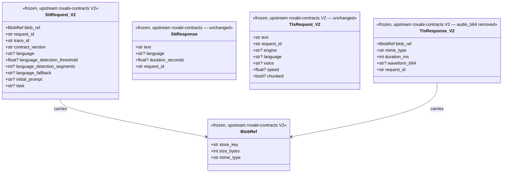
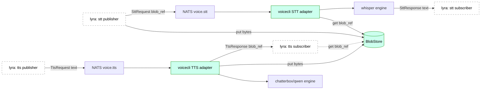

## Context

Promoted from [144-blobref-workers-frame.mdx](../frames/144-blobref-workers-frame.mdx).

Upstream coordination: [Roxabi/lyra#1067](https://github.com/Roxabi/lyra/issues/1067) (V5 slice — lyra-side worker wiring).
Upstream spec: `Roxabi/lyra/artifacts/specs/1061-blobstore-spec.mdx`.
Upstream ADRs:
- `Roxabi/lyra/docs/architecture/adr/067-blobstore-abstraction-flat-fs-content-addressed.mdx` (BlobStore abstraction)
- `Roxabi/lyra/docs/architecture/adr/068-ecosystem-service-plane.mdx` (Ecosystem Service Plane — mandates `HttpBlobStore` Protocol for workers regardless of host co-location)

**Atomic merge required with [lyra#1067](https://github.com/Roxabi/lyra/issues/1067)** (V5 lyra-side coord — still OPEN; "Bloque : Roxabi/voiceCLI#144"). Upstream infra (re-verified 2026-05-27 via /recheck): `lyra#1063` V1 package CLOSED, `lyra#1064` V2 contracts CLOSED, `lyra#1330` V8 HTTP-fronted BlobStore + `HttpBlobStore` client CLOSED. Only lyra-side worker wiring (#1067) remains — voiceCLI side developed in parallel.

## Goal

STT/TTS NATS satellites consume `BlobRef` on ingress and produce `BlobRef` on egress, replacing inline `audio_b64` (base64-encoded WAV) with a content-addressed reference fetched/stored via a shared `BlobStore` backend.

## Users

- **Primary:** Lyra agent pipeline (M₁ hub) — orchestrates STT → LLM → TTS chains and currently re-transports the same audio bytes at every NATS hop.
- **Secondary:** voiceCLI NATS satellite operators (M₁ voice-worker host) — get sub-300B payloads instead of ~1MB, no NATS message-size surprises.
- **Not affected:** CLI-only voiceCLI users (`voicecli generate`/`transcribe` file-path mode) — they never touch NATS payloads; out of scope.

## Expected Behavior

### STT request flow (lyra → voicecli-stt satellite → lyra)

1. Lyra writes audio bytes to `BlobStore` → receives `BlobRef`.
2. Lyra publishes `SttRequest(blob_ref, request_id, …)` on `voice.stt.transcribe.>`.
3. voiceCLI STT adapter receives request, calls `BlobStore.get(blob_ref.store_key)` → bytes.
4. Bytes written to scoped tempfile (existing flow), passed to `api.transcribe`.
5. voiceCLI publishes `SttResponse(text, language, duration_seconds, …)` — **unchanged response shape** (text-only; no blob involved in response).

### TTS request flow (lyra → voicecli-tts satellite → lyra)

1. Lyra publishes `TtsRequest(text, request_id, …)` on `voice.tts.synthesize.>` — **unchanged request shape** (text-only; no blob involved in request).
2. voiceCLI TTS adapter calls engine → writes synthesized WAV to scoped tempfile.
3. voiceCLI calls `BlobStore.put(out_path.read_bytes(), mime="audio/wav")` → receives `BlobRef`.
4. voiceCLI publishes `TtsResponse(blob_ref, mime_type, duration_ms, waveform_b64?)` — `audio_b64` field removed.

### Error handling

- `BlobStore.get` failure → satellite returns error code (`audio_fetch_failed` for STT) rather than continuing.
- `BlobStore.put` failure → satellite returns error code (`audio_store_failed` for TTS) rather than partial response.
- Validation: missing/malformed `blob_ref` field on `SttRequest` → existing `MalformedRequestError` path (parity with current `audio_b64` validation).

### Out of scope

- Local CLI flows (`voicecli generate`, `voicecli transcribe` file-path mode) — they don't transit NATS; payload shape change is satellite-scope only.
- Inline-bytes fallback / `DeprecationWarning` shim — explicitly rejected by the atomic-landing requirement.
- BlobStore backend choice / configuration — handled by `roxabi-blobs` (env-var driven). voiceCLI just calls the client.
- Waveform field (`waveform_b64`) on `TtsResponse` — **confirmed assumption: stays inline** (small payload, UI-side waveform preview). Implementer MUST verify against lyra#1064 PR diff before slice 3 lands; if V2 removed it, drop from response build instead of emitting an extra field (Pydantic V2 `extra='forbid'` would fail validation silently otherwise).

## Data Model & Consumers

### Structure diagram



### Consumer map



### Consumer summary

| Consumer | Fields consumed | When | Status |
|---|---|---|---|
| voicecli STT adapter | `SttRequest.blob_ref.store_key`, `request_id`, `mime_type` (from BlobRef) | on `voice.stt.transcribe.>` | this issue |
| voicecli TTS adapter | `TtsRequest.text` + all gen params (unchanged) | on `voice.tts.synthesize.>` | this issue (re-validate envelope) |
| voicecli TTS adapter | `BlobStore.put(bytes, mime)` | after engine writes WAV | this issue |
| BlobStore (roxabi-blobs) | bytes + mime | on `put` / `get` | upstream (read-only consumer here) |
| lyra publisher/subscriber | `BlobRef` round-trip | end-to-end | future (lyra#1067 V5 lyra-side) |

## Breadboard

### Affordances (NATS subjects + adapter handlers)

| ID | Affordance | Handler | Wires to |
|---|---|---|---|
| N1 | `voice.stt.transcribe.>` | `transcribe_adapter._handle_msg` | runner R1 |
| N2 | `voice.tts.synthesize.>` | `synthesize_adapter._handle_msg` | runner R2 |
| R1 | `_transcribe_runner.run_transcription` | replaces `audio_b64` arg with `blob_ref`; calls `BlobStore.get` | engine via `api.transcribe` |
| R2 | `_synthesize_runner.run_synthesis` | replaces `audio_b64` field-construction with `BlobStore.put` + `blob_ref` | engine via `api.generate` |
| S1 | `BlobStore` client init | factory fn in `adapters/nats/blobs.py` (new, ≤50 LOC) | env-driven config from `roxabi-blobs` |
| V1 | `requests.SttRequest.from_payload` | swaps `audio_b64` field for `blob_ref`; `MalformedRequestError` on bad ref | adapter validation path |
| V2 | `_validation.parse_stt_envelope` | re-asserts `blob_ref` presence/type | adapter ingress |

### Wiring summary

```
Ingress (NATS) → V1/V2 (typed parse) → R1/R2 (runner) → S1 (BlobStore client) → engine → Egress (NATS)
```

S1 is a module-level lazy singleton in `adapters/nats/blobs.py`. First call to `get_blobstore()` constructs the client (mirroring the `engine.py:_get_registry()` pattern) and caches it in `_INSTANCE: BlobStore | None`. R1 + R2 call `get_blobstore().get` / `.put` directly — no DI plumbing, no init in the upstream `roxabi_nats` adapter `__aenter__` (which voiceCLI does not own).

**Path-creation ownership (post-migration):** the **runner** owns `scoped_path` creation, deriving `ext = _ext_from_mime(blob_ref.mime_type)`. The adapter (`transcribe_adapter._run_transcription`) MUST NOT pre-create a tempfile path before calling the runner — current dual-creation pattern (adapter line ~176 + runner line ~74) collapses to runner-only. The adapter retains `try/finally: cleanup(out_path)` by reading the path back from the runner result envelope (return-tuple gains a `tempfile_path` field) or by accepting the responsibility shift entirely.

## Slices

| # | Slice | Demoable outcome | Scope |
|---|---|---|---|
| 1 | **Deps + BlobStore client + deploy plumbing** | `from voicecli.adapters.nats.blobs import get_blobstore` returns a working `HttpBlobStore` client against the lyra-hub HTTP service, in both Quadlet (M₁) and native (M₂) contexts | `pyproject.toml` (+ `roxabi-blobs` git dep, branch=staging); new `adapters/nats/blobs.py` module-level factory (≤50 LOC) — **returns `HttpBlobStore` only; flat-FS backend forbidden for workers per ADR-068** even when co-located with lyra-hub (preserves contract for future host moves, e.g. voice workers → M₂ for GPU isolation); `tests/nats/test_blobs_factory.py` (mocks `HttpBlobStore` against a fake HTTP server); `deploy/quadlet/voicecli-tts.container` + `voicecli-stt.container` (`Environment=BLOBSTORE_BACKEND=http`, `BLOBSTORE_URL=…`, `BLOBSTORE_BEARER_TOKEN=…` — **no `Volume=` bind-mount**, workers do not touch the blob FS); `deploy/install.sh` (env-stub seeding for `stt.env`/`tts.env` with HTTP vars only); `deploy/quadlet.toml` (`required_secrets` lists the bearer-token secret) |
| 2 | **STT migration** | STT satellite consumes `SttRequest.blob_ref`, fetches bytes via `BlobStore.get`, transcribes; e2e roundtrip test passes against a fake BlobStore | `requests.py` (`SttRequest.audio_b64` → `blob_ref: BlobRef`); `_validation.py` (envelope check on `blob_ref`); `_transcribe_runner.py` (b64-decode path removed; `BlobStore.get(blob_ref.store_key)` writes scoped tempfile; `ext` derived from `blob_ref.mime_type` not `payload.get("mime_type")`); `transcribe_adapter.py` (drop pre-`scoped_path` call — runner owns path creation; keep `try/finally: cleanup`); `tests/nats/test_stt_*`, `tests/e2e/test_nats_roundtrip.py` |
| 3 | **TTS migration** | TTS satellite synthesizes, stores WAV in BlobStore, emits `TtsResponse(blob_ref)`; e2e roundtrip test passes | `_synthesize_runner.py` (b64 encode removed; `BlobStore.put(out_path.read_bytes(), mime="audio/wav")` → `blob_ref`); `synthesize_adapter.py` (response build uses `blob_ref` field); verify `waveform_b64` retention against lyra#1064 PR diff before merge; `tests/nats/test_tts_*`, `tests/e2e/test_nats_roundtrip.py`; `tests/nats/test_golden_wire_compat.py` (golden fixtures regenerated for V2 wire shape; V1 fixtures deleted) |

Slices land **atomically in one PR** (atomic-merge constraint with lyra#1067 — V5 lyra-side worker wiring). Slice ordering is for implementation/review structure only — no slice ships independently.

## Success Criteria

### Build / dep gates

- [ ] `pyproject.toml` lists `roxabi-blobs` as a git source (lyra workspace member, branch=staging).
- [ ] `from roxabi_blobs import HttpBlobStore, BlobRef` resolves at module import time (no runtime ImportError on satellite startup).
- [ ] `adapters/nats/blobs.py` exposes a module-level `get_blobstore() -> HttpBlobStore` factory backed by an `_INSTANCE` cache (mirrors `engine.py:_get_registry()` pattern). Unit-tested via mocked HTTP server — test asserts identical instance returned on repeated calls. **Factory MUST NOT instantiate flat-FS variant** even if env requests it (raise `ValueError` to enforce ADR-068 for the worker role).
- [ ] Required HTTP-backend env vars (`BLOBSTORE_BACKEND=http`, `BLOBSTORE_URL`, `BLOBSTORE_BEARER_TOKEN` — exact names confirmed from `roxabi-blobs` README during slice 1) are present as `Environment=` directives in both `deploy/quadlet/voicecli-tts.container` + `voicecli-stt.container`, and seeded into `deploy/install.sh` env-stub generation for `stt.env`/`tts.env`. Bearer token sourced from secret per `deploy/quadlet.toml`.

### Contract gates

- [ ] `SttRequest` no longer has `audio_b64` field; has `blob_ref: BlobRef` field.
- [ ] `TtsResponse` (constructed in voiceCLI satellite) no longer carries `audio_b64`; carries `blob_ref: BlobRef`.
- [ ] `waveform_b64` field on `TtsResponse` either retained or removed to match the upstream lyra#1064 V2 contract exactly (verified by `python -c "from roxabi_contracts.voice.models import TtsResponse; print(TtsResponse.model_fields)"`).
- [ ] `grep -rE 'audio_b64|audio_bytes' src/voicecli/adapters/nats/` returns zero matches outside historical comments.

### Test gates

- [ ] STT adapter test (`tests/nats/test_stt_adapter.py`) passes with `BlobStore.get` mock.
- [ ] TTS adapter test (`tests/nats/test_tts_adapter.py`) passes with `BlobStore.put` mock.
- [ ] E2E roundtrip test (`tests/e2e/test_nats_roundtrip.py`) passes against in-memory `BlobStore` backend.
- [ ] First-request init failure logs `blobstore_init_failed` when `get_blobstore()` raises `BlobstoreConfigError` (lazy-first-call pattern per `engine.py:_get_registry()` — `get_blobstore()` is intentionally not invoked from upstream `roxabi_nats` adapter `__aenter__` per line 176). Verified by `test_stt_runner.test_blobstore_config_error_logs_blobstore_init_failed` + `test_tts_runner.test_blobstore_config_error_logs_blobstore_init_failed`, which inject a raising backend factory and assert both the log record and the structured `blobstore_not_configured` error code. Install-time empty-token guard in `deploy/install.sh` catches the most common misconfig before first request.
- [ ] Golden wire-compat fixtures (`tests/nats/test_golden_wire_compat.py`) regenerated for V2; old `audio_b64` golden bytes deleted (not retained as fallback).

### Quality gates

- [ ] No file in `src/voicecli/adapters/nats/` exceeds 300 lines (per `quality_gates.file_length`).
- [ ] `uv run ruff check . && uv run ruff format --check . && uv run pyright && uv run pytest` all pass on the worktree.

### Manual / deploy-time checks (not CI — runbook entries)

- BlobStore client init is host-process work only — no CUDA/VRAM allocation. Verify at first satellite cold-start on M₁ by comparing `nvidia-smi` before vs. after `get_blobstore()` call in `journalctl --user -u voicecli-tts -n 200`. Document in `docs/QUADLET-DEPLOYMENT.md`.
- Quadlet dual-context smoke: `systemctl --user restart voicecli-{tts,stt}` on M₁ succeeds without `blobstore_init_failed`. Native: `voicecli serve` on M₂ likewise.

## Edge Cases

| Case | Strategy |
|---|---|
| `BlobStore.get` returns `None` / raises | Return `(False, "audio_fetch_failed")` from runner; adapter publishes error response with same envelope shape as today's `audio_decode_failed` |
| `BlobStore.put` raises after engine succeeded | Return `(False, "audio_store_failed")` from runner; engine output discarded with tempfile (existing scoped-cleanup path) |
| `blob_ref` field missing on incoming `SttRequest` | `MalformedRequestError("blob_ref must be a BlobRef")` — same path as current `audio_b64` validation |
| BlobStore misconfigured (env var missing / ADR-068 violation) | First-request `get_blobstore()` raises `BlobstoreConfigError` → runner logs `blobstore_init_failed` and replies `blobstore_not_configured` (per-request, not satellite-fatal). Operator catches at install-time via `deploy/install.sh` empty-token guard. Network unreachable falls through to `audio_fetch_failed` / `audio_store_failed`. |
| Concurrent satellite + local CLI on same host | BlobStore client is process-local; no shared state with local CLI; CLI does not consume BlobStore |
| Existing in-flight `audio_b64` messages at deploy time | No backwards compat — atomic deploy with lyra side; in-flight V1 messages get `MalformedRequestError` and are dead-lettered (acceptable per atomic-landing decision) |
| RTX 3080 VRAM contention | Unchanged — BlobStore is CPU/disk only. No new VRAM cost. |
| `uv lock` drift from upstream `staging` advance | Re-run `uv lock` whenever `roxabi-blobs` on lyra `staging` is updated; pre-commit / CI catches drift on next lock run. Document in `docs/contributing.md` or `CLAUDE.md` Gotchas. |

## Open Questions

- [NEEDS CLARIFICATION] Does V2 `TtsResponse` retain `waveform_b64` inline, or is the waveform also moved to a blob? **Default (assumed for spec):** stays inline (tiny payload, UI-side preview). **Verification trigger:** before slice 3 PR opens, run `python -c "from roxabi_contracts.voice.models import TtsResponse; print(TtsResponse.model_fields)"` against the lyra#1064 V2 contracts and align response build accordingly. The "waveform_b64 retention matches upstream" success criterion enforces this gate.

## Notes for future refactors

- **V1/V2 validation layer placement:** Per axial ADR-003, wire-contract validation (`requests.py`, `_validation.py`) belongs in `ports/` (wire_protocol layer), not in `adapters/nats/`. This spec consciously leaves V1/V2 in `adapters/nats/` (known debt — already tracked under restructure issues #81/#82/#83) to keep the BlobRef migration scoped to a single atomic PR. When the ports-layer chantier lands, V1/V2 affordances follow at no extra cost. Do not block this slice on that refactor.
