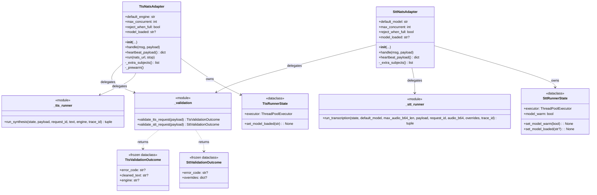
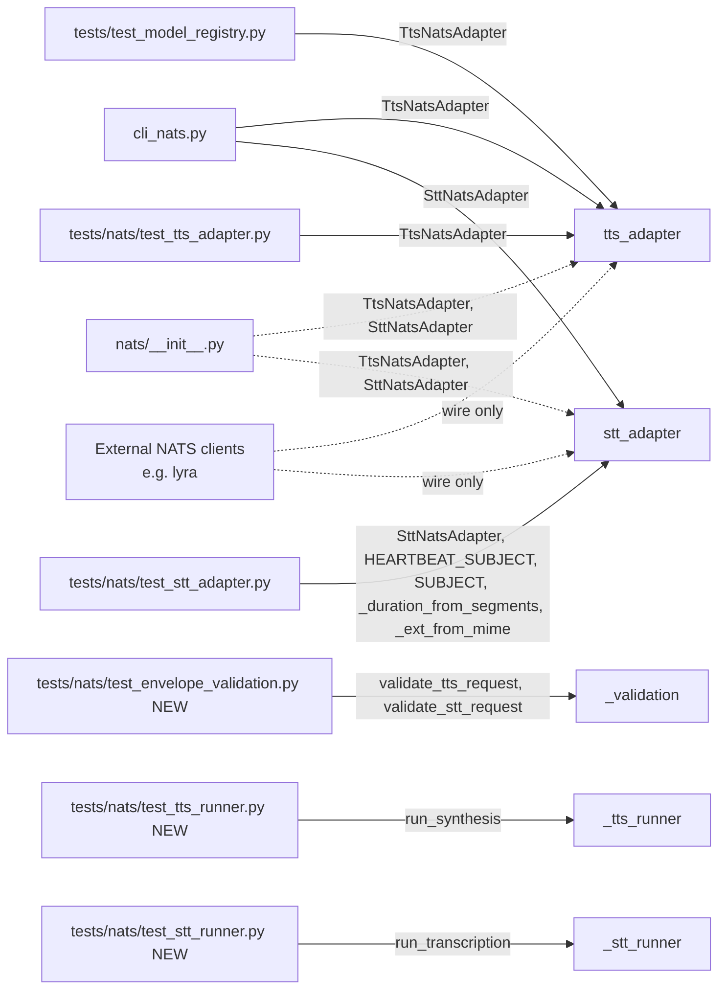

## Context

Source frame: [`artifacts/frames/147-split-nats-adapters-frame.mdx`](../frames/147-split-nats-adapters-frame.mdx). Pure refactor — split two adapter modules (`src/voicecli/nats/tts_adapter.py`, `src/voicecli/nats/stt_adapter.py`) that cross the 300-line gate on `fix/nats-tts-newlines-and-error-codes` (349 and 305 lines). Public adapter API and on-wire NATS protocol are byte-stable. Locks the three architectural choices left open in the frame.

## Goal

Both NATS adapter files end under 300 lines with their `tools/file_exemptions.txt` entries removed, by extracting two well-named, unit-testable concerns (request validation, run loop) — without changing the on-wire NATS contract, the public adapter API, or any reply error code.

## Users

- **Primary:** voiceCLI maintainer working on the NATS satellite path — gets a readable hot lane and unit-tested error branches.
- **Secondary:** Future contributors editing TTS/STT handlers; CI file-length gate (clean signal restored).

## Expected Behavior

**At runtime — observably identical to today:**

1. `voicecli nats-serve tts` starts a `TtsNatsAdapter` instance; `voicecli nats-serve stt` starts an `SttNatsAdapter`. Same constructor parameters (`default_engine`, `max_concurrent`, `reject_when_full`, `heartbeat_interval`, `drain_timeout` for TTS; `default_model` for STT).
2. NATS subjects (`lyra.voice.tts.request`, `lyra.voice.stt.request`), queue groups (`TTS_WORKERS`, `STT_WORKERS`), heartbeat subjects (`lyra.voice.tts.heartbeat`, `lyra.voice.stt.heartbeat`), and inbox prefixes (`_inbox.voice-tts`, `_inbox.voice-stt`) are unchanged.
3. Reply error codes byte-identical to current set: `malformed_request`, `engine_unavailable`, `capacity_exceeded`, `param_validation_failed`, `synthesis_failed`, `payload_too_large`, `audio_decode_failed`, `model_load_failed`, `transcription_failed`.
4. Heartbeat payload shape and fields (`model_loaded`, `active_requests`, `vram_free_mb`, `vram_status` for TTS; `model_loaded`, `active_requests` for STT) unchanged.
5. `fallback_language` retry semantics (TTS) and model warmup (STT) preserved.

**Structurally — what changes:**

- `TtsNatsAdapter` / `SttNatsAdapter` shrink to lifecycle + dispatch + reply. They delegate envelope validation to `nats/_validation.py` and the executor-bound run loop to `nats/_tts_runner.py` / `nats/_stt_runner.py`.
- Validation helpers return a typed outcome that the adapter translates into a reply error code. The wire-format encoding (`_err_tts`, `_err_stt`) stays in the adapter.
- Run loops accept the executor, the validated inputs, and a small `RunnerState` (TTS: `_executor`, current `model_loaded` setter; STT: `_executor`, `_model_warm` state cell, `_model_loaded` setter). They return `(ok, response_payload_dict)` so the adapter builds and emits the reply.
- Both adapter files end ≤ 230 lines (target ≤ 200); helpers ≤ 200 lines each.
- `tools/file_exemptions.txt` loses both NATS adapter entries.

## Architectural Decisions (locked)

| # | Decision | Choice |
|---|----------|--------|
| AD-1 | Validation module shape | **Single** `nats/_validation.py` exposing `validate_tts_request(payload)` and `validate_stt_request(payload)`. Distinct from existing `nats/_validate.py` (NATS identifier tokens — token regex only) — orthogonal concern, not collapsed. The short-prefix proximity is accepted (both are private package-internal helpers) over a longer name like `_request_validation.py` to keep import lines short; the docstring of `_validation.py` MUST cross-reference `_validate.py` and vice versa so the distinction is discoverable. |
| AD-2 | Runner shape | **Module-level functions** in `nats/_tts_runner.py` (`run_synthesis(...)`) and `nats/_stt_runner.py` (`run_transcription(...)`). State the adapter currently owns (`_executor`, `_model_warm`, `model_loaded` setter) is passed in via a small `RunnerState` dataclass (immutable except for explicit state-cell fields). No new classes inherited from anywhere. **Threading constraint:** `model_warm` and `model_loaded` are written by the runner on the executor thread; the adapter reads `model_loaded` from `heartbeat_payload()` on the async loop thread. A torn read of a Python attribute is safe (CPython GIL), but no read of `model_warm` outside the runner is permitted — adding one would require an `asyncio.Event` or atomic. The runner module docstring MUST state this constraint. |
| AD-3 | STT module helpers | **Stay** in `stt_adapter.py`: `MAX_AUDIO_B64_LEN`, `_duration_from_segments`, `_ext_from_mime`, `_MIME_TO_EXT`. Test imports unchanged. They're self-contained (no shared state with the run loop). The cap value `MAX_AUDIO_B64_LEN` is **passed as a parameter** to `run_transcription(...)` (not imported from `stt_adapter.py` by the runner) so the dependency direction stays adapter → runner only. |

Rationale captured to avoid re-deciding at /plan: each choice minimizes blast radius (no test churn for AD-3), keeps unit tests trivial (AD-2: pure functions), and prevents conflating two `_validate*` modules with different purposes (AD-1).

## Data Model & Consumers

### Module layout after the split

### Consumer map

Solid = existing import lines that must remain unchanged through the refactor (the consumer keeps importing the same symbol from the same module). Dashed = re-export via `__getattr__` and wire-only consumers (no source-level coupling).

### Consumer summary

| Consumer | Symbols consumed | When | Status |
|---|---|---|---|
| `src/voicecli/cli_nats.py` | `TtsNatsAdapter`, `SttNatsAdapter` (lazy imports) | Adapter boot | this issue (no change) |
| `src/voicecli/nats/__init__.py` | `TtsNatsAdapter`, `SttNatsAdapter` re-export via `__getattr__` | Import resolution | this issue (no change) |
| `tests/test_model_registry.py` | `TtsNatsAdapter` | Test setup | this issue (no change) |
| `tests/nats/test_tts_adapter.py` | `TtsNatsAdapter` (+ `nats.config._resolve_engine`, `nats.tempdir.scoped_path` — untouched) | Behavior tests | this issue (no change) |
| `tests/nats/test_stt_adapter.py` | `SttNatsAdapter`, `HEARTBEAT_SUBJECT`, `SUBJECT`, `_duration_from_segments`, `_ext_from_mime` | Behavior + helper tests | this issue (no change — AD-3 keeps these in `stt_adapter.py`) |
| `tests/nats/test_envelope_validation.py` (new) | `validate_tts_request`, `validate_stt_request` | Unit | this issue (added) |
| `tests/nats/test_tts_runner.py` (new) | `run_synthesis`, `TtsRunnerState` | Unit | this issue (added) |
| `tests/nats/test_stt_runner.py` (new) | `run_transcription`, `SttRunnerState` | Unit | this issue (added) |
| External NATS clients (lyra, etc.) | Wire-format only | Runtime | future (out of scope — wire byte-stable) |

## Breadboard

### Affordances — runtime entry points touched by the refactor

| ID | Affordance | Handler | Data |
|----|------------|---------|------|
| U1 | `TtsNatsAdapter(...)` constructor | `tts_adapter.TtsNatsAdapter.__init__` | Stores `default_engine`, `max_concurrent`, `reject_when_full`, executor, semaphore. Creates `TtsRunnerState`. |
| U2 | `SttNatsAdapter(...)` constructor | `stt_adapter.SttNatsAdapter.__init__` | Stores `default_model`, etc. Creates `SttRunnerState`. |
| U3 | NATS request → `handle(msg, payload)` (TTS) | `tts_adapter.TtsNatsAdapter.handle` | Calls `validate_tts_request(payload)`; on error → `reply(_err_tts(...))`. On success → acquire semaphore → call `run_synthesis(state, ...)` → emit reply. |
| U4 | NATS request → `handle(msg, payload)` (STT) | `stt_adapter.SttNatsAdapter.handle` | Calls `validate_stt_request(payload)`; on error → `reply(_err_stt(...))`. On success → acquire semaphore → call `run_transcription(state, ...)` → emit reply. |

**Byte-stable affordances (no source-level change, asserted by Success Criteria):** `heartbeat_payload()`, `run(nats_url, stop)`, `_extra_subjects()`, `_prewarm()` for both adapters; module-level `SUBJECT`, `HEARTBEAT_SUBJECT`, `_err_tts`, `_err_stt`, `_engine_available`; STT module helpers `MAX_AUDIO_B64_LEN`, `_duration_from_segments`, `_ext_from_mime`, `_MIME_TO_EXT` (per AD-3).

### Affordances — new internals (unit-test entry points)

| ID | Affordance | Handler | Data |
|----|------------|---------|------|
| N1 | `validate_tts_request(payload)` | `nats/_validation.py` | Returns `TtsValidationOutcome(error_code, cleaned_text, engine)`. Encodes all TTS request rules: `request_id` regex, text presence, newline strip + non-empty check, engine token validity, engine availability check. |
| N2 | `validate_stt_request(payload)` | `nats/_validation.py` | Returns `SttValidationOutcome(error_code, overrides)`. Encodes all STT request rules: `request_id` regex, `audio_b64` presence/type, optional-field type checks (incl. bool-as-int rejection for `language_detection_segments`), `task` allowlist. Builds `overrides` dict. |
| N3 | `run_synthesis(state, payload, request_id, text, engine, trace_id)` | `nats/_tts_runner.py` | Drives `api.generate` via `state.executor`, handles `fallback_language` retry, chunked-output collection (`tts_wav_utils`), and `param_validation_failed` / `synthesis_failed` classification. Rebuilds `optional_kwargs` (`language`, `voice`, `speed`, `exaggeration`, `cfg_weight`, `accent`, `personality`, `emotion`) and `named_kwargs` (`chunked`, `chunk_size`, `segment_gap`, `crossfade`) from `payload` — extraction logic is documented in the runner module docstring as the **single source of truth** so a new adapter optional kwarg cannot silently bypass the runner. Returns `(ok: bool, fields_or_error_code)`. |
| N4 | `run_transcription(state, default_model, max_audio_b64_len, payload, request_id, audio_b64, overrides, trace_id)` | `nats/_stt_runner.py` | Caps payload size against the `max_audio_b64_len` parameter (the constant `MAX_AUDIO_B64_LEN` stays in `stt_adapter.py` per AD-3; the adapter passes it in), decodes base64, warms model once (toggling `state.model_warm`), drives `api.transcribe` via `state.executor`, classifies `payload_too_large` / `audio_decode_failed` / `model_load_failed` / `param_validation_failed` / `transcription_failed`. Returns `(ok, fields_or_error_code)`. |

### Wiring

- `U3` → `N1`, then on success → `N3`. Adapter owns the semaphore acquire/release around `N3`.
- `U4` → `N2`, then on success → `N4`. Adapter owns the semaphore acquire/release around `N4`.
- `N1`/`N2` are pure (no I/O, no executor) — fully unit-testable on the payload dict alone.
- `N3`/`N4` take `state` so the adapter can inject a stub executor in tests if/when added (existing adapter tests stay end-to-end via `TtsNatsAdapter` / `SttNatsAdapter`).
- `_err_tts`, `_err_stt`, `_engine_available` stay in the adapter modules (only call site is `handle` / response emission).
- **Import direction (load-time, top-of-file):** `_validation.py` imports nothing from `voicecli.nats.*`. `_tts_runner.py` imports only from `voicecli.nats.{tempdir, tts_wav_utils}` (peers). `_stt_runner.py` imports only from `voicecli.nats.tempdir`. Heavy modules (`voicecli.api`, `voicecli.adapters.synthesis`, `voicecli.model_registry`, `voicecli.utils`, `voicecli.transcribe`) remain **deferred** inside function bodies — preserved as-is from the current adapters. Runners do not import the adapters; adapters import the runners.

## Slices

| # | Slice | Demo signal | Files |
|---|-------|-------------|-------|
| 1 | **Carve out `_validation.py`** — extract `validate_tts_request` + `validate_stt_request` as pure functions returning typed outcomes. Adapters call them in `handle`; semantics + error codes byte-identical. Add unit tests covering every error branch. | `pytest tests/nats/test_envelope_validation.py` green; existing `test_tts_adapter.py` + `test_stt_adapter.py` green; STT adapter drops ~55 lines (from ~305 → ~250); TTS adapter drops ~50 lines (from ~349 → ~300). Note: TTS adapter still above the 230 cap after this slice — final drop happens in slice 2. The `file_exemptions.txt` entries remain through this slice. | `nats/_validation.py` (new), `tts_adapter.py`, `stt_adapter.py`, `tests/nats/test_envelope_validation.py` (new) |
| 2 | **Extract TTS run loop** — move `_run_synthesis` body to `_tts_runner.run_synthesis`. Introduce `TtsRunnerState`. Adapter owns semaphore, calls runner, builds reply. Add focused unit tests for `fallback_language` retry + chunked-output assembly. | `pytest tests/nats/test_tts_runner.py` green; `test_tts_adapter.py` green; `wc -l src/voicecli/nats/tts_adapter.py` ≤ 230. STT exemption still in place (removed in slice 3). | `nats/_tts_runner.py` (new), `tts_adapter.py`, `tests/nats/test_tts_runner.py` (new) |
| 3 | **Extract STT run loop + remove exemptions** — move `_run_transcription` body to `_stt_runner.run_transcription`. Introduce `SttRunnerState` carrying `model_warm`. Adapter owns semaphore + result-to-reply mapping. Add unit tests for size cap (`max_audio_b64_len` parameter), b64 decode failure, model warm-once invariant. Delete both adapter entries from `tools/file_exemptions.txt`. | `pytest tests/nats/test_stt_runner.py` green; `test_stt_adapter.py` green; `wc -l src/voicecli/nats/stt_adapter.py` ≤ 230; CI file-length gate passes with no NATS-adapter rows in `tools/file_exemptions.txt`. | `nats/_stt_runner.py` (new), `stt_adapter.py`, `tools/file_exemptions.txt`, `tests/nats/test_stt_runner.py` (new) |

## Success Criteria

Single hard threshold for line counts: **≤ 230 lines** for each adapter (drops aspirational dual-target prose). Hard threshold for new modules: **≤ 250 lines** each.

- [ ] `wc -l src/voicecli/nats/tts_adapter.py` ≤ 230 **and** `wc -l src/voicecli/nats/stt_adapter.py` ≤ 230.
- [ ] `wc -l src/voicecli/nats/_validation.py src/voicecli/nats/_tts_runner.py src/voicecli/nats/_stt_runner.py` — each ≤ 250 lines.
- [ ] `tools/file_exemptions.txt` no longer contains `src/voicecli/nats/tts_adapter.py` nor `src/voicecli/nats/stt_adapter.py`; `tools/folder_exemptions.txt` requires no new entry for `src/voicecli/nats/` (file count in that dir ≤ 12 after adding the three new modules — currently 8, lands at 11).
- [ ] `uv run pytest tests/nats/` green with **no existing test function deleted, renamed, or marked `xfail`/`skip`**, and **no existing `assert` or `mock.assert_*` call removed** from `tests/nats/test_tts_adapter.py` or `tests/nats/test_stt_adapter.py`. Verifiable via `git diff` of the test files (additions allowed; deletions of existing assertions are not).
- [ ] New unit tests exist at `tests/nats/test_envelope_validation.py`, `tests/nats/test_tts_runner.py`, `tests/nats/test_stt_runner.py`. Coverage gate: `uv run pytest tests/nats/test_envelope_validation.py tests/nats/test_tts_runner.py tests/nats/test_stt_runner.py --cov=voicecli.nats._validation --cov=voicecli.nats._tts_runner --cov=voicecli.nats._stt_runner --cov-fail-under=95` passes (95% covers all branches except hard-to-trigger `Exception` catch-alls in `_run_*` which are last-resort guards).
- [ ] External surface unchanged: (a) `TtsNatsAdapter` and `SttNatsAdapter` public API — constructor parameters, `handle`, `heartbeat_payload`, `run`, `_extra_subjects` — byte-identical to pre-split signatures; (b) `git diff` shows zero modifications to import lines in `src/voicecli/cli_nats.py`, `src/voicecli/nats/__init__.py`, `tests/test_model_registry.py`, and the `from voicecli.nats.stt_adapter import (...)` block in `tests/nats/test_stt_adapter.py` (incl. `_duration_from_segments`, `_ext_from_mime`, `HEARTBEAT_SUBJECT`, `SUBJECT` per AD-3).
- [ ] All quality gates green: `uv run ruff check . && uv run ruff format --check .` clean, `uv run pyright` clean, CI file-length / folder-size / import-layers gates pass without new exemptions.
- [ ] On-wire NATS surface unchanged: grep over `*.py` for the literal strings `lyra.voice.tts.request`, `lyra.voice.stt.request`, `lyra.voice.tts.heartbeat`, `lyra.voice.stt.heartbeat`, `_inbox.voice-tts`, `_inbox.voice-stt`, and every reply error code (`malformed_request`, `engine_unavailable`, `capacity_exceeded`, `param_validation_failed`, `synthesis_failed`, `payload_too_large`, `audio_decode_failed`, `model_load_failed`, `transcription_failed`) returns the same hit count pre- and post-refactor.
