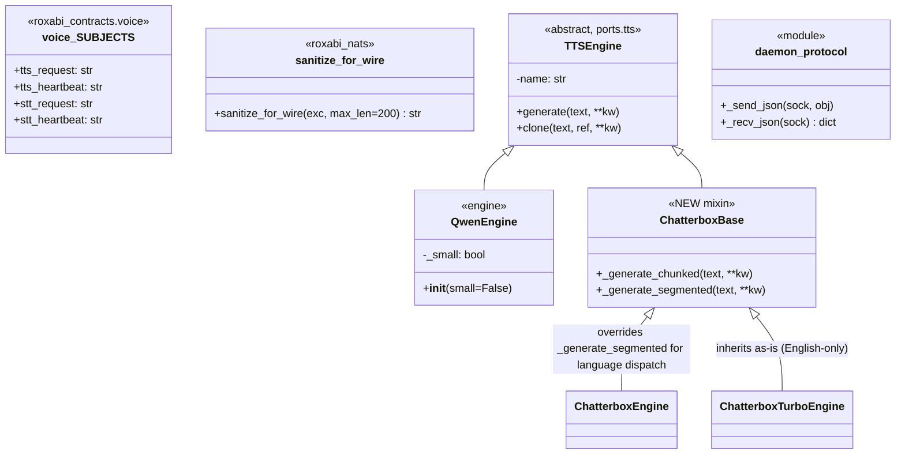
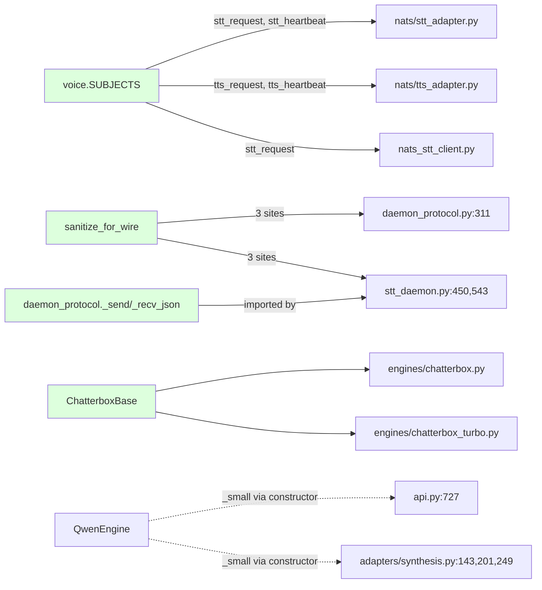

## Context

- **Frame:** [`artifacts/frames/162-stage-axis-audit-frame.mdx`](../frames/162-stage-axis-audit-frame.mdx)
- **Source audit:** [`artifacts/analyses/stage-axis-audit-2026-05-20.md`](../analyses/stage-axis-audit-2026-05-20.md)
- **Upstream (now landed):** lyra [#1291](https://github.com/Roxabi/lyra/issues/1291) — `roxabi_contracts.voice.SUBJECTS` + `roxabi_nats.sanitize_for_wire` shipped in `roxabi-contracts 0.4.0` / `roxabi-nats 0.4.1`.
- **Parallel siblings:** llmCLI [#53](https://github.com/Roxabi/llmCLI/issues/53), imageCLI [#89](https://github.com/Roxabi/imageCLI/issues/89) — same upstream consumer pattern.

## Goal

Land the 7 audit items (3 cross-repo consumers of the now-shipped upstream work + 4 local refactors) in a single F-lite PR, eliminating hardcoded NATS subject literals, raw `str(exc)` socket leaks, ABC pollution, and verbatim engine/api duplication — before the next engine variant or NATS subject rename forces sibling-fix churn.

## Users

- **Primary:** voiceCLI maintainers (Mickael + Claude agents adding engines, NATS subjects, or daemon-protocol fields).
- **Secondary:** lyra hub operators — subject rename now flows through `roxabi-contracts` instead of grep-and-pray.
- **Tertiary:** llmCLI / imageCLI maintainers — voiceCLI becomes the reference for `voice.SUBJECTS` + `sanitize_for_wire` consumption.

## Expected Behavior

After the PR lands:

1. `grep -r 'lyra\.voice\.' src/voicecli/` → returns 0 results.
2. `grep -rE '"message":\s*str\(exc\)' src/voicecli/` and equivalents on socket-bound paths → 0 results.
3. `python -c "from voicecli import api; api.generate('hello', engine='qwen')"` works identically (public API byte-compatible).
4. `voicecli dictate nats` round-trips identically (NATS subject literals replaced by `voice.SUBJECTS.stt_request`).
5. `voicecli serve` / `stt-serve` restart cleanly via supervisord; wire protocol unchanged on the wire (only the *source* of `_send_json`/`_recv_json` changes).
6. Adding a hypothetical third Chatterbox variant requires subclassing `ChatterboxBase` and overriding only the variant-specific bits (~0 verbatim duplication).
7. Adding a new Qwen-family knob does not pollute non-Qwen engines (`_small` no longer on `TTSEngine` ABC).
8. `api.py` LOC < 1000 (currently 1047); chunked-generation logic lives in a dedicated module.

## Data Model & Consumers

### Refactor surface (what changes shape)

### Consumer map (who imports what)

### Consumer summary table

| Consumer | Imports / consumes | Sites | Slice | Status |
|---|---|---|---|---|
| `nats/tts_adapter.py` | `voice.SUBJECTS.tts_request`, `tts_heartbeat` | 1 file, 2 literals replaced | 1 | this issue |
| `nats/stt_adapter.py` | `voice.SUBJECTS.stt_request`, `stt_heartbeat` | 1 file, 2 literals replaced | 1 | this issue |
| `nats_stt_client.py` | `voice.SUBJECTS.stt_request` | 1 file, 1 literal replaced | 1 | this issue |
| `daemon_protocol.py:311` | `sanitize_for_wire(exc)` | 1 site | 1 | this issue |
| `stt_daemon.py:450,543` | `sanitize_for_wire(exc)` | 2 sites | 1 | this issue |
| `stt_daemon.py` (any `_send_json`/`_recv_json` usage) | imports from `daemon_protocol` instead of inline copies | drop inline defs (~25 LOC) | 2 | this issue |
| `engines/chatterbox.py` | inherits `ChatterboxBase`; overrides `_generate_segmented` for language dispatch | ~38 LOC drop | 3 | this issue |
| `engines/chatterbox_turbo.py` | inherits `ChatterboxBase`; no override | ~38 LOC drop | 3 | this issue |
| `ports/tts.py` | drops `_small: bool = False` class attribute | 1 line removed | 3 | this issue |
| `engines/qwen.py` | `QwenEngine.__init__` accepts `small=False` kwarg; sets `self._small` | constructor change | 3 | this issue |
| `api.py:727`, `adapters/synthesis.py:143,201,249` | construct `QwenEngine(small=True)` instead of mutating `eng._small = True` post-construction | 4 sites updated | 3 | this issue |
| `api/chunked.py` (NEW) | hosts extracted `_emit_chunk`, `_generate_chunked`, `_clone_chunked` from `api.py` | new file ~80 LOC | 3 | this issue |
| `pyproject.toml` | `roxabi-contracts` declared as direct dep + `[tool.uv.sources]` entry | 2 lines added | 1 | this issue |

## Breadboard

This is an internal refactor — no UI affordances. Breadboard captures the **callsite migration map** (what code patterns change at each site).

| ID | Affordance | Handler / target | Data flowing |
|---|---|---|---|
| **U1** | `lyra.voice.tts.request` literal | `voice.SUBJECTS.tts_request` import | NATS subject string |
| **U2** | `lyra.voice.tts.heartbeat` literal | `voice.SUBJECTS.tts_heartbeat` import | NATS subject string |
| **U3** | `lyra.voice.stt.request` literal (×2 files) | `voice.SUBJECTS.stt_request` import | NATS subject string |
| **U4** | `lyra.voice.stt.heartbeat` literal | `voice.SUBJECTS.stt_heartbeat` import | NATS subject string |
| **N1** | `{"message": str(exc)}` at `daemon_protocol.py:311` | `{"message": sanitize_for_wire(exc)}` | Sanitized error string |
| **N2** | `str(exc)` at `stt_daemon.py:450` | `sanitize_for_wire(exc)` | Sanitized error string |
| **N3** | `str(exc)` at `stt_daemon.py:543` | `sanitize_for_wire(exc)` | Sanitized error string |
| **N4** | inline `_send_json` in `stt_daemon.py` | `from .daemon_protocol import _send_json` | Newline-delimited JSON bytes |
| **N5** | inline `_recv_json` in `stt_daemon.py` | `from .daemon_protocol import _recv_json` | Newline-delimited JSON bytes |
| **S1** | `class ChatterboxEngine(TTSEngine)` — duplicates `_generate_chunked` + `_generate_segmented` | `class ChatterboxEngine(ChatterboxBase)` — overrides only `_generate_segmented` for language dispatch | Audio tensors |
| **S2** | `class ChatterboxTurboEngine(TTSEngine)` — duplicates same methods | `class ChatterboxTurboEngine(ChatterboxBase)` — inherits as-is | Audio tensors |
| **S3** | `_small: bool = False` on `TTSEngine` ABC + `eng._small = True` post-construction (4 sites) | `QwenEngine.__init__(small=False)` + `QwenEngine(small=True)` at 4 callsites | bool flag |
| **S4** | `_emit_chunk` / `_generate_chunked` / `_clone_chunked` inline in `api.py` | `from .chunked import emit_chunk, generate_chunked, clone_chunked` | Audio tensor streams |
| **D1** | `pyproject.toml` lacks `roxabi-contracts` direct dep | Add under `[project.optional-dependencies]` `nats` + `[tool.uv.sources]` | dep graph |

Wiring: U1–U4 → all importable from a single contracts symbol. N1–N3 → single helper from `roxabi-nats`. N4–N5 → already-existing module deduplicated. S1–S2 → mixin extraction. S3 → constructor instead of attribute mutation. S4 → module split. D1 → pin alignment.

## Slices

| # | Slice | Affordances | Demoable when… |
|---|---|---|---|
| **1** | **Cross-repo contract integration** — declare `roxabi-contracts` direct dep, replace 5 NATS subject literals with `voice.SUBJECTS` imports, replace 3 socket-path `str(exc)` with `sanitize_for_wire` | U1–U4, N1–N3, D1 | `voicecli dictate nats` round-trips end-to-end against the live hub; `grep -r 'lyra\.voice\.' src/voicecli/` = 0; `grep -rE '"message":\s*str\(exc\)' src/voicecli/` = 0; `pyproject.toml` lists `roxabi-contracts` |
| **2** | **Daemon protocol unification** — `stt_daemon.py` imports `_send_json` / `_recv_json` from `daemon_protocol.py`, drops ~25 LOC of inline copies | N4, N5 | `voicecli serve` / `stt-serve` restart via `make -C ~/projects tts/stt start`; `voicecli generate "hello" -e qwen-fast` and `voicecli dictate` succeed; `git diff` shows ~25 LOC removed from `stt_daemon.py`, only an import added |
| **3** | **Internal refactors** — `ChatterboxBase` mixin extracted; `_small` moved to `QwenEngine.__init__`; `api.py` chunked helpers extracted to `api/chunked.py` | S1–S4 | `voicecli generate -e chatterbox` + `-e chatterbox-turbo` + `-e qwen-fast` (with `small=True` path) all succeed; `wc -l src/voicecli/api.py` < 1000; `wc -l src/voicecli/engines/chatterbox*.py` shows combined drop ≥ 70 LOC |

Slices land as separate commits in a single PR (per ~/projects/CLAUDE.md merge-commit convention). Slices 1 and 2 touch `stt_daemon.py` together — Slice 2 lands after Slice 1 to keep diffs reviewable.

## Success Criteria

- [ ] `pyproject.toml` declares `roxabi-contracts` as direct optional dep under `[project.optional-dependencies]` `nats` with matching `[tool.uv.sources]` entry pointing to `branch = "staging"` (subdirectory `packages/roxabi-contracts`).
- [ ] `grep -rE 'lyra\.voice\.(tts|stt)\.(request|heartbeat)' src/voicecli/` returns 0 matches; all 5 prior literal sites import from `roxabi_contracts.voice.SUBJECTS`.
- [ ] All 3 socket-bound exception serialization sites (`daemon_protocol.py:311`, `stt_daemon.py:450`, `stt_daemon.py:543`) use `sanitize_for_wire(exc)` instead of `str(exc)`.
- [ ] `stt_daemon.py` imports `_send_json` and `_recv_json` from `daemon_protocol` (no local definitions remain); diff shows ≥ 20 LOC removed.
- [ ] `ChatterboxBase` mixin exists; `ChatterboxEngine` and `ChatterboxTurboEngine` inherit from it; verbatim `_generate_chunked` and `_generate_segmented` duplication eliminated; combined Chatterbox engine LOC drops by ≥ 70.
- [ ] `_small` attribute removed from `TTSEngine` ABC (`ports/tts.py`); `QwenEngine.__init__` accepts `small: bool = False`; 4 prior `eng._small = True` mutation sites construct `QwenEngine(small=True)` instead.
- [ ] `api.py` < 1000 LOC; `_emit_chunk`, `_generate_chunked`, `_clone_chunked` live in a dedicated module (e.g. `api/chunked.py` or `api_chunked.py`); `api.py` imports them.
- [ ] Existing pytest suite passes (`uv run pytest`); manual smoke tests pass: `voicecli generate "test" -e qwen-fast`, `voicecli generate "test" -e chatterbox`, `voicecli generate "test" -e chatterbox-turbo`, `voicecli clone "test" -e qwen-fast`, `voicecli dictate nats` round-trip (against hub).
