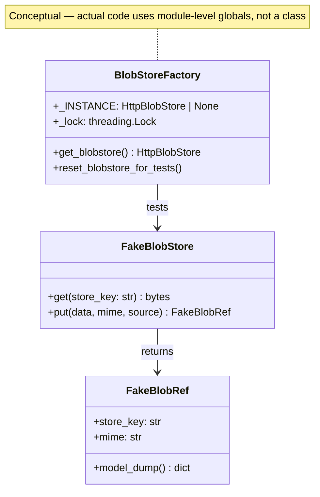

## Context

PR #180 (BlobRef workers V5) merged with a consensus scope split: 6 blockers + SC-test-4 + 4 cheap advisories landed in the PR; 8 remaining advisories were deferred to post-merge polish. This spec covers the resolution of those 8 deferred items across 3 bundles.

Source: `artifacts/analyses/144-blobref-workers-consensus.mdx` (panel: architect, backend-dev, devops; unanimous deferral).

## Goal

Resolve all 8 deferred advisories (A2, A4, A7–A12) such that the codebase passes `uv run ruff check . && uv run ruff format --check . && uv run pyright && uv run pytest` with zero new `/code-review` blockers.

## Users

- **Primary:** voiceCLI maintainers (reduced review friction, safer runtime)
- **Secondary:** Future contributors (cleaner test fixtures, clearer error paths)

## Expected Behavior

### Bundle 1 — Tests infrastructure (A7 + A9)

- `tests/nats/_fakes.py` is importable from `tests/e2e/` without `importlib.util` hack.
- `_FakeBlobRef` (currently duplicated in `test_tts_runner.py`, `test_tts_adapter.py`, `e2e/stub_hub.py`) is extracted to `tests/nats/_fakes.py` or a shared location.

### Bundle 2 — Runtime polish (A2 + A4)

- `adapters/nats/blobs.py`: `get_blobstore()` singleton is thread-safe under concurrent calls using `threading.Lock`.
- `adapters/nats/blobs.py`: `store_key` shape is validated in `blob_ref_to_contract()` (must match `sha256:[a-f0-9]{64}$`); test fake `store_key` values updated to valid shapes.
- `tests/nats/conftest.py`: provides a `reset_blobstore_for_tests()` fixture that clears the singleton between tests.

### Bundle 3 — Single-file nits (A8 + A10 + A11 + A12)

- `tests/e2e/test_nats_roundtrip.py`: `@pytest.mark.skip` on `test_nats_roundtrip` becomes `@pytest.mark.xfail(strict=True)` with the same reason string.
- `tests/nats/test_envelope_validation.py`: `pytest.raises(Exception)` → `pytest.raises(AttributeError)` on both dataclass immutability tests (frozen dataclass raises `AttributeError` on mutation attempt).
- `tests/nats/`: all `_BLOBSTORE_PATCH_PATH` string literals are replaced by a shared constant imported from a single location.
- `tests/e2e/test_nats_roundtrip.py`: removes `tmp_path.iterdir() == []` assertion if present; verify not already removed.

## Data Model & Consumers

### Consumer summary

| Consumer | Fields consumed | When | Status |
|----------|-----------------|------|--------|
| NATS adapters | `get_blobstore()` singleton | Every request | This issue |
| Runner tests | `reset_blobstore_for_tests()` | Test setup | This issue |
| E2E tests | `FakeBlobRef`, `FakeBlobStore` | Test arrangement | This issue |

## Breadboard

| Affordance | Handler | Data | Notes |
|------------|---------|------|-------|
| U1: `get_blobstore()` thread-safe | `blobs.py` — add `threading.Lock` guard | `_INSTANCE` global | A2 |
| U2: `reset_blobstore_for_tests()` | `blobs.py` — expose reset function | `_INSTANCE` global | A2 |
| U3: `store_key` validation | `blobs.py` — regex guard | `store_key` string | A4 |
| U4: `_fakes` importable from e2e | `tests/e2e/conftest.py` or `pythonpath` fix | `_fakes` module | A7 |
| U5: `_FakeBlobRef` dedup | Move to `_fakes.py` | `_FakeBlobRef` class | A9 |
| U6: Skip → xfail | `test_nats_roundtrip.py` | `@pytest.mark.skip` | A8 |
| U7: Exception tightening | `test_envelope_validation.py` | `pytest.raises(Exception)` | A10 |
| U8: Shared patch constant | `tests/nats/` — new constant | `_BLOBSTORE_PATCH_PATH` | A11 |
| U9: Remove E2E cleanup assertion | `test_nats_roundtrip.py` | `tmp_path.iterdir()` | A12 |

## Slices

| # | Slice | Files | Acceptance Criteria |
|---|-------|-------|---------------------|
| 1 | Tests infra refactor | `tests/nats/__init__.py`, `tests/nats/_fakes.py`, `tests/nats/conftest.py`, `tests/e2e/conftest.py`, `tests/nats/test_tts_runner.py`, `tests/nats/test_tts_adapter.py`, `tests/e2e/stub_hub.py` | A7 + A9: `tests/nats/__init__.py` added; `_fakes` importable without `importlib.util`; `_FakeBlobRef` lives in `_fakes.py` only |
| 2 | Runtime polish | `src/voicecli/adapters/nats/blobs.py`, `tests/nats/conftest.py` | A2: singleton uses `threading.Lock`; A4: `store_key` validated in `blob_ref_to_contract()`; test fake store_keys updated; conftest provides reset fixture |
| 3 | Single-file nits | `tests/nats/test_synthesize_client.py`, `tests/nats/test_envelope_validation.py`, `tests/nats/test_stt_runner.py`, `tests/e2e/test_nats_roundtrip.py` | A8: `xfail(strict=True)`; A10: `AttributeError`; A11: shared constant; A12: assertion removed |

## Success Criteria

- [ ] A2 — `get_blobstore()` uses `threading.Lock` to guard `_INSTANCE` creation; `reset_blobstore_for_tests()` exposed for tests
- [ ] A4 — `store_key` validated with `re.match(r"^sha256:[a-f0-9]{64}$", store_key)` in `blob_ref_to_contract()`; all test fake store_keys updated to valid shapes
- [ ] A7 — `tests/e2e/` can import `tests.nats._fakes` via `from tests.nats._fakes import ...` (no `importlib.util` hack)
- [ ] A8 — `test_nats_roundtrip` uses `@pytest.mark.xfail(strict=True)` instead of `@pytest.mark.skip`
- [ ] A9 — `_FakeBlobRef` deduplicated: only one definition in `tests/nats/_fakes.py`
- [ ] A10 — `pytest.raises(Exception)` in `test_envelope_validation.py` tightened to `pytest.raises(AttributeError)`
- [ ] A11 — `_BLOBSTORE_PATCH_PATH` constant shared across all test files that patch `get_blobstore`
- [ ] A12 — Verify `tmp_path.iterdir() == []` assertion is absent from `test_nats_roundtrip.py`; if present, remove it
- [ ] CI green: `uv run ruff check . && uv run ruff format --check . && uv run pyright && uv run pytest`
- [ ] `/code-review` on the polish PR produces zero new blockers
