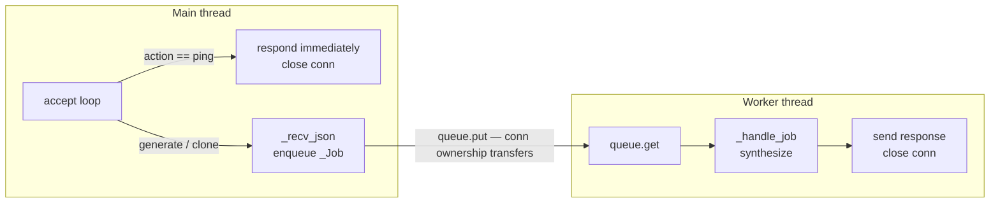

## Context

Promoted from [frame](../frames/31-tts-fifo-queue-frame.mdx). Analysis phase skipped (F-lite).

The TTS daemon currently processes one connection at a time synchronously. Upcoming callers (Lyra voice responses + video generation agents) will make concurrent requests, causing undefined behavior on the single GPU.

## Goal

The TTS daemon serializes all synthesis requests through a FIFO queue so concurrent callers block safely and are processed in arrival order — with zero client-side changes required.

## Users

- **Callers (Lyra, video agents, CLI):** send a request, wait on their socket, receive their result — no change in their code
- **Daemon:** gains a worker thread + queue; accepts connections immediately instead of blocking on synthesis

## Out of Scope

- Async job IDs / status polling
- Priority queue or request cancellation
- Backpressure / queue depth limits — unbounded is an explicit accepted trade-off (future work if needed)
- Observability / queue-depth metrics
- Multi-worker parallelism
- Client-side changes in Lyra or any other caller
- STT daemon

## Expected Behavior

1. Client A connects and sends a `generate` request. The daemon accepts the connection, reads the request, enqueues the job, and keeps the socket open.
2. Client B connects concurrently and sends its own `generate` request. Same: accepted immediately, enqueued, socket stays open.
3. The single worker thread dequeues A's job, synthesizes (GPU-bound, may take 5–30 s), sends the response, closes A's connection.
4. The worker then dequeues B's job and processes it identically.
5. A `ping` request is handled directly in the accept loop — it never enters the queue and responds in <50 ms regardless of queue depth.
6. Errors during synthesis are caught per-job; they return `{"status": "error", "message": "..."}` to the affected caller without affecting other queued jobs. The worker catches all exceptions and continues processing the queue.

**Known limitation:** `_recv_json` in the accept loop is a blocking read. A stalled client can delay connection acceptance. This is a pre-existing issue; it is not introduced by this change and is accepted as a known limitation.

## Data Model & Consumers

| Consumer | Fields used | When | Status |
|----------|------------|------|--------|
| Main thread (accept loop) | `req.action` for fast-path ping | Every connection | This issue |
| Worker thread | `conn`, full `req`, `engines` dict, `fast` flag | After dequeue | This issue |
| Future: priority queue | `req.priority` | On demand | Future (out of scope) |

## Breadboard

| Affordance | Handler | Data | Notes |
|------------|---------|------|-------|
| N0: Worker thread start | `threading.Thread(target=_worker, daemon=True).start()` at daemon init | — | `daemon=True` ensures clean exit when main process stops |
| U1: Client connects | `srv.accept()` in main thread | raw `conn` | |
| U2: Request received | `_recv_json(conn)` in main thread | `req: dict` | Blocking read — known limitation |
| U3: ping action | Respond inline, close conn | `{"status": "ok"}` | Never enters queue |
| U4: generate/clone action | `_queue.put(_Job(conn, req))` then main thread releases `conn` | `_Job` on queue | **Ownership of `conn` transfers to worker; main thread MUST NOT touch `conn` after this point** |
| N1: Worker dequeues | `job = _queue.get()` | `_Job` | Blocks until job available |
| N2: Engine access | `engines[eng_name]` — read/lazy-load inside worker only | `engines` dict (closed over) | **All `engines` mutations must happen in the worker thread only** |
| N3: Synthesis | `_handle_job(job)` — existing logic from `_handle()` | audio file | |
| N4: Response sent | `_send_json(conn, result)` + `conn.close()` | `{"status": "ok", "path": ...}` | |
| N5: Error in synthesis | `_send_json(conn, {"status": "error", ...})` + `conn.close()` | error dict | Worker catches all exceptions, continues queue |

## Slices

| # | Name | Affordances | Demo |
|---|------|-------------|------|
| S1 | Worker thread + queue wiring | N0, U4, N1, N2, N3, N4, N5 | Two concurrent `voice tts` calls both complete and produce distinct audio files |
| S2 | Ping fast path stays in main thread | U1, U2, U3 | `ping` responds in <50 ms while a synthesis is running |
| S3 | Tests: concurrent callers serialize | N1–N5 | pytest: 2 threads call daemon concurrently with mock synthesis delay → both receive `{"status": "ok"}`, audio paths are distinct, responses arrive in FIFO order |

## Success Criteria

- [ ] Two concurrent `generate` requests both return `{"status": "ok", "path": ...}` without error
- [ ] Second caller's socket stays open and receives its response (no connection-refused or timeout)
- [ ] `ping` responds in <50 ms regardless of queue depth (fast path, not queued)
- [ ] Wire protocol unchanged — existing CLI one-shot usage produces identical results
- [ ] Synthesis errors are returned to the affected caller only; worker catches all exceptions and continues processing subsequent jobs
- [ ] Queue is unbounded (`maxsize=0`) — no requests are dropped under backpressure
- [ ] All existing tests pass
- [ ] New tests cover: concurrent callers (FIFO order verified), ping-during-synthesis, per-job error isolation
