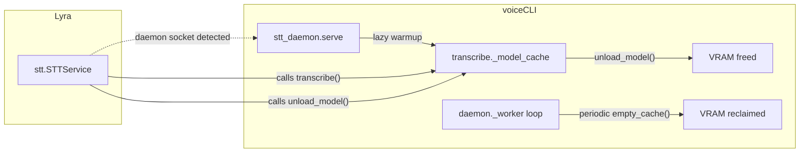

## Context

Promoted from [vram-lifecycle-frame.mdx](../frames/vram-lifecycle-frame.mdx). Analysis skipped (F-lite — clear scope, single domain).

Production RTX 3080 (10 GiB) suffers cascading OOM failures when the TTS daemon (`qwen-fast`, ~5.8–7.3 GiB) and STT daemon (Whisper `large-v3-turbo`, ~2.2 GiB) compete for VRAM with no coordination or cleanup.

## Goal

Eliminate VRAM OOM failures on the production RTX 3080 by adding periodic cleanup, a model unload API, and startup coordination between TTS and STT daemons.

## Users

- **Mickael** — sole Lyra user on Telegram, sends voice messages (STT) and receives TTS responses. Both must work reliably on the 10 GiB production GPU.

## Expected Behavior

1. The TTS daemon reclaims fragmented VRAM after every job by calling `gc.collect()` + `torch.cuda.empty_cache()`. This keeps inter-job VRAM at ~5.8 GiB instead of growing to ~7.3 GiB. Peak VRAM during inference may still reach ~7.3 GiB transiently — cleanup reclaims the overhead after the job finishes.
2. `voicecli.transcribe` exposes an `unload_model()` function that clears the local Whisper model from VRAM and `_model_cache`. Caller is responsible for not calling during active local inference (no internal guard — design choice to keep it simple).
3. Lyra's `STTService` checks for the STT daemon socket (`SOCKET_PATH.exists()`) before each `transcribe()` call. On first detection, it calls `unload_model()` to release its local Whisper copy (~2.3 GiB) and sets an internal flag to skip future checks. If the daemon socket later disappears, the existing daemon-first pattern in `transcribe()` handles fallback: `_try_daemon()` returns `None`, and `_load_model()` re-loads locally.
4. The STT daemon uses lazy warmup (load on first request) instead of eager warmup at startup, avoiding the VRAM race with the TTS daemon's initial load. Model loading is serialized via a `threading.Lock` in `_load_model()` to prevent concurrent first-request races (two threads both seeing `model not in _model_cache` and double-loading).
5. The STT daemon retries model loading on `torch.cuda.OutOfMemoryError` with exponential backoff: 3 retries, initial delay 5s, multiplier 2x (5s → 10s → 20s). Requests arriving during the retry window receive an error response (not queued). After 3 failures, the daemon logs the error and remains running (accepts future requests that will re-trigger a load attempt) instead of going FATAL.

**VRAM budget:** Steady-state (between jobs): TTS ~5.8 GiB + STT ~2.2 GiB = ~8.0 GiB. Peak (during TTS inference): up to ~7.3 GiB + 2.2 GiB = ~9.5 GiB — tight but within the 9.64 GiB limit. The `qwen-fast` model uses ~5.8 GiB for weights; the ~1.5 GiB overhead is PyTorch CUDA allocator cache that `empty_cache()` reclaims after each job.

Note: the `warmup()` function in `transcribe.py` remains as a public convenience (used by callers who want explicit preloading) but is no longer called by the STT daemon at startup.

## Data Model & Consumers

| Consumer | What | When | Status |
|----------|------|------|--------|
| `daemon._worker` | `torch.cuda.empty_cache()` + `gc.collect()` | After every job unconditionally | This issue |
| `transcribe.unload_model()` | Clears `_model_cache`, deletes refs, `empty_cache()` | Called by Lyra or externally | This issue |
| Lyra `STTService` | Calls `unload_model()` | When STT daemon socket appears | This issue |
| `stt_daemon.serve` | Lazy warmup instead of eager | On first transcribe request | This issue |

## Breadboard

### Affordances

| ID | Location | Element | Description |
|----|----------|---------|-------------|
| U1 | `daemon.py` | `_vram_cleanup()` | Function: `gc.collect()` + `torch.cuda.empty_cache()` |
| U2 | `daemon.py` | cleanup call site | After each `_handle_job` in `_worker` loop |
| U3 | `transcribe.py` | `unload_model()` | Public function: clear `_model_cache`, del refs, `empty_cache()` |
| U4 | `stt_daemon.py` | lazy warmup | Remove eager `warmup()` call in `serve()`, load on first request. Serialize via `threading.Lock` in `_load_model()` |
| U5 | `stt_daemon.py` | retry backoff | Catch `torch.cuda.OutOfMemoryError` during model load. 3 retries, 5s initial delay, 2x multiplier. Requests during retry get error response |
| N1 | Lyra `stt/__init__.py` | daemon detection | Per-call `SOCKET_PATH.exists()` check, with `_daemon_detected` flag to skip after first detection |
| N2 | Lyra `stt/__init__.py` | local model release | Call `unload_model()` when daemon becomes available |

### Wiring

| From | To | Trigger |
|------|-----|---------|
| U2 | U1 | `_handle_job` completes |
| N1 | N2 | STT daemon socket detected |
| N2 | U3 | Lyra yields VRAM |
| U4 | U5 | First request triggers `_load_model()` → `OutOfMemoryError` → backoff retry loop (max 3). Success → serve. 3 failures → error response, daemon stays alive for future attempts |

## Slices

| # | Slice | Deliverable | Demo |
|---|-------|-------------|------|
| 1 | TTS VRAM cleanup | `_vram_cleanup()` in `daemon.py`, called after each job in `_worker` | TTS daemon steady-state stays ~5.8 GiB after many requests (check via `nvidia-smi`) |
| 2 | Unload API + load lock | `unload_model()` + `threading.Lock` in `_load_model()` in `transcribe.py` | `from voicecli.transcribe import unload_model; unload_model()` frees ~2.2 GiB (verify via `torch.cuda.mem_get_info()`). Two concurrent `_load_model()` calls → only one loads |
| 3 | STT lazy warmup + retry | Remove eager warmup in `stt_daemon.py`, add OOM backoff retry (3x, 5s/10s/20s) | STT daemon starts instantly, loads model on first request, survives transient OOM. After 3 failures: error response, daemon stays alive |
| 4 | Lyra daemon-aware unload | Lyra `STTService` checks `SOCKET_PATH.exists()` per-call, calls `unload_model()` on first detection, sets flag | Start STT daemon while Lyra holds local Whisper → Lyra releases it, subsequent calls go through daemon. Stop daemon → Lyra re-loads locally on next call (existing fallback) |

Slices 1–3 are in voiceCLI repo. Slice 4 is in Lyra repo (depends on Slice 2 API).

## Success Criteria

- [ ] TTS daemon calls `gc.collect()` + `torch.cuda.empty_cache()` after every `_handle_job` completes (unconditional, no counter/timer)
- [ ] `voicecli.transcribe.unload_model()` exists, clears `_model_cache`, deletes model references, and calls `torch.cuda.empty_cache()`
- [ ] `unload_model()` is a no-op when no model is loaded (no crash)
- [ ] `_load_model()` in `transcribe.py` is protected by a `threading.Lock` — two concurrent calls result in exactly one model load
- [ ] STT daemon starts without eagerly loading the model (lazy warmup on first request)
- [ ] STT daemon catches `torch.cuda.OutOfMemoryError` during model load and retries up to 3 times with exponential backoff (5s → 10s → 20s). Requests during retry receive an error response. After 3 failures, daemon stays alive (does not exit/FATAL)
- [ ] Lyra `STTService` checks `SOCKET_PATH.exists()` before each `transcribe()` call. On first detection, calls `unload_model()` and sets `_daemon_detected = True` (skips future checks)
- [ ] After `unload_model()`, `_model_cache` is empty and `torch.cuda.mem_get_info()` shows no Whisper-sized VRAM allocation in Lyra's process. Subsequent `transcribe()` calls route through the daemon socket (verified: `_try_daemon()` returns a result, `_load_model()` is not called)
- [ ] If STT daemon socket disappears after Lyra has unloaded, `transcribe()` falls back to local `_load_model()` automatically (existing daemon-first pattern, no new code needed — but must not break)
- [ ] Production RTX 3080: both daemons running + `voicecli transcribe <file>` completes successfully. `nvidia-smi` shows combined steady-state (between jobs) below 9.0 GiB

## Known Risks

- **Peak VRAM during TTS inference** can reach ~7.3 GiB + STT 2.2 GiB = ~9.5 GiB — within the 9.64 GiB limit but tight. If this proves insufficient under real load, a follow-up could add `empty_cache()` mid-inference or reduce chunk sizes.
- **`empty_cache()` latency under high TTS request rate** — the call adds a few ms per job. If latency becomes noticeable, a counter-based approach (every N jobs) can replace the unconditional call without changing the API.
