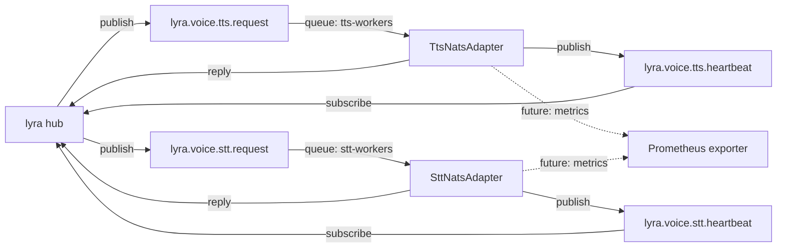

## Context

Source: [42-nats-serve-analysis.mdx](../analyses/42-nats-serve-analysis.mdx) (approved).
Sibling artifacts (on the lyra side, both approved):
- `lyra/artifacts/specs/658-voicecli-nats-decouple-spec.mdx` — Slice S2 names this issue as its pre-req; Slice S3 is the Machine-1 cutover blocked on this.
- `lyra/artifacts/plans/688-voicecli-contract-adr-plan.mdx` — froze ADR-044 and added `contract_version: "1"` to all 4 lyra-side producers/consumers; ADR mandates **consumers MUST ignore unknown `contract_version` values** for forward-compat.
Shape chosen: **Shape 1** — port lyra's NATS mini-framework into `src/voicecli/nats/`; build two concrete async adapters.

## Goal

Ship `voicecli nats-serve {tts,stt}`: a new CLI mode that authenticates to NATS with an nkey, joins the ADR-044 queue group, answers `lyra.voice.{stt,tts}.request` with base64 audio / text, and emits ≤ 5 s heartbeats — without regressing the existing socket daemons or the default install path.

## Users

- **Primary:** voiceCLI operators who deploy worker processes on GPU hosts (roxabituwer prod, roxabitower dev). They run `voicecli nats-serve {tts,stt}` under supervisord alongside or instead of `tts-serve` / `stt-serve`.
- **Secondary:** lyra hub (lyra#658) — consumes the NATS contract; cannot begin Machine-1 cutover (lyra#689) until this mode is deployable.

## Expected Behavior

### Startup

1. Operator runs `voicecli nats-serve tts --engine qwen-fast` (or `nats-serve stt --model large-v3-turbo`).
2. **Config precedence for engine/model:** CLI flag > env var (`VOICECLI_ENGINE` for TTS, `VOICECLI_MODEL` for STT; `LYRA_TTS_ENGINE` accepted as alias for `VOICECLI_ENGINE` for the lyra#658 S3 cutover) > `voicecli.toml` > hardcoded default. Same precedence for `--max-concurrent` (`VOICECLI_MAX_CONCURRENT`), `--heartbeat-interval` (`VOICECLI_HEARTBEAT_INTERVAL`), `--drain-timeout` (`VOICECLI_DRAIN_TIMEOUT`).
3. Satellite reads `NATS_URL`, `NATS_NKEY_SEED_PATH`, and optional `NATS_CA_CERT` from env. nkey seed file (NATS ed25519 credential) must be `0600`; permission check fails loudly otherwise.
4. **VRAM sequencing guard:** if the corresponding socket-daemon socket exists (`~/.local/share/voicecli/daemon.sock` for TTS, `~/.local/share/voicecli/stt-daemon.sock` for STT), the guard attempts a non-blocking `connect()` to it. **Only a live daemon aborts** — stale socket files (post-crash / post-reboot) are detected by `ECONNREFUSED` on connect, logged at INFO as "stale socket ignored", and startup proceeds. A live daemon aborts with exit code `78` (`EX_CONFIG`; see shutdown/restart section) unless `--allow-coexist` is passed.
5. Satellite connects to NATS, subscribes to `lyra.voice.{mode}.request` with queue group `{mode}-workers`, starts the heartbeat loop on `lyra.voice.{mode}.heartbeat`.
6. Engine is lazy-loaded on first request (same pattern as existing daemon). Satellite logs "ready" once NATS subscription is active (NOT once the engine is loaded — heartbeats must start flowing before first inference). First heartbeat therefore carries `model_loaded: null`; this is accepted by lyra hub (confirmed: `nats_{stt,tts}_client._on_heartbeat` only reads `worker_id`).

### Request handling (happy path)

1. NATS message arrives on the adapter's message callback (runs on the asyncio event loop).
2. Adapter parses payload, validates required fields (see "Contract version handling" below — the `contract_version` field is NOT validated), decodes base64 audio (STT only).
3. Concurrency guard: acquire per-mode `asyncio.Semaphore` (default: TTS=1, STT=2 — configurable via `--max-concurrent`). If `--reject-when-full` is set and the semaphore would block, reply immediately with `capacity_exceeded`; otherwise await.
4. **Inside the semaphore** (critical for cleanup safety): create per-request temp file at `/tmp/voicecli-nats/{request_id}.{ext}` → run engine on a thread pool (`asyncio.loop.run_in_executor`) so the event loop keeps draining heartbeats and new messages → read output WAV / transcription result → base64-encode → build reply via `build_reply(ok=True, **fields)` → publish to `msg.reply` → **delete temp file** → release semaphore. Failure paths follow the same teardown order: temp file is always removed before the semaphore is released.
5. Default thread-pool size matches the semaphore capacity (TTS=1 worker, STT=2 workers) so the pool cannot queue requests behind the semaphore.

### Request handling (errors)

Reply with `{contract_version: "1", request_id, ok: false, error: <code>}` where `<code>` ∈:

| Code | Trigger |
|---|---|
| `model_load_failed` | Engine lazy-load raised |
| `audio_decode_failed` | STT: base64 decode or codec parse failed |
| `transcription_failed` | STT: inference raised |
| `synthesis_failed` | TTS: inference raised |
| `engine_unavailable` | Request asked for an engine not installed in this extras profile |
| `payload_too_large` | NATS publish failed with `max_payload` exceeded |
| `capacity_exceeded` | `--reject-when-full` and semaphore held |
| `malformed_request` | Required field missing (including `request_id`) |

**Contract version handling (defensive read per ADR-044).** Incoming `contract_version` is **not validated**: if it is missing or has any value other than `"1"`, the satellite logs WARN once per worker (rate-limited) and **proceeds normally**. All outgoing payloads (replies and heartbeats) stamp `contract_version: "1"`. This matches lyra hub's behavior tested in lyra#688 T7.

**Explicit override of the ported base class.** Lyra's `_version_check.check_schema_version` (which lives in the mini-framework we're porting) **drops** messages whose version exceeds the expected value, emitting a rate-limited ERROR. The voicecli port **does not apply** `check_schema_version` to the ADR-044 `contract_version` field on incoming voice requests — it applies only to any future `schema_version` envelope field. Implementers must wire the voice adapters to bypass `_validate_envelope`'s version check for `contract_version`, or the defensive-read behavior required by ADR-044 breaks.

Errors log at WARN (request-level) with `request_id`; crashes log at ERROR and do NOT kill the process.

### Heartbeat

Every 5 s (configurable via `--heartbeat-interval`), publish to `lyra.voice.{mode}.heartbeat`:

```json
{
  "contract_version": "1",
  "worker_id": "<mode>-<hostname>-<pid>-<startup_ts>",
  "service": "<mode>_workers",
  "host": "<hostname>",
  "subject": "lyra.voice.<mode>.request",
  "queue_group": "<mode>-workers",
  "ts": <unix_epoch_float>,
  "model_loaded": "<engine_name_or_null>",
  "vram_used_mb": <int>,
  "vram_total_mb": <int>,
  "active_requests": <int>
}
```

### Shutdown & exit codes

| Code | Meaning | Supervisord behavior |
|---|---|---|
| 0 | Clean shutdown; in-flight requests drained within `--drain-timeout` | Do not restart |
| 3 | Drain timeout exceeded (in-flight request didn't finish in time) | Restart (transient fault) |
| 78 (`EX_CONFIG`) | VRAM-sequencing guard detected a live socket daemon | Do not restart — operator action required |

SIGTERM / SIGINT → set `stop` event → unsubscribe NATS → await in-flight requests (timeout: `--drain-timeout`, default 30 s) → publish a final heartbeat with `model_loaded: null, active_requests: 0` → disconnect → exit 0. If drain timeout hits, exit 3.

**Supervisord requirement for operators:** the `voicecli_{stt,tts}` program in `deploy/supervisor/conf.d/*.conf` on lyra-stack must set `autorestart=unexpected` + `exitcodes=0,78` so a coexistence-guard abort (78) does NOT loop-restart. Documented in `docs/NATS-SERVE.md` (Slice 2).

### Coexistence

- `--allow-coexist` disables the startup VRAM-sequencing guard. Use on local dev only.
- `nats-serve` NEVER touches `~/.local/share/voicecli/*.sock`. The two daemons are independent processes.

### Heartbeat VRAM fields

`vram_used_mb` / `vram_total_mb` come from `pynvml` (lazy import). On CPU-only boxes or when `pynvml` / NVIDIA driver is unavailable, the satellite emits these keys as `null` rather than omitting them. `pynvml` ships in the `nats` extra (see "Install & ops") so CPU-only CI does not hard-fail on import.

## Data Model & Consumers

### Message schema

**Frozen by ADR-044 (lyra#688).** Field-level tables for STT/TTS request, reply-ok, reply-err, and heartbeat live in the analysis doc (`../analyses/42-nats-serve-analysis.mdx#adr-044-schema-verbatim`). Any field change requires a `contract_version` bump in lyra first. This spec is the implementation-side view; it does not redefine the schema.

### Consumer map



Solid edges ship in this issue; dashed = future (out of scope, but heartbeat fields are designed to feed a metrics scrape later).

### Consumer summary

| Consumer | Fields consumed | When | Status |
|---|---|---|---|
| lyra hub (`nats_tts_client.py`) | TTS reply: `audio_b64`, `mime_type`, `duration_ms`, `request_id`, `ok`, `error` | Every request | This issue |
| lyra hub (`nats_stt_client.py`) | STT reply: `text`, `language`, `duration_seconds`, `request_id`, `ok`, `error` | Every request | This issue |
| lyra hub (health dashboard) | Heartbeat: `worker_id`, `ts`, `model_loaded`, `vram_used_mb`, `active_requests` | Every 5 s | This issue |
| Prometheus exporter (future) | Heartbeat: `vram_used_mb`, `vram_total_mb`, `active_requests` | Scrape | Future |

## Breadboard

### Affordances

| Group | ID | Affordance | Handler | Data |
|---|---|---|---|---|
| NATS | N1 | Subscription on `lyra.voice.{mode}.request` | adapter base `run()` → message callback → `handle(msg, payload)` | `{STT,TTS}Request` |
| NATS | N2 | Publish on `msg.reply` | adapter base `reply(msg, data: bytes)` | `{STT,TTS}Reply{OK,Err}` |
| NATS | N3 | Publish on `lyra.voice.{mode}.heartbeat` | adapter base heartbeat loop | `Heartbeat` |
| NATS | N4 | Connect with nkey + TLS | `voicecli.nats.connect.nats_connect()` | `NATS_URL`, `NATS_NKEY_SEED_PATH`, `NATS_CA_CERT` |
| CLI | U1 | `voicecli nats-serve tts` | `cli.nats_serve_tts()` → `TtsNatsAdapter(...).run()` | engine, flags, env |
| CLI | U2 | `voicecli nats-serve stt` | `cli.nats_serve_stt()` → `SttNatsAdapter(...).run()` | model, flags, env |
| Internal | S1 | TTS engine execution (thread pool) | `TtsNatsAdapter.handle()` → thread pool runs `api.generate`/`api.clone` | request payload → `TTSResult` |
| Internal | S2 | STT transcription (thread pool) | `SttNatsAdapter.handle()` → thread pool runs `api.transcribe` | request payload → `TranscriptionResult` |
| Internal | S3 | Concurrency semaphore | `asyncio.Semaphore(max_concurrent)` acquired in adapter dispatch | `--max-concurrent` |
| Internal | S4 | Reply builder | `voicecli.nats.reply.build_reply(ok, **fields)` | stamps `contract_version` + `request_id` |
| Internal | S5 | Temp-file manager | `voicecli.nats.tempdir.scoped_path(request_id, ext)` | `request_id` → `/tmp/voicecli-nats/{request_id}.{ext}` |
| Internal | S6 | VRAM-sequencing guard (connect-probe, not stat) | `cli._probe_socket_daemon(mode)` | Returns `live | stale | absent` |
| Internal | S7 | Graceful shutdown | adapter base `stop` event + signal handlers | SIGTERM/SIGINT |
| Internal | S8 | Mock engine (test-only) | `voicecli.engines.mock.MockEngine` returns pre-baked 1s silent WAV | Gate for CI E2E without GPU |
| Internal | S9 | VRAM probe | `voicecli.nats.nvml.read_vram() -> (used_mb, total_mb) \| (None, None)` | Lazy `pynvml` import; returns nulls on failure |

### Wiring

`U1/U2` → build adapter → adapter `run()` → `nats_connect()` (N4) → subscribe (N1) → start heartbeat loop (N3) → on message: acquire S3 → S5 (STT only) → S1/S2 via executor → S4 → N2 → release S3 → S5 cleanup.

## Slices

Vertical, independently demo-able increments. Each slice is a PR candidate; the plan may merge or split them.

| # | Slice | Affordances | Demo |
|---|---|---|---|
| 1 | **TTS path (scaffold + adapter + CLI + operator doc)**: port `adapter_base`, `connect`, `queue_groups`, `_validate`, `_version_check`, VRAM-sequencing guard, reply builder, temp-file manager, NVML probe. Add `nats` extra (`nats-py>=2.6,<3`, `nkeys>=0.1`, `pynvml>=11.5`) to `pyproject.toml`. Build `TtsNatsAdapter` + `nats-serve tts` CLI with env-var precedence. Ship a minimal `docs/NATS-SERVE.md` covering env vars, the VRAM-sequencing guard, exit codes, and the required supervisord stanza (`autorestart=unexpected`, `exitcodes=0,78`) — landing the operator doc in Slice 1 so lyra#658 S3 runbook can reference it. | N1-N4 (TTS), U1, S1, S3-S7, S9 | Live: publish TTS request via `nats-cli`, receive base64 audio; heartbeat visible. `docs/NATS-SERVE.md` exists. |
| 2 | **STT adapter + `nats-serve stt` CLI**: concrete `SttNatsAdapter`, per-request language-detection overrides. | N1-N4 (STT), U2, S2, S3-S7, S9 | Live: publish base64 audio, receive text. |
| 3 | **Mock engine + stub-hub docker-compose E2E**: add `MockEngine` (S8) to the engine registry, gated behind a test-only entry (not exposed via `--engine` for end users). Ship `tests/e2e/docker-compose.nats.yml` (NATS container + stub hub + `nats-serve`) + `conftest.py` fixture that generates a throwaway nkey seed pair per run, writes it to a tmp file, and renders `nats-server.conf` with the matching pubkey. Stub hub publishes one TTS and one STT request, asserts replies match ADR-044 schema. | S8, end-to-end | `pytest tests/e2e/test_nats_roundtrip.py` green on `ubuntu-latest` (no GPU). |
| 4 | **Optional real-hub compose + SKILL.md update**: ship `tests/e2e/docker-compose.real-hub.yml` (not run in CI) referencing a lyra hub image path operators can set via env. Extend `docs/NATS-SERVE.md` with a `## Local real-hub E2E` section. Update `skills/voice/SKILL.md` and `CLAUDE.md` VRAM gotcha section. | docs | `docs/NATS-SERVE.md` has a `## Local real-hub E2E` header. `grep -q nats-serve skills/voice/SKILL.md`. |

## Success Criteria

### Functional

- [ ] `voicecli nats-serve tts --engine <engine>` starts, connects to NATS, subscribes to `lyra.voice.tts.request` with queue group `tts-workers`.
- [ ] `voicecli nats-serve stt --model <model>` starts, connects to NATS, subscribes to `lyra.voice.stt.request` with queue group `stt-workers`.
- [ ] A well-formed STT request produces a reply matching the ADR-044 STT success schema with `ok: true`, non-empty `text`, populated `language` and `duration_seconds`.
- [ ] A well-formed TTS request produces a reply matching the ADR-044 TTS success schema with `ok: true`, base64-decodable `audio_b64`, `mime_type`, and `duration_ms`.
- [ ] Every reply and heartbeat carries `contract_version: "1"`; every reply echoes the request's `request_id`.
- [ ] A request carrying `contract_version: "999"` is handled normally (defensive-read test — mirrors lyra#688 T7).
- [ ] A malformed or failing request produces a reply with `ok: false` and an `error` code from the fixed vocabulary listed in "Request handling (errors)".
- [ ] Per-request STT language-detection overrides (`language_detection_threshold`, `language_detection_segments`, `language_fallback`) are applied on that request only and do not mutate satellite global state.
- [ ] Per-request TTS `engine` field overrides the satellite's startup engine; if the requested engine is unavailable, reply carries `error: "engine_unavailable"`.

### Liveness & reliability

- [ ] Heartbeat on `lyra.voice.{mode}.heartbeat` fires every ≤ 5 s with `contract_version`, `worker_id`, `service`, `host`, `subject`, `queue_group`, `ts` always populated.
- [ ] Heartbeat includes `model_loaded`, `active_requests` keys on every emission (value may be `null` / `0`); `vram_used_mb` and `vram_total_mb` keys are also always emitted, with value `null` when `pynvml` is unavailable.
- [ ] Heartbeats continue firing while an inference is in-flight (event loop never blocks on engine work).
- [ ] SIGTERM with in-flight request completing within 30 s: final heartbeat with `model_loaded: null, active_requests: 0` published, exit 0.
- [ ] SIGTERM with in-flight request NOT completing within `--drain-timeout`: exit 3.
- [ ] Concurrent in-flight requests do not exceed `--max-concurrent` (defaults: TTS=1, STT=2).
- [ ] `--reject-when-full` (and `VOICECLI_REJECT_WHEN_FULL=1`) causes a request arriving when the semaphore is held to reply with `ok: false, error: "capacity_exceeded"` instead of queueing.
- [ ] `--allow-coexist` (and `VOICECLI_ALLOW_COEXIST=1`) bypasses the VRAM-sequencing guard; without it, starting alongside a live socket daemon exits 78 (`EX_CONFIG`).
- [ ] Stale socket files (present on disk but no live listener) do NOT trigger the guard — they are logged at INFO and startup proceeds.
- [ ] Two simultaneous requests do not race on the same temp file (different `request_id` → different `/tmp/voicecli-nats/` paths).
- [ ] `--max-concurrent`, `--heartbeat-interval`, `--drain-timeout`, `--engine` / `--model` each read their listed env-var fallback when the CLI flag is absent.

### Coexistence & install

- [ ] Existing `voicecli tts-serve` and `voicecli stt-serve` commands pass their current test suite unchanged.
- [ ] Starting `nats-serve tts` while `tts-serve`'s socket exists aborts with exit code 78 (`EX_CONFIG`) (unless `--allow-coexist`).
- [ ] `uv pip install --all-extras` succeeds and pulls in `nats-py>=2.6` + `nkeys>=0.1`.
- [ ] Default install (`uv pip install .`) does NOT pull `nats-py` or `nkeys`.

### Gate (E2E)

- [ ] `tests/e2e/docker-compose.nats.yml` brings up NATS + stub hub + `nats-serve` and `pytest tests/e2e/test_nats_roundtrip.py` passes on `ubuntu-latest` in CI, using `MockEngine` for the engine layer (no GPU).
- [ ] The E2E fixture generates a throwaway nkey seed pair per run, writes the seed to a tmp file with 0600 perms, renders `nats-server.conf` with the matching pubkey, and exports `NATS_NKEY_SEED_PATH` to the satellite container.
- [ ] `tests/e2e/docker-compose.real-hub.yml` exists and `docs/NATS-SERVE.md` contains a `## Local real-hub E2E` section explaining how to point it at a lyra hub image.

## Edge cases handled

| Edge case | Handling |
|---|---|
| NATS disconnect mid-request | Engine call completes; reply fails silently (hub timeouts and retries). Satellite reconnects via nats-py reconnect logic. |
| Reply payload > NATS max_payload | Catch publish error, log WARN, publish `payload_too_large` error reply instead. |
| Two satellites of same mode on same host | NATS queue group ensures each request goes to one worker; heartbeats distinguish via `worker_id` (includes pid). |
| nkey seed file has wrong permissions | Abort on startup with clear message (port of lyra's `_read_nkey_seed` check). |
| Engine lazy-load fails on first request | Reply `model_load_failed`; satellite stays up (subsequent requests retry the load). |
| Request `contract_version` != "1" or missing | Defensive read per ADR-044: log WARN once (rate-limited), proceed with request. Outgoing reply still carries `contract_version: "1"`. |
| `request_id` missing | Reply cannot echo a request_id; publish `ok: false, error: "malformed_request"` with `request_id: ""` and log WARN. |
