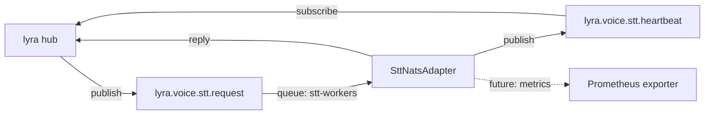

## Context

Source: [44-nats-serve-stt-frame.mdx](../frames/44-nats-serve-stt-frame.mdx) (approved).

Parent context (already shipped in slice V1 / PR #43, merged `adbf37d`):
- [42-nats-serve-spec.mdx](./42-nats-serve-spec.mdx) — defines the full message schema, adapter base, heartbeat/shutdown/exit-code semantics, VRAM-sequencing guard, install/ops. **Still the source of truth** for any detail not re-stated here.
- `src/voicecli/nats/{base,connect,reply,tempdir,nvml,queue_groups,_validate,_version_check}.py` — ported framework, reusable as-is.
- `src/voicecli/nats/tts_adapter.py` — reference implementation to mirror.
- `tests/nats/test_tts_adapter.py` — 12-case test structure to mirror.
- `docs/NATS-SERVE.md` — operator doc with env vars + exit codes; this slice adds an STT section.

Sibling cutover (blocking this):
- `lyra#689` (slice S3 of parent `lyra#658`) — Machine-1 cutover runbook. Body: *"voicecli nats-serve must be merged + deployable before this cutover."*

Shape: **pure mirror** of slice V1. New files only; zero changes to the ported NATS framework. One minimal signature extension to `api.transcribe()` to pass per-request language-detection overrides to the underlying `transcribe.transcribe()` (already supports them).

## Goal

Ship `voicecli nats-serve stt --model <model>`: a second NATS satellite that subscribes to `lyra.voice.stt.request` (queue `stt-workers`), runs `api.transcribe()` on a thread pool, replies with the ADR-044 STT schema, emits `lyra.voice.stt.heartbeat`, and aborts with exit 78 if the `stt-serve` Unix-socket daemon is live.

## Users

- **Primary:** voiceCLI operators on `roxabituwer` who will run `voicecli nats-serve stt` under supervisord alongside the TTS satellite. CLI shape must be symmetric with slice V1 (same env vars for NATS, max-concurrent, heartbeat, drain-timeout; `--model` replaces `--engine`).
- **Secondary:** lyra hub (`lyra#689` slice S3) — blocked on this subscriber existing before Machine-1 cutover.

## Expected Behavior

### Startup

1. Operator runs `voicecli nats-serve stt --model large-v3-turbo`.
2. **Config precedence (symmetric with slice V1):**

   | Option | CLI flag | Env var | TOML | Default |
   |---|---|---|---|---|
   | Model | `--model` | `VOICECLI_MODEL` | `[stt].model` | `large-v3-turbo` |
   | Max concurrent | `--max-concurrent` | `VOICECLI_MAX_CONCURRENT` | — | `2` |
   | Heartbeat interval | `--heartbeat-interval` | `VOICECLI_HEARTBEAT_INTERVAL` | — | `5.0 s` |
   | Drain timeout | `--drain-timeout` | `VOICECLI_DRAIN_TIMEOUT` | — | `30.0 s` |
   | Allow coexist | `--allow-coexist` | `VOICECLI_ALLOW_COEXIST` | — | `false` |
   | Reject when full | `--reject-when-full` | `VOICECLI_REJECT_WHEN_FULL` | — | `false` |

   NATS auth (`NATS_URL`, `NATS_NKEY_SEED_PATH`, `NATS_CA_CERT`) is unchanged from slice V1.
3. Satellite reads `NATS_URL`, `NATS_NKEY_SEED_PATH`, optional `NATS_CA_CERT` (identical to slice V1).
4. **VRAM-sequencing guard:** non-blocking `connect()` on `~/.local/share/voicecli/stt-daemon.sock`. Live daemon → exit 78 (`EX_CONFIG`) unless `--allow-coexist`. Stale socket file → INFO log, proceed. Mirror of slice V1 logic, different socket path.
5. Satellite connects, subscribes to `lyra.voice.stt.request` with queue group `stt-workers`, starts the heartbeat loop on `lyra.voice.stt.heartbeat`.
6. Model is lazy-loaded on first request. Satellite logs "ready" once NATS subscription is active (before first inference). First heartbeat carries `model_loaded: null`.

### Request handling (happy path)

1. NATS message arrives on the adapter callback (event loop).
2. Adapter validates required fields: `request_id` (non-empty, `^[A-Za-z0-9_-]{1,128}$`), `audio_b64` (non-empty string).
3. Concurrency guard: acquire per-mode `asyncio.Semaphore` (default `--max-concurrent=2`). `--reject-when-full` + full semaphore → reply `capacity_exceeded`.
4. Inside the semaphore:
   - base64-decode `audio_b64` → write to `/tmp/voicecli-nats/{request_id}.{ext}` (ext derived from `mime_type`, default `wav`) via `tempdir.scoped_path(...)`.
   - Build per-request override dict from optional fields: `language`, `language_detection_threshold`, `language_detection_segments`, `language_fallback`. Non-null values only.
   - Run `api.transcribe(path, model=self.default_model, _skip_daemon=True, **overrides)` on the thread pool (`loop.run_in_executor(self._executor, fn)`). `_skip_daemon=True` is mandatory: without it, `transcribe.transcribe()` would silently route through `stt-serve`'s Unix-socket daemon when it is live (under `--allow-coexist`), making `--model` a no-op and desynchronising `self.model_loaded` telemetry. The NATS satellite owns its own model; it must never delegate to the socket daemon.
   - Read `TranscriptionResult`: extract `text`, `language`, `duration_seconds`.
   - `build_reply(ok=True, request_id=..., text=..., language=..., duration_seconds=...)` → publish to `msg.reply`.
   - Cleanup temp file (always, even on failure) before releasing the semaphore.
5. Default thread-pool size = `max_concurrent` (same invariant as slice V1).

### Request handling (errors)

Reply with `{contract_version: "1", request_id, ok: false, error: <code>}`:

| Code | Trigger |
|---|---|
| `malformed_request` | `request_id` missing/invalid, `audio_b64` missing/not-string |
| `audio_decode_failed` | base64 decode or audio parse raised |
| `model_load_failed` | Model lazy-load raised |
| `transcription_failed` | `api.transcribe()` raised |
| `capacity_exceeded` | `--reject-when-full` and semaphore held |
| `payload_too_large` | Reply publish failed with `max_payload` exceeded |

**Contract version handling:** unchanged from slice V1 — defensive read, never validate, always stamp `"1"` on outgoing.

### Heartbeat

Every 5 s (configurable), publish to `lyra.voice.stt.heartbeat`:

```json
{
  "contract_version": "1",
  "worker_id": "stt-<hostname>-<pid>-<startup_ts>",
  "service": "stt_workers",
  "host": "<hostname>",
  "subject": "lyra.voice.stt.request",
  "queue_group": "stt-workers",
  "ts": <unix_epoch_float>,
  "model_loaded": "<model_name_or_null>",
  "vram_used_mb": <int_or_null>,
  "vram_total_mb": <int_or_null>,
  "active_requests": <int>
}
```

### Shutdown & exit codes

Unchanged from slice V1: `0` (clean drain), `3` (drain timeout), `78` (coexistence guard abort).

### Per-request language-detection overrides

The ADR-044 STT request schema allows three optional per-request overrides. Each is applied to a single request and **must not** mutate satellite state or leak to subsequent requests:

| Field | Type | Effect |
|---|---|---|
| `language_detection_threshold` | `float` | Min probability to accept detected language (else fallback) |
| `language_detection_segments` | `int` | How many initial segments to sample for detection |
| `language_fallback` | `str` | Language code to use if detection confidence too low |

Implementation: the adapter builds a kwargs dict of non-null values and passes them as keyword args to `api.transcribe()`. `api.transcribe()` forwards them to `transcribe.transcribe()` (which already accepts these three parameters — see `src/voicecli/transcribe.py:115`). The adapter never stores these on `self`, guaranteeing no cross-request leakage.

**Signature extension to `api.transcribe()`:** add the three optional override kwargs (`language_detection_threshold`, `language_detection_segments`, `language_fallback`) plus a private `_skip_daemon: bool = False` kwarg, all with safe defaults. Forward all four to `transcribe.transcribe()` (the three override kwargs already exist there; `_skip_daemon` is a new param on `transcribe.transcribe()` that bypasses the `_try_daemon()` call). Backward-compatible — existing CLI callers pass none of them.

## Data Model & Consumers

### Request / reply schema (frozen by ADR-044, unchanged from slice V1)

Full field tables live in [42-nats-serve-analysis.mdx#adr-044-schema-verbatim](../analyses/42-nats-serve-analysis.mdx). Fields relevant to this slice:

**Request (`lyra.voice.stt.request`):**

| Field | Type | Required | Notes |
|---|---|---|---|
| `contract_version` | `str` | no | Defensive read; accepted as-is |
| `request_id` | `str` | yes | `^[A-Za-z0-9_-]{1,128}$` |
| `audio_b64` | `str` | yes | base64-encoded audio |
| `mime_type` | `str` | no | Drives temp-file extension; default `audio/wav` |
| `language` | `str?` | no | ISO code (force, skip detection) |
| `language_detection_threshold` | `float?` | no | Per-request override |
| `language_detection_segments` | `int?` | no | Per-request override |
| `language_fallback` | `str?` | no | Per-request override |

**Reply-ok:**

| Field | Type | Notes |
|---|---|---|
| `contract_version` | `"1"` | Always stamped |
| `request_id` | `str` | Echoed |
| `ok` | `true` | |
| `text` | `str` | Transcription |
| `language` | `str` | Detected/forced language code |
| `duration_seconds` | `float` | Audio duration |

**Reply-err:** `{contract_version: "1", request_id, ok: false, error: <code>}` where `<code>` is from the table above.

### Consumer map



Solid = this slice. Dashed = future (heartbeat VRAM fields, out of scope).

### Consumer summary

| Consumer | Fields consumed | When | Status |
|---|---|---|---|
| lyra hub (`nats_stt_client.py`) | Reply: `text`, `language`, `duration_seconds`, `request_id`, `ok`, `error` | Every request | This slice |
| lyra hub (health dashboard) | Heartbeat: `worker_id`, `ts`, `model_loaded`, `vram_used_mb`, `active_requests` | Every 5 s | This slice |

## Breadboard

### Affordances (new in this slice only)

| Group | ID | Affordance | Handler | Data |
|---|---|---|---|---|
| NATS | N1 | Subscription on `lyra.voice.stt.request` | `SttNatsAdapter.handle()` via ported base | `STTRequest` |
| NATS | N2 | Publish on `msg.reply` | base `reply()` | `STTReply{OK,Err}` |
| NATS | N3 | Publish on `lyra.voice.stt.heartbeat` | base heartbeat loop | `Heartbeat` |
| CLI | U1 | `voicecli nats-serve stt` | `cli.nats_serve_stt()` → `SttNatsAdapter(...).run()` | model, flags, env |
| Internal | S1 | STT transcription (thread pool) | `SttNatsAdapter._run_transcription()` → `api.transcribe()` | payload → `TranscriptionResult` |
| Internal | S2 | Per-request override dict builder | adapter `handle()` → pass non-null overrides as kwargs | 3 optional fields |
| Internal | S3 | VRAM-sequencing guard probe (STT socket) | `cli._probe_socket_daemon("stt")` (extend slice V1 helper) | `stt-daemon.sock` |
| API | A1 | `api.transcribe(..., language_detection_threshold=None, language_detection_segments=None, language_fallback=None)` | forward to `transcribe.transcribe()` | new kwargs |

### Reused from slice V1 (framework: zero changes)

- `NatsAdapterBase`, `nats_connect()`, `build_reply()`, `scoped_path()` / `cleanup()`, `read_vram()`
- Heartbeat loop, shutdown/drain logic, exit codes, `--allow-coexist`, `--reject-when-full`
- CLI `nats_app` Typer sub-app and its shared option defaults

Note: `_probe_socket_daemon()` (CLI helper introduced in slice V1) is **extended**, not reused as-is — it gains an argument selecting the socket path for TTS vs STT (see affordance `S3`). This is the only framework-adjacent change in this slice.

### Wiring

`U1` → resolve model via precedence → build `SttNatsAdapter` → `run()` → `nats_connect()` → subscribe N1 → start heartbeat N3 → on message: validate → build override dict (S2) → acquire semaphore → `scoped_path` → `api.transcribe()` via executor (S1) → `build_reply` → `reply` N2 → cleanup temp → release semaphore.

## Slices

Single slice — this issue **is** slice V2. No further subdivision.

| # | Slice | Affordances | Demo |
|---|---|---|---|
| 1 | **STT subscriber + CLI + test + docs**: `SttNatsAdapter`, `nats-serve stt` CLI, `api.transcribe()` kwargs extension, `test_stt_adapter.py` (12 cases mirror), `docs/NATS-SERVE.md` STT section. | N1-N3, U1, S1-S3, A1 | `voicecli nats-serve stt --model large-v3-turbo` starts, `pytest tests/nats/test_stt_adapter.py` green, manual round-trip via `nats-cli` publish returns transcription reply. |

## Success Criteria

### Functional

- [ ] `voicecli nats-serve stt --model <model>` starts, connects to NATS, subscribes to `lyra.voice.stt.request` with queue group `stt-workers`.
- [ ] A well-formed STT request (non-empty `request_id`, valid base64 `audio_b64`) produces a reply with `ok: true`, `contract_version: "1"`, non-empty `text`, populated `language` and `duration_seconds`.
- [ ] A request with invalid/missing `request_id` or `audio_b64` produces `ok: false, error: "malformed_request"`.
- [ ] A request with `language` forced (e.g., `"en"`) produces a reply whose `language` field equals that value (lyra hub uses this for routing — cf. lyra#689 runbook).
- [ ] A request whose `audio_b64` fails to base64-decode or parse as audio produces `ok: false, error: "audio_decode_failed"`.
- [ ] A request whose transcription raises produces `ok: false, error: "transcription_failed"` and does not kill the process.
- [ ] A request carrying `contract_version: "999"` (or missing) is handled normally (defensive read).
- [ ] Every reply echoes the request's `request_id`.

### Per-request overrides

- [ ] A request carrying `language_detection_threshold`, `language_detection_segments`, or `language_fallback` has those values applied to that request only.
- [ ] A second request omitting those fields is unaffected by the first (no state leakage). Asserted by a test that fires two requests **sequentially** through the same adapter instance and verifies the second call's kwargs do not contain the first's override values.
- [ ] `api.transcribe()` accepts the three new kwargs and forwards them to `transcribe.transcribe()`; existing callers (CLI `voicecli transcribe`) continue to work unchanged.

### Liveness & reliability

- [ ] Heartbeat on `lyra.voice.stt.heartbeat` fires every ≤ 5 s with `contract_version`, `worker_id` (prefix `stt-`), `service: "stt_workers"`, `host`, `subject: "lyra.voice.stt.request"`, `queue_group: "stt-workers"`, `ts` populated.
- [ ] First heartbeat (before any request) carries `model_loaded: null`, `active_requests: 0`.
- [ ] Heartbeats continue firing while a transcription is in-flight.
- [ ] SIGTERM mid-flight with request completing within `--drain-timeout` (default `30.0 s`) → final heartbeat `model_loaded: null, active_requests: 0`, exit 0.
- [ ] SIGTERM mid-flight exceeding `--drain-timeout` → exit 3.
- [ ] Concurrent in-flight requests do not exceed `--max-concurrent` (default 2).
- [ ] `--reject-when-full` causes a request arriving while the semaphore is held to reply `ok: false, error: "capacity_exceeded"`.

### Coexistence & VRAM guard

- [ ] Starting `nats-serve stt` while `stt-serve`'s socket is live aborts with exit 78 unless `--allow-coexist`.
- [ ] Stale `stt-daemon.sock` file (no live listener) → INFO log "stale socket ignored", startup proceeds.
- [ ] `voicecli stt-serve` (Unix-socket daemon) and its tests pass unchanged after this slice lands.

### Docs

- [ ] `docs/NATS-SERVE.md` has an STT section covering: CLI invocation, `VOICECLI_MODEL` env var, VRAM-guard behavior (same exit 78), supervisord stanza (same `autorestart=unexpected`, `exitcodes=0,78`).
- [ ] `docs/NATS-SERVE.md` recommends `--max-concurrent=1` when TTS and STT satellites share the same GPU (RTX 3080 10 GB on `roxabituwer`: TTS ~7.4 GB + STT ~2.2 GB = ~9.6 GB; second concurrent decode would OOM). Default remains `2` for standalone STT hosts.

## Edge cases handled

| Edge case | Handling |
|---|---|
| `audio_b64` decodes but content is not audio | `audio_decode_failed` (inference wrapper raises in `transcribe.py`) |
| `mime_type` absent | Assume `audio/wav`, temp file gets `.wav` extension |
| Per-request overrides all three present | All three forwarded as kwargs; `transcribe.transcribe()` applies them |
| Per-request override has wrong type (e.g., `language_detection_threshold: "high"`) | Caught by `api.transcribe()` / `transcribe.transcribe()` type handling; adapter replies `transcription_failed` with WARN log |
| `stt-serve` Unix-socket daemon is live and `--allow-coexist` is set | Satellite starts (VRAM guard bypassed). Adapter always passes `_skip_daemon=True` to `api.transcribe()`, so requests still run against the satellite's own model — daemon is never consulted for NATS traffic. `stt-serve`'s own socket clients are unaffected. |
| Concurrent requests on same `request_id` | `tempdir.scoped_path` uses per-request paths; tests do not guarantee behavior under collision (lyra hub generates UUIDs, duplicates are a lyra bug) |
| Empty transcription (silent audio) | Reply `ok: true, text: ""` — silence is a valid result |
| NATS disconnect mid-transcription | Engine completes; reply fails silently; nats-py auto-reconnect handles resume (inherited from slice V1) |
| `pynvml` unavailable | Heartbeat emits `vram_used_mb: null`, `vram_total_mb: null` (inherited) |

## Testing notes for plan stage

- `test_stt_adapter.py` must patch `voicecli.nats.stt_adapter.api.transcribe` (the import site in the adapter module), **not** `voicecli.transcribe.transcribe` or `voicecli.api.transcribe` directly. Patching at the wrong layer lets the daemon-bypass / socket call slip through on machines where `stt-daemon.sock` exists.
- Mirror `test_tts_adapter.py`'s 12-case structure: happy path, malformed `request_id` (missing / traversal), malformed `audio_b64`, `audio_decode_failed`, `transcription_failed`, `model_load_failed`, `capacity_exceeded` (`--reject-when-full`), defensive `contract_version`, request_id echo, reply schema, heartbeat fields, per-request override leakage.
- Per-request override leakage test: two sequential calls through the same `SttNatsAdapter` instance; assert mock was called with the first request's overrides and the second request's `call_args.kwargs` does not include any of the three override keys (or they are `None`).

## Non-goals (reminder from frame)

- Mock engine + docker-compose E2E — **slice V3** (`#B`), separate issue.
- SKILL.md / CLAUDE.md polish — **slice V4**, separate issue.
- Removing `voicecli stt-serve` — stays until `lyra#689` cutover completes.
- Framework changes to `NatsAdapterBase`, heartbeat, reply builder, tempdir, NVML — **drift signal** if any appears in the diff.
