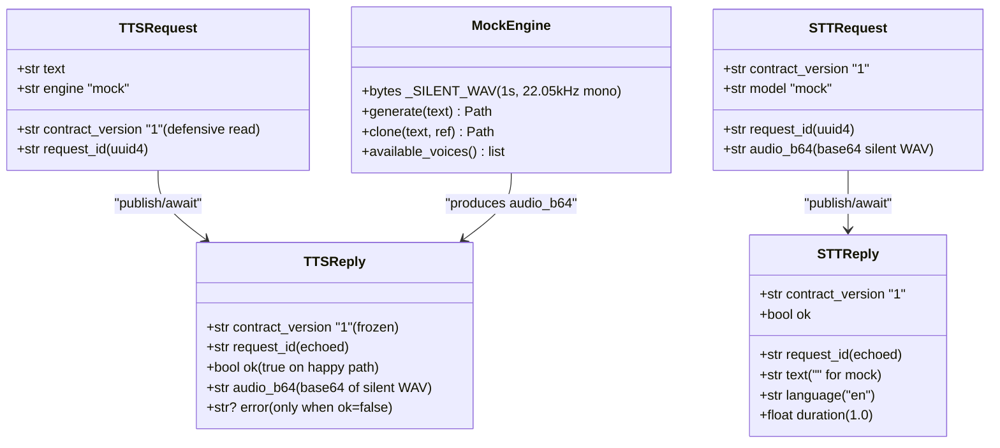
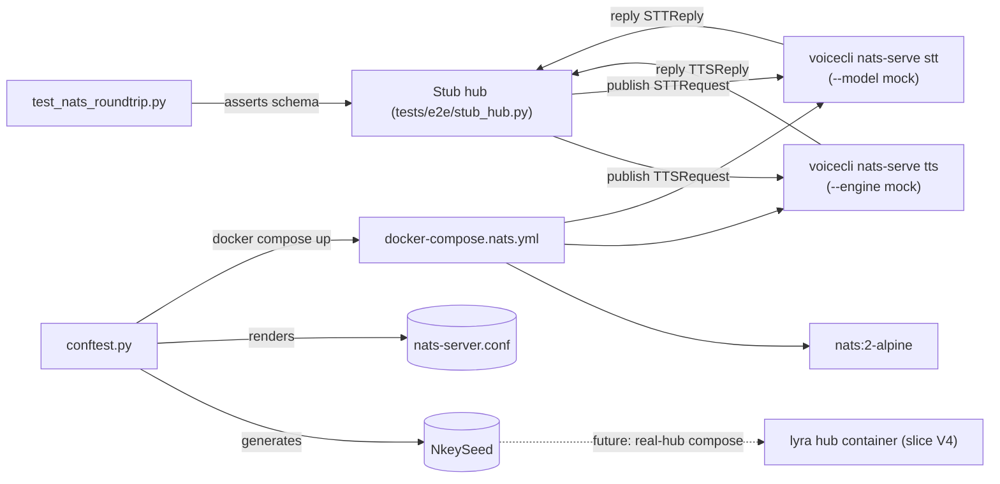

## Context

Source: [45-nats-mock-e2e-frame.mdx](../frames/45-nats-mock-e2e-frame.mdx) (approved).

Parent / sibling artifacts:
- [42-nats-serve-spec.mdx](./42-nats-serve-spec.mdx) — defines the full message schema, adapter base, heartbeat / shutdown / exit-code semantics. **Source of truth** for any wire-format detail not re-stated here.
- [44-nats-serve-stt-spec.mdx](./44-nats-serve-stt-spec.mdx) — STT satellite (slice V2). Must land first so both subjects can round-trip.
- ADR-044 (`lyra/docs/architecture/adr/044-lyra-voicecli-nats-contract.mdx`, frozen in lyra commit `e7a890a` / PR Roxabi/lyra#692) — frozen wire contract.
- `lyra/artifacts/specs/658-voicecli-nats-decouple-spec.mdx` — parent decoupling spec on the lyra side. **Slice S3 (Machine-1 cutover) blocks on this PR landing plus slice V2.**

Existing voiceCLI scaffolding to lift:
- `src/voicecli/engine.py` (`_get_registry`, `TTSEngine`, `QWEN_ENGINES`) — engine registry to extend with a gated mock entry.
- `src/voicecli/cli.py` (`nats_serve_tts`, `nats_serve_stt` Typer commands at line ~1336) — already accept `--engine` / `--model` so the satellite can pick `mock` when the gate is set.
- `src/voicecli/nats/reply.py` (`CONTRACT_VERSION = "1"`, `build_reply`) — schema source of truth. The stub hub asserts replies match what `build_reply` produces.
- `tests/nats/test_tts_adapter.py` — RED-phase pattern with lazy-import shim. Reuse for E2E test importability.
- `.github/workflows/ci.yml` (lines 1–80) — single `ci` job today (lint / typecheck / pytest). New `e2e` job uses `needs: ci`.

Shape: **out-of-tree test infrastructure + one tiny in-tree engine.** No changes to the NATS framework, no changes to existing CLI commands, one new engine wired behind a process-env flag. CI gets a second job that runs only after the existing one is green.

## Goal

Ship a `pytest tests/e2e/test_nats_roundtrip.py` test (new `e2e` GitHub Actions job) that brings up NATS + both `voicecli nats-serve {tts,stt}` satellites in docker-compose, runs one TTS request and one STT request through a Python stub hub, and asserts both replies conform to the ADR-044 schema — all on `ubuntu-latest`, no GPU, no real engine, no lyra repo access, fresh nkey seed per run.

## Users

- **Primary:** voiceCLI maintainers landing follow-ups on `nats-serve` — every PR touching `src/voicecli/nats/` or the satellite entry points must pass this E2E gate before merging to staging.
- **Secondary:** lyra hub (`lyra#658` Slice S3 — Machine-1 cutover) — blocked on this E2E gate going green plus slice V2 landing; needs the contract proof in CI before flipping producers from socket → NATS in production.

## Expected Behavior

### Test execution (CI happy path)

1. PR pushed → `ci` job runs (lint / typecheck / unit tests on `ubuntu-latest`). Green.
2. `e2e` job starts (`needs: [ci]` — never runs unless `ci` is green). Sets up Python 3.12, installs Docker Compose plugin, runs `uv sync --dev --extra nats`.
3. Job runs `uv run pytest tests/e2e/test_nats_roundtrip.py -v`.
4. The test's session fixture:
   - Generates a fresh Ed25519 nkey via `nkeys`, writes the seed file at `0600`, derives the public key.
   - Renders `nats-server.conf` from a template, embedding the public key under `authorization.users[0]`.
   - Runs `docker compose -f tests/e2e/docker-compose.nats.yml up -d` with the seed path / conf path / cwd bind-mounts.
   - Polls `nc -z localhost 4222` until NATS accepts connections (≤ 30 s).
5. The compose stack brings up three containers:
   - `nats:2-alpine` listening on `4222`, port-forwarding `4222:4222` to the host (so the host-side stub hub can connect), mounting the rendered conf, with nkey auth enabled.
   - `voicecli-tts` running `python:3.12-slim` with the repo bind-mounted at `/app`; entrypoint `bash -lc "cd /app && pip install uv -q && uv sync --extra nats -q && uv run voicecli nats-serve tts --engine mock"`. Env: `VOICECLI_ENABLE_MOCK_ENGINE=1`, `NATS_URL=nats://nats:4222`, `NATS_NKEY_SEED_PATH=/run/secrets/nkey.seed`.
   - `voicecli-stt` same shape but `voicecli nats-serve stt --model mock`.
   - **No Dockerfile build step** — both satellites use the upstream `python:3.12-slim` image and install dependencies on container start. Trade-off: ~30 s slower cold start vs. zero CI build complexity. uv installs cache in a named volume (`uv-cache:/root/.cache/uv`) so re-runs are fast within a job.
6. Test calls `stub_hub.run_once(seed_path=<host-side tmp_path/nkey.seed>, nats_url="nats://localhost:4222")`:
   - Receives the seed path as an explicit argument (host-side path; satellites mount the same file via compose). Connects to NATS as a separate nkey-authed client (one nkey shared by hub + both satellites — acceptable for contract test; prod uses distinct nkeys per service).
   - Publishes one TTS request to `lyra.voice.tts.request` (JSON: `contract_version`, `request_id`, `text`, `engine`).
   - Awaits reply on the auto-generated reply subject (≤ 10 s timeout).
   - Asserts reply schema: `contract_version == "1"`, `request_id` echoes input, `ok == True`, `audio_b64` decodes to a non-empty WAV.
   - Repeats for STT: publishes to `lyra.voice.stt.request` with a base64-encoded silent WAV, asserts reply has `text` field (empty string is fine), `ok == True`, `request_id` echo, `contract_version == "1"`.
7. Test fixture teardown runs `docker compose down -v`. Seed file is in a `tmp_path` and discarded.

### MockEngine behavior

- Implements `TTSEngine` interface from `src/voicecli/engine.py`.
- `generate(text, ...)` returns a path to a pre-baked **1-second silent WAV** (16-bit mono, 22.05 kHz). Bytes are baked into the module (small literal) — no model load, no disk I/O on the model path.
- `clone(...)` returns the same WAV (test gate doesn't exercise clone, but interface compliance keeps registry typing happy).
- `available_voices()` returns `["mock-voice"]`.
- For STT: `transcribe.transcribe()` adds a single guarded branch at the **top of the function** (before any daemon check, before any `_load_model()` call) — `if model == "mock" and os.getenv("VOICECLI_ENABLE_MOCK_ENGINE") == "1": return {"text": "", "language": "en", "duration": 1.0}`. Placement is critical: after `_load_model()` would attempt to resolve a `faster-whisper` model named `mock` and fail. Same env gate as TTS — single source of truth for "test-only".

### MockEngine gate

- Registry function `_get_registry()` reads `os.environ.get("VOICECLI_ENABLE_MOCK_ENGINE")` once at first call.
- When unset / `"0"` / empty → registry has no `mock` key → `voicecli generate -e mock` errors with the standard "Unknown engine 'mock'. Available: …" message; `voicecli --help` does not list it.
- When set to `"1"` → registry includes `"mock": MockEngine`. Same gate gates STT model lookup (`mock` model name resolves to the silent transcriber).
- Gate is **process-env only** — never read from `voicecli.toml`, never settable by a config file. This is the "test-only registration" the issue calls for.
- Registry is **not cached** across calls — `_get_registry()` re-reads the env on every invocation. Any future caching optimization must invalidate on env change.
- Anti-leak guard: a unit test in `tests/test_mock_engine_gate.py` asserts:
  1. With env unset from process start: `available_engines()` does not contain `mock`; `get_engine("mock")` raises `ValueError`.
  2. With env set, then unset, then queried again in the same process: `mock` does not appear in `available_engines()` (covers the cached-registry edge case).
  3. STT path: with env unset, `transcribe.transcribe(audio, model="mock")` falls through to the normal dispatch (which will fail loading a real `mock` model — the failure mode is "engine unavailable", not "silent mock returned").

### NATS auth (per-run nkey)

- Fixture imports `nkeys` (already in `nats` extras), calls `nkeys.from_seed(nkeys.create_user_seed())` → `(seed, pubkey)`.
- Seed bytes written to `tmp_path / "nkey.seed"` with mode `0600` (`os.chmod` after write).
- `nats-server.conf` template:
  ```
  port: 4222
  authorization {
    users: [
      { nkey: "{{PUBKEY}}" }
    ]
  }
  ```
  Rendered with the freshly derived pubkey.
- Compose mounts: `${SEED_PATH}:/run/secrets/nkey.seed:ro` and `${CONF_PATH}:/etc/nats/nats-server.conf:ro`.
- Containers connect using `NATS_NKEY_SEED_PATH=/run/secrets/nkey.seed` (already supported by the satellite per [42-spec](./42-nats-serve-spec.mdx)).
- Anti-leak guard: a CI step runs `! find tests/e2e/ -name '*.seed' -o -name '*.nk' | grep .` and fails the `e2e` job if any seed-shaped file is committed under `tests/e2e/`.

### Failure modes

| Scenario | Behavior |
|---|---|
| `docker compose up` fails (image pull, port collision) | Fixture raises with stdout/stderr captured; pytest reports as setup error, not test failure. |
| NATS doesn't accept connections within 30 s | Fixture timeout; teardown still runs `docker compose down -v`. |
| Satellite container exits before subscribing (e.g. seed perms wrong) | Stub hub's request times out (10 s); test fails with "no reply received" + `docker compose logs voicecli-tts` dumped via `--capture=no` style. |
| Reply schema mismatch (e.g. missing `contract_version`) | Stub hub raises `AssertionError` with a diff against `build_reply(...)` shape. |
| Mock-engine env unset in container | Satellite errors at startup with "Unknown engine 'mock'" → reply timeout → fail. |

## Data Model & Consumers

### Data structure



Frozen by ADR-044: `contract_version` field name + value, `request_id` echo behavior, reply envelope shape (`ok`, `error` codes). Mutable here: `audio_b64` payload (mock returns silent WAV; real engines return synthesized audio).

### Consumer map



Solid edges = this issue. Dashed = future (slice V4 real-hub compose — out of scope but fixture must keep nkey generation reusable).

### Consumer summary

| Consumer | Fields consumed | When | Status |
|---|---|---|---|
| Stub hub | All 4 schemas (TTS/STT request+reply) | Per E2E test run | This issue |
| `test_nats_roundtrip.py` | Reply schemas (assertion targets) | CI per push | This issue |
| Fixture (`conftest.py`) | NkeySeed (generates), nats conf (renders) | Session scope | This issue |
| Future real-hub (V4) | NkeySeed (reuses fixture) | Slice V4 | Future |

## Breadboard

### Affordances

| ID | Type | Element | Handler | Data |
|---|---|---|---|---|
| N1 | env | `VOICECLI_ENABLE_MOCK_ENGINE=1` | `_get_registry()` reads on first call | gates registry entry |
| N2 | engine | `MockEngine` (TTS) | `engines/mock.py` — `generate()` returns `_SILENT_WAV` | 1s silent WAV bytes |
| N3 | engine | mock STT branch | `transcribe.transcribe(model="mock")` → static `{text:"", language:"en", duration:1.0}` | static dict |
| N4 | fixture | `nkey_seed` (session) | `conftest.py` — `nkeys.create_user_seed()` + chmod 0600 | seed + pubkey |
| N5 | fixture | `nats_conf` (session) | `conftest.py` — render template with N4 pubkey | rendered config path |
| N6 | fixture | `compose_stack` (session) | `conftest.py` — `docker compose up -d` + readiness poll | container handles |
| N7 | helper | `stub_hub.run_once()` | `tests/e2e/stub_hub.py` — pub/await/assert TTS+STT | reply assertion results |
| N8 | test | `test_nats_roundtrip` | `test_nats_roundtrip.py` — wires N4–N7 | pass/fail |
| N9 | unit test | `test_mock_engine_gate` | `tests/test_mock_engine_gate.py` — env-unset behavior | gate compliance |
| N10 | CI job | `e2e` workflow job | `.github/workflows/ci.yml` — `needs: [ci]`, `timeout-minutes: 10`, sets up uv + apt deps + runs `pytest tests/e2e/`, dumps `docker compose logs` on failure (`if: failure()`) and runs `docker compose down -v` (`if: always()`) | green/red |
| N11 | conftest | repo-root `conftest.py` `collect_ignore = ["tests/e2e"]` + `pyproject.toml` `[tool.pytest.ini_options] testpaths = ["tests"]` | excludes `tests/e2e/` from default pytest collection | dev `pytest` skips e2e when Docker absent |

### Wiring

- **N1 → N2 / N3:** `_get_registry()` includes `"mock": MockEngine` only when N1 is set; `transcribe.transcribe()` short-circuits to a static dict only when both `model == "mock"` and N1 is set. Registry is not cached.
- **N4 → N5 → N6:** session-scoped chain. N5 depends on N4's pubkey; N6 mounts both N4's seed file and N5's conf, port-forwards `4222:4222`.
- **N6 → N7:** N7 connects to NATS at `localhost:4222` (compose port-forward) using N4's seed (passed in as `stub_hub.run_once(seed_path=...)` from the fixture).
- **N7 → N8:** test calls `stub_hub.run_once(...)`; on success, asserts no exceptions raised + reply objects match `build_reply` shape.
- **N9** is independent — runs in the existing `ci` job's pytest collection (proves the env-unset case never leaks `mock` into prod registry; covers cached-registry edge case).
- **N10** wraps it all: `needs: [ci]`, `timeout-minutes: 10`. Docker Compose v2 is **pre-installed on `ubuntu-latest`** as of Feb 2026 — no install step. Steps: setup-uv → apt deps (portaudio + gir) → `uv sync --dev --extra nats` → seed-leak lint → `pytest tests/e2e/` → `if: failure()` `docker compose logs` → `if: always()` `docker compose down -v`.
- **N11:** `pyproject.toml` `testpaths = ["tests"]` plus repo-root `conftest.py` `collect_ignore = ["tests/e2e"]` so dev-machine `pytest` (no args) skips E2E. CI runs `pytest tests/e2e/` explicitly to opt back in.

## Slices

| # | Slice | Files | Demo-able |
|---|---|---|---|
| # | Slice | Files | Demo-able | Depends on |
|---|---|---|---|---|
| V3a | MockEngine + env gate + anti-leak unit test | `src/voicecli/engines/mock.py`, `src/voicecli/engine.py` (gate in `_get_registry`), `src/voicecli/transcribe.py` (top-of-function mock branch), `tests/test_mock_engine_gate.py`, `pyproject.toml` (testpaths) + repo-root `conftest.py` (collect_ignore) | `VOICECLI_ENABLE_MOCK_ENGINE=1 voicecli generate "hi" -e mock` produces a silent WAV; without the env, command errors | — (mergeable on its own) |
| V3b | Compose + nkey fixture + readiness poll | `tests/e2e/__init__.py`, `tests/e2e/docker-compose.nats.yml`, `tests/e2e/nats-server.conf.template`, `tests/e2e/conftest.py` | `pytest tests/e2e/ -k smoke` brings the stack up, asserts NATS accepts auth'd connection, tears down clean | **Slice V2 (#44)** must be merged — `voicecli nats-serve stt` is V2's deliverable and the compose `voicecli-stt` container will fail to start without it. V3a should ideally land first too (so containers can find `mock`). |
| V3c | Stub hub + round-trip test | `tests/e2e/stub_hub.py`, `tests/e2e/test_nats_roundtrip.py` | `pytest tests/e2e/test_nats_roundtrip.py` passes locally with Docker available | V3a + V3b |
| V3d | CI `e2e` job | `.github/workflows/ci.yml` | PR pushes show two jobs (`ci` then `e2e`); `e2e` only runs on green `ci` | V3a + V3b + V3c |

Land V3a → V3d in order. V3a is a clean refactor unit (mergeable on its own if needed); V3b is hard-blocked on slice V2 (#44) landing first; V3b–V3d compose into the gate.

## Success Criteria

- [ ] `pytest tests/e2e/test_nats_roundtrip.py` passes on `ubuntu-latest` in CI with no GPU, no real engine installed, no lyra repo access.
- [ ] Fresh Ed25519 nkey generated by the fixture per run; seed file mode is `0600`; no seed file committed to the repo.
- [ ] Stub hub asserts reply schema for **both** TTS and STT: `contract_version == "1"`, `request_id` echoed from request, `ok == True`, payload field present (`audio_b64` for TTS, `text` for STT).
- [ ] E2E job declares `needs: [ci]` so lint / typecheck / unit tests gate first; E2E job is skipped if `ci` fails.
- [ ] `MockEngine` is **not** exposed via the public `--engine` flag when `VOICECLI_ENABLE_MOCK_ENGINE` is unset: `available_engines()` returns the same list as today, and `get_engine("mock")` raises `ValueError`.
- [ ] Unit test `tests/test_mock_engine_gate.py` covers all three cases listed under "MockEngine gate" (env unset from start, env set-then-unset same process, STT branch env-unset fall-through) and runs in the existing `ci` job.
- [ ] E2E job declares `timeout-minutes: 10` (hard CI ceiling); a slow run does not block a runner indefinitely.
- [ ] E2E job has an `if: always()` step running `docker compose down -v` and an `if: failure()` step running `docker compose logs` so failed runs surface satellite + NATS output in the GHA log.
- [ ] No seed-shaped file ships in the repo: CI step `! find tests/e2e/ \( -name '*.seed' -o -name '*.nk' \) | grep .` returns no results (fails the job if any are found).
- [ ] `pyproject.toml` declares `[tool.pytest.ini_options] testpaths = ["tests"]` and repo-root `conftest.py` declares `collect_ignore = ["tests/e2e"]`; running `pytest` (no args) on a dev machine collects 0 tests from `tests/e2e/`. CI opts in via `pytest tests/e2e/`.

## Open Questions / [NEEDS CLARIFICATION]

None — issue body, parent spec, and frozen ADR-044 cover all design questions. Implementation choices (e.g. share NATS client between hub and satellite vs. spawn separate connections) are mechanical and resolved at `/plan` time.
