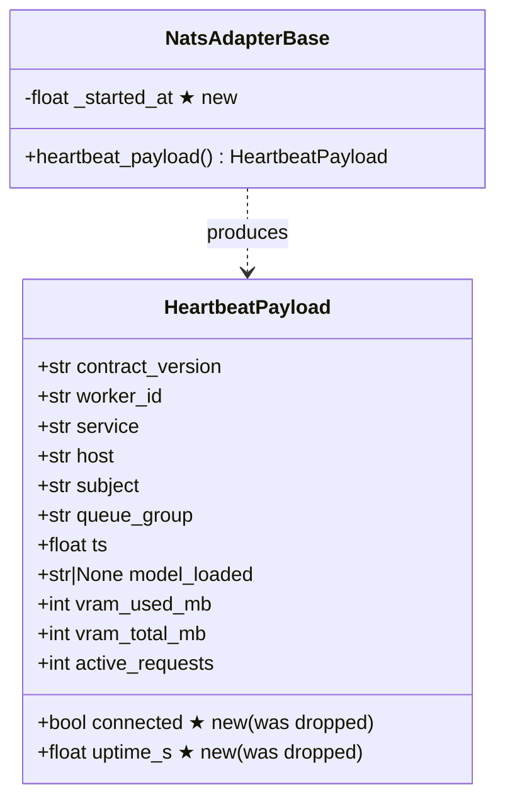
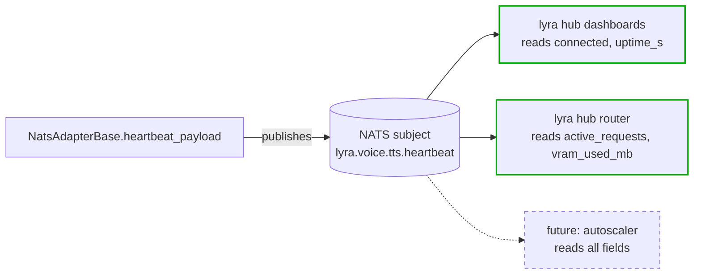

## Context

Promoted from [`artifacts/frames/49-nats-adapter-hygiene-frame.mdx`](../frames/49-nats-adapter-hygiene-frame.mdx).

Seven review findings from PR #43 (NATS-serve TTS slice V1) plus a one-line spec typo
deferred from the same review pass. All findings are co-located in `src/voicecli/nats/`
and bundle cleanly. Nothing here is blocking; the heartbeat-loop leak is the only
runtime-relevant defect. Everything else is hygiene, deprecation, or spec-polish.

## Goal

Deliver a single PR that closes all 7 hygiene findings + pynvml swap + spec typo from the
PR #43 review without regressing TTS adapter behavior and without expanding scope.

## Users

- **Primary:** VoiceCLI maintainer — resumes slice V2 (STT — already shipped as PR #44)
  and V3 (production rollout, issue #45) on top of a cleaner base. Readers of
  `/tmp/voicecli-nats/` synth output stay isolated to the service user.
- **Secondary:** Lyra hub dashboards — regain `connected` + `uptime_s` in heartbeat payloads;
  downstream readers of heartbeats.

## Expected Behavior

1. A `nats-serve tts` run creates `/tmp/voicecli-nats/` with mode `0o700`. `stat -c "%a"`
   reports `700`.
2. The TTS adapter handles a malformed `engine` field (e.g. wildcards, whitespace, oversized
   string) by returning `error: "malformed_request"` **before** registry lookup.
3. A caller that passes `contract_version="wrong"` in `**fields` to `build_reply()` still
   produces a reply stamped with the canonical `CONTRACT_VERSION`.
4. The heartbeat loop runs for N cycles without accumulating cancelled/unreachable coroutines
   (verified via `gc.get_objects()` stable count).
5. Heartbeat payloads contain `connected: bool` and `uptime_s: float` fields; hub-side
   dashboards that read these fields resume working.
6. `_resolve_engine` lives outside `tts_adapter.py`. All imports still resolve.
   The adapter module contains only adapter logic (no CLI env-var reading, no TOML loading).
7. `import pynvml` in `src/voicecli/nats/nvml.py` emits **no** `FutureWarning` during a test
   run. `pyproject.toml` `nats` extra lists `nvidia-ml-py>=12` instead of `pynvml>=11.5`.
8. `artifacts/specs/42-nats-serve-spec.mdx` line 212 reads
   `"aborts with exit code 78 (\`EX_CONFIG\`)"` (matching the canonical table on lines 154–158
   and the actual implementation in `cli.py`).

## Data Model & Consumers

### Heartbeat payload shape (classDiagram)

★ = field (re)introduced by this issue.

### Consumer map (flowchart)

Solid = this issue unblocks. Dashed = future consumer; no change required now.

### Consumer summary

| Consumer | Fields consumed | When | Status |
|---|---|---|---|
| lyra hub health dashboards | `connected`, `uptime_s`, `worker_id`, `service` | Continuously | This issue (restoring missing fields) |
| lyra hub router | `active_requests`, `vram_used_mb`, `vram_total_mb` | Per routing decision | Unchanged |
| future autoscaler | All | Future | Out of scope |

## Breadboard

Seven independent files × one concern each. No shared UI surface — this is a refactor spec,
so the "affordances" are module-level public surfaces plus dependency declarations.

### Touchpoints (module surface → responsibility)

| ID | Surface | Handler | Data in / out |
|---|---|---|---|
| T1 | `tempdir.TEMP_ROOT.mkdir` | `scoped_path()` | Creates dir w/ `mode=0o700` |
| T2 | `reply.build_reply(**fields)` | kwarg merge order | Stamps always win |
| T3 | `base._heartbeat_loop` | Heartbeat cadence | Replaces `shield(stop.wait())` with `sleep(interval)` |
| T4 | `voicecli.nats.config._resolve_engine` | New module | Reads env + TOML; returns engine name |
| T5 | `base.heartbeat_payload` | `connected`, `uptime_s` | Adds 2 fields |
| T6 | `tts_adapter.handle` → `_validate.validate_nats_token` | Engine token format check (no change to `_validate.py`) | Raises → `malformed_request` reply |
| T7 | `pyproject.toml [project.optional-dependencies].nats` | Dep name | `pynvml` → `nvidia-ml-py` |
| T8 | `artifacts/specs/42-nats-serve-spec.mdx:212` | Spec copy | `"exit code 2"` → `"exit code 78 (EX_CONFIG)"` |

### Wiring

| ID | Imported by | Depends on |
|---|---|---|
| T1 | `tts_adapter._run_synthesis`, `stt_adapter` (transitively) | None |
| T2 | `base._dispatch` (via build_reply), all adapters | None |
| T3 | `base.run` | None |
| T4 | `cli.py:nats_app:tts_serve` | `voicecli.config.load_config`, env vars |
| T5 | `base.run` (final HB), `base._heartbeat_loop` | `time.monotonic`, `nc.is_connected` |
| T6 | `tts_adapter.handle` | `_validate.validate_nats_token` |
| T7 | `uv pip install .[nats]` | pynvml API identical to nvidia-ml-py |
| T8 | None (doc-only) | None |

## Slices

One slice = one logical unit that passes tests on its own. All slices land in one PR; order
is purely for incremental commits inside the worktree (and mental load during implementation).

| # | Slice | Files | Demo-able via |
|---|---|---|---|
| S1 | Tempdir mode + reply stamp guard (two low-risk fixes) | `tempdir.py`, `reply.py`, test files | `test_tempdir_mode`, `test_build_reply_stamp_wins` |
| S2 | Heartbeat refactor: fix leak, restore `connected`/`uptime_s` | `base.py`, test files | `test_heartbeat_payload_fields`, `test_heartbeat_loop_no_leak` |
| S3 | Move `_resolve_engine` to `voicecli.nats.config` | new `config.py`, `tts_adapter.py`, `cli.py`, test files | `test_config_resolve_engine` + existing tts adapter tests unchanged |
| S4 | Engine allowlist format validation | `tts_adapter.py`, `_validate.py` (no change expected), test files | `test_tts_adapter_malformed_engine` |
| S5 | `pynvml` → `nvidia-ml-py` | `pyproject.toml`, `uv.lock` | `uv sync` succeeds; `pytest -W error::FutureWarning` passes |
| S6 | Spec typo | `artifacts/specs/42-nats-serve-spec.mdx` | `grep "exit code 78" artifacts/specs/42-*.mdx` |

Ordering rationale: S1 first (trivial, lowest blast radius, smoke-tests the worktree).
S2 is the only runtime-relevant defect. S3 creates a new module that tests in S4 can import
to exercise the adapter. S5 touches deps — runs late so earlier slices benefit from the
warning-free baseline. S6 is pure docs.

**Sequencing constraint:** S3 and S4 both mutate `src/voicecli/nats/tts_adapter.py`
(S3 deletes `_resolve_engine`; S4 inserts engine-format validation in `handle`).
Commits must be strictly sequential (S3 → S4), not parallelized. Running them together
via separate agents would create merge conflicts on the same file.

## Success Criteria

### Security & correctness

- [ ] `/tmp/voicecli-nats/` has mode `700` after first `scoped_path()` call. Verified via
      `stat -c "%a" /tmp/voicecli-nats/` in a test.
- [ ] `build_reply(ok=True, request_id="r", contract_version="spoofed")` returns a dict where
      `contract_version == CONTRACT_VERSION` (not `"spoofed"`). Unit test asserts this.
- [ ] `tts_adapter.handle` rejects an `engine` value that fails `validate_nats_token`
      (e.g. `"a b"`, `"*.tts"`, 129-char string) with `error: "malformed_request"` and
      does NOT call `_engine_available`. New unit test covers each malformed variant.
- [ ] When `engine` is `None` or `""`, `tts_adapter.handle` falls back to
      `self.default_engine` and proceeds normally (no error reply, no validation failure).
      The `or self.default_engine` branch at `tts_adapter.py:124` must remain the precedence
      rule — validation runs **after** the default is applied.

### Heartbeat

- [ ] `HeartbeatPayload` contains `connected: bool` and `uptime_s: float` fields;
      `connected` reflects `self._nc.is_connected`, `uptime_s` = `time.monotonic() - self._started_at`.
- [ ] Heartbeat loop runs 50 iterations at a fast interval (e.g. 0.01s) and `gc.collect()`
      shows **no growth mid-loop** in live `stop.wait()` inner coroutines across iterations.
      Mechanism being guarded: `asyncio.shield(stop.wait())` wrapped per iteration lets the
      inner `stop.wait()` coroutine keep running when `wait_for` times out — a new inner
      coroutine spawns next iteration, so N iterations accumulate N concurrent waiters.
      The fix (plain `asyncio.sleep(interval)`) removes this entirely. Test asserts live-coroutine
      count is stable **during** the loop, not just after `stop.set()`.

### Refactor

- [ ] `_resolve_engine` is not defined in `src/voicecli/nats/tts_adapter.py` (no body, no
      re-export shim). It lives only in `src/voicecli/nats/config.py`.
- [ ] `src/voicecli/cli.py` imports `_resolve_engine` from `voicecli.nats.config`, not from
      `voicecli.nats.tts_adapter`.

### Deprecation

- [ ] `pyproject.toml` `[project.optional-dependencies].nats` lists `nvidia-ml-py>=12`
      (not `pynvml>=11.5`).
- [ ] `uv sync --extra nats` succeeds on a fresh virtualenv.
- [ ] `pytest -W error::FutureWarning tests/nats/` produces zero `FutureWarning`s.

### Spec typo

- [ ] `artifacts/specs/42-nats-serve-spec.mdx` line ~212 reads
      `"aborts with exit code 78 (\`EX_CONFIG\`)"`.

### Coexistence (non-regression)

- [ ] `pytest tests/nats/` passes on the default matrix.
- [ ] `voicecli nats-serve tts --help` and `voicecli nats-serve stt --help` exit 0
      and render help without traceback.

## Decision — `_resolve_engine` relocation

── Decision: shim vs hard-move ──
Context:  Finding says move `_resolve_engine` out of `tts_adapter.py`. `cli.py` is the only
          known caller (`src/voicecli/cli.py:1360`). STT has a parallel `_resolve_model`
          that the finding does NOT mention.
Target:   Adapter module is free of CLI-layer logic.
Path:     Pick shim policy before implementation to avoid mid-slice churn.

Options:
  1. **Hard move** — delete `_resolve_engine` from `tts_adapter.py`, update `cli.py` import,
     no shim. Simpler, one less re-export to maintain. ← recommended
  2. **Move + re-export shim** — keep `from voicecli.nats.config import _resolve_engine`
     at bottom of `tts_adapter.py`. Safer for any external callers.
  3. **Move both** `_resolve_engine` AND `_resolve_model` (STT counterpart) in the same PR.
     Better consistency but expands scope beyond the issue's listed findings.

Recommended: Option 1 — there are no external callers (tts_adapter is adapter-internal),
`cli.py` import is trivially updatable, and the frame's "no scope expansion" constraint
rules out Option 3.

Note: `_resolve_engine` is **private by convention** (leading underscore). Python semantics
make backwards-compatibility concerns for private callers a non-issue; Option 2 (shim) would
be preserving a contract that was never offered. This reinforces Option 1.

## Scope boundary — what this spec does NOT do

- Does not touch STT's `_resolve_model` (parallel issue, out of scope per frame).
- Does not add heartbeat fields beyond `connected` and `uptime_s`.
- Does not change NATS wire contract, subjects, or envelope shape.
- Does not refactor the adapter base class structurally.
- Does not add CI checks for these fixes (tests are sufficient for F-lite).
