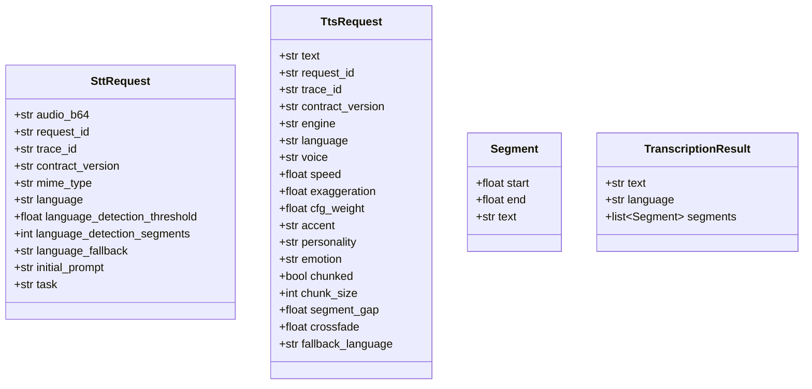

## Context

Promoted from: [artifacts/frames/53-typed-adapter-ingress-frame.mdx](../frames/53-typed-adapter-ingress-frame.mdx)

The NATS adapter layer currently accepts raw `dict` payloads and forwards them verbatim through 5 call layers before faster-whisper raises an opaque error. `TranscriptionResult.segments: list[dict]` is shape-free — the daemon JSON path and the local Whisper path produce the same declared type but may drift on keys. PR #51 added short-term `isinstance` guards as a patch; this spec describes the structural fix.

## Goal

Type the contract boundary: typed dataclasses at NATS adapter ingress (`SttRequest`, `TtsRequest`) and a typed `Segment` dataclass in the transcription result, with all type mismatches caught at the boundary and mapped to `malformed_request`.

## Users

- **Primary:** maintainers debugging NATS adapter request/response contract mismatches.
- **Secondary:** operators of `voicecli nats-serve` who receive clearer error codes.

## Expected Behavior

1. STT NATS adapter receives a JSON payload, constructs `SttRequest` at ingress. Any field type mismatch raises a clear validation error mapped to `malformed_request`.
2. TTS NATS adapter symmetrically constructs `TtsRequest` at ingress.
3. `TranscriptionResult.segments` is `list[Segment]` with guaranteed fields (`start: float`, `end: float`, `text: str`).
4. `_duration_from_segments` uses direct attribute access with no `.get()` or `float()` coercion fallbacks.
5. PR #51 `isinstance` guards in `_validation.py` are removed/replaced by dataclass-level validation.

## Data Model & Consumers

**Consumer map:**

| Consumer | Fields consumed | When | Status |
|---|---|---|---|
| `SttNatsAdapter.handle()` | All `SttRequest` fields | Ingress | this issue |
| `_stt_runner.run_transcription()` | `mime_type`, `audio_b64`, `overrides` | Post-validation | this issue |
| `api.transcribe()` | `language`, `language_detection_threshold`, `language_detection_segments`, `language_fallback`, `task`, `initial_prompt` | Runner dispatch | this issue |
| `TtsNatsAdapter.handle()` | All `TtsRequest` fields | Ingress | this issue |
| `_tts_runner.run_synthesis()` | `engine`, `text`, optional kwargs, named kwargs | Post-validation | this issue |
| `_duration_from_segments()` | `Segment.end` | Result packaging | this issue |

## Breadboard

| Affordance | Handler | Data |
|---|---|---|
| STT NATS request ingress | `SttNatsAdapter.handle()` | `SttRequest` constructed from `payload` dict |
| TTS NATS request ingress | `TtsNatsAdapter.handle()` | `TtsRequest` constructed from `payload` dict |
| STT envelope validation | `_validation.validate_stt_request()` | Returns `SttRequest` or error code |
| TTS envelope validation | `_validation.validate_tts_request()` | Returns `TtsRequest` or error code |
| Daemon JSON parse | `_try_daemon()` | `json.loads` → `Segment` objects |
| Local Whisper parse | `transcribe()` | `faster_whisper.Segment` → `Segment` objects |
| Duration extraction | `_duration_from_segments()` | `segments[-1].end` |

## Slices

| # | Slice | Files | Demo-able |
|---|---|---|---|
| 1 | **Segment dataclass + transcription constructors** | `runtime/transcribe.py`, `adapters/nats/_audio_utils.py` | `_duration_from_segments` no longer has `.get()` guards |
| 2 | **SttRequest dataclass + STT ingress typing** | `adapters/nats/stt_adapter.py`, `adapters/nats/_validation.py`, `adapters/nats/_stt_runner.py` | Type-mismatch unit test asserts `malformed_request` |
| 3 | **TtsRequest dataclass + TTS ingress typing** | `adapters/nats/tts_adapter.py`, `adapters/nats/_validation.py`, `adapters/nats/_tts_runner.py` | Type-mismatch unit test asserts `malformed_request` |
| 4 | **Test alignment** | `tests/nats/test_stt_adapter.py`, `tests/nats/test_tts_adapter.py`, `tests/test_transcribe.py`, `tests/nats/golden/*` | All existing tests pass; new type-mismatch tests added |

## Success Criteria

- [ ] `SttRequest` dataclass exists in `adapters/nats/stt_adapter.py` with fields matching ADR-044 STT request schema.
- [ ] `TtsRequest` dataclass exists in `adapters/nats/tts_adapter.py` with fields matching ADR-044 TTS request schema.
- [ ] Both dataclasses are constructed at adapter ingress; type mismatch yields `malformed_request` reply (not `transcription_failed` / `synthesis_failed`).
- [ ] PR #51 `isinstance` guards in `_validation.py` are removed.
- [ ] `Segment` dataclass exists in `runtime/transcribe.py` with `start: float`, `end: float`, `text: str`.
- [ ] `TranscriptionResult.segments` is `list[Segment]`.
- [ ] Daemon JSON parse path (`_try_daemon`) constructs `Segment` objects.
- [ ] Local Whisper path (`transcribe`) constructs `Segment` objects.
- [ ] `_duration_from_segments` uses `segments[-1].end` directly (no `.get()`, no `float()` coercion, no logging fallback).
- [ ] Unit tests for wrong-type STT override fields assert `malformed_request` reply.
- [ ] Unit tests for wrong-type TTS fields assert `malformed_request` reply.
- [ ] All existing tests pass without modification (or with mechanical updates for import paths / renames).

## Edge Cases

- `bool` is a subclass of `int` — `language_detection_segments: bool` must still be rejected explicitly.
- `task` value must be in `("transcribe", "translate")` when present.
- Daemon JSON response may contain `segments: None` or missing `segments` key — treat as empty list.
- Local Whisper may return segments with `text: None` or empty text after stripping — skip them.
