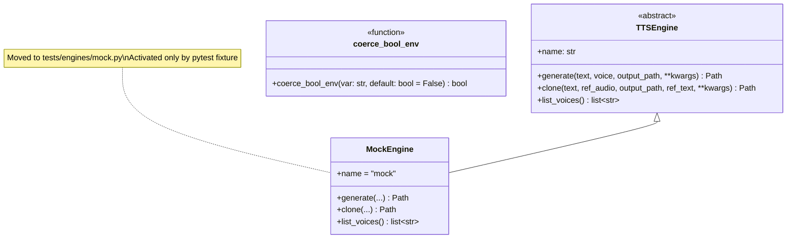
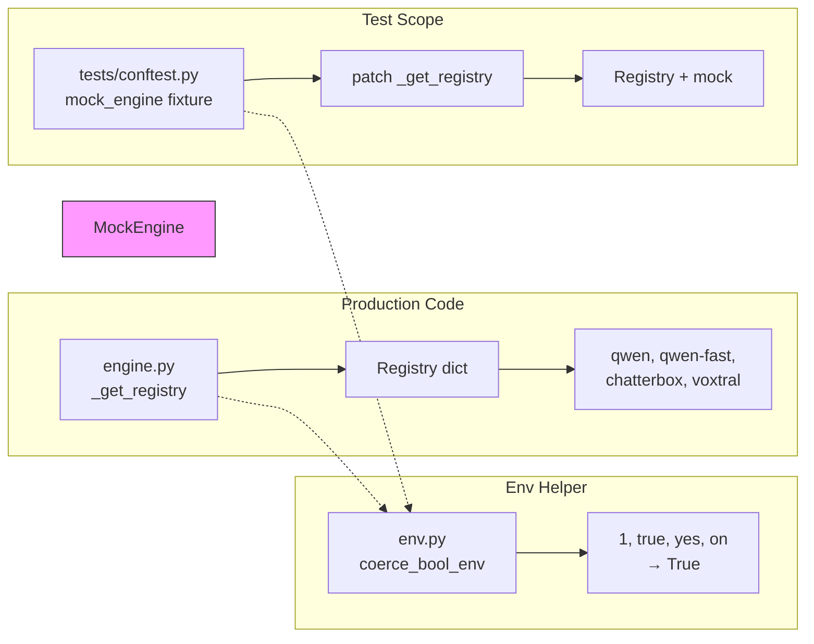

## Context

Long-term follow-up from PR #52 (slice V3a of ADR-044). Two code-quality issues surfaced during code review:

1. **MockEngine env-gate leak path** — `src/voicecli/engines/mock.py` is gated by `VOICECLI_ENABLE_MOCK_ENGINE=1`. If a CI job exports this env var and a Docker image is built in that same shell, the variable could survive into a production image layer. A prod caller passing `model="mock"` would get silent empty transcriptions with no log.

2. **Scattered boolean env checks** — `os.environ.get(...) == "1"` pattern is used in 4 sites across 3 files. Users setting `VOICECLI_ENABLE_MOCK_ENGINE=true` or `yes` would see the flag silently stay off.

Blocked on #50 (E2E compose infrastructure) which uses the current env-var gate in docker-compose.nats.yml.

## Goal

**As a voiceCLI maintainer**, I want the MockEngine isolated to test scope and boolean env vars centralized, **so that** production code has no leak path and env flags are discoverable and consistently parsed.

## Users

| User | Impact |
|------|--------|
| voiceCLI maintainers | Cleaner test infrastructure, no production leak surface |
| CI pipeline | Consistent env var handling across all boolean flags |
| E2E compose tests | Continue using env var activation in test containers |

## Out of Scope

- Changing any non-mock engine behavior
- Modifying NATS protocol or satellite architecture
- Altering the existing `MockEngine` implementation (move-only, no refactor)
- Adding new boolean env vars beyond the 4 existing sites
- Updating user-facing documentation (env vars are internal)
- Removing `VOICECLI_ENABLE_MOCK_ENGINE` from E2E docker-compose files (test containers need it)

## Expected Behavior

### Before

```
VOICECLI_ENABLE_MOCK_ENGINE=1 voicecli generate "hello" -e mock
→ produces silent WAV (mock engine in production code, gated by env)

os.environ.get("VOICECLI_ENABLE_MOCK_ENGINE") == "1" in engine.py, transcribe.py
os.environ.get("VOICECLI_OVERLAY_TEST") == "1" in overlay.py
```

### After

```
# Production code — mock engine completely absent
voicecli generate "hello" -e mock
→ ValueError: Unknown engine 'mock'

# Test scope — mock activated by pytest fixture
pytest tests/test_mock_engine_gate.py
→ mock engine registered via conftest fixture, tests pass

# Boolean env vars — unified helper
coerce_bool_env("VOICECLI_OVERLAY_TEST")  → accepts "1"/"true"/"yes"/"on"
```

## Data Model & Consumers





## Edge Cases

| Scenario | Handling |
|----------|----------|
| User has `VOICECLI_ENABLE_MOCK_ENGINE=true` in shell currently | After S4: no effect — production code no longer reads this var |
| Existing test mocks `_get_registry` independently | Fixture patches registry after construction; coexistence untested → document in conftest |
| Docker image built with env var in previous layer | Irrelevant after S4 — production code no longer reads `VOICECLI_ENABLE_MOCK_ENGINE` |
| `coerce_bool_env` called with empty string `""` | Returns `False` (not in accepted set) — document in docstring |
| CI shell exports env var before Docker build | CI hygiene: `unset VOICECLI_ENABLE_MOCK_ENGINE` before `docker build` |

## Breadboard

### Affordances

| Component | Affordance | Current | Target |
|-----------|------------|---------|--------|
| `src/voicecli/env.py` | Boolean env parsing | N/A | **Created** |
| `src/voicecli/engine.py:_get_registry()` | Mock branch | `if env == "1": registry["mock"] = MockEngine` | **Removed** |
| `src/voicecli/transcribe.py:transcribe()` | Mock branch (line 128) | Top-of-function check | **Removed** |
| `src/voicecli/transcribe.py:_load_model()` | Mock branch (line 232) | Model loading check | **Removed** |
| `src/voicecli/overlay.py` | Boolean env check | `os.environ.get(...) == "1"` | **Migrated to coerce_bool_env** |
| `tests/engines/mock.py` | Test import | N/A | **Created** (moved from src) |
| `src/voicecli/engines/mock.py` | Production import | Available | **Deleted** |
| `tests/conftest.py` | Mock fixture | N/A | **Created** |

### Wiring

| Source | Wire | Sink |
|--------|------|------|
| `tests/conftest.py` | `monkeypatch.setattr(_get_registry)` | `engine._get_registry()` |
| `src/voicecli/engine.py` | `from voicecli.env import coerce_bool_env` | Boolean env checks (future) |
| `src/voicecli/overlay.py` | `from voicecli.env import coerce_bool_env` | `VOICECLI_OVERLAY_TEST` |

**Note:** E2E docker-compose files retain `VOICECLI_ENABLE_MOCK_ENGINE` env var — this is the intended activation mechanism for standalone test containers. The "leak path" concern is addressed by CI hygiene (unset before production builds), not by code removal.

## Slices

| Slice | Description | Files | Verifies |
|-------|-------------|-------|----------|
| **S1** | `coerce_bool_env()` helper | `src/voicecli/env.py`, `tests/test_env.py` | Unit tests for "1"/"true"/"yes"/"on"/"TRUE"/etc |
| **S2** | Migrate `VOICECLI_OVERLAY_TEST` | `src/voicecli/overlay.py` | Env check replaced with helper |
| **S3** | Remove production mock branches | `src/voicecli/engine.py`, `src/voicecli/transcribe.py` | No mock refs in production code |
| **S4** | Move `MockEngine` + create fixture (atomic) | `tests/engines/mock.py` (new), `src/voicecli/engines/mock.py` (delete), `tests/conftest.py` | Import path updated, tests pass with fixture |
| **S5** | Update E2E compose docs | `tests/e2e/docker-compose.nats.yml`, `tests/e2e/docker-compose.real-hub.yml`, `docs/NATS-SERVE.md` | Document CI hygiene for leak prevention |

### Slice Details

#### S1: `coerce_bool_env()` helper

```python
# src/voicecli/env.py
"""Environment variable utilities."""

import os
from typing import Final

TRUE_VALUES: Final = frozenset(("1", "true", "yes", "on"))


def coerce_bool_env(var: str, *, default: bool = False) -> bool:
    """Parse boolean env var — accepts 1/true/yes/on (case-insensitive).

    Args:
        var: Environment variable name.
        default: Value to return if the variable is unset.

    Returns:
        True if the variable value is in {"1", "true", "yes", "on"} (case-insensitive).
        False otherwise, including empty string or unset (returns default).
    """
    val = os.environ.get(var)
    if val is None:
        return default
    return val.lower() in TRUE_VALUES
```

```python
# tests/test_env.py
"""Unit tests for env.py."""

import os
import pytest
from voicecli.env import coerce_bool_env


class TestCoerceBoolEnv:
    def test_true_values(self, monkeypatch):
        """Accepted values return True."""
        for val in ("1", "true", "TRUE", "True", "yes", "YES", "on", "ON"):
            monkeypatch.setenv("TEST_VAR", val)
            assert coerce_bool_env("TEST_VAR") is True

    def test_false_values(self, monkeypatch):
        """Non-accepted values return False."""
        for val in ("0", "false", "no", "off", "", "random", "2"):
            monkeypatch.setenv("TEST_VAR", val)
            assert coerce_bool_env("TEST_VAR") is False

    def test_unset_returns_default(self, monkeypatch):
        """Unset variable returns default."""
        monkeypatch.delenv("TEST_VAR", raising=False)
        assert coerce_bool_env("TEST_VAR") is False
        assert coerce_bool_env("TEST_VAR", default=True) is True
```

#### S2: Migrate `VOICECLI_OVERLAY_TEST`

```python
# src/voicecli/overlay.py (change at line ~424)
# Before:
if os.environ.get("VOICECLI_OVERLAY_TEST") == "1":

# After:
from voicecli.env import coerce_bool_env
if coerce_bool_env("VOICECLI_OVERLAY_TEST"):
```

#### S3: Remove production mock branches

**engine.py:_get_registry()** — delete entire mock branch:

```python
# DELETE these lines (~117-120):
if os.environ.get("VOICECLI_ENABLE_MOCK_ENGINE") == "1":
    from voicecli.engines.mock import MockEngine
    registry["mock"] = MockEngine
```

**transcribe.py** — delete two mock branches:

```python
# DELETE at line ~128:
if model == "mock" and os.environ.get("VOICECLI_ENABLE_MOCK_ENGINE") == "1":
    logger.info("Mock transcription requested — returning empty string")
    return ""

# DELETE at line ~232 (in _load_model):
if model == "mock" and os.environ.get("VOICECLI_ENABLE_MOCK_ENGINE") == "1":
    return None  # Mock doesn't need a real model
```

#### S4: Move MockEngine + create fixture (atomic)

```python
# tests/engines/mock.py (moved from src/voicecli/engines/mock.py)
"""Mock TTS engine for testing."""

from pathlib import Path
from voicecli.engine import TTSEngine


class MockEngine(TTSEngine):
    """Mock engine that produces empty WAV files."""

    name = "mock"

    def generate(self, text: str, voice: str, output_path: Path, **kwargs) -> Path:
        """Write an empty WAV file."""
        # ... (existing implementation, unchanged)
        return output_path

    def clone(self, text: str, ref_audio: Path, output_path: Path, ref_text: str = None, **kwargs) -> Path:
        """Write an empty WAV file."""
        return output_path

    def list_voices(self) -> list[str]:
        return ["mock-voice"]
```

```python
# tests/conftest.py (add to existing file)
"""Pytest fixtures for voiceCLI tests."""

import pytest


@pytest.fixture
def mock_engine(monkeypatch):
    """Register MockEngine in the registry for the test scope.

    This fixture patches _get_registry() to include the mock engine,
    which is isolated to test scope (not in production code).
    """
    from voicecli.engine import _get_registry
    from tests.engines.mock import MockEngine

    original_registry = _get_registry()
    original_registry["mock"] = MockEngine

    monkeypatch.setattr("voicecli.engine._REGISTRY_CACHE", original_registry)
    yield

    # Cleanup: remove mock from cache
    if "mock" in original_registry:
        del original_registry["mock"]
```

**Delete:** `src/voicecli/engines/mock.py`

#### S5: Update E2E compose docs

Update `docs/NATS-SERVE.md` with CI hygiene guidance:

```markdown
## CI Hygiene for Mock Engine

The `VOICECLI_ENABLE_MOCK_ENGINE` env var must **never** be present in a production
Docker build context. To prevent accidental leakage:

1. **Explicit unset before build:**
   ```bash
   unset VOICECLI_ENABLE_MOCK_ENGINE
   docker build -t voicecli:prod .
   ```

2. **Separate build stage:** Use a dedicated CI job for production builds that
   never runs E2E tests (which export the env var).

The mock engine is isolated to test scope via the `tests/engines/mock.py` location
and pytest fixture activation. Production code has no reference to `MockEngine`.
```

## Success Criteria

- [ ] `coerce_bool_env()` helper exists at `src/voicecli/env.py`, unit-tested at `tests/test_env.py`
- [ ] `VOICECLI_OVERLAY_TEST` check in `src/voicecli/overlay.py` uses `coerce_bool_env()`
- [ ] `src/voicecli/engines/mock.py` removed from production code
- [ ] `tests/engines/mock.py` contains the `MockEngine` implementation (moved)
- [ ] `_get_registry()` has no env-var branch and no reference to `MockEngine`
- [ ] `transcribe.transcribe()` has no mock branch (both sites removed)
- [ ] `transcribe._load_model()` has no mock branch
- [ ] `tests/conftest.py` contains `mock_engine` fixture that registers MockEngine
- [ ] `pytest tests/test_mock_engine_gate.py` passes (prod never returns "mock", fixture activates correctly)
- [ ] `pytest tests/` passes with 0 failures
- [ ] CI hygiene guidance added to `docs/NATS-SERVE.md`
