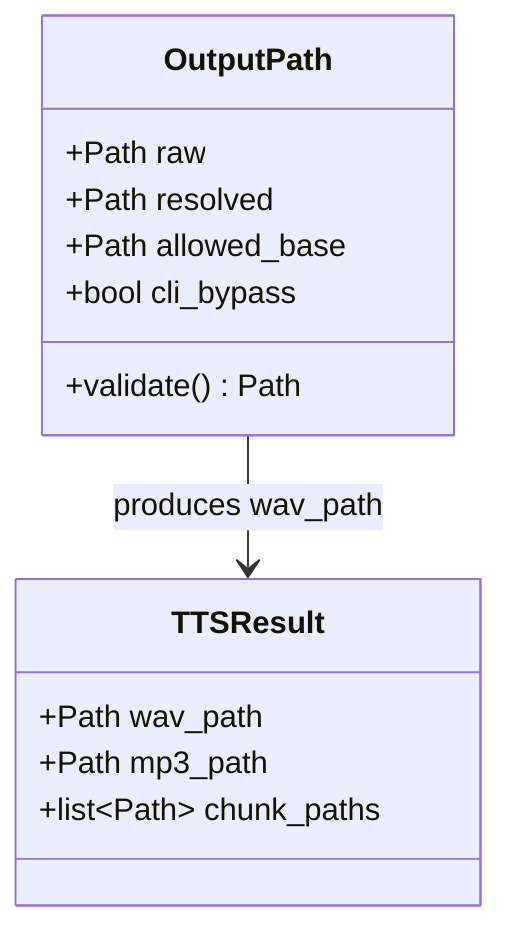
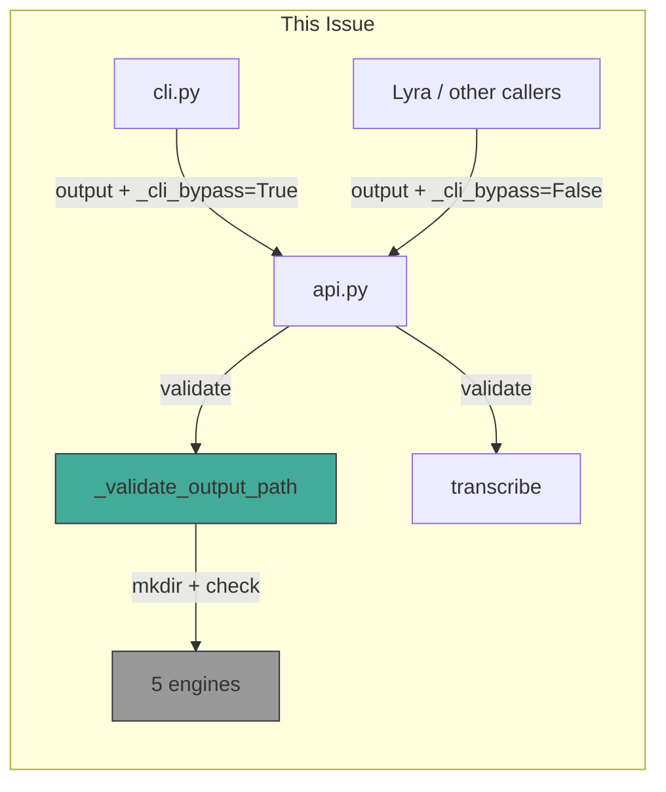

## Context

Promoted from [frame](../frames/57-centralize-output-path-validation-frame.mdx). Follow-up from PR #52 (security-auditor review).

## Goal

Centralize output path validation in `api.py` to prevent path traversal and remove duplicated `mkdir` calls across 5 TTS engines.

## Users

- **Primary:** voiceCLI maintainers — single validation point, less duplication
- **Secondary:** CLI operators — protection against misconfiguration

## Expected Behavior

1. `voicecli generate "text" --output ../../etc/evil.wav` → error: path escapes allowed base
2. `voicecli generate "text" --output /tmp/test.wav` → allowed (absolute path bypass via CLI)
3. `voicecli generate "text" --output ./custom/test.wav` → validated against base (inside → works)
4. `voicecli generate "text"` → works as before, auto-created directory
5. Non-CLI caller (e.g., Lyra) passes `output` → validated against base (no bypass)

> **Note:** Frontmatter `output:` field is **not supported** — `TTSDocument` has no `output` attribute. This eliminates the frontmatter attack vector. Only CLI `--output` can override path.

## Edge Cases

| Case | Input | Expected | Test |
|------|-------|----------|------|
| Symlink escape | `--output ~/voices_out/link.wav` where `link` → `/etc/` | Blocked (resolve follows symlink) | Unit test |
| Relative path inside base | `--output ./subdir/test.wav` | Works (validated, stays in base) | Unit test |
| Relative path escapes base | `--output ../../escape.wav` | Blocked | Unit test |
| Absolute path inside base | `--output /home/user/.voicecli/TTS/voices_out/x.wav` | Works (inside base) | Unit test |
| Absolute path outside base | `--output /tmp/test.wav` | Bypassed (CLI flag) | Unit test |
| Non-CLI caller | `api.generate(..., output=Path("/tmp/x.wav"))` | Blocked (no bypass) | Unit test |

## Data Model & Consumers

| Consumer | Fields Used | When | Status |
|----------|-------------|------|--------|
| `api.generate()` | `output`, `_cli_bypass` | Entry point | This issue |
| `api.clone()` | `output`, `_cli_bypass` | Entry point | This issue |
| `api.transcribe()` | `output` | Entry point | This issue |
| Engines | validated `output_path` | After validation | This issue (mkdir removed) |

## Breadboard

### Affordances

| ID | Location | Element | Description |
|----|----------|---------|-------------|
| U1 | `cli.py` | `--output` flag | Passes `output` + `_cli_bypass=True` to API |
| U2 | `cli.py` | stdin/text input | Passes `_cli_bypass=False` (default) |
| U3 | External | `api.generate()` call | Non-CLI callers get `_cli_bypass=False` |
| N1 | `api.py` | `_validate_output_path()` | Validates + mkdirs, returns resolved path |
| N2 | `api.py` | `_cli_bypass` param | Private bool, default `False` |
| S1 | `engines/*.py` | `.generate()` / `.clone()` | No mkdir, receives validated path |

### Wiring

| From | To | Trigger | Data |
|------|-----|---------|------|
| U1 | `api.generate()` | CLI invocation | `output`, `_cli_bypass=True` |
| U3 | `api.generate()` | Library call | `output`, `_cli_bypass=False` |
| `api.generate()` | N1 | Before engine dispatch | `output`, `allowed_base`, `_cli_bypass` |
| N1 | S1 | After validation | `resolved_path` |

## Slices

| # | Name | Files | Demo | Dependencies |
|---|------|-------|------|--------------|
| 1 | Add validator helper | `api.py` | Unit tests pass | None |
| 2 | Wire into generate/clone/transcribe | `api.py` | Integration test | Slice 1 |
| 3 | Remove mkdir from engines + api chunked helpers | `engines/*.py`, `api.py` | All tests pass | Slice 2 |
| 4 | Add CLI bypass param | `api.py`, `cli.py` | Manual demo | Slice 2 |

## Success Criteria

### Validator

- [ ] `_validate_output_path()` helper exists in `api.py`
- [ ] Helper validates path stays within `allowed_base` (default: `~/.voicecli/TTS/voices_out/`)
- [ ] Helper creates parent directories with `mkdir(parents=True, exist_ok=True)`
- [ ] Helper raises `ValueError` with clear message on path escape attempt
- [ ] Helper follows symlinks via `resolve()` and validates resolved path

### API Integration

- [ ] `api.generate()` calls validator before dispatching to engine
- [ ] `api.clone()` calls validator before dispatching to engine
- [ ] `api.transcribe()` calls validator for output path

### CLI Bypass

- [ ] `api.generate()` / `api.clone()` accept `_cli_bypass: bool = False` private parameter
- [ ] `cli.py` passes `_cli_bypass=True` when `--output` flag is used
- [ ] Non-CLI callers default to `_cli_bypass=False` (strict validation)

### Engine Cleanup

- [ ] All 5 engines remove local `mkdir` calls
- [ ] `_generate_chunked()` in `api.py` removes local `mkdir` call
- [ ] `_clone_chunked()` in `api.py` removes local `mkdir` call

### Tests

- [ ] Unit test: valid path inside base → works
- [ ] Unit test: path with `..` escaping base → raises `ValueError`
- [ ] Unit test: absolute path outside base without bypass → raises `ValueError`
- [ ] Unit test: absolute path outside base with bypass → works
- [ ] Unit test: relative path inside base → works (validated)
- [ ] Unit test: relative path escaping base → raises `ValueError`
- [ ] Unit test: symlink pointing outside base → raises `ValueError`
- [ ] Unit test: nested non-existent directory inside base → auto-created

## Open Questions

None — expert review concerns addressed.
