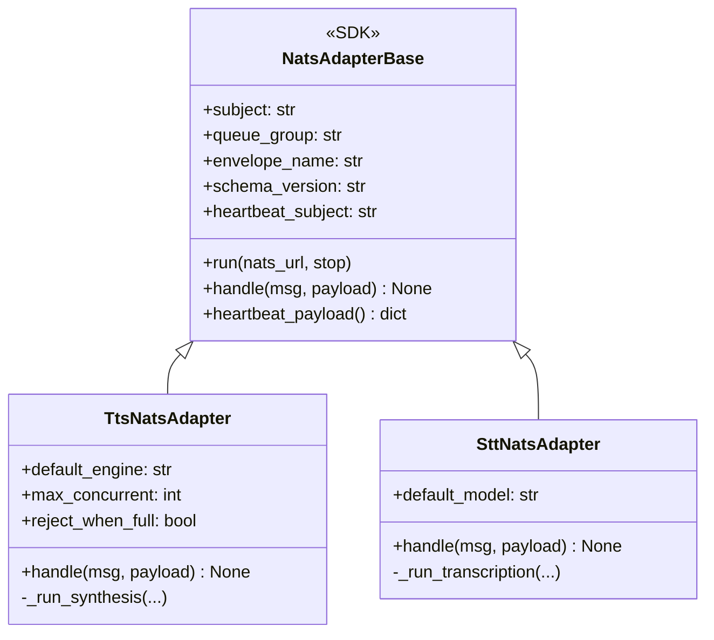
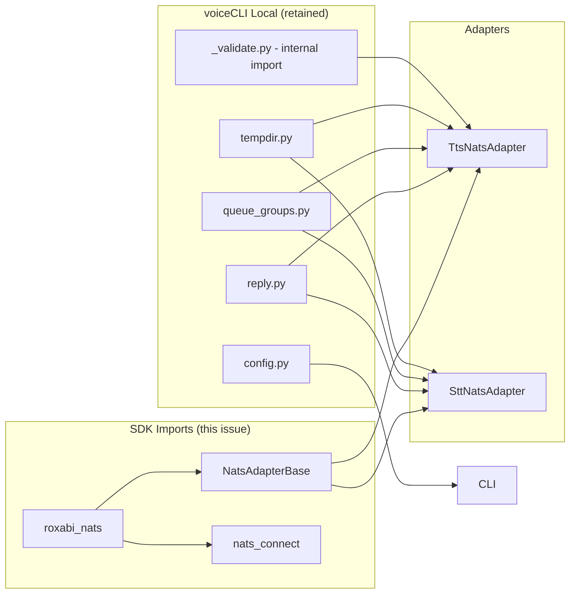

## Context

voiceCLI's local NATS port (`voicecli/nats/base.py` and surrounding modules) duplicates code now maintained in `roxabi-nats` SDK. The extraction (ADR-045, PR #724) created a canonical SDK to eliminate drift. This spec defines the migration to adopt the SDK.

**API Compatibility Note:** SDK v0.1.0's `NatsAdapterBase` has a different constructor signature than voiceCLI's local version. This migration requires adapter refactoring, not just import swapping.

## Goal

Replace local NATS primitives with `roxabi-nats` SDK, refactor adapters to match SDK signatures, retain voiceCLI-specific helpers, and verify CI/e2e pass.

## Users

- **Primary:** voiceCLI developers — simpler NATS adapter code, single source of truth
- **Secondary:** Lyra developers — unified NATS contract across projects, no drift

## Constraints

- **Dependency:** `roxabi-nats` pinned to tag `roxabi-nats/v0.1.0` (not latest)
- **SDK contract:** Only `__all__` exports (`NatsAdapterBase`, `nats_connect`, `CONTRACT_VERSION`) are stable
- **Internal modules:** `_validate` is internal but required for token validation
- **Behavior change:** SDK's `run()` waits for hub readiness; voiceCLI currently skips this
- **VRAM loss:** SDK's heartbeat lacks VRAM fields — acceptable trade-off

## Out of Scope

- Changes to adapter request handling semantics
- New features in NATS adapters
- Hub contract changes
- Migration of Lyra's NATS code (separate issue)
- #53 typed adapter ingress (keep, implement on top of SDK later)
- #54 centralize nkey seed loading (superseded by SDK's `nats_connect`)
- #55 extend ADR-044 (rescoped separately)

## Expected Behavior

1. Developer adds `roxabi-nats` git dependency to `pyproject.toml`
2. Adapters refactored to match SDK `NatsAdapterBase` constructor signature
3. All imports of `voicecli.nats.base.NatsAdapterBase` resolve to `roxabi_nats.NatsAdapterBase`
4. `nats_connect` imported from SDK; `nkey_seed_path` set via env var
5. Local port files deleted; voiceCLI-specific helpers retained
6. CLI error handling updated for `asyncio.TimeoutError` (replaces `DrainTimeoutError`)
7. CI runs green: `pytest`, `ruff`, `pyright`
8. e2e docker-compose test passes

## Data Model & Consumers

### SDK vs voiceCLI Constructor Comparison

| Param | SDK `NatsAdapterBase` | voiceCLI Local | Migration Action |
|-------|----------------------|----------------|------------------|
| `subject` | ✓ positional | ✓ positional | Unchanged |
| `queue_group` | ✓ positional | ✓ positional | Unchanged |
| `envelope_name` | ✓ **required** | ✗ | **Add** — `"tts"` / `"stt"` |
| `schema_version` | ✓ **required** | ✗ | **Add** — `"1"` |
| `heartbeat_subject` | ✓ keyword, optional | ✓ positional | Make keyword |
| `service` | ✗ | ✓ | **Remove** — SDK auto-generates |
| `worker_id` | ✗ | ✓ | **Remove** — SDK auto-generates |
| `timeout` | ✓ (hub wait) | ✗ | Accept default 30s |
| `drain_timeout` | ✓ | ✓ | Unchanged |

### Data Structure (Post-Migration)



### Consumer Map



### Consumer Summary

| Consumer | SDK Imports | Local Imports | Migration |
|----------|-------------|---------------|-----------|
| `TtsNatsAdapter` | `NatsAdapterBase`, `nats_connect` | `build_reply`, `TTS_WORKERS`, `cleanup`, `scoped_path`, `validate_nats_token` | Update constructor, keep local imports |
| `SttNatsAdapter` | `NatsAdapterBase`, `nats_connect` | `build_reply`, `STT_WORKERS`, `cleanup`, `scoped_path` | Update constructor, keep local imports |
| `cli.py` | — | `_resolve_engine`, `_resolve_model` | No change |

## Breadboard

### Affordance Table

| ID | Element | Handler | Data |
|----|---------|---------|------|
| U1 | `pyproject.toml` dependency | uv sync | git source, subdirectory, tag |
| N1 | SDK import | Python import resolver | `from roxabi_nats import NatsAdapterBase` |
| N2 | Internal import | Python import resolver | `from roxabi_nats._validate import validate_nats_token` |
| M1 | TTS constructor refactor | Code change | Add `envelope_name="tts"`, `schema_version="1"` |
| M2 | STT constructor refactor | Code change | Add `envelope_name="stt"`, `schema_version="1"` |
| M3 | CLI error handling | Code change | Catch `asyncio.TimeoutError` instead of `DrainTimeoutError` |
| D1 | Delete port files | File deletion | `base.py`, `connect.py`, `_version_check.py` |
| V1 | pytest | CI runner | Unit + integration tests |
| V2 | ruff check | CI runner | Lint check |
| V3 | ruff format --check | CI runner | Format check |
| V4 | pyright | CI runner | Type checking |
| V5 | docker-compose | e2e test runner | Stub-hub integration |

### Wiring

```
U1 ──enables──> N1, N2
N1 ──requires──> M1, M2 (constructor signature)
M3 ──replaces──> DrainTimeoutError handling
D1 ──follows──> M1, M2, M3 (all refactors complete)
V1-V4 ──verify──> U1, N1, M1-M3, D1
V5 ──verifies──> End-to-end NATS flow
```

## Slices

| Slice | Scope | Demo | Depends on |
|-------|-------|------|------------|
| **S1: Dependency** | Add `roxabi-nats` to `pyproject.toml`, run `uv sync` | `from roxabi_nats import NatsAdapterBase` succeeds | — |
| **S2: TTS Constructor** | Update `TtsNatsAdapter.__init__` to pass `envelope_name`, `schema_version` | Adapter instantiates without error | S1 |
| **S3: STT Constructor** | Update `SttNatsAdapter.__init__` to pass `envelope_name`, `schema_version` | Adapter instantiates without error | S1 |
| **S4: Validate Import** | Update `tts_adapter.py` to import `validate_nats_token` from `roxabi_nats._validate` | Import succeeds, validation works | S1 |
| **S5: CLI Error Handling** | Update `cli.py` to catch `asyncio.TimeoutError` for drain timeout (exit code 3) | `nats-serve` handles timeout correctly | S2, S3 |
| **S6: Delete Port** | Remove `base.py`, `connect.py`, `_version_check.py` | No orphaned files, imports still work | S5 |
| **S7: CI Verify** | Run `pytest`, `ruff check`, `ruff format --check`, `pyright` | All green | S6 |
| **S8: e2e Verify** | Run docker-compose stub-hub test (CI e2e job) | Test passes | S7 |

## Files to Delete vs Retain

### Delete (SDK replaces)

- `voicecli/nats/base.py` — replaced by `roxabi_nats.NatsAdapterBase`
- `voicecli/nats/connect.py` — replaced by `roxabi_nats.nats_connect`
- `voicecli/nats/_version_check.py` — replaced by SDK internal

### Retain (voiceCLI-specific)

- `voicecli/nats/reply.py` — `build_reply`, `encode_reply` (not in SDK)
- `voicecli/nats/queue_groups.py` — `TTS_WORKERS`, `STT_WORKERS` constants
- `voicecli/nats/tempdir.py` — `scoped_path`, `cleanup` helpers
- `voicecli/nats/config.py` — `_resolve_engine`, `_resolve_model`
- `voicecli/nats/tts_adapter.py` — stays with updated imports + constructor
- `voicecli/nats/stt_adapter.py` — stays with updated imports + constructor
- `voicecli/nats/__init__.py` — stays (update exports)
- `voicecli/nats/_validate.py` — stays (used locally, SDK internal is importable)

### Special Case: `nvml.py`

- SDK's `heartbeat_payload()` does NOT include VRAM fields
- voiceCLI's heartbeat currently includes `vram_used_mb`, `vram_total_mb`
- **Decision:** Delete `nvml.py`, accept VRAM field loss in heartbeat (hub can query GPU directly)

## Success Criteria

- [ ] `pyproject.toml` declares `roxabi-nats` via git source: `git = "https://github.com/Roxabi/lyra.git"`, `subdirectory = "packages/roxabi-nats"`, `tag = "roxabi-nats/v0.1.0"`
- [ ] `TtsNatsAdapter.__init__` passes `envelope_name="tts"` and `schema_version="1"` to SDK base class
- [ ] `SttNatsAdapter.__init__` passes `envelope_name="stt"` and `schema_version="1"` to SDK base class
- [ ] `TtsNatsAdapter` imports `NatsAdapterBase` from `roxabi_nats` (not `voicecli.nats.base`)
- [ ] `SttNatsAdapter` imports `NatsAdapterBase` from `roxabi_nats` (not `voicecli.nats.base`)
- [ ] `tts_adapter.py` imports `validate_nats_token` from `roxabi_nats._validate`
- [ ] All NATS connections use `roxabi_nats.nats_connect`
- [ ] `cli.py` catches `asyncio.TimeoutError` for drain timeout (replaces `DrainTimeoutError`)
- [ ] Port files deleted: `voicecli/nats/base.py`, `voicecli/nats/connect.py`, `voicecli/nats/_version_check.py`, `voicecli/nats/nvml.py`
- [ ] Local helpers retained: `reply.py`, `queue_groups.py`, `tempdir.py`, `config.py`, `_validate.py`
- [ ] `pytest` passes (unit + integration tests)
- [ ] `ruff check .` passes (no lint errors)
- [ ] `ruff format --check .` passes (no format changes needed)
- [ ] `pyright` passes (no type errors)
- [ ] e2e docker-compose stub-hub test passes
- [ ] Issue #54 closed with comment "Superseded by #69 — SDK's `nats_connect` centralizes nkey loading"
- [ ] Issues #53 and #55 commented with rescope note

## Edge Cases

| Scenario | Handling |
|----------|----------|
| SDK import fails | CI catches at S1 (import test) |
| Constructor signature wrong | S2/S3 demo catches at instantiation |
| `validate_nats_token` internal import breaks | Accept — SDK README documents internal modules may change pre-v1.0 |
| VRAM fields missing in heartbeat | Accept trade-off — hub can query GPU directly |
| Hub readiness wait changes startup | Accept — satellites now wait up to 30s for hub before subscribing |
| e2e test flake | Re-run; if persistent, block on infra |
