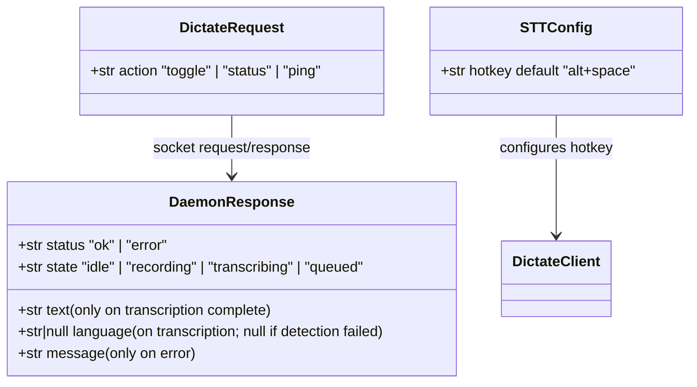
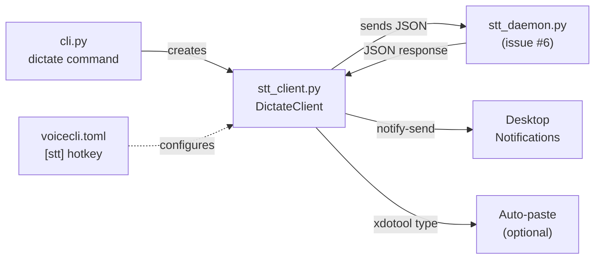

## Context

Promoted from [frame](../frames/7-dictate-toggle-hotkey-frame.mdx). Blocked by #6 (STT daemon).

The STT daemon (#6) is already implemented in `src/voicecli/stt_daemon.py` with a Unix socket protocol supporting `ping`, `status`, and `toggle` actions. Clipboard writing (`wl-copy`/`xclip`/`xsel`) is already handled server-side. This spec covers the **client** side: a thin CLI command that talks to the daemon and adds hotkey listening, notifications, and optional auto-paste.

## Goal

Provide a `voicecli dictate` command that toggles STT recording via the daemon socket, with optional built-in global hotkey listener, desktop notifications, and auto-paste — enabling hands-free dictation from any application.

## Users

- **Primary:** Developer using WSL2 who wants push-to-talk dictation bound to a keyboard shortcut (Windows shortcut → `wsl voicecli dictate`, or pynput `--listen` mode).
- **Secondary:** Scripters who need programmatic toggle/status access for automation.

## Expected Behavior

### Toggle flow (single shot)

User presses a Windows keyboard shortcut bound to `wsl voicecli dictate`:

1. Client connects to `~/.local/share/voicecli/stt-daemon.sock`
2. Sends `{"action": "toggle"}`
3. If daemon was **idle** → starts recording. Client prints `response["state"]` (`recording`) and sends a persistent notification ("Recording..."). Exits 0.
4. If daemon was **recording** → stops + transcribes. Client receives `{"status": "ok", "state": "idle", "text": "...", "language": "fr"}`. `language` may be `null` on transcription failure. Prints text to stdout. Sends notification with transcription preview. Exits 0.
5. If daemon was **transcribing** → queues next recording. Client receives `{"status": "ok", "state": "queued"}`. Prints `queued` to stdout. Sends notification ("Queued — will record after current transcription"). Exits 0.
6. If daemon was **queued** → no-op. Client prints `queued`. Exits 0.
7. If daemon unreachable → prints error, sends error notification, exits 1.

### Status check

`voicecli dictate status` → sends `{"action": "status"}` → prints `idle` / `recording` / `transcribing` / `queued`. Exits 0.

### Hotkey listener mode

`voicecli dictate --listen` → stays alive, listens for global hotkey (default `alt+space`, configurable in `voicecli.toml`). On hotkey press: sends toggle to daemon (same as single-shot). 300ms debounce. Ctrl+C to exit. **This is a secondary/convenience path** — pynput only captures keys when an X11/WSLg window has focus. For cross-app dictation, the recommended path is a Windows keyboard shortcut bound to `wsl voicecli dictate`.

### Auto-paste

`voicecli dictate --paste` → after receiving transcription, attempts `xdotool type --clearmodifiers -- "<text>"` with 150ms focus delay. Falls back silently to clipboard-only if `xdotool` not found. **Known limitation:** `xdotool` targets X11 windows only — under pure Wayland sessions (no XWayland) it will fail and fall back to clipboard. Clipboard is always written (by daemon).

### Notifications

All modes send `notify-send` feedback. Use `--replace-id=voicecli-dictate` (or `-r` on libnotify 0.8+) so each notification replaces the previous one instead of stacking:
- Recording start: `notify-send -r voicecli-dictate "VoiceCLI" "Recording..." -t 0` (persistent until replaced)
- Queued: `notify-send -r voicecli-dictate "VoiceCLI" "Queued..." -t 3000`
- Transcription done: `notify-send -r voicecli-dictate "VoiceCLI" "[fr]: Bonjour tout le..." -t 3000` (truncated to ~50 chars)
- Error: `notify-send -r voicecli-dictate "VoiceCLI" "STT daemon not running" -t 3000`
- If `notify-send` is unavailable or doesn't support `-r`, skip/fall back silently (no crash).

## Data Model & Consumers

| Consumer | Fields | When | Status |
|----------|--------|------|--------|
| `cli.py` dictate commands | all DaemonResponse fields | on toggle/status response | this issue |
| `notify-send` | state, text, language | after each toggle | this issue |
| `xdotool` auto-paste | text | after transcription (--paste) | this issue |
| `voicecli.toml` | `[stt] hotkey` | on `--listen` startup | this issue |

## Breadboard

### Affordances

| ID | Element | Location |
|----|---------|----------|
| U1 | `voicecli dictate` command | cli.py |
| U2 | `voicecli dictate status` subcommand | cli.py |
| U3 | `--listen` flag | cli.py |
| U4 | `--paste` flag | cli.py |
| N1 | `send_toggle()` | stt_client.py |
| N2 | `send_status()` | stt_client.py |
| N3 | `notify()` | stt_client.py |
| N4 | `auto_paste()` | stt_client.py |
| N5 | `hotkey_loop()` | stt_client.py |
| S1 | `[stt] hotkey` config | voicecli.toml |

### Wiring

| From | To | Trigger |
|------|----|---------|
| U1 | N1 | user runs `voicecli dictate` |
| U2 | N2 | user runs `voicecli dictate status` |
| U3 | N5 → N1 | `--listen` starts hotkey loop, each hotkey press triggers toggle |
| N1 | N3 | after daemon response, send notification |
| N1 | N4 | if `--paste` and text received, attempt xdotool |
| S1 | N5 | hotkey_loop reads configured shortcut |

## Slices

| # | Slice | Affordances | Demo |
|---|-------|-------------|------|
| 1 | Socket client + toggle | N1, N2, U1, U2 | `voicecli dictate` toggles recording, `voicecli dictate status` prints state |
| 2 | Notifications + auto-paste | N3, N4, U4 | Toggle shows notify-send popup, `--paste` types into focused window |
| 3 | Hotkey listener | N5, U3, S1 | `voicecli dictate --listen` captures alt+space, sends toggle. Prereq: add `[stt]` table support to `config.py`, add `pynput` to `pyproject.toml` |

## Implementation Notes

- **Wire protocol:** `_send_json`/`_recv_json` are currently duplicated between `daemon.py` and `stt_daemon.py`. The client needs the same helpers — consider factoring into a shared `wire.py` module (or at minimum, duplicate into `stt_client.py` with a comment).
- **Config:** `config.py` currently only reads `[defaults]`. Slice 3 requires reading `[stt] hotkey` — extend `load_defaults()` or add a `load_stt_config()` helper.
- **Dependency:** Slice 3 adds `pynput` as a new optional dependency in `pyproject.toml`.

## Success Criteria

- [ ] `voicecli dictate` connects to STT daemon socket and sends `{"action": "toggle"}`
- [ ] Toggle response is printed to stdout (`response["state"]` on start/queue, `response["text"]` on transcription)
- [ ] Toggling during transcription prints `queued` and sends appropriate notification
- [ ] `voicecli dictate status` prints current daemon state (`idle`/`recording`/`transcribing`/`queued`)
- [ ] Exit code 0 on success, 1 on daemon unreachable or error
- [ ] `notify-send` is called on recording start, transcription done, queued, and error
- [ ] Notifications use replace-id to avoid stacking
- [ ] Notifications degrade gracefully (no crash if `notify-send` missing)
- [ ] `--paste` flag triggers `xdotool type` after transcription; falls back to clipboard if unavailable
- [ ] `--listen` starts pynput global hotkey listener with 300ms debounce
- [ ] Hotkey is configurable via `voicecli.toml` `[stt] hotkey` (default: `alt+space`)
- [ ] `--listen` mode exits cleanly on Ctrl+C
- [ ] `docs/dictation-setup.md` documents Windows shortcut + KDE/GNOME setup
