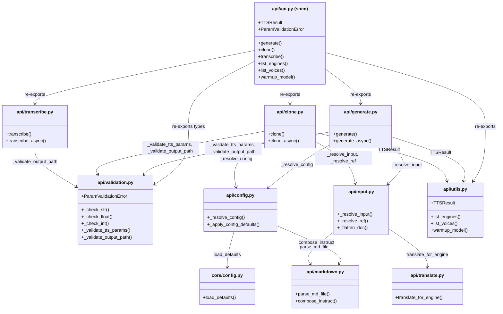
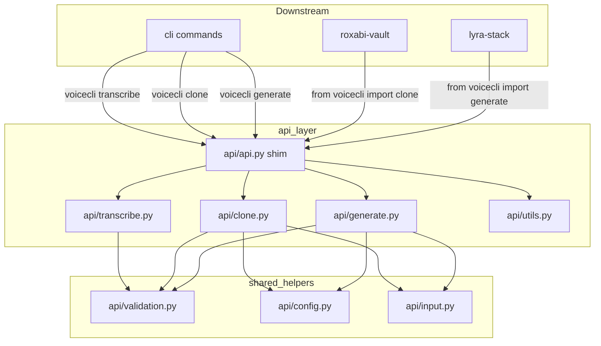

## Context

Source: [frame #81](../frames/81-split-src-voicecli-api-py-frame.mdx). PR #170 restructured `src/voicecli/` into layer sub-packages; this issue completes the extraction of the remaining 850-line `api/api.py` into focused modules ≤ 300 LOC each.

## Goal

`src/voicecli/api/api.py` ≤ 300 LOC (thin re-export shim), with pipeline logic extracted into focused api-layer modules by functional concern — not by modality.

## Users

- **Primary:** voiceCLI maintainers — api-layer changes become isolated to single files.
- **Secondary:** `lyra-stack` and `roxabi-vault` — top-level imports `generate`, `clone`, `transcribe` remain stable.

## Expected Behavior

Current `api/api.py` (850 LOC) carries three public pipelines (`generate`, `clone`, `transcribe`) plus shared helpers (validation, config resolution, input resolution, ref resolution, utilities, async wrappers). After refactor:

1. `api/api.py` becomes a thin shim that imports and re-exports the public surface.
2. Each extracted module focuses on a single functional concern within the `api` layer.
3. No public API signatures change; no downstream import paths break.
4. `api/__init__.py` continues to re-export from `api.api` (the shim) for backward compatibility.

## Data Model & Consumers

### Module Structure (classDiagram)

### Consumer Map (flowchart)

### Consumer Summary Table

| Consumer | Uses | Fields / Functions | Status |
|---|---|---|---|
| lyra-stack | `voicecli.generate`, `voicecli.clone` | top-level imports | this issue |
| roxabi-vault | `voicecli.generate` | top-level imports | this issue |
| CLI commands | `generate()`, `clone()`, `transcribe()` | via `api.api` shim | this issue |
| tests | `generate()`, `clone()`, `transcribe()`, `TTSResult`, `ParamValidationError` | public API + types | this issue |

## Breadboard

| Affordance | Handler | Data / Types | Module |
|---|---|---|---|
| `generate(text, ...)` → `TTSResult` | `generate()` | `str/Path`, `TTSResult` | `api/generate.py` |
| `generate_async(text, ...)` → `TTSResult` | `generate_async()` | `str/Path`, `TTSResult` | `api/generate.py` |
| `clone(text, ref, ...)` → `TTSResult` | `clone()` | `str/Path`, `TTSResult` | `api/clone.py` |
| `clone_async(text, ref, ...)` → `TTSResult` | `clone_async()` | `str/Path`, `TTSResult` | `api/clone.py` |
| `transcribe(audio, ...)` → `TranscriptionResult` | `transcribe()` | `str/Path`, `TranscriptionResult` | `api/transcribe.py` |
| `transcribe_async(audio, ...)` → `TranscriptionResult` | `transcribe_async()` | `str/Path`, `TranscriptionResult` | `api/transcribe.py` |
| `list_engines()` → `list[str]` | `list_engines()` | `list[str]` | `api/utils.py` |
| `list_voices(engine)` → `list[str]` | `list_voices()` | `list[str]` | `api/utils.py` |
| `warmup_model(model)` | `warmup_model()` | `str` | `api/utils.py` |
| `TTSResult` dataclass | `TTSResult` | `wav_path`, `mp3_path`, `chunk_paths` | `api/utils.py` |
| `ParamValidationError` exception | `ParamValidationError` | `ValueError` subclass | `api/validation.py` |
| Input validation | `_validate_tts_params()` | `dict` of params | `api/validation.py` |
| Output path guard | `_validate_output_path()` | `Path`, `_Unrestricted` | `api/validation.py` |
| Config resolution | `_resolve_config()` | `dict` of resolved values | `api/config.py` |
| Config backfill | `_apply_config_defaults()` | `TTSDocument`, `dict` | `api/config.py` |
| Markdown flatten | `_flatten_doc()` | `TTSDocument` | `api/input.py` |
| Markdown input | `_resolve_input()` | `str/Path`, `dict` | `api/input.py` |
| Ref audio | `_resolve_ref()` | `Path/str/None` | `api/input.py` |

## Constraints

- Layer-axis split only (per ADR-003). All new modules must be in `src/voicecli/api/` and map to the api layer — no modality prefixes (`tts`, `stt`, `sts`) in filenames.
- Public API stability: `from voicecli import generate, clone, transcribe` must work unchanged. `from voicecli.api.api import generate` must also work.
- Extracted modules must NOT import `api.api` (the shim) to avoid circular imports.
- Each resulting module ≤ 300 LOC.

## Out of Scope

- Moving helpers across layers (e.g. `_validate_output_path` stays in `api/` for cohesion with `_Unrestricted` usage, does not move to `core/`).
- Changes to engine internals (`engines/`), CLI commands (`cli/`), adapters (`adapters/`), ports (`ports/`), or runtime (`runtime/`).
- New features, API surface changes, or async wrapper behavior changes.
- Downstream repo updates — lyra-stack and roxabi-vault are consumers, not modified here.

## Edge Cases / Failure Modes

| Scenario | Handling |
|---|---|
| Circular import between shim and extracted module | Prevented by rule: extracted modules import helpers directly; never import `api.api`. |
| Downstream imports private symbol (e.g. `from voicecli.api.api import _resolve_config`) | Will break if `_resolve_config` moves. Mitigation: keep `api.api` re-exporting all public symbols; private helpers are not re-exported. Add smoke-test criterion verifying downstream import paths. |
| `TTSResult` imported from wrong module | `api/__init__.py` re-exports `TTSResult` from wherever it lands; `voicecli/__init__.py` re-exports from `api`. |
| Tests import moved private helper | `tests/test_api.py` and `tests/test_validation.py` may import `_check_str` etc. Update test imports to new module paths. |
| File-length gate fires on new modules | All new modules are sized ≤300 LOC by construction; gate should pass for `api/` package. |

## Slices

| # | Slice | Files | Demo-able | Dependencies |
|---|---|---|---|---|
| 1 | Extract shared helpers | `api/validation.py`, `api/config.py`, `api/input.py`, `api/utils.py` | `pytest tests/test_validation.py` + `tests/test_output_path_validation.py` pass | none |
| 2 | Extract TTS pipelines | `api/generate.py`, `api/clone.py` | `voicecli generate "hello"` + `voicecli clone "hello"` work | slice 1 |
| 3 | Extract transcribe pipeline | `api/transcribe.py` | `voicecli transcribe <file>` works | slice 1 |
| 4 | Thin shim + __init__ cleanup | `api/api.py`, `api/__init__.py` | `from voicecli import generate, clone, transcribe` works | slices 2–3 |
| 5 | Update exemptions + gates | `tools/file_exemptions.txt` | CI file-length gate passes | slice 4 |

## Success Criteria

- [ ] `src/voicecli/api/api.py` ≤ 300 LOC (or becomes a thin re-export shim)
- [ ] Each new module in `src/voicecli/api/` ≤ 300 LOC
- [ ] No file name contains modality prefix (`tts`, `stt`, `sts`) — layer-axis only
- [ ] `from voicecli import generate, clone, transcribe` still works with unchanged signatures
- [ ] `from voicecli import TTSResult, ParamValidationError` still works
- [ ] `from voicecli.api.api import generate` still works (backward compat)
- [ ] Smoke test: `python -c "from voicecli import generate, clone, transcribe; from voicecli.api.api import generate, clone, transcribe"` succeeds
- [ ] `tests/test_api.py` passes
- [ ] `tests/test_validation.py` passes
- [ ] `tests/test_output_path_validation.py` passes
- [ ] CI file-length gate passes (exemption row updated/removed)
- [ ] `ruff check .` passes
- [ ] `pyright` passes
