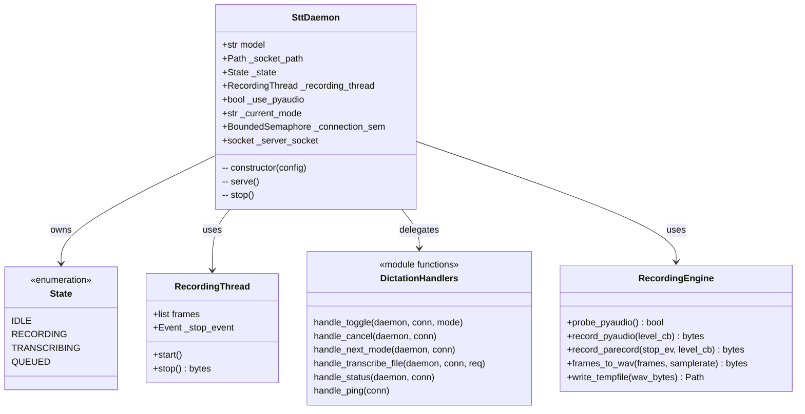
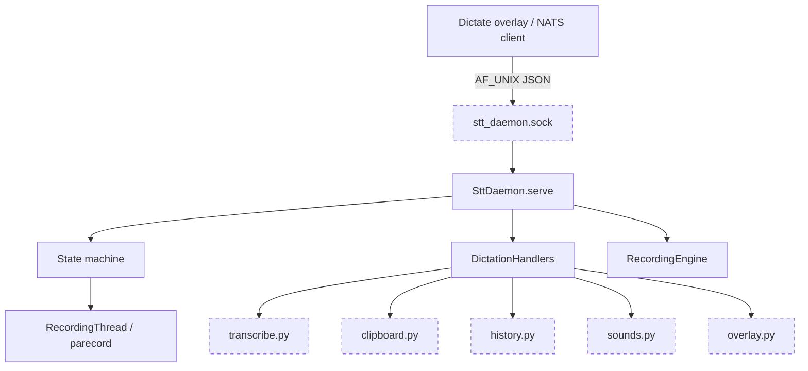

## Context

Derived from [frame](../frames/82-split-runtime-stt-daemon-frame.mdx). The file was moved from `src/voicecli/stt_daemon.py` → `src/voicecli/runtime/stt_daemon.py` by #170 layer restructure. Partial extractions (#133, #154) already relocated clipboard, history, sounds, wire protocol, and standalone transcription. The remaining 784 LOC is still 2.6x the file-length budget.

## Goal

Split `src/voicecli/runtime/stt_daemon.py` into a ≤ 300 LOC bootstrap plus focused layer-named modules, preserving the `voicecli stt-serve` CLI surface and the AF_UNIX newline-delimited JSON socket contract.

## Users

- **Primary:** voiceCLI maintainers editing STT daemon behavior
- **Secondary:** downstream consumers of the `voicecli stt-serve` socket contract (dictate overlay, NATS toggle clients)

## Expected Behavior

A user runs `voicecli stt-serve`. The daemon binds to `~/.local/share/voicecli/stt-daemon.sock`, accepts AF_UNIX connections, and dispatches JSON actions (ping, status, toggle, cancel, next_mode, transcribe_file). Recording starts via pyaudio when available, falling back to parecord. On toggle-stop, audio is transcribed via `transcribe.py`, written to clipboard/history, and the result is returned over the socket. `cancel` aborts an active recording and returns the daemon to idle. `next_mode` cycles through configured STT modes and persists the new default. `transcribe_file` transcribes a WAV file using the warm model, retrying on CUDA OOM. All behavior is identical to the pre-split implementation.

## Data Model & Consumers

| Consumer | Fields / Actions | When | Status |
|---|---|---|---|
| Dictate overlay | toggle, cancel, next_mode, status | User hotkey press | this issue |
| NATS toggle client | toggle, transcribe_file | Cross-host dictate | this issue |
| Tests | serve, stop, _handle_* | CI / local dev | this issue |
| Future TTS daemon | serve loop pattern, peer-auth | Out of scope | future |

## Breadboard

| Affordance | ID | Handler | Data | Notes |
|---|---|---|---|---|
| `voicecli stt-serve` | N1 | `SttDaemon.serve()` | config from `load_stt_config()` | CLI entry unchanged |
| Socket `ping` | N2 | `DictationHandlers.ping()` | none | liveness check |
| Socket `status` | N3 | `DictationHandlers.status()` | `state`, `mode` | returns current state |
| Socket `toggle` | N4 | `DictationHandlers.toggle()` | `mode` (opt) | idle→recording or recording→transcribing→idle |
| Socket `cancel` | N5 | `DictationHandlers.cancel()` | none | aborts recording |
| Socket `next_mode` | N6 | `DictationHandlers.next_mode()` | none | cycles mode |
| Socket `transcribe_file` | N7 | `DictationHandlers.transcribe_file()` | `audio_path`, `language`, `task`, `initial_prompt` | uses warm model |
| pyaudio recording | N8 | `RecordingEngine.record_pyaudio()` | `level_callback` | primary path |
| parecord fallback | N9 | `RecordingEngine.record_parecord()` | `level_callback` | fallback path |
| Clipboard write | S1 | `clipboard.write_clipboard()` | transcribed text | side effect |
| History append | S2 | `history.append_history()` | text, language, mode, duration | side effect |
| UI sound | S3 | `sounds.play_ui_sound()` | `"start.wav"` / `"stop.wav"` | side effect |
| Overlay spawn | S4 | `overlay.spawn_overlay()` | mode, hotkeys | side effect → Slice 3 |
| Audio save | S5 | `_save_recording()` | wav_bytes, text, language | side effect → Slice 2 |

## Slices

| # | Slice | Files | Acceptance | Risk |
|---|---|---|---|---|
| 1 | Extract recording infrastructure | `runtime/recording.py` (new), `runtime/stt_daemon.py` (-~200 LOC) | `voicecli stt-serve` starts; toggle records audio | low |
| 2 | Extract dictation handlers | `runtime/dictation.py` (new), `runtime/stt_daemon.py` (-~240 LOC). Includes all `_handle_*` methods plus `_stop_and_transcribe` (state transition + transcription orchestration). | all socket actions respond identically; conn ownership transfer preserved | low |
| 3 | Thin bootstrap | `runtime/stt_daemon.py` (≤ 300 LOC). Constructor, `serve()` accept loop, `stop()`, `_handle()` dispatch, state machine wiring. Keep socket loop separate from `runtime/daemon.py` (TTS diverges on peer-auth + semaphore). | serve loop + state machine only | medium |
| 4 | Integration + cleanup | `tools/file_exemptions.txt`, tests | all tests green; exemption removed; `warmup()` import path preserved | low |

**Risks**

- **Conn ownership transfer:** `_stop_and_transcribe` sends the JSON response and owns `conn`; the bootstrap `_handle` must skip `conn.close()` for this action. Documented in slice 2.
- **`warmup()` re-export:** Tests patch `voicecli.stt_daemon.warmup`. Preserve import path or update tests in slice 4.
- **Thread safety:** `_parecord_wav_holder` is mutated by a background thread (`_run_parecord`) and read by the main thread (`_stop_and_transcribe`) without a lock. Existing behavior is preserved by the refactor; a future issue can add proper synchronization.

## Success Criteria

- [ ] `src/voicecli/runtime/stt_daemon.py` ≤ 300 LOC
- [ ] `voicecli stt-serve` command-line surface unchanged
- [ ] Socket protocol (AF_UNIX newline-delimited JSON) unchanged — ping, status, toggle, cancel, next_mode, transcribe_file all respond identically
- [ ] No new modality-prefixed file names (`stt_*`) beyond existing `stt_daemon.py`
- [ ] All existing tests pass
- [ ] `tools/file_exemptions.txt` row for `src/voicecli/runtime/stt_daemon.py` removed
- [ ] Pre-commit quality gates pass (file length, folder size, import layers)
