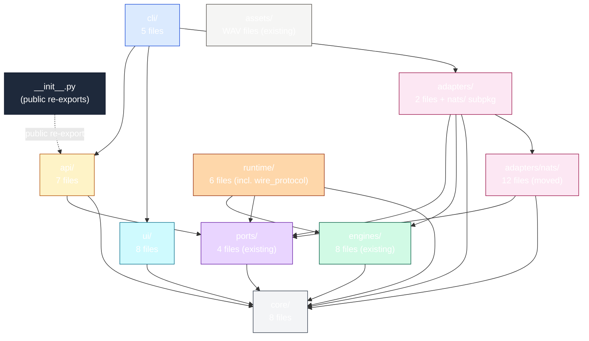
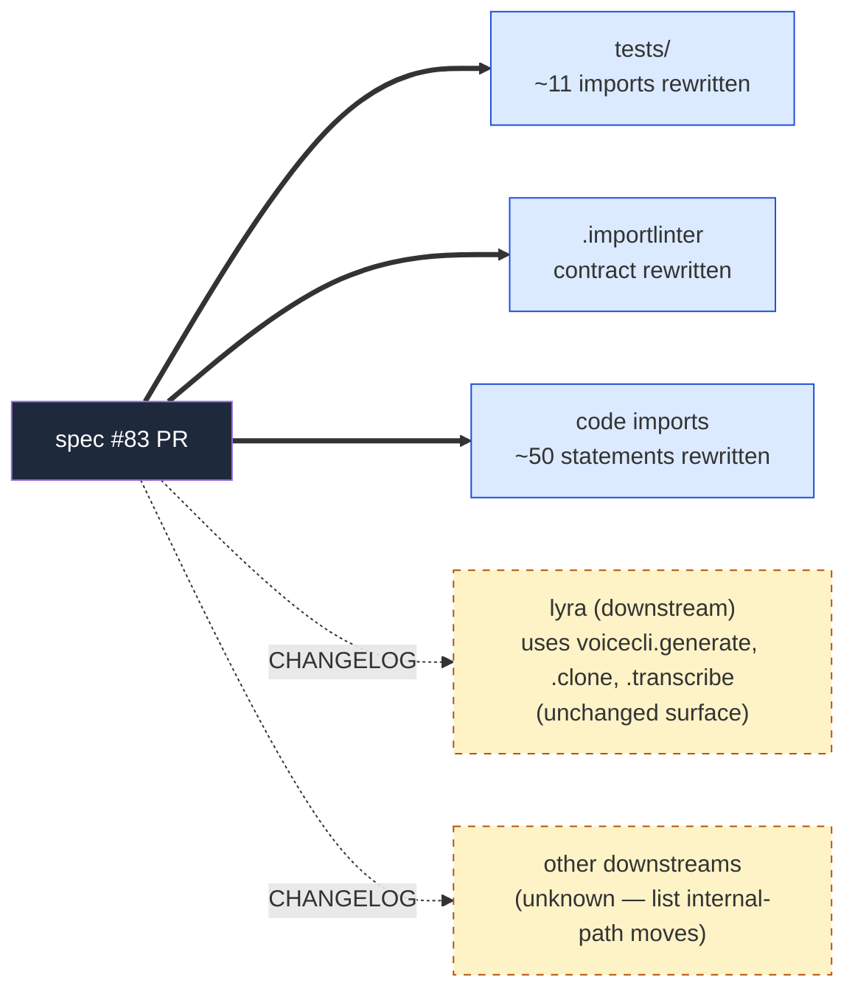

## Context

`src/voicecli/` has 37 top-level `.py` files against a folder-size budget of 12. ADR-003 (axial: true) declares **layer** as the primary axis (cli → api → ports → adapters → engine) and modality (TTS/STT/STS) as subordinate. The current flat layout mixes layers and modality-tagged siblings (`stt_client.py`, `stt_daemon.py`, `nats_stt_client.py`, `nats_recorder.py`, `stt_modes.py`) — the exact drift signature ADR-003 was written to prevent.

Source: [analysis 83](../analyses/83-restructure-src-voicecli-analysis.mdx) — recommends **Shape B (9-package layout)**.
Frame: [frame 83](../frames/83-restructure-src-voicecli-frame.mdx).

## Goal

Move every existing `src/voicecli/*.py` module into a layer-named sub-package such that the top-level folder count drops to ≤12, the public API import contract stays identical, and no new shim cruft is introduced.

## Users

- **Primary:** voiceCLI maintainers + AI agents reading the codebase. After this change, `ls src/voicecli/` shows a layer-axis tree (`cli/ api/ ports/ adapters/ engines/ runtime/ ui/ core/ assets/`) that answers "where does X live" without consulting docs.
- **Secondary:** the quality-gate system itself — the `folder_size` budget becomes meaningful again (no exemption row silencing it on `src/voicecli/`).
- **Downstream consumers:** `lyra` (only known external consumer) — affected only via the CHANGELOG; `voicecli.generate`, `voicecli.clone`, `voicecli.transcribe` continue to work.

## Expected Behavior

After the change:

1. `ls src/voicecli/` returns 10 entries: `__init__.py`, `cli/`, `api/`, `ports/`, `adapters/`, `engines/`, `runtime/`, `ui/`, `core/`, `assets/`.
2. `python -c "from voicecli import generate, clone, transcribe, TTSDocument, Segment, TranscriptionResult; print(generate)"` runs identically to before.
3. `python -c "from voicecli.api import generate"` runs identically to before (the `voicecli.api` sub-package re-exports from `voicecli.api.api`).
4. `uv run pytest` passes with the same test count + duration profile (no skips, no new failures).
5. `uv run lint-imports` passes against the rewritten `.importlinter` (layer order matches new sub-package tree; no `ignore_imports` added).
6. `uv run pre-commit run --all-files` passes the file-length + folder-size + duplicate-test-basenames gates.
7. `tools/file_exemptions.txt` and `tools/folder_exemptions.txt` contain **zero** rows pointing to issue #83.
8. The `daemon_protocol.py` → `runtime/wire_protocol.py` rename collapses ADR-003 debt #4 (one `ignore_imports` line removed).
9. The `nats/` → `adapters/nats/` move is reflected in the importlinter contract.
10. `CHANGELOG.md` lists every internal-import path that moved, grouped by sub-package.

## Data Model & Consumers

The "data" being restructured is the **module tree** itself; the relevant model is the layer graph + import contract.

### Target module tree

### Module → target layer mapping (37 source files)

| Current path | Target path | Layer | Notes |
|---|---|---|---|
| `cli.py` | `cli/main.py` (with `cli/__init__.py` re-exporting `app`) | cli | Typer app root; preserves `voicecli` console-script entry |
| `cli_samples.py` | `cli/samples.py` | cli | |
| `cli_dictate.py` | `cli/dictate.py` | cli | |
| `cli_doctor.py` | `cli/doctor.py` | cli | |
| `cli_nats.py` | `cli/nats.py` | cli | |
| `api.py` | `api/api.py` (re-exported via `api/__init__.py`) | api | |
| `api_chunked.py` | `api/chunked.py` | api | |
| `markdown.py` | `api/markdown.py` | api | doc-model surface |
| `markdown_types.py` | `api/markdown_types.py` | api | shared primitives stay with public API |
| `_markdown_directives.py` | `api/_markdown_directives.py` | api | private helper of `api/markdown.py` |
| `translate.py` | `api/translate.py` | api | doc transformations |
| `engine_caps.py` | `api/engine_caps.py` | api | capability matrix (consumed by translate) |
| `engine.py` | `engines/engine.py` (re-exported via `engines/__init__.py`) | engine | registry stays in engines |
| `daemon.py` | `runtime/daemon.py` | runtime | TTS daemon |
| `stt_daemon.py` | `runtime/stt_daemon.py` | runtime | STT daemon |
| `daemon_protocol.py` | `runtime/wire_protocol.py` | runtime | **renamed** per ADR-003 debt #4 |
| `model_registry.py` | `runtime/model_registry.py` | runtime | VRAM/LRU mgmt |
| `transcribe.py` | `runtime/transcribe.py` | runtime | Whisper file inference |
| `listen.py` | `runtime/listen.py` | runtime | Kyutai realtime inference |
| `overlay.py` | `ui/overlay.py` | ui | |
| `overlay_audio.py` | `ui/overlay_audio.py` | ui | |
| `overlay_draw.py` | `ui/overlay_draw.py` | ui | |
| `ui_sounds.py` | `ui/sounds.py` | ui | drop redundant `ui_` prefix |
| `stt_client.py` | `ui/stt_client.py` | ui | toggle/notify/hotkey UI |
| `nats_recorder.py` | `ui/nats_recorder.py` | ui | mic recorder UI subprocess |
| `clipboard.py` | `ui/clipboard.py` | ui | |
| `tg.py` | `ui/tg.py` | ui | Telegram helper (out-of-band notify) |
| `nats_stt_client.py` | `adapters/nats/stt_client.py` | adapters | NATS STT client |
| `config.py` | `core/config.py` | core | |
| `paths.py` | `core/paths.py` | core | |
| `utils.py` | `core/utils.py` | core | |
| `env.py` | `core/env.py` | core | |
| `models.py` | `core/models.py` | core | model metadata + HF cache |
| `samples.py` | `core/samples.py` | core | |
| `stt_modes.py` | `core/stt_modes.py` | core | named presets |
| `history.py` | `core/history.py` | core | |

Existing sub-packages preserved as-is:
- `engines/` (8 files) — engine implementations (already layer-named: by product/backend, ¬modality)
- `ports/` (4 files) — Protocols (already correct)
- `adapters/` (2 files) — port impls (existing); receives `nats/` as `adapters/nats/` (12 files moved)
- `assets/` — static WAV files

### Public API contract (frozen)

`voicecli/__init__.py` MUST continue to export, with identical names and signatures:

| Symbol | Source after move |
|---|---|
| `generate`, `generate_async` | `voicecli.api.api` |
| `clone`, `clone_async` | `voicecli.api.api` |
| `transcribe`, `transcribe_async` | `voicecli.api.api` |
| `list_engines`, `list_voices` | `voicecli.api.api` |
| `TTSResult` | `voicecli.api.api` |
| `TTSDocument`, `Segment` | `voicecli.api.markdown` |
| `TranscriptionResult` | `voicecli.runtime.transcribe` |
| `__version__` | inline |

Submodule attribute trick (`voicecli.transcribe = <submodule>` before importing the `transcribe` function) must be preserved — pin to `voicecli.runtime.transcribe`.

### Consumers — internal (rewritten in this PR) vs external (CHANGELOG)

| Consumer | What changes | Status |
|---|---|---|
| `src/voicecli/**` (intra-package code) | ~50 `from voicecli.X import …` statements rewritten to new sub-paths | this PR |
| `tests/**` | ~11 `from voicecli.X import …` statements rewritten | this PR |
| `.importlinter` | layer-tier prose rewritten to new sub-package tree; existing `ignore_imports` reduced where moves collapse them (notably `daemon` → `daemon_protocol` collapses) | this PR |
| `tools/file_exemptions.txt`, `tools/folder_exemptions.txt` | 4 rows pointing to #83 removed | this PR |
| `CHANGELOG.md` | new entry listing all moved `voicecli.X` → `voicecli.Y.X` paths | this PR |
| `lyra` (downstream) | reads CHANGELOG; public API (`voicecli.generate` etc.) unchanged → no code change needed | docs only |

## Breadboard

### Affordances (places code reaches into the package)

| ID | Affordance | Handler (current → target) |
|---|---|---|
| A1 | Console script `voicecli` entry | `voicecli.cli:app` → `voicecli.cli.main:app` (re-exported via `voicecli.cli:app`) |
| A2 | Library entry `from voicecli import generate, clone, transcribe` | `voicecli/__init__.py` → unchanged path, source updated to `voicecli.api.api` |
| A3 | Markdown doc model `from voicecli import TTSDocument, Segment` | `voicecli/__init__.py` → unchanged path, source updated to `voicecli.api.markdown` |
| A4 | STT result type `from voicecli import TranscriptionResult` | `voicecli/__init__.py` → unchanged path, source updated to `voicecli.runtime.transcribe` |
| A5 | Engine registry `voicecli.engine.{get_engine,available_engines}` | becomes `voicecli.engines.{get_engine,available_engines}` (re-exported at `voicecli.engines` level) |
| A6 | Daemon Unix socket `~/.local/share/voicecli/daemon.sock` | path constant moves `voicecli.paths` → `voicecli.core.paths` (no behavioral change) |
| A7 | NATS satellite invocation `voicecli nats-serve {tts,stt}` | reaches `voicecli.cli.nats:nats_app` (was `voicecli.cli_nats:nats_app`) — Typer app composition |
| A8 | Quality gate `folder_size` on `src/voicecli/` | currently exempted via `folder_exemptions.txt` row → exemption removed, gate passes natively |
| A9 | axial-adr-review regex `src/voicecli/**/[^/]*(tts|stt|sts)[^/]*\.py` | pre-existing files (`stt_client.py` etc.) match — addressed via Slice 8 allowlist |

### Wiring (cross-layer imports — must respect `.importlinter`)

Allowed direction: cli → api → adapters → engines → runtime → core (top-down). Same-tier peer imports allowed within a sub-package only (no cross-package peer imports without explicit `ignore_imports`).

The rewritten `.importlinter` will declare these tiers in order. All current `ignore_imports` lines are re-evaluated:

| Current `ignore_imports` | Disposition after restructure |
|---|---|
| `voicecli.translate -> voicecli.markdown` | **Removed** — both move into `voicecli.api`, intra-package peer import is allowed |
| `voicecli.translate -> voicecli.utils` | **Stays** — `api.translate` → `core.utils` is cross-tier (api → core) and allowed without ignore (top-down) |
| `voicecli.cli -> voicecli.cli_samples` (×4) | **Removed** — all `cli_*` collapse into `voicecli.cli/`; intra-package |
| `voicecli.cli_nats -> voicecli.nats.*` | **Stays** as `voicecli.cli.nats -> voicecli.adapters.nats.*` — cli → adapters is top-down, allowed without ignore. Existing `ignore` row drops. |
| `voicecli.cli_nats -> voicecli.model_registry` | **Reclassified** — `voicecli.cli.nats -> voicecli.runtime.model_registry`. cli → runtime is *upward* (cli is tier 1, runtime is tier 4 — runtime is *below* cli; this is top-down). Allowed. Existing row drops. |
| `voicecli.cli -> voicecli.listen` | **Reclassified** as `voicecli.cli.main -> voicecli.runtime.listen` — cli → runtime, allowed. Row drops. |
| `voicecli.daemon -> voicecli.engine` | **Reclassified** as `voicecli.runtime.daemon -> voicecli.engines.engine` — runtime → engines is top-down (runtime sits above engines? **NO — engines is the bottom, runtime is the daemon orchestration above it**). Actually verify: per `.importlinter` current tier order, `engine` and `daemon` are in the **same tier 4** (peer). After restructure: `engines/` is tier-engines, `runtime/` is the daemon-wrapping tier above engines. **runtime → engines is top-down, allowed.** Row drops. |
| `voicecli.daemon -> voicecli.daemon_protocol` | **Removed** — both move to `voicecli.runtime`, intra-package |
| `voicecli.daemon_protocol -> voicecli.engine` | **Reclassified** as `voicecli.runtime.wire_protocol -> voicecli.engines.engine`. runtime → engines top-down. Row drops. |
| `voicecli.stt_daemon -> voicecli.daemon_protocol` | **Removed** — `voicecli.runtime.stt_daemon -> voicecli.runtime.wire_protocol` is intra-package |
| `voicecli.stt_daemon -> voicecli.transcribe` | **Removed** — both in `voicecli.runtime`, intra-package |
| `voicecli.model_registry -> voicecli.engine` | **Reclassified** as `voicecli.runtime.model_registry -> voicecli.engines.engine`. runtime → engines top-down. Row drops. |
| `voicecli.overlay -> voicecli.overlay_*` (×2) + `voicecli.overlay -> voicecli.stt_client` | **Removed** — all move into `voicecli.ui`, intra-package |
| `voicecli.cli_dictate -> voicecli.stt_client` | **Reclassified** as `voicecli.cli.dictate -> voicecli.ui.stt_client`. cli → ui top-down. Row drops. |
| `voicecli.nats_recorder -> voicecli.stt_client` | **Removed** — both move to `voicecli.ui`, intra-package |
| `voicecli.translate -> voicecli.engine_caps` | **Removed** — both in `voicecli.api`, intra-package |
| `voicecli.markdown -> voicecli._markdown_directives` | **Removed** — both in `voicecli.api`, intra-package |
| `voicecli.history -> voicecli.paths` | **Removed** — both in `voicecli.core`, intra-package |

Net effect: **every `ignore_imports` row currently in `.importlinter` is either removed (intra-package collapse) or no longer needed (legal top-down)**. The post-restructure `.importlinter` SHOULD have ZERO `ignore_imports` for `voicecli.*` peer/cross-tier exceptions. If a row survives, the spec audit failed — flag it during review.

## Slices

8 vertical slices. Each slice is **independently green** (tests pass, lint passes, types pass) before the next is started. Slice boundaries are sub-package moves so a slice can be reverted without unwinding all of the work.

| # | Slice | Files moved | Imports rewritten | Independently demo-able |
|---|---|---|---|---|
| 1 | **`adapters/nats/`** — move existing `nats/` → `adapters/nats/` | 12 (rename dir only) | `voicecli.nats.*` → `voicecli.adapters.nats.*` (~15 sites) | importlinter passes; tests green |
| 2 | **`api/`** — collect doc-model + public lib | 7 (`api.py`, `api_chunked.py`, `markdown.py`, `markdown_types.py`, `_markdown_directives.py`, `translate.py`, `engine_caps.py`) | ~20 sites; `voicecli/__init__.py` re-exports updated | `from voicecli import generate` works; tests green |
| 3 | **`engines/`** — promote `engine.py` into `engines/` (registry consolidation) | 1 (`engine.py` → `engines/engine.py`) + `engines/__init__.py` re-exports `get_engine`, `available_engines` | ~5 sites | engine registry tests green |
| 4 | **`runtime/`** — daemon + transcribe + listen + model_registry + wire_protocol | 6 (`daemon.py`, `stt_daemon.py`, `daemon_protocol.py`→`wire_protocol.py`, `model_registry.py`, `transcribe.py`, `listen.py`) | ~15 sites; daemon socket path unchanged | `voicecli serve` works; daemon tests green |
| 5 | **`ui/`** — overlay + clipboard + ui_sounds + stt_client + nats_recorder + tg | 8 (`overlay*.py`, `clipboard.py`, `ui_sounds.py`→`sounds.py`, `stt_client.py`, `nats_recorder.py`, `tg.py`) | ~12 sites | overlay tests green; dictate cycle green |
| 6 | **`core/`** — config + paths + utils + env + models + samples + stt_modes + history | 8 | ~25 sites | tests green |
| 7 | **`cli/`** — `cli_*.py` sub-apps + main | 5 (`cli.py`→`cli/main.py` + 4 `cli_*.py` files) + `cli/__init__.py` re-exports `app` | ~5 sites; console-script entry preserved | `voicecli --help` works; CLI tests green |
| 8 | **`.importlinter` rewrite + exemption removal + axial allowlist + CHANGELOG** | 0 (config-only) | 0 | `uv run lint-imports` passes; `uv run pre-commit run --all-files` passes; gate green |

Slice order rationale:
- **Bottom-up moves first** (1–3): adapters and engines have the fewest downstream consumers in `voicecli/*` source; moving them first lets later slices reference the final paths.
- **Runtime then UI then core then cli** (4–7): each layer can reference layers already moved.
- **Config + allowlist last** (8): runs against the final tree, catches drift in one place.

Every slice updates `voicecli/__init__.py` re-exports for any public symbol it touches before declaring done.

## Success Criteria

- [ ] `ls src/voicecli/ | wc -l` returns ≤ 12 (currently 37).
- [ ] `ls -d src/voicecli/*/` returns exactly `adapters/`, `api/`, `assets/`, `cli/`, `core/`, `engines/`, `ports/`, `runtime/`, `ui/` (alphabetical, 9 directories).
- [ ] No file matching `src/voicecli/[^/]*\.py` except `__init__.py` (i.e. every non-`__init__` `.py` lives in a sub-package).
- [ ] `python -c "from voicecli import generate, clone, transcribe, TTSDocument, Segment, TranscriptionResult, TTSResult, list_engines, list_voices"` exits 0.
- [ ] `python -c "from voicecli.api import generate, clone, transcribe"` exits 0 (the `api` sub-package re-exports).
- [ ] `python -c "import voicecli.transcribe; assert hasattr(voicecli.transcribe, 'TranscriptionResult')"` exits 0 (submodule attribute trick preserved).
- [ ] `uv run pytest` reports same number of passing tests as pre-PR (no skips, no new failures).
- [ ] `uv run lint-imports` exits 0.
- [ ] `uv run pre-commit run --all-files` exits 0 (file-length + folder-size + duplicate-test-basenames all green).
- [ ] `grep -E '#83' tools/file_exemptions.txt tools/folder_exemptions.txt` returns no matches.
- [ ] `.importlinter` contains **zero** `ignore_imports` lines for `voicecli.*` (intra-package peer or top-down cross-tier exceptions; only externally-justified ignores may remain).
- [ ] `src/voicecli/daemon_protocol.py` no longer exists; `src/voicecli/runtime/wire_protocol.py` exists; all importers point to the new path.
- [ ] `src/voicecli/nats/` no longer exists; `src/voicecli/adapters/nats/` exists; all importers point to the new path.
- [ ] An `.axial-allowlist` entry (or equivalent mechanism) covers the 5 pre-existing modality-tagged filenames (`stt_client.py`, `stt_daemon.py`, `stt_modes.py`, `nats_stt_client.py`, `nats_recorder.py`); a follow-up issue is opened to rename them.
- [ ] `CHANGELOG.md` "Unreleased" section contains a `### Changed — internal module paths` block listing every moved `voicecli.X` → `voicecli.Y.X` pair (alphabetical), with a "public API unchanged" disclaimer.
- [ ] `voicecli` console script invokes the same Typer app as before (`voicecli --help` output unchanged).
- [ ] `voicecli serve` (TTS daemon) starts on the same Unix socket path and same protocol as before.
- [ ] `voicecli nats-serve tts` and `voicecli nats-serve stt` start without VRAM-sequencing or import errors.
- [ ] No `from voicecli.X import` form remains in `src/voicecli/**` or `tests/**` that references a pre-move top-level path (`voicecli.daemon`, `voicecli.engine`, `voicecli.config`, etc.) — only post-move sub-package paths are used.

## Open questions resolved here (was 6 in analysis)

1. **`axial-adr-review` regex hits on pre-existing files** → **Resolved:** Slice 8 adds an `.axial-allowlist` mechanism enumerating the 5 known modality-tagged filenames; a follow-up issue is opened to rename them. The allowlist file lives at `docs/architecture/.axial-allowlist` (or equivalent path under `docs/architecture/`) and is consumed by `axial-adr-review`.
2. **`runtime/`, `ui/`, `core/` not in ADR-003's 5 canonical names** → **Resolved:** ADR-003 declares the **primary axis** is layer; it does NOT claim those 5 names are the complete enumeration of layers in the system. `runtime`, `ui`, `core` are layer-axis extensions (no modality leakage), consistent with the ADR's spirit. The spec's "Data Model & Consumers" section documents this; no ADR amendment.
3. **`engine_caps.py` and `translate.py` placement** → **Resolved:** both go in `api/` because they transform the TTS document model (`TTSDocument` lives in `api/markdown.py`). They are API-layer logic, not engine-layer. The importlinter tier reflects this.
4. **Test imports — strict rewrite vs shim** → **Resolved:** strict rewrite. Tests are the only in-repo consumers; mechanical change. Matches frame's failure-mode constraint.
5. **CHANGELOG scope** → **Resolved:** list every internal `voicecli.X` → `voicecli.Y.X` pair under "Changed — internal module paths". Public API (`voicecli.generate`, `voicecli.clone`, `voicecli.transcribe`, `voicecli.TTSDocument`, `voicecli.Segment`, `voicecli.TranscriptionResult`) called out as unchanged.
6. **PR size** → **Resolved:** single PR shipped, but plan slices by sub-package (the 8 slices in this spec) so each commit reviews atomically. Reviewers can scrub the diff slice-by-slice.

## Out of Scope

- Renaming `stt_*.py`, `nats_stt_*.py`, `nats_recorder.py` to layer-axis names (follow-up issue, not this PR — keeps the move PR purely mechanical).
- Engine refactoring (already done in `engines/`).
- ADR-003 amendment to enumerate `runtime/`, `ui/`, `core/` as canonical layer names (would loop back to spec review; not required for this PR).
- New `ports/`, `adapters/` interface design (existing 4 ports + 2 adapters stay as-is).
- Touching `engines/*.py` internals.

## Risks

| Risk | Likelihood | Mitigation |
|---|---|---|
| `voicecli.transcribe` submodule attribute trick breaks | Medium | Slice 4 explicitly verifies `import voicecli.transcribe; assert hasattr(voicecli.transcribe, 'TranscriptionResult')` after the move |
| Console script `voicecli` entry breaks (pyproject `tool.poetry.scripts` / `project.scripts`) | Low | Slice 7 verifies `voicecli --help` runs; entry-point path updated in `pyproject.toml` (`voicecli.cli:app` → `voicecli.cli.main:app` or re-exported via `voicecli.cli:app`) |
| Daemon socket path constants live under `voicecli.paths` and break daemon clients across hosts | Low | Daemon socket path is determined by `core.paths` constants; constant values unchanged — only the import-path of the constant module moved. `voicecli serve` / `voicecli stt-serve` smoke-tested in Slice 4 |
| Quadlet deployment breaks due to internal path assumptions | Very Low | `deploy/entrypoint.sh` only invokes `voicecli nats-serve` CLI; no internal module paths. Verified in analysis. |
| `.importlinter` post-restructure has remaining `ignore_imports` we missed | Medium | Spec Breadboard table enumerates every current `ignore_imports` row + its post-restructure disposition. Slice 8 audits the final file against this table. |
| Existing `tests/` directory layout (`tests/nats/`, `tests/engines/`) confuses the move | Low | Test directory layout is unchanged. Only `from voicecli.X import` statements inside test files are rewritten (~11 sites). |
| Concurrent PRs add new top-level files during the work | Medium | Worktree-based work; rebase before merge. If new top-level files land mid-flight, sort them into the right sub-package as part of the rebase. |
| `lyra` breaks due to undocumented internal-path dependency | Low | CHANGELOG entry covers all internal moves. `lyra` known to use only public API (`voicecli.generate`, `.clone`, `.transcribe`). Confirmed by spec author; verify before merge. |

## Premise check (from frame)

- **Success in 6 months:** ≤12 top-level + no exemption regression + new modules land in sub-packages → success criteria above directly verify the immediate post-merge state; the 6-month check is a follow-up (`/checkup` cadence).
- **Failure mode (falsifiable):** drift back above 12 OR shim cruft persists → spec mandates strict test rewrite (no shims), the `folder_size` gate stays armed against `src/voicecli/` after exemption removal.
- **Simpler alternative rejected:** raising the budget would defeat the gate. Out of scope.
