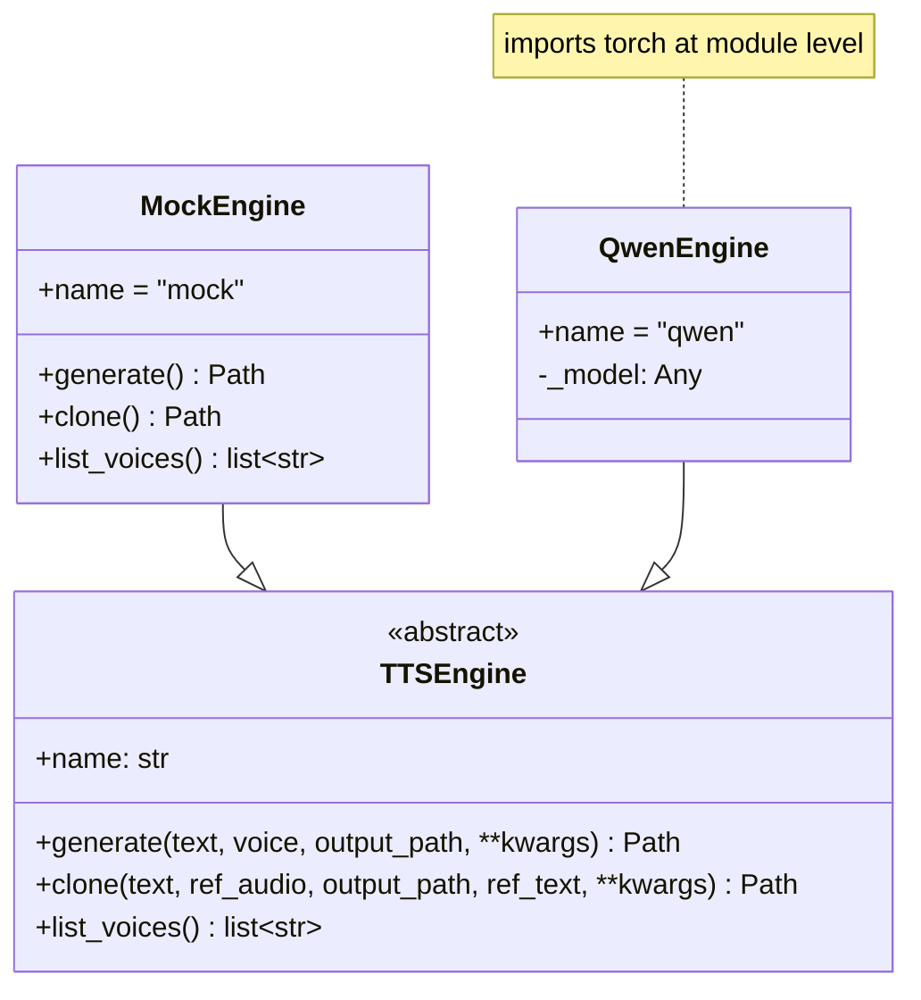
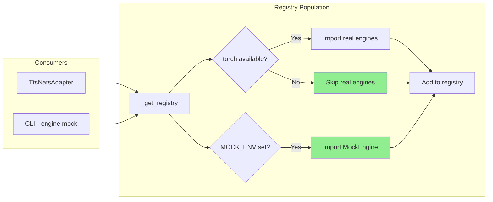

## Context

Promoted from frame [85-e2e-engine-unavailable-frame.mdx](../frames/85-e2e-engine-unavailable-frame.mdx).

## Goal

E2e CI job passes with mock engine, enabling PR quality-gate validation.

## Users

- **Primary:** Developers — CI unblocks PR merges
- **Secondary:** Release workflow — e2e becomes regression guard

## Constraints

- CI staging only — local runs not affected (or untested)
- Docker-compose stack topology fixed by prior work (#44, #49, #69)
- Real engine (qwen-fast) in current stack → prefer mock for isolation
- Must pass `tests/e2e/test_nats_roundtrip.py::test_nats_roundtrip`
- Unit tests (416) pass green — only e2e affected
- No torch dependency for mock-only scenarios

## Out of Scope

- NATS protocol changes (envelope is correct)
- Production satellite behavior (only CI stack)
- Performance optimization
- Real engine support when torch is missing

## Expected Behavior

1. CI runs `pytest tests/e2e/` on staging
2. Docker-compose stack starts NATS + TTS satellite + STT satellite
3. Satellites use mock engine (no torch dependency)
4. `test_nats_roundtrip` sends TTS + STT requests
5. Both requests succeed with mock-generated audio
6. CI job passes green

## Data Model & Consumers

| Consumer | Fields | When | Status |
|----------|--------|------|--------|
| TtsNatsAdapter | `registry["mock"]` | Request handling | This issue |
| CLI | `registry` keys | `--engine` validation | This issue |

## Breadboard

| ID | Affordance | Handler | Data |
|----|------------|---------|------|
| U1 | `voicecli nats-serve tts --engine mock` | `nats_serve_tts()` | CLI args → resolved_engine |
| N1 | `_get_registry()` | engine.py | torch availability + MOCK_ENV → dict of engine classes |
| N2 | `_engine_available("mock")` | tts_adapter.py | engine_name → bool |
| N3 | MockEngine import | engine.py | VOICECLI_ENABLE_MOCK_ENGINE=1 → MockEngine class |

**Wiring:**
- U1 calls `_resolve_engine("mock")` → returns "mock"
- U1 creates `TtsNatsAdapter(default_engine="mock")`
- When request arrives, adapter calls N2 with engine name from request
- N2 calls N1 to get registry → checks if engine name in registry keys
- N1 checks torch availability → skips real engines if missing
- N1 checks `VOICECLI_ENABLE_MOCK_ENGINE` → imports MockEngine (N3) if set
- N1 returns registry → N2 returns bool → request proceeds or returns error

## Slices

| # | Slice | Files | Demo | Acceptance |
|---|-------|-------|------|------------|
| 1 | Lazy registry | `engine.py` | `uv run python -c "from voicecli.engine import _get_registry; print(_get_registry())"` without torch | Mock in registry when env set |
| 2 | E2e passes | `tests/e2e/` | `pytest tests/e2e/` in CI | Green job |

## Success Criteria

- [ ] `_get_registry()` does not raise ImportError when torch is missing
- [ ] `_get_registry()` returns `{"mock": MockEngine}` when `VOICECLI_ENABLE_MOCK_ENGINE=1` and torch is missing
- [ ] `_get_registry()` returns real engines + mock when torch is available and env is set
- [ ] `_get_registry()` returns empty dict when torch is missing and env is not set
- [ ] `tests/e2e/test_nats_roundtrip.py::test_nats_roundtrip` passes on CI staging

## [NEEDS CLARIFICATION]

None — root cause identified.
