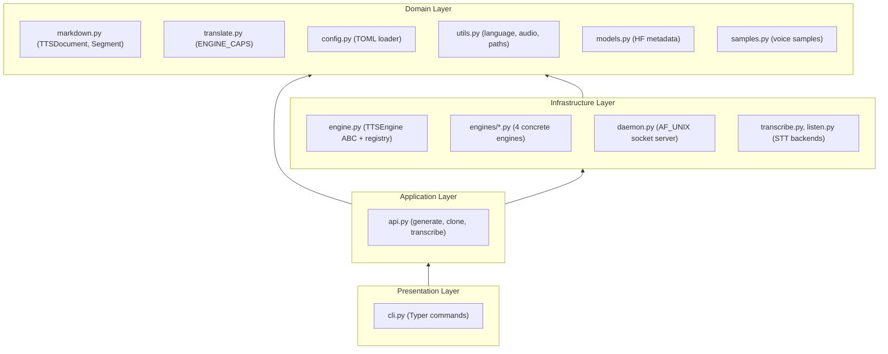
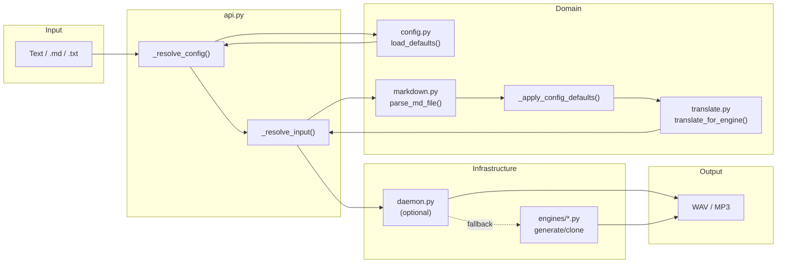

## Project Structure

```txt
voiceCLI/
├── voicecli.example.toml       # Template config — copy to voicecli.toml (gitignored)
├── TTS/
│   ├── texts_in/               # Authored .md scripts (tracked in git)
│   ├── voices_out/             # Generated WAV/MP3 (gitignored)
│   └── samples/                # Voice samples for cloning (gitignored)
├── STT/
│   ├── audio_in/               # Audio files to transcribe (gitignored)
│   └── texts_out/              # Transcription results (gitignored)
├── src/voicecli/
│   ├── __init__.py             # Public exports (generate, clone, transcribe, etc.)
│   ├── cli.py                  # Typer app — CLI entry point
│   ├── api.py                  # Orchestration — public library API
│   ├── markdown.py             # Domain models (TTSDocument, Segment) + parsing
│   ├── translate.py            # Engine capability matrix + document translation
│   ├── config.py               # TOML config loader (walk-up search)
│   ├── engine.py               # Abstract TTSEngine base class + registry
│   ├── utils.py                # Output paths, audio concat, WAV→MP3, language codes
│   ├── models.py               # HuggingFace model metadata + cache utilities
│   ├── samples.py              # Voice sample management (filesystem)
│   ├── daemon.py               # Qwen model warm-keeping daemon (AF_UNIX socket)
│   ├── transcribe.py           # Faster Whisper file transcription
│   ├── listen.py               # Kyutai real-time mic transcription
│   ├── stt_daemon.py           # STT daemon with PyAudio recording
│   └── engines/
│       ├── qwen.py             # Qwen3-TTS 1.7B engine
│       ├── qwen_fast.py        # Qwen3-TTS 0.6B variant
│       ├── chatterbox.py       # Chatterbox Multilingual (23 languages)
│       └── chatterbox_turbo.py # Chatterbox Turbo (English, paralinguistic tags)
├── tests/                      # Pytest test suite
├── docs/                       # Architecture and standards documentation
│   ├── architecture/           # Architecture docs and ADRs
│   └── standards/              # Coding standards and review checklists
├── artifacts/                  # Dev process artifacts (frames, specs, plans)
└── .claude/                    # Claude Code configuration
    ├── stack.yml               # Stack metadata (gitignored, .example committed)
    └── skills/                 # Custom skills
```

## Layered Architecture

voiceCLI follows a **four-layer architecture** with strict dependency direction — outer layers depend on inner layers, never the reverse.



### Layer Responsibilities

| Layer | Modules | Responsibility |
|-------|---------|----------------|
| **Presentation** | `cli.py` | Parse CLI flags, invoke API, format output, handle `typer.Exit` |
| **Application** | `api.py` | Orchestration: config resolution, input parsing, translation, engine dispatch, chunking |
| **Domain** | `markdown.py`, `translate.py`, `config.py`, `utils.py`, `models.py`, `samples.py` | Data models, parsing, capability matrix, configuration, utilities — pure Python, no heavy deps |
| **Infrastructure** | `engine.py`, `engines/*.py`, `daemon.py`, `transcribe.py`, `listen.py` | Abstract engine base, concrete engine implementations, daemon, STT adapters |

### Dependency Direction

Dependencies flow **inward only**:

- `cli.py` depends on `api.py` — never on engines directly
- `api.py` depends on domain modules and `engine.py` — orchestrates the full pipeline
- Domain modules depend only on stdlib and each other — no torch, no engine imports
- Engine implementations depend on `engine.py` (ABC) and domain models — never on `api.py` or `cli.py`
- **No circular dependencies** exist in the codebase

## Data Flow — Generation Pipeline



Each step is pure Python, deterministic, and reversible at each stage.

### Priority Chain

```
CLI flag / API kwarg  >  markdown frontmatter  >  voicecli.toml  >  hardcoded default
```

This priority chain is enforced in `api.py:_resolve_config()` and `_resolve_input()`.

## Key Architectural Patterns

| Pattern | Where | Purpose |
|---------|-------|---------|
| [Strategy + Registry](./patterns#strategy--registry-pattern) | `engine.py` | Pluggable TTS engines via ABC + factory |
| [Adapter / Translator](./patterns#adapter--translator-pattern) | `translate.py` | Adapt universal documents per engine capability |
| [Data Transformation Pipeline](./patterns#data-transformation-pipeline) | `api.py` | Deterministic input → parse → backfill → translate → dispatch flow |
| [Lazy Loading](./patterns#lazy-loading) | All engines | Defer heavy imports (torch, etc.) to function bodies |
| [Library-First](./patterns#library-first-api) | `api.py`, `__init__.py` | CLI is a thin wrapper over a public Python API |

See [Architectural Patterns](./patterns) for the full pattern catalog with code examples.

See [Ubiquitous Language](./ubiquitous-language) for a glossary of domain terms and entity lifecycle diagrams.

## ADRs

Architecture Decision Records documenting key design choices.

None yet. Use the `/adr` skill to create Architecture Decision Records when a significant design choice is made.
