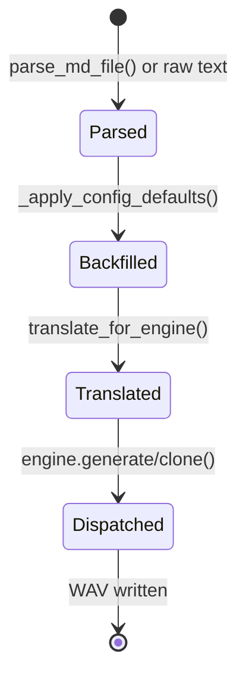
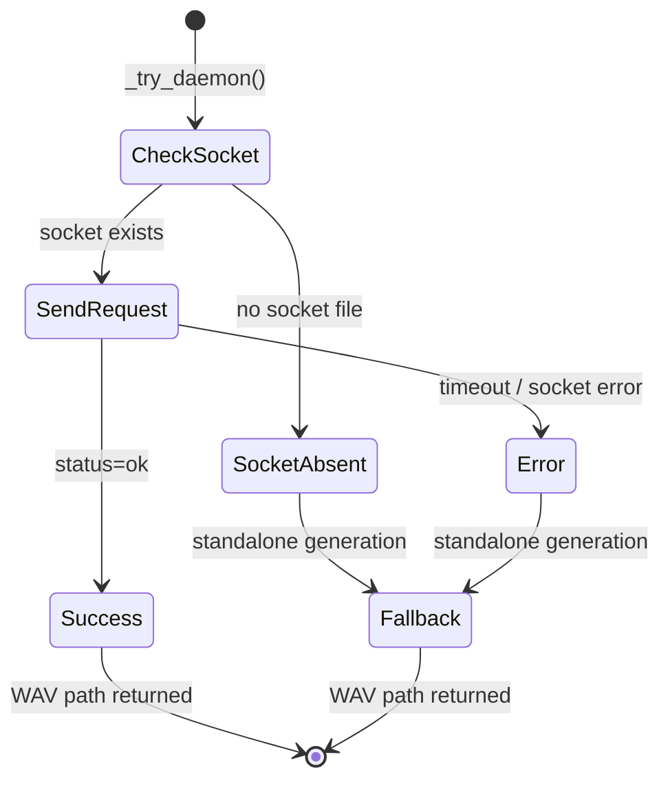
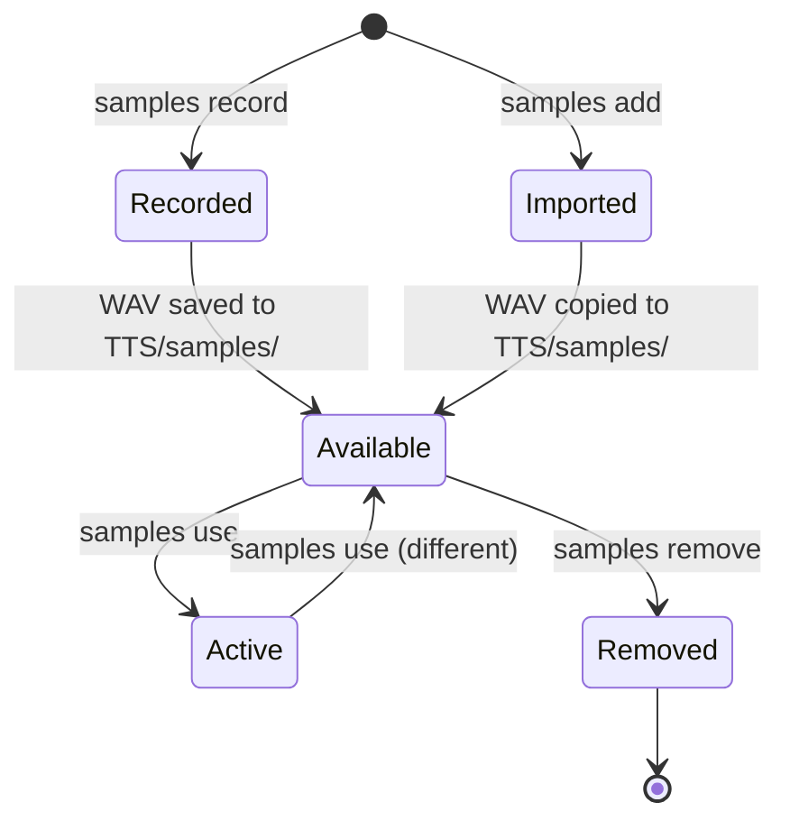

This glossary covers the voiceCLI domain model. It is extended as new features are implemented.

## Glossary

| Term | Definition | Source |
|------|-----------|--------|
| **TTSDocument** | Universal document representation — contains text, metadata (language, voice, instruct), and a list of Segments. Parsed from `.md` files or created programmatically. Engine-agnostic. | `markdown.py` |
| **Segment** | A text section with per-section overrides (instruct, language, voice, exaggeration, etc.). Created from `<!-- directive -->` boundaries in markdown. | `markdown.py` |
| **Instruct** | A text prompt that controls voice style in Qwen engines (e.g., "Calm, warm, with a slight Provencal accent"). Can be raw (explicit string) or composed from structured parts. | `markdown.py` |
| **Structured Parts** | The four composable instruct fields: `accent`, `personality`, `speed`, `emotion`. Auto-joined into instruct as `"accent. personality. speed. emotion"`. | `markdown.py` |
| **ENGINE_CAPS** | The engine capability matrix — a dict defining what each engine supports (instruct, tags, exaggeration, language, voice). Drives all translation decisions. | `translate.py` |
| **Translation** | The process of adapting a universal TTSDocument to a specific engine's capabilities — nulling unsupported fields, converting tags, splitting segments. | `translate.py` |
| **Tag** | A paralinguistic marker in text like `[laugh]`, `[sigh]`, `[chuckle]`. Handled differently per engine: kept native (Turbo), stripped (Multilingual), or converted to instruct segments (Qwen). | `translate.py` |
| **Tag Mode** | How an engine handles tags: `native` (keep as-is), `strip` (remove), `to_instruct` (split into segments with mapped instruct + transitions). | `translate.py` |
| **Config Backfill** | The process of merging `voicecli.toml` structured parts into document/segments where frontmatter didn't set them. Runs after parsing, before translation. | `api.py` |
| **Priority Chain** | Resolution order: CLI flag / API kwarg > markdown frontmatter > voicecli.toml > hardcoded default. Enforced in `api.py`. | `api.py` |
| **Daemon** | A long-running process that keeps Qwen models warm in VRAM. Communicates via AF_UNIX socket with JSON protocol. Optional — generation falls back silently if absent. | `daemon.py` |
| **Active Sample** | The currently selected voice sample WAV file for cloning operations when `--ref` is not explicitly provided. Set via `voicecli samples use`. | `samples.py` |
| **Chunk** | A piece of text split from a long input for separate generation. Chunks produce individual WAV files (`_001.wav`, `_002.wav`, etc.). | `api.py`, `utils.py` |
| **TTSResult** | Return type of `generate()` and `clone()` — contains `wav_path`, optional `mp3_path`, and optional `chunk_paths`. | `api.py` |
| **TranscriptionResult** | Return type of `transcribe()` — contains `text`, `language`, and `segments` with timestamps. | `transcribe.py` |
| **TTSEngine** | Abstract base class defining the engine contract: `generate()`, `clone()`, `list_voices()`. All concrete engines inherit from this. | `engine.py` |

## Common Confusions

### Instruct vs Structured Parts

`instruct` is a single raw string ("Parle avec colère"). Structured parts (`accent`, `personality`, `speed`, `emotion`) are four fields that auto-compose into an instruct string. If raw `instruct` is set, structured parts are **ignored** (bypass). This applies at both document and segment level.

### Translation vs Generation

Translation adapts the **document model** — it changes fields, nulls unsupported ones, and splits segments. It does not produce audio. Generation uses the **translated document** to produce audio via an engine. Translation is pure Python; generation involves GPU inference.

### Frontmatter vs Directives

Frontmatter (`---` YAML block at the top of `.md` files) sets **document-level defaults**. Directives (`<!-- key: value -->` HTML comments in the body) set **per-section overrides**. Directives inherit from frontmatter and override only the fields they specify.

### Engine vs Engine Name

`TTSEngine` is the abstract class. Engine names are string keys (`"qwen"`, `"chatterbox"`, `"chatterbox-turbo"`) used in the registry, config, and CLI flags. `QwenEngine` and `QwenFastEngine` are both registered under the `"qwen"` and `"qwen-fast"` keys respectively but share the same capability entry in ENGINE_CAPS.

### Segment Gap vs Crossfade

Both control transitions between segments. `segment_gap` adds silence (ms) between segments. `crossfade` adds fade-out/fade-in overlap (ms). They can be combined: gap + crossfade = fade-out, silence, fade-in.

## Entity Lifecycle Diagrams

### TTSDocument Lifecycle

### Daemon Request Lifecycle

### Voice Sample Lifecycle

